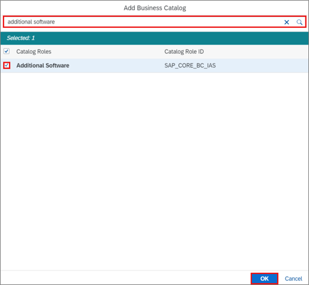
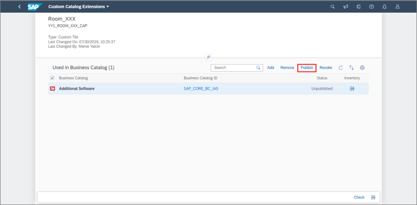
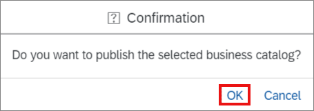
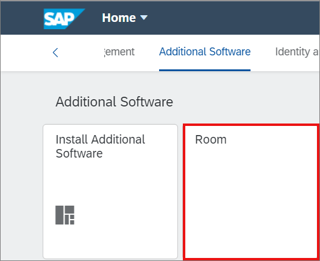
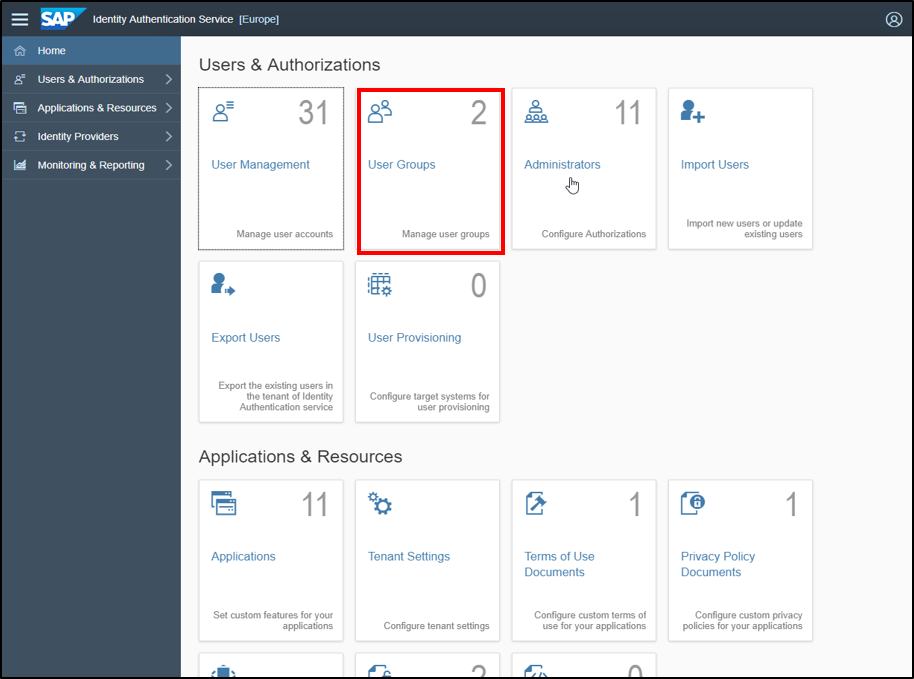
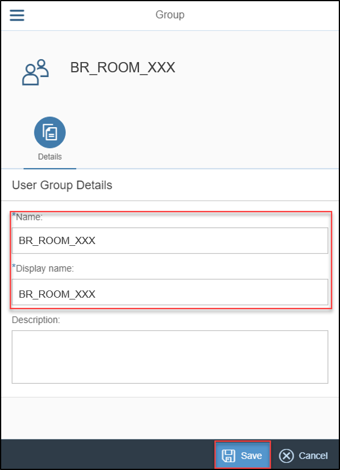
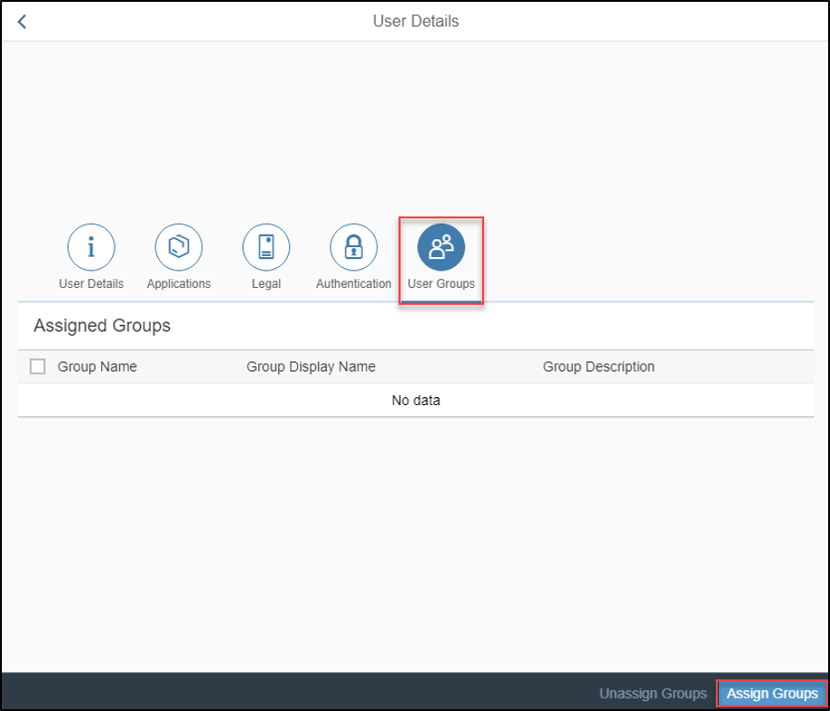
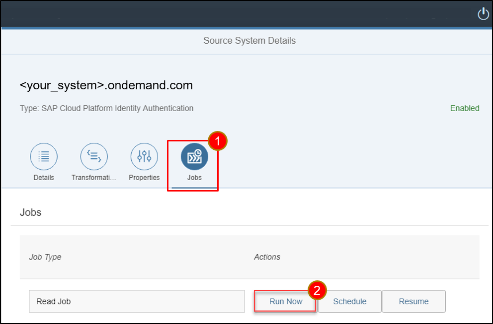
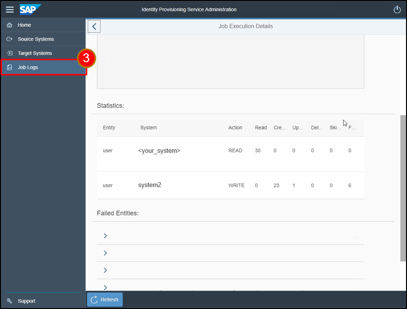
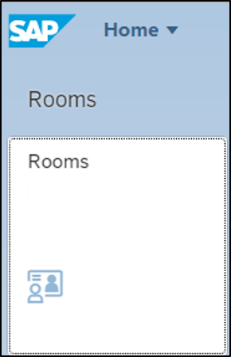

## Prerequisites  
 - Create a developer user in a SAP Cloud Platform ABAP Environment system.
 - Download Eclipse Photon or Oxygen and install ABAP Development Tools (ADT). See <https://tools.hana.ondemand.com/#abap>.

## Details
### You will learn  
  - How to create tiles
  - How to create Fiori Launchpad sites
  - How to add scopes for filtering apps
  - How to create roles and role collections
  - How to create role collection mappings
  - How to assign users to role collections
  - How to provision users

---

[ACCORDION-BEGIN [Step 1: ](Create tile)]
  1. Open your S/4HANA Cloud system and select Custom Tiles in the extensibility section.

      

  2. Click **New**.

      

  3. Create tile.
     - Title: `Room_XXX`
     - ID: `Room_XXX`

     Click **Create**.

      

  4. Create custom tile details.
     - Title: `Room`
     - URL: `<route-on-cf>/<id>.<version>`
       (`<route-on-cf> = <your_url>.sap.hana.ondemand.com`)
     - ID: ID used in `webapp/manifest.json (without the ".")`
     - Version: `applicationVersion provided in webapp/manifest.json`

     Example URL: `https://<your_url_on_cf>.sap.hana.ondemand.com/ROOM_LR_XXX.1.0.0`

     Click **Save**.

      

[DONE]
[ACCORDION-END]

[ACCORDION-BEGIN [Step 2: ](Create custom catalog extension)]
  1. Select Custom Catalog Extensions in the extensibility section.

      

  2. Search `Room_XXX` and select it.

      

  3. Click **Add** to add a new business catalog.

      

  4. Search for `additional software`, select it and click **OK**.

      

  5. Select **Additional Software** and click **Publish**.

      

  6. Click **OK**.

      

  7. Check your result.

      

[DONE]
[ACCORDION-END]

[ACCORDION-BEGIN [Step 3: ](Define inbound tile)]
Define inbound tile in `webapp/manifest.json`.


[DONE]
[ACCORDION-END]

[ACCORDION-BEGIN [Step 4: ](Create Fiori launchpad site)]
  1. Open SAP Web IDE, select the tool symbol, select **Extensions**, search for **portal** and enable SAP Fiori Launchpad Site Feature in Web IDE.

      

  2. Select the eye ICON.

      

  3. Open your `xs-app.json` file.

      

  4. Replace your code with following:

    ```JSON
       {  
            "welcomeFile": "cp.portal",  "authenticationMethod": "none",  "routes": [ ]
       }          
    ```

  5. Define portal entitlement for Cloud FOUNDRY subaccount. Standard should be selected.

      

[DONE]
[ACCORDION-END]

[ACCORDION-BEGIN [Step 5: ](Deploy UI to Cloud Foundry)]

  1. Right click on `ROOM_MTA_XXX` file and choose **Deploy** > **Deploy to SAP Cloud Platform**.

      


  2.  Choose again the **API Endpoint**, **Organization** and **Space**. Now click on **Deploy**.

      

[DONE]
[ACCORDION-END]

[ACCORDION-BEGIN [Step 6: ](Add Scope for filtering apps)]

  1. Add scope to `xs-security.json`.

    ```JSON
         {  

             "name": "$XSAPPNAME.Room-maintain",
             "description": "View data"

         }          
    ```


  2.  Add role template to xs-security.json

    ```JSON
          {
                "name": "RoomTemplate",
                "description": "Role for viewing data",
                "scope-references": ["$XSAPPNAME.Room-maintain"]
          }   
    ```

  3. Add required scope to `webapp/manifest.json`.

    ```JSON
          {
              "sap.platform.cf":
                                {		
                                  "oAuthScopes": ["$XSAPPNAME.Room-maintain"]
                                }
          }   
    ```

[DONE]
[ACCORDION-END]

[ACCORDION-BEGIN [Step 7: ](Deploy UI to Cloud Foundry)]

  1. Right click on `ROOM_MTA_XXX` file and choose **Deploy** > **Deploy to SAP Cloud Platform**.

      


  2.  Choose again the **API Endpoint**, **Organization** and **Space**. Now click on **Deploy**.

      

[DONE]
[ACCORDION-END]


[ACCORDION-BEGIN [Step 8: ](Create role & role collection)]
  1. Switch to your SAP Cloud Platform Cockpit, select your `appRouter`, click **Roles** and **New Role**

      

  2. Create a new role.
     - Name: `MyRoomTemplate_XXX`
     - Template: `RoomTemplate`

     Click **Save**.

      

  3. Select your subaccount, click **Role Collections** in the security area and click **New Role Collection**.

      

  4. Create a new role collection.
     - Name: `MyCollection_XXX`

     Click **Save**.

      


  5. Select your created role collection.

      

  6. Add a role to your role collection in Cloud Foundry subaccount.

      

[DONE]
[ACCORDION-END]

[ACCORDION-BEGIN [Step 9: ](Create role collection mapping)]
  1. In your SAP Cloud Platform Cockpit, select your **Role Collection Mappings** and click **New Role Collection Mapping**

      

    Hint: Groups attribute and assignment to business user needs to be provided in identity provider!

  2. Create a new role collection mapping.
     - Role collection: `MyCollection_XXX`
     - Value: `BR_ROOM_XXX`

     Click **Save**.

      

[DONE]
[ACCORDION-END]


[ACCORDION-BEGIN [Step 10: ](Assign user to role collection)]
  1. Select your trust configuration in your SAP Cloud Platform Cockpit. Select **Role Collection Assignment**, enter your e-mail address, click **Show Assignments** and **Assign Role Collection**.

      

  2. Select `RoomsRole` and click **Assign Role Collection**.

      

  3. Select your subaccount and your application route will be shown.

      

     Hint: `<route-on-cf> = <your_url>.sap.hana.ondemand.com`

[DONE]
[ACCORDION-END]


[ACCORDION-BEGIN [Step 11: ](Provision user)]
  1. Switch to your **`SAP Identity Authentication Service`**, select **User Groups**

      

  2. Create a new user group.
     - Name: `BR_ROOM_XXX`
     - Display Name: `BR_ROOM_XXX`

     Click **Save**.

      

  3. Select **User Groups** and click **Assign Groups**.

      

  4. Select your created user group and click **Save**.

      

  5. Select **Jobs** and click **Run Now**.

      

  6. Select **Job Logs** to check your logs.

      

  7. Verify logon to Fiori Launchpad with your business user.

      

      Hint: Logon to the deployed example app Fiori Launchpad with the business user: The tile for the deployed rooms app should be visible and the app should be usable.

[DONE]
[ACCORDION-END]

[ACCORDION-BEGIN [Step 12: ](Test yourself)]

[VALIDATE_1]
[ACCORDION-END]
---
