## Prerequisites
- You have knowledge on connecting code to AI workflows of SAP AI Core.
- You have created your first pipeline with SAP AI Core, using [this tutorial](https://developers.sap.com/tutorials/ai-core-code.html/#)

## Details
### You will learn
- How to create placeholders for datasets in your code and associated AI workflow.
- How to register datasets stored in AWS S3 to SAP AI Core.
- How to use datasets with placeholders.
- How to generate models and store them in AWS S3 for later use.

By the end of the tutorial you will have two models trained on two different datasets of house price data. It is possible to change the names of components and file paths mentioned in this tutorial, without breaking the functionality, unless stated explicitly.

>**IMPORTANT** Before you start this tutorial with SAP AI Launchpad, it is recommended that you set up at least on other tool, either Postman or Python (SAP AI Core SDK) because two steps of this tutorial cannot be performed with SAP AI Launchpad.

---

[ACCORDION-BEGIN [Step 1: ](Modify AI code)]

Create a new directory named `hello-aicore-data`.

Create a file named `main.py`, and paste the following snippet there:

```PYTHON
import os
#
# Variables
DATA_PATH = '/app/data/train.csv'
DT_MAX_DEPTH= int(os.getenv('DT_MAX_DEPTH'))
MODEL_PATH = '/app/model/model.pkl'
#
# Load Datasets
import pandas as pd
df = pd.read_csv(DATA_PATH)
X = df.drop('target', axis=1)
y = df['target']
#
# Partition into Train and test dataset
from sklearn.model_selection import train_test_split
train_x, test_x, train_y, test_y = train_test_split(X, y, test_size=0.3)
#
# Init model
from sklearn.tree import DecisionTreeRegressor
clf = DecisionTreeRegressor(max_depth=DT_MAX_DEPTH)
#
# Train model
clf.fit(train_x, train_y)
#
# Test model
test_r2_score = clf.score(test_x, test_y)
# Output will be available in logs of SAP AI Core.
# Not the ideal way of storing /reporting metrics in SAP AI Core, but that is not the focus this tutorial
print(f"Test Data Score {test_r2_score}")
#
# Save model
import pickle
pickle.dump(clf, open(MODEL_PATH, 'wb'))
```

### Understanding your code

Your code reads the data file `train.csv` from the location `/app/data`. This dataset file `train.csv` you will arrange for this file to be there, later in this tutorial. It also reads the variable (hyper-parameter) `DT_MAX_DEPTH` from the environment variables later. When generated, your model will be stored in the location `/app/model/` . You will also learn how to transport this code from SAP AI Core to your own cloud storage.

!

Create file `requirement.txt` as shown below. Here, if you don't specify a particular version like `pandas` then the latest version of the package will be fetched automatically.

```TEXT
sklearn==0.0
pandas
```

Create a file called `Dockerfile` with following contents.

> This filename cannot be amended, and does not have a `.filetype`

```TEXT
# Specify which base layers (default dependencies) to use
# You may find more base layers at https://hub.docker.com/
FROM python:3.7
#
# Creates directory within your Docker image
RUN mkdir -p /app/src/
# Don't place anything in below folders yet, just create them
RUN mkdir -p /app/data/
RUN mkdir -p /app/model/
#
# Copies file from your Local system TO path in Docker image
COPY main.py /app/src/
COPY requirements.txt /app/src/  
#
# Installs dependencies within you Docker image
RUN pip3 install -r /app/src/requirements.txt
#
# Enable permission to execute anything inside the folder app
RUN chgrp -R 65534 /app && \
    chmod -R 777 /app
```

!

> **IMPORTANT** Your `Dockerfile` createS empty folders to store your datasets and models (example above `/app/data` and `/app/model/` ). Contents from cloud storage will be copied to and from these folders later. If you place any contents in these folders during time of Docker image building, then the contents will be overwritten.

Build and upload your Docker image to Docker repository, using the following code in the terminal.

```BASH
docker build -t docker.io/<YOUR_DOCKER_USERNAME>/house-price:03 .
docker push docker.io/<YOUR_DOCKER_USERNAME>/house-price:03
```

[DONE]
[ACCORDION-END]

[ACCORDION-BEGIN [Step 2: ](Create placeholders for datasets in workflows)]

Create a pipeline (yaml file) named `house-price-train.yaml` in your GitHub repository. You may use the existing GitHub path which is already tracked (auto synced) by your application of SAP AI Core.

```YAML
apiVersion: argoproj.io/v1alpha1
kind: WorkflowTemplate
metadata:
  name: data-pipeline # executable id, must be unique across all your workflows (YAML files)
  annotations:
    scenarios.ai.sap.com/description: "Learning how to ingest data to workflows"
    scenarios.ai.sap.com/name: "House Price (Tutorial)" # Scenario name should be the use case
    executables.ai.sap.com/description: "Train with live data"
    executables.ai.sap.com/name: "training" # Executable name should describe the workflow in the use case
    artifacts.ai.sap.com/housedataset.kind: "dataset" # Helps in suggesting the kind of inputs that can be attached.
  labels:
    scenarios.ai.sap.com/id: "learning-datalines"
    ai.sap.com/version: "1.0"
spec:
  imagePullSecrets:
    - name: credstutorialrepo # your docker registry secret
  entrypoint: mypipeline
  templates:
  - name: mypipeline
    steps:
    - - name: mypredictor
        template: mycodeblock1
  - name: mycodeblock1
    inputs:
      artifacts:  # placeholder for cloud storage attachements
        - name: housedataset # a name for the placeholder
          path: /app/data/ # where to copy in the Dataset in the Docker image
    container:
      image: docker.io/<YOUR_DOCKER_USERNAME>/house-price:03 # Your docker image name
      command: ["/bin/sh", "-c"]
      env:
        - name: DT_MAX_DEPTH # name of the environment variable inside Docker container
          value: 3 # will make it as variable later
      args:
        - "python /app/src/main.py"
```

### Understanding your workflow.

!

1. A placeholder named `housedataset` is created.
2. You specify the **kind of artifact** that the placeholder can accept. **Artifact** is covered in details later in this tutorial.
3. You use a placeholder to specify the **path that you created in your Dockerfile**, which is where you will copy files to your Docker image.

[DONE]
[ACCORDION-END]

[ACCORDION-BEGIN [Step 3: ](Create placeholders for hyperparameter)]

In your workflow, you have used the variable `DT_MAX_DEPTH` to incorporate a static value from the corresponding environment variable. Let's make this a variable in the workflow.

!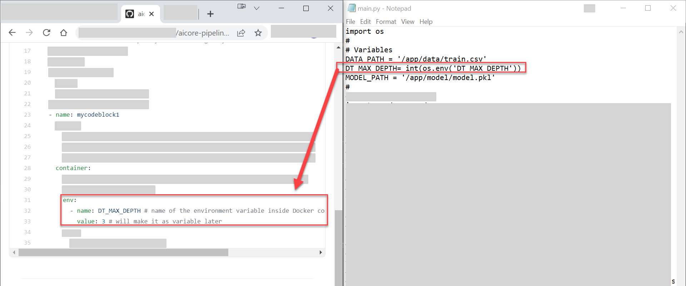

Replace the contents of above AI workflow with this snippet.

```YAML[35,36]
apiVersion: argoproj.io/v1alpha1
kind: WorkflowTemplate
metadata:
  name: data-pipeline # executable id, must be unique across all your workflows (YAML files)
  annotations:
    scenarios.ai.sap.com/description: "Learning how to ingest data to workflows"
    scenarios.ai.sap.com/name: "House Price (Tutorial)" # Scenario name should be the use case
    executables.ai.sap.com/description: "Train with live data"
    executables.ai.sap.com/name: "training" # Executable name should describe the workflow in the use case
    artifacts.ai.sap.com/housedataset.kind: "dataset" # Helps in suggesting the kind of inputs that can be attached.
  labels:
    scenarios.ai.sap.com/id: "learning-datalines"
    ai.sap.com/version: "1.0"
spec:
  imagePullSecrets:
    - name: credstutorialrepo # your docker registry secret
  entrypoint: mypipeline
  arguments:
    parameters: # placeholder for string like inputs
        - name: DT_MAX_DEPTH # identifier local to this workflow
  templates:
  - name: mypipeline
    steps:
    - - name: mypredictor
        template: mycodeblock1
  - name: mycodeblock1
    inputs:
      artifacts:  # placeholder for cloud storage attachements
        - name: housedataset # a name for the placeholder
          path: /app/data/ # where to copy in the Dataset in the Docker image
    container:
      image: docker.io/<YOUR_DOCKER_USERNAME>/house-price:03 # Your docker image name
      command: ["/bin/sh", "-c"]
      env:
        - name: DT_MAX_DEPTH # name of the environment variable inside Docker container
          value: "{{workflow.parameters.DT_MAX_DEPTH}}" # value to set from local (to workflow) variable DT_MAX_DEPTH
      args:
        - "python /app/src/main.py"
```

Following are the new important lines in the workflows.

!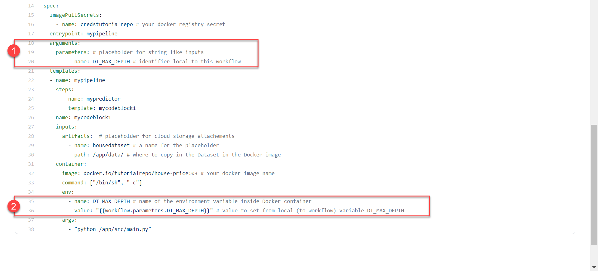

##Understanding these changes

1. A placeholder named `DT_MAX_DEPTH` is created locally in the workflow. Specifying it under `arguments > parameters` means that it accepts inputs of type: `type`.
2. You create an input to your Docker image. This is an `env` (Environment) variable named `DT_MAX_DEPTH`, and feed it the value from `workflow.parameters.DT_MAX_DEPTH` (the local name from previous point).

Commit the changes in the GitHub.

[DONE]
[ACCORDION-END]


[ACCORDION-BEGIN [Step 4: ](Observe your scenario and placeholder)]

[OPTION BEGIN [SAP AI Launchpad]]

You will observe a scenario named **House Price (Tutorial)** In the **ML Operations** tab. Click on the scenario row in the table.

Click on the **Executables** tab. You will find your executable `training`.

!

> **INFORMATION** If multiple executables/workflows (YAML files) have the same annotation values for their scenarios, they the are grouped under same scenario in SAP AI Core.

Click on the executable `training` to it in more detail. The placeholders that you created in your AI workflow will appear here.

!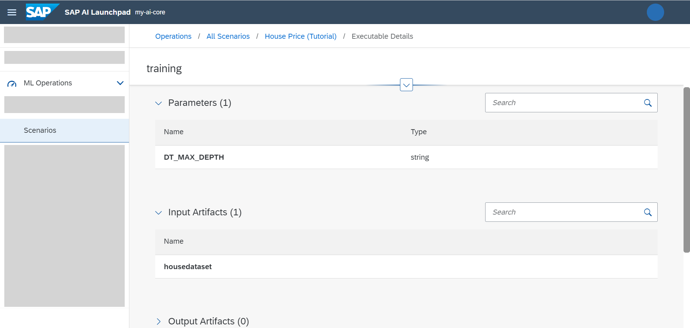

[OPTION END]

[OPTION BEGIN [Postman]]

List the executables for the scenario ID `learning-datalines`. This is the scenario ID that you specified in the workflow.

**RESPONSE**

```
{
    "count": 1,
    "resources": [
        {
            "createdAt": "2022-04-17T13:09:00+00:00",
            "deployable": false,
            "description": "Train with live data",
            "id": "data-pipeline",
            "inputArtifacts": [
                {
                    "name": "housedataset"
                }
            ],
            "modifiedAt": "2022-04-17T13:09:00+00:00",
            "name": "training",
            "outputArtifacts": [],
            "parameters": [
                {
                    "name": "DT_MAX_DEPTH",
                    "type": "string"
                }
            ],
            "scenarioId": "learning-datalines",
            "versionId": "1.0"
        }
    ]
}
```

[OPTION END]

[OPTION BEGIN [SAP AI Core SDK]]

List the executables for the scenario ID `learning-datalines`. This is the scenario ID that you specified in the workflow.

```PYTHON
response = ai_core_client.executable.query(
    scenario_id = "learning-datalines", resource_group='default'
)

for executable in response.resources:
    for key, value in executable.__dict__.items():
        if "artifact" in key or "parameter" in key:
            print(f"{key} :")
            for placeholder in value:
                print(f" {placeholder.__dict__}")
        else:
            print(f"{key} : {value}")
```

**RESPONSE**

```TEXT
id : data-pipeline
scenario_id : learning-datalines
version_id : 1.0
name : training
description : Train with live data
deployable : False
parameters :
 {'name': 'DT_MAX_DEPTH', 'type': <Type.STRING: 'string'>}
input_artifacts :
 {'name': 'housedataset'}
output_artifacts :
 {'name': 'housemodel'}
labels : None
...
```

[OPTION END]

Observe the `inputArtifacts` and `parameters`. The value of the `name` variable in each, represents the placeholder names which were specified earlier in the process. You are required use these names later when creating your **configuration**.

[DONE]
[ACCORDION-END]

[ACCORDION-BEGIN [Step 5: ](Create cloud storage for datasets and models)]

### Why use cloud storage?
SAP AI Core only provides your ephemeral (short-lived) storage, while training or inferencing a model.  Amazon Web Services (AWS) S3 Object store is the cloud storage used by SAP AI Core for storing datasets and models. They can be stored over a longer time period, and can be transferred to and from SAP AI Core during training or online inferencing.

You need to create AWS S3 object store, using one of the following links:

- If you are a BTP user, create your storage through the [SAP Business Technology Platform](https://help.sap.com/docs/ObjectStore/2ee77ef7ea4648f9ab2c54ee3aef0a29/4236b942f67349d5a583773162d99660.html). Note that while BTP offers alternative storage solutions, SAP AI Core uses AWS S3 exclusively.
- If you are not a BTP user, go directly through [AWS site](https://aws.amazon.com/free/?all-free-tier.sort-by=item.additionalFields.SortRank&all-free-tier.sort-order=asc&awsf.Free%20Tier%20Categories=categories%23storage&trk=e31669e1-2406-4016-9dc4-feb8ed89019b&sc_channel=ps&sc_campaign=acquisition&sc_medium=ACQ-P|PS-BI|Brand|Desktop|SU|Storage|S3|IN|EN|Text&s_kwcid=AL!4422!10!71880729042342!71881173212098&ef_id=77e85e62d00a1077e8c33c3e3fbff9e2:G:s&s_kwcid=AL!4422!10!71880729042342!71881173212098&awsf.Free%20Tier%20Types=*all)


[DONE]
[ACCORDION-END]

[ACCORDION-BEGIN [Step 6: ](Connect local system to AWS S3)]

Download and Install the [AWS Command Line Interface (CLI)](https://docs.aws.amazon.com/cli/latest/userguide/getting-started-install.html).

Open your terminal and execute the following line of code.

```BASH
aws configure
```

!

Enter your AWS credentials. Note that the appearance of the screen will not change as you type. You can leave the `Default output format` entry as blank (press enter).

[DONE]
[ACCORDION-END]

[ACCORDION-BEGIN [Step 7: ](Upload datasets to AWS S3)]

For our data, we will use a toy dataset from `Scikit Learn`. Download [this dataset](https://scikit-learn.org/stable/modules/generated/sklearn.datasets.fetch_california_housing.html).

Download the `train.csv` [dataset](https://raw.githubusercontent.com/sap-tutorials/Tutorials/master/tutorials/ai-core-data/train.csv)

To upload the datasets to you AWS S3 Storage, paste and edit the following command in the terminal:

```BASH
aws s3 cp train.csv s3://<YOUR_BUCKET_NAME>/example-dataset/house-price-toy/data/jan/train.csv
```

!

This uploaded the data to a folder called `jan`. Upload it one more time in another folder `feb`, by changing your command as shown:

```BASH
aws s3 cp train.csv s3://<YOUR_BUCKET_NAME>/example-dataset/house-price-toy/data/feb/train.csv
```

You now know how to upload and use multiple datasets with SAP AI Core.

List your files in you AWS S3 bucket by editing the following command:

```BASH
aws s3 ls s3//<YOUR_BUCKET_NAME/example-dataset/house-price-toy/data/
```
> **CAUTION**: Ensure your file names and format match what you have specified in your code. For example, if you specify ´train.csv´ in your code, the system expects a files called train, which is of type: comma separated value.

!

[DONE]
[ACCORDION-END]

[ACCORDION-BEGIN [Step 8: ](Store an object store secret in SAP AI Core)]


[OPTION BEGIN [SAP AI Launchpad]]

> **IMPORTANT** Currently, SAP AI Launchpad offers no functionality to perform this step. Please perform this step using any one of the alternative options from the option tab.

[OPTION END]

[OPTION BEGIN [Postman]]

Edit and execute the following snippet to create object store secret in SAP AI Core. An object store secret is required to store credentials to access your AWS S3 buckets, and limit access to a particular directory.

**HEADER**

> **CAUTION** IF the following Header is not specified, this secret is restricted to the `default` resource group.

| Key | Value |
| --- | --- |
| `AI-Resource-Group` | `default` |

**BODY**

```JSON
{
    "name": "mys3",
    "data": {
        "AWS_ACCESS_KEY_ID": "<YOUR_AWS_ID>",
        "AWS_SECRET_ACCESS_KEY": "<YOUR_AWS_KEY>"
    },
    "type": "S3",
    "bucket": "<YOUR_BUCKET_NAME>",
    "endpoint": "s3-eu-central-1.amazonaws.com",
    "region": "eu-central-1",
    "pathPrefix": "example-dataset/house-price-toy"
}
```

**RESPONSE**
```
{
    "message": "secret has been created"
}
```

!

[OPTION END]


[OPTION BEGIN [SAP AI Core SDK]]

Edit and execute the following snippet to create object store secret in SAP AI Core. An object store secret is required to store credentials to access your AWS S3 buckets, and limit access to a particular directory.

```PYTHON
# Create object Store secret
response = ai_core_client.object_store_secrets.create(
    name = "mys3", # identifier for this secret within your SAP AI Core
    path_prefix = "example-dataset/house-price-toy", # path that we want to limit restrict this secret access to
    type = "S3",
    data = { # Dictionary of credentials of AWS
        "AWS_ACCESS_KEY_ID": "<YOUR_AWS_ID>",
        "AWS_SECRET_ACCESS_KEY": "<YOUR_AWS_KEY>"
    },
    bucket = "<YOUR_BUCKET_NAME>", # Edit this
    region = "eu-central-1", # Edit this
    endpoint = "s3-eu-central-1.amazonaws.com", # Edit this
    resource_group = "default" # object store secret are restricted within this resource group. you may change this when creating secret for another resource group.
)
print(response.__dict__)
```

[OPTION END]

> ### Why not put complete path to train.csv as `pathPrefix`?
> You might have noticed that previously you uploaded data to `example-dataset/house-price-toy/data/jan/train.csv` but here in object store secret the `pathPrefix` is you set the value till `example-dataset/house-price-toy` . This is because the use of `pathPrefix` is to restrict access to particular directory of your cloud storage.
>
>But why not mentioning complete path in `pathPrefix`? This is because in that case all the files (even from sub-directories) will be copied from your AWS S3 to SAP AI Core. This might not be the useful when in cases where you have multiple datasets from different periods and only one of them is used (to train) at a time. Hence another level of abstraction called **Artifacts** is introduced which extends on the value of `pathPrefix` to complete path. This same use case is demonstrated in this tutorial.

With object store secret created you can now reference any sub-folders to `pathPrefix` using artifacts for datasets or model.

> **INFORMATION** You may create any number of object store secrets each with unique `name`. All pointing to same or different object stores.

[DONE]
[ACCORDION-END]


[ACCORDION-BEGIN [Step 9: ](Create artifact to specify folder of dataset)]

Execute the following snippet to create artifact for first `train.csv` that we uploaded to `jan` folder.


[OPTION BEGIN [SAP AI Launchpad]]

> **IMPORTANT** Currently, SAP AI Launchpad offers no functionality to perform this step. Please perform this step using any one of the alternative options from the option tab.

[OPTION END]

[OPTION BEGIN [Postman]]

**BODY**

```JSON
{
    "kind": "dataset",
    "name": "House Price Dataset 101",
    "scenarioId": "learning-datalines",
    "url": "ai://mys3/data/jan",
    "labels": [
        {
            "key": "ext.ai.sap.com/month",
            "value": "Jan"
        }
    ],
    "description": "Prices in the month of Jan"
}
```

!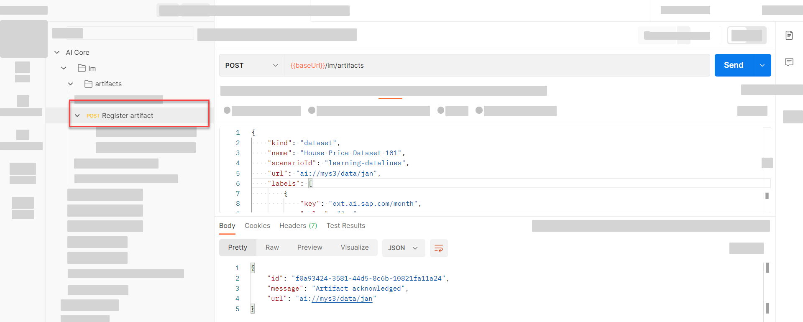

The `id` returned in the response is the unique identifier of your artifact - not its name. In the next step you will explore how to find the ID.

Create another artifact in the same way, for the `feb` folder. Refer to the snippet below for guidance on the changes required.

```JSON
{
    "kind": "dataset",
    "name": "House Price Dataset 201",
    "scenarioId": "learning-datalines",
    "url": "ai://mys3/data/feb",
    "labels": [
        {
            "key": "ext.ai.sap.com/month",
            "value": "Feb"
        }
    ],
    "description": "Prices in the month of Feb"
}
```

[OPTION END]

[OPTION BEGIN [SAP AI Core SDK]]

```PYTHON
# Create Artifact
from ai_api_client_sdk.models.artifact import Artifact
from ai_api_client_sdk.models.label import Label

response = ai_core_client.artifact.create(
    name = "House Price Dataset 101", # Custom Non-unqiue identifier
    kind = Artifact.Kind.DATASET,
    url = "ai://mys3/data/jan", #
    scenario_id = "learning-datalines",
    description = "Prices in the month of Jan",
    labels = [
        Label(key="ext.ai.sap.com/month", value="Jan"), # any descriptive key-value pair, helps in filtering, key must have the prefix ext.ai.sap.com/
    ],
    resource_group = "default" # required to restrict object store secret usage within a resource group
)

print(response.__dict__)
```

Create another artifact in the same way, for the `feb` folder. Refer to the snippet below for guidance on the changes required.

```PYTHON
# Create Artifact
response = ai_core_client.artifact.create(
    name = "House Price Dataset 201",
    kind = Artifact.Kind.DATASET,
    url = "ai://mys3/data/feb",
    scenario_id = "learning-datalines",
    description = "Prices in the month of Feb",
    labels = [
        Label(key="ext.ai.sap.com/month", value="Feb"),
    ],
    resource_group = "default"
)

print(response.__dict__)
```

[OPTION END]

You have learnt to add more data artifacts, allowing you to ingest more data over time.

### Important points to notice

1. Notice the `url` used in above snippet is `ai://mys3/data/jan`, here `mys3` is the object store secret name you created previously. Hence the path translates as `ai://<PATH_PREFIX_OF_mys3>/data/jan` which is the directory your dataset file is located.
2. You are not mentioning any particular file like `train.csv` located in the directory pointed by `url`, which gives you advantage that you can store multiple files in a AWS S3 directory (for example `train.csv`, `tokenization.json` and other files of any format) and register the directory containing all as a single artifact.
3. All the files present in path referenced by artifact will be copied from your S3 storage will be copied to your SAP AI Core instance during training or inferencing. This includes subfolders (not in case of `Kind = MODEL`).


[DONE]
[ACCORDION-END]


[ACCORDION-BEGIN [Step 10: ](Locate artifacts)]

[OPTION BEGIN [SAP AI Launchpad]]

Navigate to your data set by clicking through **Workspaces** > **default** >**ML Operations** > **Datasets**.


!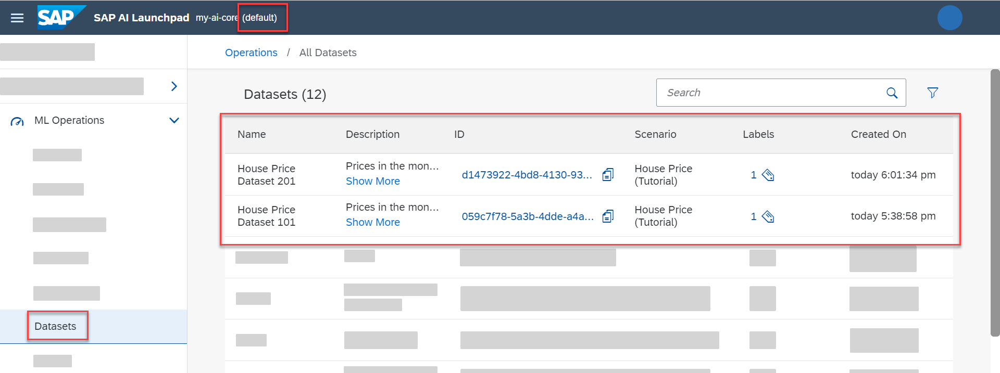

[OPTION END]


[OPTION BEGIN [Postman]]

Get a list of your artifacts.

!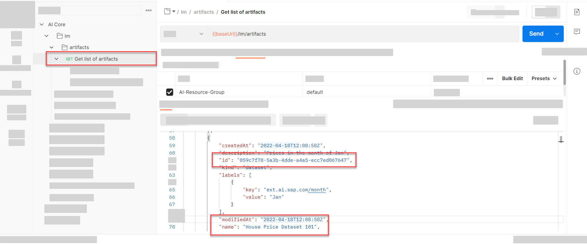

[OPTION END]

[OPTION BEGIN [SAP AI Core SDK]]

Get a list of your artifacts using the following code snippet:

```PYTHON
### List Artifacts
response = ai_core_client.artifact.query(resource_group="default")
#
for artifact in response.resources:
    for key, value in artifact.__dict__.items():
        if "label" in key:
            if value is None:
                continue
            print(f"{key} :")
            for label in value:
                print(f" {label.__dict__}")
        else:
            print(f"{key} : {value}")
    print('-'*3)
```

**RESPONSE**

```TEXT
...
id : f0a93424-3581-44d5-8c6b-10821fa11a24
name : House Price Dataset 101
url : ai://mys3/data/jan
kind : Kind.DATASET
description : Prices in the month of Jan
scenario_id : learning-datalines
execution_id : None
configuration_id : None
labels :
 {'key': 'ext.ai.sap.com/month', 'value': 'Jan'}
created_at : 2022-04-23 10:01:20
modified_at : 2022-04-23 10:01:20
---
id : d1473922-4bd8-4130-9310-3c5d58fbb7c4
name : House Price Dataset 201
url : ai://mys3/data/feb
kind : Kind.DATASET
description : Prices in the month of Feb
scenario_id : learning-datalines
execution_id : None
configuration_id : None
labels :
 {'key': 'ext.ai.sap.com/month', 'value': 'Feb'}
created_at : 2022-04-18 12:31:34
modified_at : 2022-04-18 12:31:34
...
```

[OPTION END]

> Information: Artifacts appear in the `default` resource group and the **Datasets** menu, because you had registered artifacts with `resource_group = default` and `Kind = Dataset` in Step 9.

Copy the artifact ID of the January dataset. You will use this value in the placeholders of your workflows, to create your execution. The **ID** of artifacts allows SAP AI Core to ingest data into workflows.


[DONE]
[ACCORDION-END]


[ACCORDION-BEGIN [Step 11: ](Use artifacts with workflows using configuration)]

[OPTION BEGIN [SAP AI Launchpad]]

Click through **ML Operations** > **Configuration** > **Create**. Enter the following details as shown in the image below. Click **Next**

!

The field for `DT_MAX_DEPTH` allows your to use the configuration to pass values to placeholders of hyper-parameters that your prepared earlier in your workflows. In this case, type `3`. Click **Next**.

!

Locate your artifact (using the unique **ID**) in the **Available Artifacts** pane. Click the dropdown menu and the checkbox of `housedataset`. This is named of the placeholder for dataset in your workflow. As a result, the placeholder will now take the value of the artifact.

!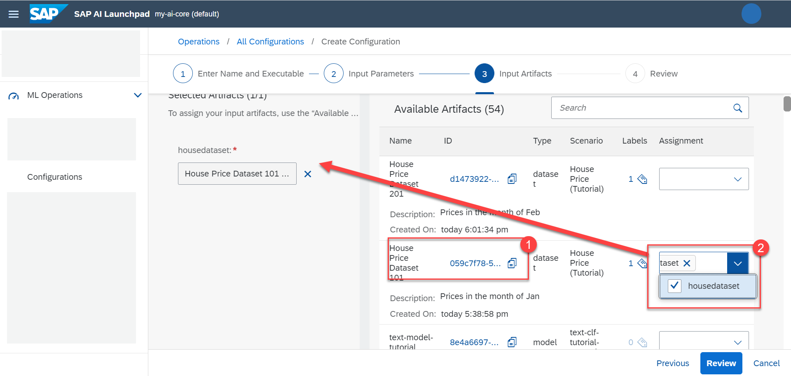

Click **Review** and click **Create**.

You will redirected to the details page of the newly created configuration.

[OPTION END]

[OPTION BEGIN [Postman]]

Use the artifact ID of the `jan` dataset and the placeholder names to create a configuration, based on the code snippet. The key value pair for `DT_MAX_DEPTH` allows your to use the configuration to pass values to placeholders of hyper-parameters that your prepared earlier in your workflows. In this case, type `3`.
**BODY**

```JSON
{
    "name": "House Price January 1",
    "scenarioId": "learning-datalines",
    "executableId": "data-pipeline",
    "inputArtifactBindings": [
        {
            "key": "housedataset",
            "artifactId": "<YOUR_JAN_ARTIFACT_ID>"
        }
    ],
    "parameterBindings": [
        {
            "key": "DT_MAX_DEPTH",
            "value": "3"
        }
    ]
}
```
### Important points

1. You bind the artifact in the section `inputArtifactBindings`, where `key` denotes the placeholder name from your workflow and `artifactId` is the unique ID of the artifact that you registered. In later steps, you will bind the `feb` dataset's artifact ID, to learn how the same workflow can be used with multiple datasets.

2. You provide the value to hyper-parameters using the section `parameterBindings`, where the `key` denotes the placeholder and the value is the string. Your code converts this value to an integer type before utilizing it.

[OPTION END]


[OPTION BEGIN [SAP AI Core SDK]]

Paste and edit the code snippet. The key value pair for `DT_MAX_DEPTH` allows your to use the configuration to pass values to placeholders of hyper-parameters that your prepared earlier in your workflows. In this case, type `3`.

```PYTHON
from ai_api_client_sdk.models.parameter_binding import ParameterBinding
from ai_api_client_sdk.models.input_artifact_binding import InputArtifactBinding

response = ai_core_client.configuration.create(
    name = "House Price January 1",
    scenario_id = "learning-datalines",
    executable_id = "data-pipeline",
    input_artifact_bindings = [
        InputArtifactBinding(key = "housedataset", artifact_id = "<YOUR_JAN_ARTIFACT_ID>") # placeholder as name
    ],
    parameter_bindings = [
        ParameterBinding(key = "DT_MAX_DEPTH", value = "3") # placeholder name as key
    ],
    resource_group = "default"
)
print(response.__dict__)
```

!

### Important points

1. You bind the artifact in the section `inputArtifactBindings`, where `key` denotes the placeholder name from your workflow and `artifactId` is the unique ID of the artifact that you registered. In later steps, you will bind the `feb` dataset's artifact ID, to learn how the same workflow can be used with multiple datasets.

2. You provide the value to hyper-parameters using the section `parameterBindings`, where the `key` denotes the placeholder and the value is the string. Your code converts this value to an integer type before utilizing it.

[OPTION END]

This is how you bind values to placeholders to your workflows.


[DONE]
[ACCORDION-END]

[ACCORDION-BEGIN [Step 12: ](Run you workflow using execution)]

[OPTION BEGIN [SAP AI Launchpad]]

Click **Create Execution** in the configuration details page. This will start a new execution with the values specified in the configuration. On the **Logs** tab of your execution, you will see that the data from AWS S3 has been incorporated into SAP AI Core.

!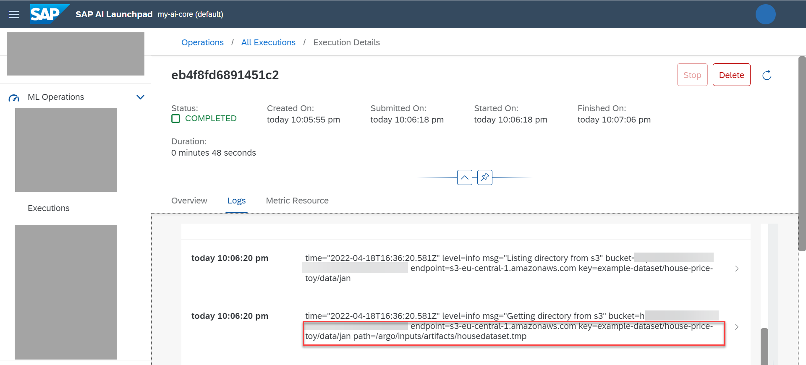

[OPTION END]

[OPTION BEGIN [Postman]]

Use configuration ID from previous step to create and launch a new execution.

Query the execution logs. The logs will show that the data from AWS S3 has been incorporated into SAP AI Core.
!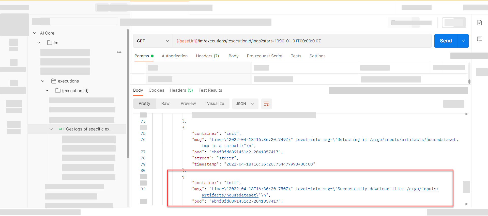

[OPTION END]

[OPTION BEGIN [SAP AI Core SDK]]

Use configuration ID from previous step to create and launch a new execution.

```PYTHON
response = ai_core_client.execution.create(
    configuration_id = '<YOUR_CONFIGURATION_ID>',
    resource_group = 'default'
)

response.__dict__
```

Query the status of the execution. The logs will show that the data from AWS S3 has been incorporated into SAP AI Core.

```PYTHON
# show execution logs
response = ai_core_client.execution.query_logs(
    execution_id = '<YOUR_EXECUTION_ID>',
    resource_group = 'default',
    start = datetime(1990, 1, 1) # Optional, else shows logs of last 1 hour
)

for log in response.data.result:
    print(log.__dict__)
```

[OPTION END]

Until now you have ingested data and specified variables in SAP AI Core. To save your model to use later, you need to extract the model to cloud storage. We will complete this in the next step.

[DONE]
[ACCORDION-END]


[ACCORDION-BEGIN [Step 13: ](Set model pipeline in workflow)]

In your GitHub repository, edit the workflow `house-price-train.yaml` and replace the contents with the below snippet. Make sure to add your Docker credentials and artifact details to the relevant fields.

```YAML
apiVersion: argoproj.io/v1alpha1
kind: WorkflowTemplate
metadata:
  name: data-pipeline # executable id, must be unique across all your workflows (YAML files)
  annotations:
    scenarios.ai.sap.com/description: "Learning how to ingest data to workflows"
    scenarios.ai.sap.com/name: "House Price (Tutorial)" # Scenario name should be the use case
    executables.ai.sap.com/description: "Train with live data"
    executables.ai.sap.com/name: "training" # Executable name should describe the workflow in the use case
    artifacts.ai.sap.com/housedataset.kind: "dataset" # Helps in suggesting the kind of artifact that can be attached.
    artifacts.ai.sap.com/housemodel.kind: "model" # Helps in suggesting the kind of artifact that can be generated.
  labels:
    scenarios.ai.sap.com/id: "learning-datalines"
    ai.sap.com/version: "2.0"
spec:
  imagePullSecrets:
    - name: credstutorialrepo # your docker registry secret
  entrypoint: mypipeline
  arguments:
    parameters: # placeholder for string like inputs
        - name: DT_MAX_DEPTH # identifier local to this workflow
  templates:
  - name: mypipeline
    steps:
    - - name: mypredictor
        template: mycodeblock1
  - name: mycodeblock1
    inputs:
      artifacts:  # placeholder for cloud storage attachements
        - name: housedataset # a name for the placeholder
          path: /app/data/ # where to copy in the Dataset in the Docker image
    outputs:
      artifacts:
        - name: housepricemodel # name of the artifact generated, and folder name when placed in S3, complete directory will be `../<executaion_id>/housepricemodel`
          globalName: housemodel # local identifier name to the workflow, also used above in annotation
          path: /app/model/ # from which folder in docker image (after running workflow step) copy contents to cloud storage
          archive:
            none:   # specify not to compress while uploading to cloud
              {}
    container:
      image: docker.io/<YOUR_DOCKER_USERNAME>/house-price:03 # Your docker image name
      command: ["/bin/sh", "-c"]
      env:
        - name: DT_MAX_DEPTH # name of the environment variable inside Docker container
          value: "{{workflow.parameters.DT_MAX_DEPTH}}" # value to set from local (to workflow) variable DT_MAX_DEPTH
      args:
        - "python /app/src/main.py"
```

### Description of changes

!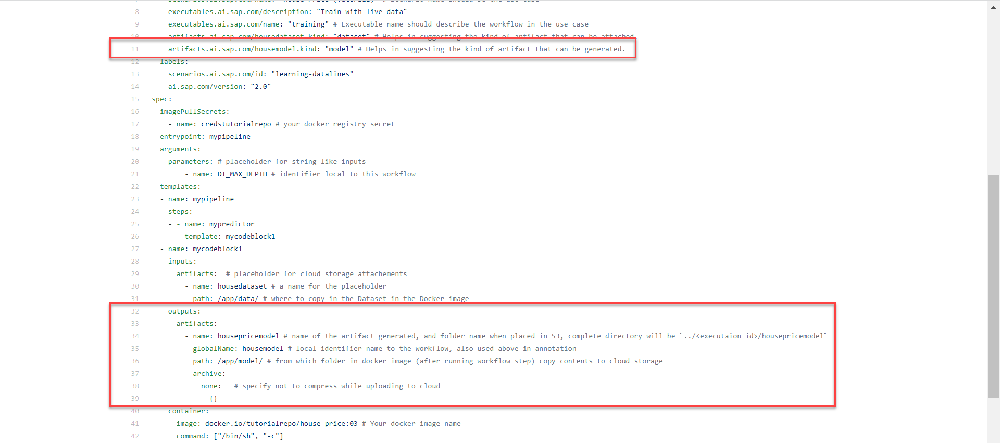

You added a new `outputs` section, where you specify files and their directories, which are created during execution, and will be uploaded to AWS S3 and automatically registered as artifacts in SAP AI Core. You also added a line in the `annotations` section, which specified the `kind` of artifact that would be generated. In this case, a model.

Again, all of the contents within your `/app/model/` directory (from your Docker image after execution) will be uploaded to AWS S3. This implies you may generate multiple files of any format after training, for example `class_labels.npy`, `model.h5`, `classifier.pkl` or `tokens.json`.

[DONE]
[ACCORDION-END]


[ACCORDION-BEGIN [Step 14: ](Create required object store secret `default` for model)]

It is compulsory to create a object store secret named `default` within your resource group, for your executable to **generate models and store them in AWS S3**. After execution the model will be saved to `PATH_PREFIX_of_default/<execution_id>/housepricemodel` in your AWS S3. The `housepricemodel` is mentioned in workflow/executable in previous step.

> **TIP** You can create multiple object store secrets with different `name` keys within the same resource group. You can also patch to modify values of an existing object store secret.


[OPTION BEGIN [SAP AI Launchpad]]

> **IMPORTANT** Currently, SAP AI Launchpad offers no functionality to perform this step. Please perform this step using any one of the alternative options from the option tab.

[OPTION END]

[OPTION BEGIN [Postman]]

**HEADER**

> **CAUTION** IF the following Header is not specified, this secret is restricted to the `default` resource group.

| Key | Value |
| --- | --- |
| `AI-Resource-Group` | `default` |

Paste and edit the following snippet:

```JSON[2]
{
    "name": "default",
    "data": {
        "AWS_ACCESS_KEY_ID": "<YOUR_AWS_ID>",
        "AWS_SECRET_ACCESS_KEY": "<YOUR_AWS_KEY>"
    },
    "type": "S3",
    "bucket": "<YOUR_BUCKET_NAME>",
    "endpoint": "s3-eu-central-1.amazonaws.com",
    "region": "eu-central-1",
    "pathPrefix": "example-dataset/house-price-toy/model"
}
```
Here, the name must be `default`. This should not be confused with the resource group name, which is also `default`. These are unrelated.
[OPTION END]

[OPTION BEGIN [SAP AI Core SDK]]

Paste and edit the following snippet:

```PYTHON
# Create object Store secret for placing models to S3
response = ai_core_client.object_store_secrets.create(
    name = "default", # name must be `default`, please DONT correlate with resource group name (which is also default here), these are not related.
    path_prefix = "example-dataset/house-price-toy/model", # ensure path prefix is targeted to where you want your models subdirectory to be located
    type = "S3",
    data = { # Dictionary of credentials of AWS
        "AWS_ACCESS_KEY_ID": "<YOUR_AWS_ID>",
        "AWS_SECRET_ACCESS_KEY": "<YOUR_AWS_KEY>"
    },
    bucket = "<YOUR_BUCKET_NAME>", # bucket name,
    region = "eu-central-1", # Edit this
    endpoint = "s3-eu-central-1.amazonaws.com", # Edit this
    resource_group = "default"
)
print(response.__dict__)
```

[OPTION END]

[DONE]
[ACCORDION-END]

[ACCORDION-BEGIN [Step 15: ](Create another configuration with new data)]

This time, let's train the model with the February's artifact (the `feb` dataset) and with a different hyper-parameter value.

[OPTION BEGIN [SAP AI Launchpad]]

On your SAP AI Launchpad, click through **ML Operations** > **Configuration** > **Create**.

Enter a configuration name and select your other details. Note that you updated the version of workflow above and hence select here.

!

Type `5` for `DT_MAX_DEPTH` field. Click **Next**.

Attach the `feb` artifact that you had registered.

!

Click **Review** and click **Create**.

[OPTION END]

[OPTION BEGIN [Postman]]

Paste and edit the snippet below. You should locate your `feb` dataset artifact ID by listing all artifacts and using the relevant ID.

**BODY**

```JSON
{
    "name": "House Price Feburary 1",
    "scenarioId": "learning-datalines",
    "executableId": "data-pipeline",
    "inputArtifactBindings": [
        {
            "key": "housedataset",
            "artifactId": "<YOUR_FEB_ARTIFACT_ID>"
        }
    ],
    "parameterBindings": [
        {
            "key": "DT_MAX_DEPTH",
            "value": "5"
        }
    ]
}
```

[OPTION END]


[OPTION BEGIN [SAP AI Core SDK]]

Paste and edit the snippet below. You should locate your `feb` dataset artifact ID by listing all artifacts and using the relevant ID.

```PYTHON
from ai_api_client_sdk.models.parameter_binding import ParameterBinding
from ai_api_client_sdk.models.input_artifact_binding import InputArtifactBinding

response = ai_core_client.configuration.create(
    name = "House Price Feburary 1",
    scenario_id = "learning-datalines",
    executable_id = "data-pipeline",
    input_artifact_bindings = [
        InputArtifactBinding(key = "housedataset", artifact_id = "<YOUR_FEB_ARTIFACT_ID>") # placeholder as name
    ],
    parameter_bindings = [
        ParameterBinding(key = "DT_MAX_DEPTH", value = "5") # placeholder name as key
    ],
    resource_group = "default"
)
print(response.__dict__)
```

[OPTION END]

[DONE]
[ACCORDION-END]

[ACCORDION-BEGIN [Step 16: ](Create execution)]

Use your new configuration to create an execution.

[OPTION BEGIN [SAP AI Launchpad]]

Click **Create Execution** in the configuration details page.

!

To see the details of your new model, click the model card, and then on **execution** in the **Process Flow**. The information is also available through **ML Operations** > **Models**.

!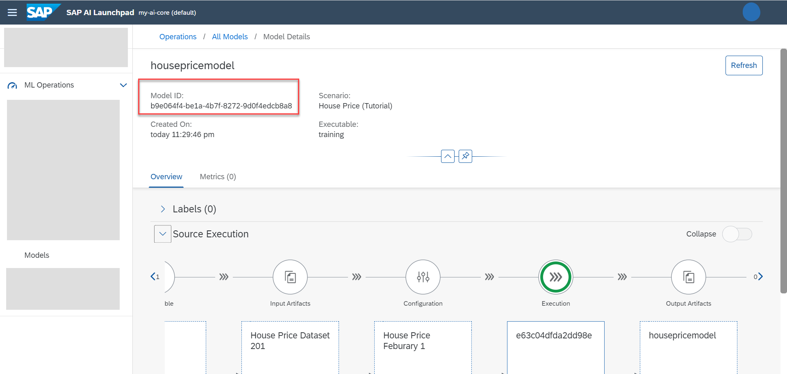

[OPTION END]

[OPTION BEGIN [Postman]]

List the execution status.

!

[OPTION END]

[OPTION BEGIN [SAP AI Core SDK]]

To query the execution status, paste and edit the code snippet below.

```PYTHON
# execute this multiple times in interval of 30 seconds
response = ai_core_client.execution.get(
    execution_id = '<YOUR_EXECUTION_ID>',
    resource_group = 'default'
)

for key, value in response.__dict__.items():
    if "output" in key:
        print(f"{key} : ")
        for artifact in value:
            print(f" {artifact.__dict__}")
    else:
        print(f"{key} : {value}")
```

!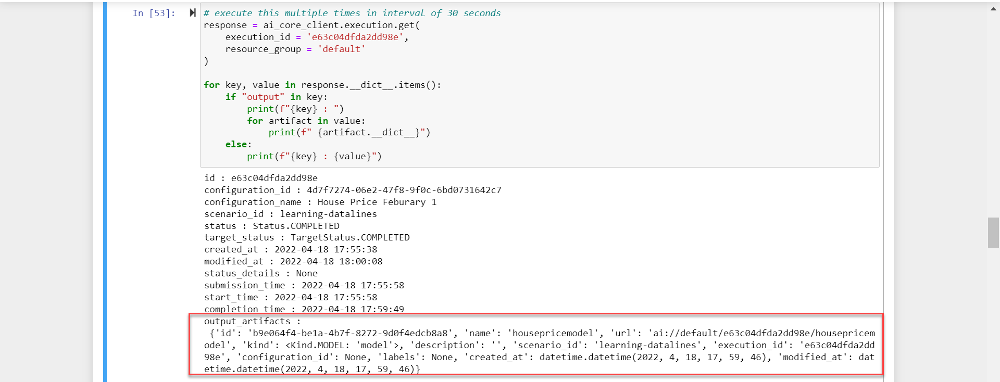

[OPTION END]

When your execution shows status **COMPLETED**, you will see that a new model artifact called `housepricemodel` has been generated. Note that the `outputArtifacts` are automatically registered and copied to AWS S3. Note that your artifact is of the kind **model** and that its **ID** is its only unique identifier - not its name.

Generating and associating metrics (model quality) will covered in a separate tutorial.

[DONE]
[ACCORDION-END]

[ACCORDION-BEGIN [Step 17: ](Locate your model in AWS S3)]

List your new files by pasting and editing the following snippet in your terminal.

```BASH
aws s3 ls s3://<YOUR_BUCKET_NAME>/example-dataset/house-price-toy/model/<YOUR_EXECUTION_ID>/housepricemodel
```

You are listing the files in the path `example-dataset/house-price-toy/model/` because you is the value you set earlier for the `pathPrefix` variable, for your object store secret named `default`.

!

[VALIDATE_1]
[ACCORDION-END]
