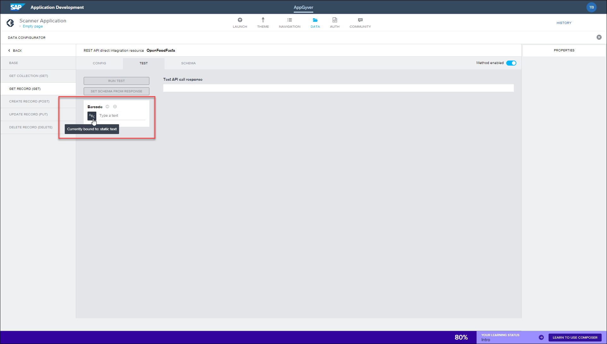
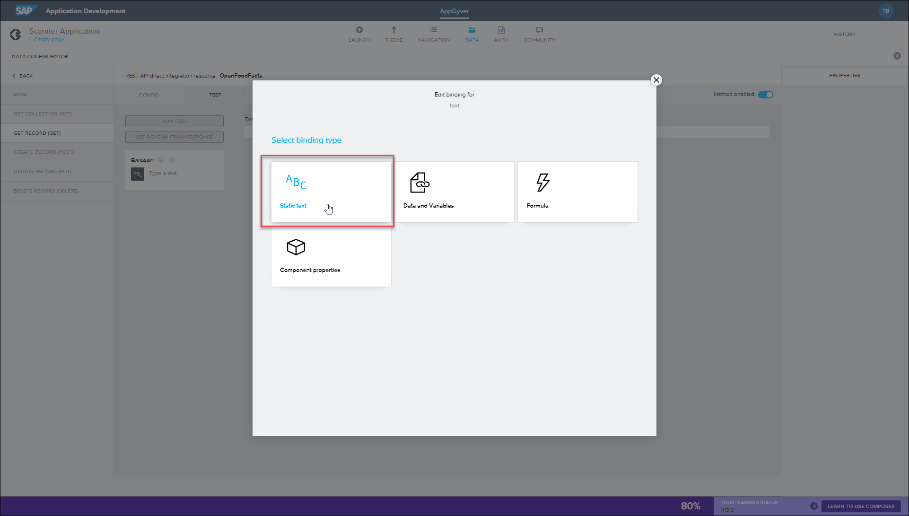
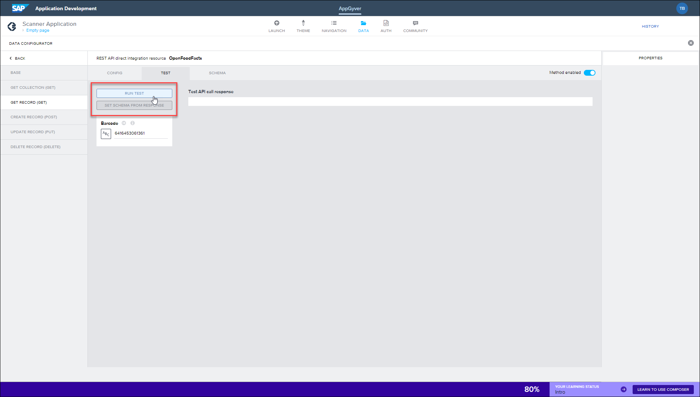

 
# Connect Your SAP Build Application to a Public API
<!-- description --> Connect your application to a public API and then test that it's pulling the right information.

## You will learn
  - How to add and configure data resources in your SAP Build application
  - How to call a public API by scanning a barcode

In the previous tutorial, you configured your application to open a device camera once the scan button had been tapped. This currently reads the barcode and returns only the barcode number, which on it's own is just a reference with no further information. 

To improve this, you need to configure a data source connected to that information. In this example, we'll use the Open Food Facts public API. Here the application will make an HTTPS request to their URL, returning the information provided there.

---

### Add data resources

Open your draft application in the Composer account.

1. Click your **Scan** button, and then click the **Data** tab.

    

2. Click **SAP Build Apps classic data entities > Create Data Entity**, and then select **REST API direct integration**.

    

3. Configure the resource with the following details:

    | Field | Value |
    |-------|-------|
    | **Resource ID** | `OpenFoodFacts` |
    | **Short description** | Data from Open Food Facts API |
    | **Resource URL** | <https://world.openfoodfacts.org/api/v0> |

4. Click **Save**, saving the data resource.

### Configure Get Record data

You now need to configure which information is taken from the Open Food Facts API. For your application, you need to configure this to fetch the barcode information, since that's what's being scanned with the device camera. This can be achieved using a Get Record request.

1. To configure this, click **Get Record (Get)**.

2. In the ***Relative path*** field enter: `/product/{barcode}`

    

3. Click the existing **URL placeholder key**, and then configure the following settings:

    | Field | Value |
    |-------|-------|
    | **Label** | Barcode |
    | **Key** | barcode |
    | **Value type** | Text |
    | **Description** | Resource ID to retrieve |
    | **Is encoded** | Enabled |
    | **Is static** | Disabled |
    | **Is optional** | Disabled |

    

### Test data sources

1. To now test that the HTTPS is configured and able to fetch information, click **Test**.

    

2. Under the **Barcode** placeholder, click **Currently bound to: static text**.

    

    Click **Static Text**.

    

    Enter **6416453061361** into the ***Type a text*** field. This is an example barcode number, taken from a confectionary wrapper.

    

3. Click **Run Test**.

    

The test now runs, displaying a Test API call response. In this response, you can see information about the confectionary. This includes the product categories, allergen information, and the brand who manufactured the product.

### Set schema from response

After a successful test you should now set the data schema. This stores the data structure from the URL, enabling the application to easily identify the types of information it is fetching.

To do this, click **Set Schema from Response**.

Click **Save**.

Your draft application is now saved and available in your SAP Build Apps Preview app.

