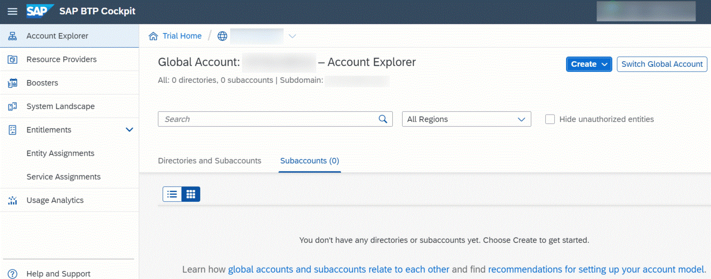
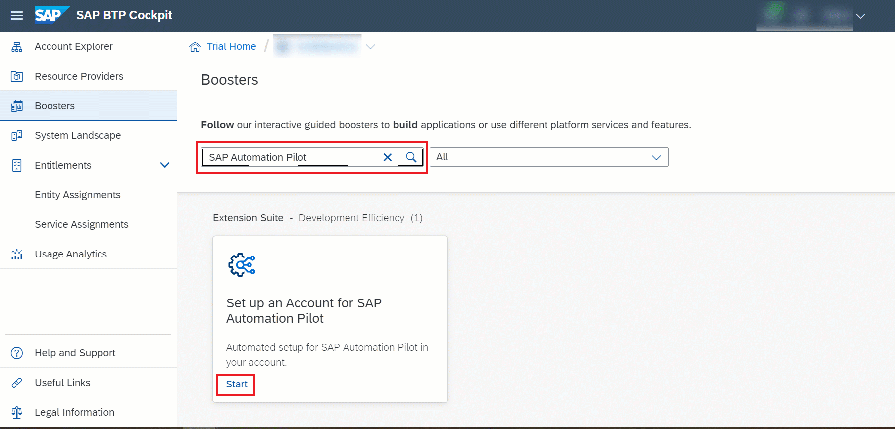
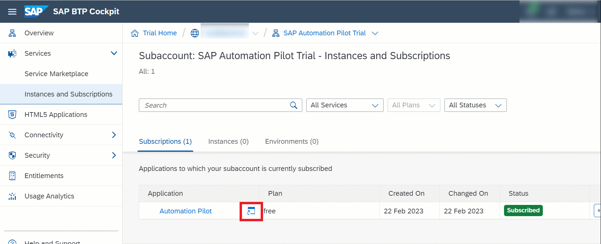
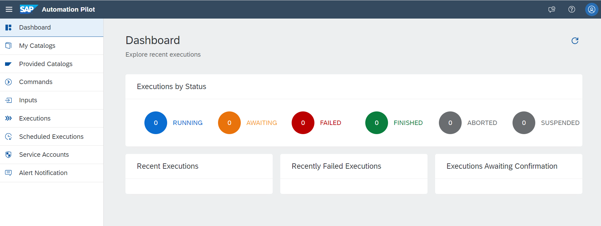

auto_validation: false
time: 10
tags: [ tutorial>beginner, type>tutorial ]
primary_tag: type>tutorial
parser: v2
---
# Get Started with SAP Automation Pilot
<!-- description --> This tutorial will guide you through the process of setting up a SAP Automation Pilot account and accessing it for the first time. 

## You will learn
- How to setup a Free SAP Automation Pilot Account.
- How to setup a Standard SAP Automation Pilot Account.

## Prerequisites
SAP Automation Pilot is available as a service on SAP Business Technology Platform (SAP BTP). You must have an active SAP BTP account as a prerequisite for using SAP Automation Pilot. For more information on how to setup a free SAP BTP trial, see [Get started with SAP BTP](https://www.sap.com/products/technology-platform/trial.html).     

### Acess your SAP BTP global account cockpit.

Once you have access to a SAP BTP global account, you can set up SAP Automation Pilot by taking advantage of the service booster. The booster automatically performs the following SAP BTP steps:

- Assigning service quotas
- Subscribing to SaaS applications
- Assigning role collections

For more information, see the official documentation on [Boosters](https://help.sap.com/docs/btp/sap-business-technology-platform/boosters?version=Cloud).

### Run the Booster
- Navigate to the menu on the left and select **Boosters**.

- Search for SAP Automation Pilot and click **Start** to launch the booster.

[OPTION BEGIN [Free Plan]]

- Choose your subaccount Scenario and then click **Next**. 

You can create a new subaccount or use an existing one.

- Configure your Subaccount Details including your Subaccount Name. Then click **Next**.
We recommend that you use names which are easily identifiable and self-explanatory here.
 
Provider and Region cannot be changed in the Trial version of SAP Automation Pilot.

- Review your subaccount details and then choose **Finish**.

- The booster now runs and the progress of each stage is displayed.
[OPTION END]

[OPTION BEGIN [Standard Plan]]

The booster loads and the prerequisite checks run automatically. These prerequisite checks ensure that your user account has the necessary permissions to subscribe to new services and that your SAP BTP global account has available SAP Automation Pilot entitlements. 

- Once the prerequisite checks are met, click **Next**.

- Choose your subaccount Scenario and then click **Next**. 

You can create a new subaccount or use an existing one.

- Configure your Subaccount Details including your Subaccount Name. Then click **Next**.
We recommend that you use names which are easily identifiable and self-explanatory here.
 
If needed, enter the details of additional users who will work on your development project and assign them to the relevant roles. Thenk click **Next**.

- Review your subaccount details and then choose **Finish**.

The booster now runs and the progress of each stage is displayed.
[OPTION END]

### Access SAP Automation Pilot

- Once the booster has successfully run, choose **Navigate to Subaccount**.

- Click **Services** and select **Instances and Subscriptions**.

- Click **Go to Application**.

Congratulations! You're now in the SAP Automation Pilot dashboard.

