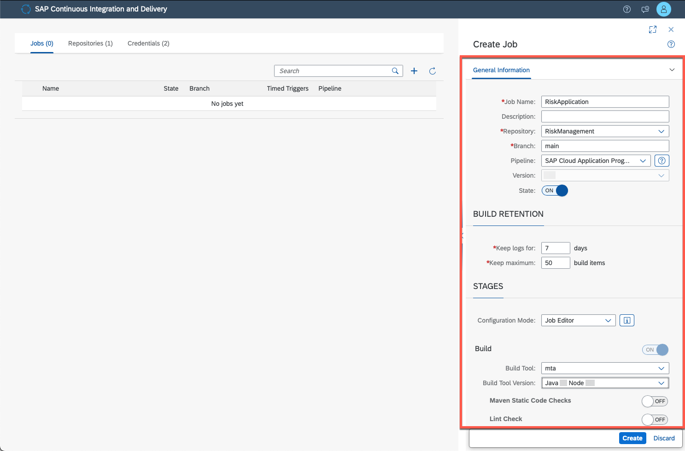
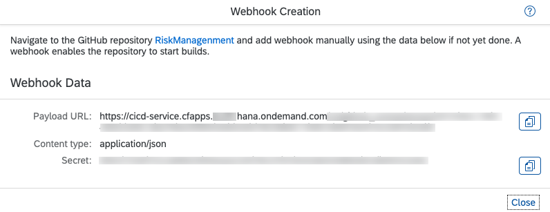
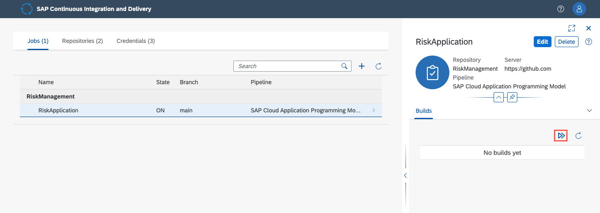
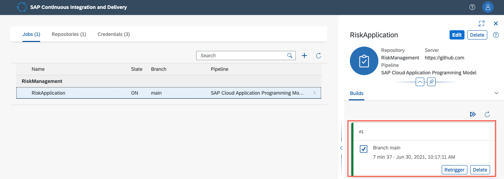

## Prerequisites
 - You have created your GitHub repository as described in **Step 14 Create a GitHub repository for your project** of the tutorial [Prepare Your Development Environment for CAP](btp-app-prepare-dev-environment-cap)
 - You have cloned your GitHub repository to your `cpapp` folder as described in **Step 15 Clone your GitHub repository** of the tutorial [Prepare Your Development Environment for CAP](btp-app-prepare-dev-environment-cap)
 - You have developed your CAP application and have prepared it for deployment using this collection of tutorials: [Build an Application End-to-End using CAP, Node.js and VS Code](mission.btp-application-cap-e2e)
 - You have to [Use an existing SAP HANA Cloud service instance](https://developers.sap.com/tutorials/btp-app-hana-cloud-setup.html#42a0e8d7-8593-48f1-9a0e-67ef7ee4df18) or [set up a new SAP HANA Cloud service instance](https://developers.sap.com/tutorials/btp-app-hana-cloud-setup.html#3b20e31c-e9eb-44f7-98ed-ceabfd9e586e)

## Details
### You will learn
 - How to enable SAP Continuous Integration and Delivery (CI/CD)
 - How to configure a CI/CD pipeline
 - How to create a GitHub webhook
 - How to run the CI/CD pipeline that automatically builds, tests, and deploys your code changes

---

[ACCORDION-BEGIN [Step 1: ](Introduction)]
> ### To earn your badge for the whole mission, you will need to mark all steps in a tutorial as done, including any optional ones that you may have skipped because they are not relevant for you.

[SAP Continuous Integration and Delivery (CI/CD)](https://help.sap.com/viewer/product/CONTINUOUS_DELIVERY/Cloud/en-US) is a service on SAP BTP, which lets you configure and run predefined continuous integration and delivery pipelines. It connects with your Git SCM repository and builds, tests, and deploys your code changes. In its user interface, you can easily monitor the status of your builds and detect errors as soon as possible, which helps you prevent integration problems before completing your development.

SAP Continuous Integration and Delivery has a ready-to-use pipeline for CAP, that is applicable to multi-target application (MTA) and Node.js based projects. It does not require you to host your own Jenkins instance and it provides an easy, UI-guided way to configure your pipelines.

For more information on how to configure and run predefined pipelines for your own CI/CD process, have a look at [What Is SAP Continuous Integration and Delivery](https://help.sap.com/viewer/SAP-Cloud-Platform-Continuous-Integration-and-Delivery).

[DONE]
[ACCORDION-END]
---
[ACCORDION-BEGIN [Step 2: ](Enable SAP Continuous Integration and Delivery service)]
[OPTION BEGIN [Trial]]

1. Go to your SAP BTP cockpit by using one of the following links, depending on the landscape you want to use:

    [https://cockpit.hanatrial.ondemand.com/](https://cockpit.hanatrial.ondemand.com/)

    > When running the tutorial with a trial account, please have in mind the following considerations:

    > * Choose host region `cf-us10` when creating a new trial account. This will ensure that the SAP Continuous Integration and Delivery service is available to your account.
    > * If you use an existing trial account, make sure the host region is different from `cf-ap21`. Otherwise, the SAP Continuous Integration and Delivery service might be missing from your account. To check the host region for your account, choose **About** from the dropdown under your user in the top right corner of the SAP BTP cockpit.

1. Enter your **Global Account**. If you are using a trial account, choose **Go To Your Trial Account**.

2. Choose **Account Explorer**.

3. In the **Subaccounts** tab, choose the subaccount to which you want to deploy your service and application.

    !

3. Choose **Service Marketplace** in the left-hand pane.

4. Type **Continuous Integration & Delivery** in the search box and choose the service tile.

    !

5. Choose **Create**.

    !

6. Choose **Create** in the popup without changing any values.

    !

7. Choose **View Subscription** and wait until the status changes to **Subscribed**.

    !

    !

8. In your SAP BTP subaccount, choose **Security** → **Role Collections** in the left-hand pane.

9. Choose role collection **CICD Service Administrator**.

10. Choose **Edit**.

    !

11. In the **Users** section, enter your user and select an **Identity Provider**.

    !

    > Keep the setting `Default Identity Provider` unless you have a custom identity provider configured.

13. Choose **Save**.

    > See [Initial Setup](https://help.sap.com/docs/CONTINUOUS_DELIVERY/99c72101f7ee40d0b2deb4df72ba1ad3/719acaf61e4b4bf0a496483155c52570.html) for more details on how to enable the service.


[OPTION END]
[OPTION BEGIN [Live]]

1. Go to your SAP BTP cockpit by using one of the following links, depending on the landscape you want to use:

    [https://account.hana.ondemand.com/](https://account.hana.ondemand.com/)

1. Enter your **Global Account**. If you are using a trial account, choose **Go To Your Trial Account**.

2. Choose **Account Explorer**.

3. In the **Subaccounts** tab, choose the subaccount to which you want to deploy your service and application.

    !

3. Choose **Service Marketplace** in the left-hand pane.

4. Type **Continuous Integration & Delivery** in the search box and choose the service tile.

    !

5. Choose **Create**.

    !

6. Choose **Create** in the popup without changing any values.

    !

7. Choose **View Subscription** and wait until the status changes to **Subscribed**.

    !

    !

8. In your SAP BTP subaccount, choose **Security** → **Role Collections** in the left-hand pane.

9. Choose role collection **CICD Service Administrator**.

10. Choose **Edit**.

    !

11. In the **Users** section, enter your user and select an **Identity Provider**.

    !

    > Keep the setting `Default Identity Provider` unless you have a custom identity provider configured.

13. Choose **Save**.

    > See [Initial Setup](https://help.sap.com/docs/CONTINUOUS_DELIVERY/99c72101f7ee40d0b2deb4df72ba1ad3/719acaf61e4b4bf0a496483155c52570.html) for more details on how to enable the service.


[OPTION END]


[DONE]
[ACCORDION-END]
---
[ACCORDION-BEGIN [Step 3: ](Access Continuous Integration and Delivery service)]
1. In your SAP BTP subaccount, navigate to **Services** → **Instances and Subscriptions** in the left-hand pane.

2. Choose the **Go to Application** icon located next to the **Continuous Integration & Delivery** subscription.

    !

3. Use your credentials to log in to the application.

    !

[DONE]
[ACCORDION-END]
---
[ACCORDION-BEGIN [Step 4: ](Configure your GitHub credentials)]
> ### To earn your badge for the whole mission, you will need to mark all steps in a tutorial as done, including any optional ones that you may have skipped because they are not relevant for you.

If your GitHub repository is not private, you can skip this section. If your GitHub repository is private, configure credentials for it, so that SAP Continuous Integration and Delivery service can connect to it.

1. Navigate to the **Credentials** tab in SAP Continuous Integration and Delivery.

2. Choose ( &#x2B; ) to create credentials.

    !

3. For **Name**, enter a freely chosen name for your credential, which is unique in your SAP BTP subaccount. In this example, the name of the credential is **`github`**.

4. As **Type**, select **Basic Authentication**.

5. For **Username**, enter your GitHub username.

6. For **Password**, use a [personal access token](https://docs.github.com/en/github/authenticating-to-github/keeping-your-account-and-data-secure/creating-a-personal-access-token).

    > Select **repo** as scope when creating the token.

7. Choose **Create**.

[DONE]
[ACCORDION-END]
---
[ACCORDION-BEGIN [Step 5: ](Configure your SAP BTP credentials)]
1. To create credentials for deploying to SAP BTP, Cloud Foundry environment, go to the **Credentials** tab and choose **+** *(Create Credentials)*.

    !

2. For **Name**, enter a freely chosen name for your credentials, which is unique in your SAP BTP subaccount, for example **`cfdeploy`**.

3. As **Type**, select **Basic Authentication**.

4. For **Username**, enter your username for the SAP BTP cockpit.

5. For **Password**, use your password for the SAP BTP cockpit.

    !

6. Choose **Create**.

[DONE]
[ACCORDION-END]
---
[ACCORDION-BEGIN [Step 6: ](Configure a CI/CD job)]
1. In the **Jobs** tab in SAP Continuous Integration and Delivery, choose ( &#x2B; ) to create a new job.

    !

2. For **Job Name**, enter a freely chosen name for your job, which is unique in your SAP BTP subaccount, for example **`RiskApplication`**.

3. Under **Repository**, choose **Add Repository**.

    !

4. Add the name and the URL for your repository.

    !

    > If your GitHub repository is private, enter the name of the GitHub credentials (`github` as created in step [Configure you GitHub credentials](#configure-your-github-credentials) above) in **Repository Credentials** to access your GitHub Repository that you have already created. If your GitHub repository isn't private, leave this field empty.

5. Choose **Add**.

6. For **Branch**, enter the GitHub branch of your repository from which you want to receive push events. In this example, **`main`**.

7. As **Pipeline**, choose **SAP Cloud Application Programming Model**.

8. Keep the default values in the **BUILD RETENTION** tab.

9. In the **STAGES** tab, choose **Job Editor** from the **Configuration Mode** dropdown list.

10. For **Build Tool**, leave **`mta`** as preselected.

11. For **Build Tool Version**, select the latest version.

11. Leave the execution of the **Maven Static Code Checks** step switched off.

12. Leave the execution of the **Lint Check** step switched off.

    !

13. Leave the execution of the **Additional Unit Tests** switched off.

14. Leave **Acceptance** switched off.

15. Leave **`SonarQube` Scan** under **Compliance** switched off.

14. Under the **Release** section, switch the execution of the **Deploy to Cloud Foundry Space** step on.

    !

16. Replace the placeholders `<YOUR ORG NAME>`, `<YOUR SPACE NAME>`, and `<YOUR CLOUD FOUNDRY API ENDPOINT>` with the values of the space in the Cloud Foundry environment to which you want to deploy. You can get the values from your subaccount overview in the SAP BTP cockpit.

    !

17. For **Deploy Type**, choose `standard`.

17. For **Credentials**, choose the name of the credentials you created before in step [Configure your SAP BTP credentials](#configure-your-sap-btp-credentials). In the example we used `cfdeploy`.

    > Use a technical user instead of your personal credentials.

    > Deployment will not work if you have activated Two-factor authentication for the user.

17. Leave the **Upload to Cloud Transport Management** step switched off.

18. Choose **Create**.

[DONE]
[ACCORDION-END]
---
[ACCORDION-BEGIN [Step 7: ](Create a GitHub webhook)]
GitHub webhooks allow you to automate CI/CD builds. Whenever you push changes to your GitHub repository, a webhook push event is sent to the service to trigger a build of the connected job.

To create a webhook in GitHub, you need some data that has been automatically created during the previous step. You can find this data, the *Payload URL* and *Secret*, when you open the detail view of an existing repository in the **Repositories** tab.

1. Choose the name of your repository and choose **Webhook Data**.

    !

    You will see a popup like this:

    !

2. In your project in GitHub, go to the **Settings** tab.

3. From the navigation pane, choose **Webhooks**.

4. Choose **Add webhook**.

    !

5. Enter the **Payload URL**, **Content type**, and **Secret** from the **Webhook Data** in SAP Continuous Integration and Delivery. For all other settings, leave the default values.

6. Choose **Add webhook**.

    !

[DONE]
[ACCORDION-END]
---
[ACCORDION-BEGIN [Step 8: ](Change specVersion to avoid build errors)]
You have to change the `specVersion` parameter in files `ui5-deploy.yaml` and `ui5.yaml` in both the `app/risks` and `app/mitigations` folders to `2.3`. Otherwise, you might get an error when your job is built.

1. Open the `app/risks/ui5-deploy.yaml` file and set the `specVersion` to `2.3`:

    ```YAML[2]
    # yaml-language-server: $schema=https://sap.github.io/ui5-tooling/schema/ui5.yaml.json
    specVersion: '2.3'
    metadata:
        ...
    ```

2. Open the `app/risks/ui5.yaml` file and set the `specVersion` to `2.3`:

    ```YAML[1]
    specVersion: '2.3'
    metadata:
        ...
    ```

3. Open the `app/mitigations/ui5-deploy.yaml` file and set the `specVersion` to `2.3`:

    ```YAML[2]
    # yaml-language-server: $schema=https://sap.github.io/ui5-tooling/schema/ui5.yaml.json
    specVersion: '2.3'
    metadata:
        ...
    ```

4. Open the `app/mitigations/ui5.yaml` file and set the `specVersion` to `2.3`:

    ```YAML[1]
    specVersion: '2.3'
    metadata:
        ...
    ```

5. Commit the changes to your GitHub repo.

[DONE]
[ACCORDION-END]
---
[ACCORDION-BEGIN [Step 9: ](Verify the success of your build)]
You have to trigger your job manually the first time after creation.

1. In the **Jobs** tab in SAP Continuous Integration and Delivery, select your job and choose **Trigger Build**.

    !

    Verify that a new tile appears in the **Builds** view. This tile should be marked as running.

    !

    > If you would like to check whether the job is triggered automatically after new changes, you can make a simple change in the code and verify if it's built. You can also add a time trigger for your job under section **Timed Triggers**.

2. Wait until the job has finished and verify that the build tile is marked as successful.

    !

    > In case you get any errors:

    > Verify that your SAP HANA Cloud service instance is running. Your SAP HANA Cloud service instance will be automatically stopped overnight, according to the server region time zone. That means you need to restart your instance every day, before you start working with your trial.

    > Verify you have added all necessary entitlements to your account as specified in [Prepare for SAP BTP Development](btp-app-prepare-btp).

3. Navigate to your space in the SAP BTP cockpit and check the list of installed applications. Now, you have a **cpapp-db-deployer** application and a **cpapp-srv** application.

    !

4. Choose the **cpapp-srv** application and launch it with the application route.

    !

You have now successfully created a CI/CD pipeline and deployed your application to SAP BTP.

> Additional Information:

> If you'd like to add more stages to your job, for example, additional unit tests, you can configure the job in your repository instead of using the job editor of the SAP Continuous Integration and Delivery. See [Configure an SAP Cloud Application Programming Model Job in Your Repository](https://help.sap.com/viewer/SAP-Cloud-Platform-Continuous-Integration-and-Delivery/bfe48a4b12ed41868f92fa564829f752.html#loiobfe48a4b12ed41868f92fa564829f752) for more details.

> In case this is your first deployment of the `cpapp` project to the SAP BTP Cloud Foundry environment, please continue with the tutorial [Add the SAP Launchpad Service](btp-app-launchpad-service).  You will need to complete the configuration before you can use the application, because this part can't be automated with CI/CD tooling.

[VALIDATE_1]
[ACCORDION-END]
---