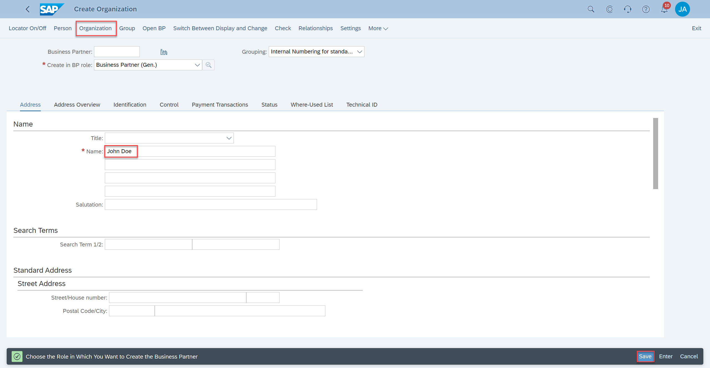

## Prerequisites
 - [Add the Consumption of an External Service to Your CAP Application](btp-app-ext-service-add-consumption)
 - [Consume the External Service in the UI of Your Application](btp-app-ext-service-consume-ui)
 - [Register Your SAP S/4HANA Cloud System](btp-app-ext-service-s4hc-register)
 - [Use Your SAP S/4HANA Cloud Service for Your Deployed CAP Application](btp-app-ext-service-s4hc-use)
 - [Set Up Your CAP Application for Eventing](btp-app-events-app-setup-s4hc)
 - [Enable Events from SAP S/4HANA Cloud to SAP BTP](btp-app-events-enable-s4hc)
 - When starting with the result from the [`events-app-setup-s4hc`](https://github.com/SAP-samples/cloud-cap-risk-management/tree/events-app-setup-s4hc) branch, refer to [Create a Directory for Development](btp-app-create-directory) to see a recommended approach for organizing directories and details how to copy the content of the branch.
 - On SAP BTP side:
    - You have an [enterprise](https://help.sap.com/viewer/65de2977205c403bbc107264b8eccf4b/Cloud/en-US/171511cc425c4e079d0684936486eee6.html) global account in SAP BTP.
    - You must be an administrator of the SAP BTP global account where you want to register your SAP S/4HANA Cloud system.
    - You need to [Prepare for SAP BTP Development](btp-app-prepare-btp) if you start with the result from an example branch.
    - Your SAP BTP subaccount has quota for the services `SAP Launchpad service` and `SAP HTML5 Applications Repository service` as described in [Prepare for SAP BTP Development](btp-app-prepare-btp).
    - You have to [Use an existing SAP HANA Cloud service instance](https://developers.sap.com/tutorials/btp-app-hana-cloud-setup.html#42a0e8d7-8593-48f1-9a0e-67ef7ee4df18) or [Set up a new SAP HANA Cloud service instance](https://developers.sap.com/tutorials/btp-app-hana-cloud-setup.html#3b20e31c-e9eb-44f7-98ed-ceabfd9e586e) for the deployment. After the deployment, you need to perform step 14-17, starting with step [Subscribe to SAP Launchpad Service](https://developers.sap.com/de/tutorials/btp-app-launchpad-service.html#57352c79-1a09-4054-a77d-626fac957404) from the tutorial [Add the SAP Launchpad service](btp-app-launchpad-service).
 - On SAP S/4HANA Cloud side:
    - You have a dedicated SAP S/4HANA Cloud tenant.
    - You must be an administrator of the SAP S/4HANA Cloud system.
    - You need to connect this system to your SAP BTP global account, if you'd like to build extension applications for your SAP S/4HANA Cloud system.

## Details
### You will learn
 - How to create and change a Business Partner in your SAP S/4HANA Cloud system
 - How to check if the Business Partner creation and change events sent from your SAP S/4HANA Cloud system have updated your CAP application

---

[ACCORDION-BEGIN [Step 1: ](Create a Business Partner and check updates in your CAP application)]
1. In your S/4HANA Cloud system, go to **Maintain Business Partner**. You can also use the **Search** field in the upper right corner of the screen.

    !

2. Under **Organization**, add a name for the business partner and choose **Save**.

    !

3. Open the UI application. Choose the **Risks** tile and find the automatically created `Risk` for the newly saved `BusinessPartner`.

    !

4. Open the object page of the new risk. Set **Impact** to `1000` and choose **Save**.

    !

5. Refresh the **Risks** app and choose **Go**. The risk status is updated to `Assessed`.

    !

5. In the SAP S/4HANA Cloud system, change the already created business partner. For example, add a salutation and choose **Save**.

    !

6. Refresh the **Risks** app and choose **Go** again. The status of the new risk is updated to `Changed`.

    !

Congratulations! You have completed all tutorials.

[VALIDATE_1]

Give us 55 seconds of your time to help us improve.

<!--TAIL END-->
[ACCORDION-END]
---
