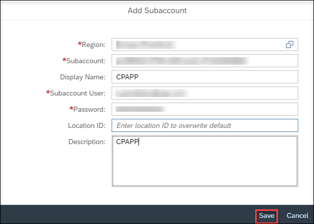
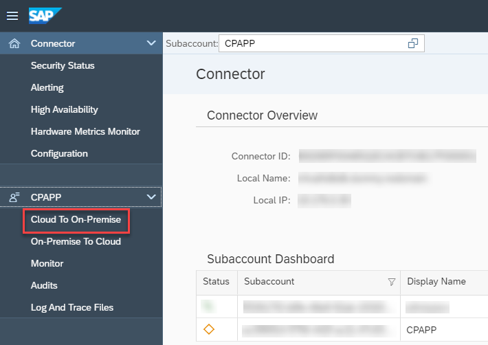
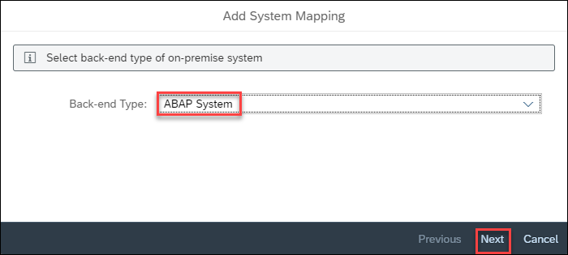
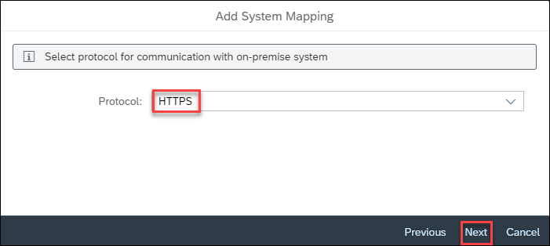
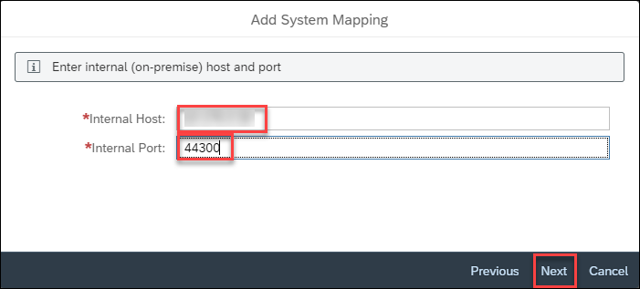
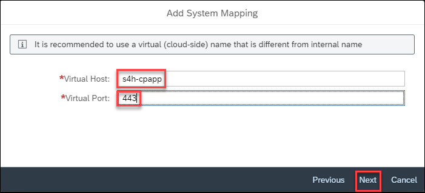
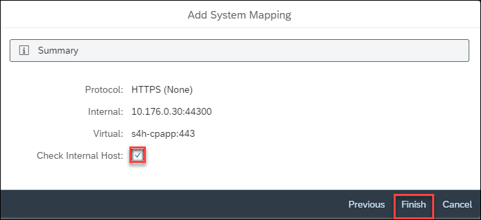
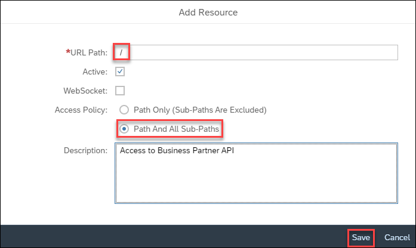

## Prerequisites
 - You have developed your CAP application using the tutorials [Add the Consumption of an External Service to Your CAP Application](btp-app-ext-service-add-consumption) and [Consume the External Service in the UI of Your Application](btp-app-ext-service-consume-ui) or download the result from this [branch](https://github.com/SAP-samples/cloud-cap-risk-management/tree/ext-service-consume-ui) to continue here.
 - When starting with the result from the [`ext-service-consume-ui`](https://github.com/SAP-samples/cloud-cap-risk-management/tree/ext-service-consume-ui) branch, refer to [Create a Directory for Development](btp-app-create-directory) to see a recommended approach for organizing directories and details how to copy the contents of the branch.
 - [Prepare SAP S/4HANA System by Activating the Suitable OData Service](btp-app-ext-service-odata-service)
 - On SAP BTP side:
    - You have an [enterprise](https://help.sap.com/viewer/65de2977205c403bbc107264b8eccf4b/Cloud/en-US/171511cc425c4e079d0684936486eee6.html) global account in SAP BTP.
    - You must be an administrator of the SAP BTP global account where you want to register your SAP S/4HANA system.
    - You need to [Prepare for SAP BTP Development](btp-app-prepare-btp) if you start with the result from an example branch.
    - Your SAP BTP subaccount has quota for the services `SAP Launchpad service` and `SAP HTML5 Applications Repository service` as described in [Prepare for SAP BTP Development](btp-app-prepare-btp).
    - You have to [Use an existing SAP HANA Cloud service instance](https://developers.sap.com/tutorials/btp-app-hana-cloud-setup.html#42a0e8d7-8593-48f1-9a0e-67ef7ee4df18) or [Set up a new SAP HANA Cloud service instance](https://developers.sap.com/tutorials/btp-app-hana-cloud-setup.html#3b20e31c-e9eb-44f7-98ed-ceabfd9e586e) for the deployment. After the deployment, you need to perform step 14-17, starting with step [Subscribe to SAP Launchpad Service](https://developers.sap.com/de/tutorials/btp-app-launchpad-service.html#57352c79-1a09-4054-a77d-626fac957404) from the tutorial [Add the SAP Launchpad service](btp-app-launchpad-service).
- On SAP S/4HANA side:
    - You have a dedicated SAP S/4HANA system.
    - You must be an administrator of the SAP S/4HANA system.
 - On Cloud Connector side:
    - You have downloaded the right Cloud Connector version for your operating system from [SAP Development Tools](https://tools.hana.ondemand.com/#cloud) and have installed Cloud Connector on your machine in accordance with the [installation instructions](https://help.sap.com/viewer/cca91383641e40ffbe03bdc78f00f681/LATEST/en-US/57ae3d62f63440f7952e57bfcef948d3.html) on the SAP Help Portal.

## Details
### You will learn
- How to configure the Cloud Connector to connect your SAP S/4HANA system to SAP BTP
- How to add subaccount, system mapping and resource

---

[ACCORDION-BEGIN [Step 1: ](Configure system access in Cloud Connector)]
The Cloud Connector serves as a link between SAP BTP applications and on-premise systems. It combines an easy setup with a clear configuration of the systems that are exposed to the SAP BTP. At the same time, the cloud connector lets you use existing on-premise assets without exposing the entire internal landscape. See [Cloud Connector documentation](https://help.sap.com/viewer/cca91383641e40ffbe03bdc78f00f681/LATEST/en-US/e6c7616abb5710148cfcf3e75d96d596.html) for more details.

[DONE]
[ACCORDION-END]
---
[ACCORDION-BEGIN [Step 2: ](Add subaccount)]
1.    Open your [Cloud Connector administration UI](https://localhost:8443/).

    > - Adjust the port if you specified another one during the installation. You might have to use the external IP of your system.
    > - You can find detailed information on installing the Cloud Connector and logging in to the administration UI in [Install the Cloud Connector](https://developers.sap.com/tutorials/hana-cloud-mission-extend-08.html#10dcb97c-ab26-4ee1-973e-6f1f6638b079).

2.    Choose **Add Subaccount**.

    !

3.    Enter the required data in the **Add Subaccount** dialog and choose **Save**.

    !

    > - You can look up the required data in SAP BTP cockpit.
    > - For example, the field **Subaccount** requires the ID.

[DONE]
[ACCORDION-END]
---
[ACCORDION-BEGIN [Step 3: ](Add system mapping)]
1.    Choose **Cloud to On-Premise** on the left.

    !

2.    Choose <kbd>+</kbd> on the right.

    !

3.    In the **Add System Mapping** dialog, select `ABAP System` from the dropdown list in the **Backend Type** field and choose **Next**.

    !

4.    Select `HTTPS` from the dropdown list in the **Protocol** field and choose **Next**.

    !

5.    Enter your values for the fields **Internal Host** and **Internal Port**, and choose **Next**.

    !

    > Tip for field values

    > - **Internal Host**: this is the internal IP of your SAP S/4HANA system.
    > - **Internal Port**: this is set to `44300` for HTTPS. However, you can look up the specific HTTPS port on your SAP S/4HANA system using the transaction `SMICM`.

6. Enter your values for the fields **Virtual Host** and **Virtual Port**, and choose **Next**.

    !

    > Tip for field values

    > - It's up to you what values to put in the fields **Virtual Host** and **Virtual Port**. We've provided exemplary values for your convenience.

7.    Select `None` for **Principal Type** and choose **Next**.

8.    Select `Use Virtual Host` for **Host in Request Header** and choose **Next**.

    !

9.    (Optional) Add a **Description** for your system mapping and choose **Next**.

    !

10.    Review the values, enable **Check Internal Host**, and choose **Finish**.

    !

[VALIDATE_1]
[ACCORDION-END]
---
[ACCORDION-BEGIN [Step 4: ](Add resource)]
1. Make sure that your system is selected under section **Mapping Virtual to Internal System** and choose <kbd>+</kbd> under section **Resources Of <YOUR_VIRTUAL_HOST>** (in this example, `s4h-cpapp:443`).

    !

2. In the **Add Resource** dialog, insert `/` for **URL Path**.

3. Set **Access Policy** to `Path and All Subpaths`.

4. Enter a description for the resource (optional).

5. Choose **Save**.

    !

    The resource appears in the table.

    !

[DONE]
[ACCORDION-END]
---