# Integrate SAP AppGyver with SAP Integration Suite
<!-- description --> how to test request calls in SAP AppGyver to a SAP Integration Suite API and how to set up the needed schema for sending payloads.

## Prerequisites

 - You have a SAP BTP account or trial account with access to the SAP Integration Suite.
 - You have a SAP AppGyver account or trial account.
 - You have completed the previous tutorial [Configure SAP API Management policies to avoid CORS issues and generate an API Key](btp-integration-suite-integral-api-management).


## You will learn

  - How to test request calls in SAP AppGyver to a SAP Integration Suite API.
  - How to set up the needed schema for sending payloads.
  - How to retrieve data from a request call's response.

### Add the API Endpoint in SAP AppGyver

1. Go to your SAP AppGyver custom app, click on `Data` on the menu and Add a Data Resource and select `REST API direct integration`. Remember that for this exercise, it is needed to create first a custom mobile application from this [blog post](https://blogs.sap.com/2022/05/08/get-data-from-a-json-object-by-scanning-a-qr-code-with-sap-appgyver/).

    

2. Copy and paste your API endpoint from SAP API Management as the base resource URL and name your Data Resource. Enter the name: `IntegrationSuite_API_CORS`.

    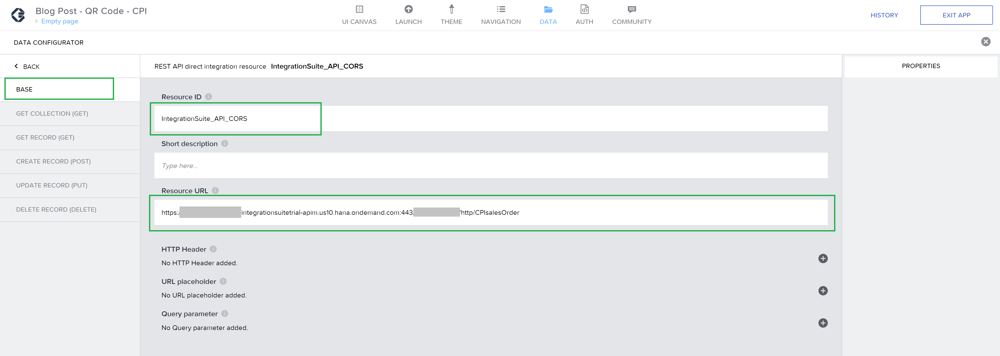

3. Click on the `Create Record (POST)` section, make sure `id` is erased from the relative path and enter your API Key as a header (make sure you don't put it as optional and mark it as static).

    

4. Set up the custom needed schema for testing a POST request. Remember the payload structure you are using for this exercise:

    <!-- cpes-file db/schema.cds -->
    ```JSON
    {
    "AppGyverSalesOrder": {
        "customer": {
        "ObjectID": "<Object ID from SAP C4C>",
        "BuyerPartyID": <BuyerPartyID from SAP C4C>
        },
        "paymentData": {
        "amount": <Payment transaction amount to be processed in Stripe>,
        "customer": "<stripe customer id>",
        "currency": "<currency selected in stripe account>",
        "source": "<card id>",
        "description": "Test payment via CPI"
        },
        "product": [
        {
            "ProductID": "<Product ID from SAP C4C>",
            "Quantity": <Product quantity to be purchased>
        }
        ]
    }
    }
    ```
    So to "translate it" into the custom schema in SAP AppGyver, you'll need to add these properties manually, as shown in the following image:

    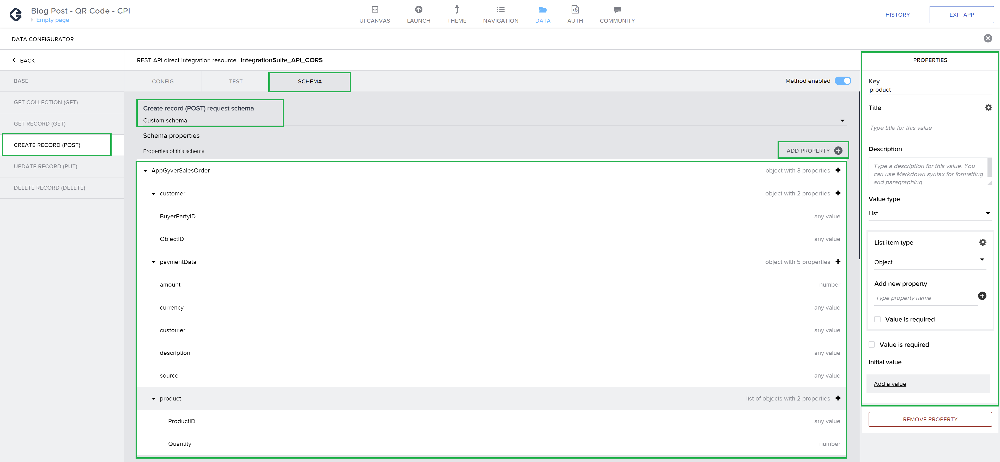

5. Click on the Test tab and open your custom object, where you are going to add the values as the payload for testing.

    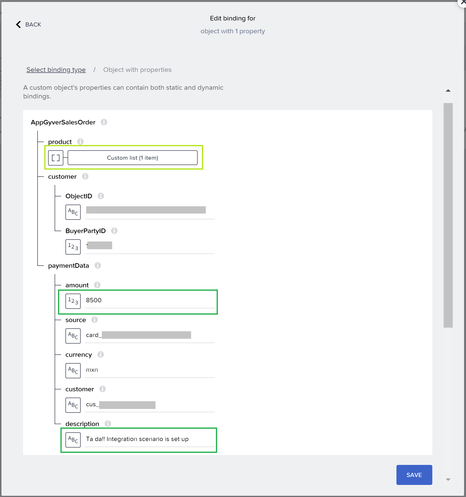

    And setting for testing purposes a Product ID from SAP Sales and Service core (formerly SAP Cloud for Customer or SAP C4C).

    

6. Save it and now click on `Run Test`. You should see this response `Status: OK`:

    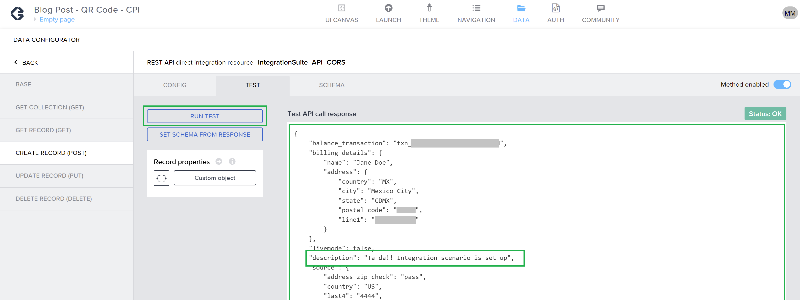

7. If you check on your Stripe developers account, you can see the amount and description "Ta dá!! Integration scenario is set up":

    

### Create a variable from the request call's response

1. Click on Set Schema From Response to let AppGyver know you want to create a variable for getting the receipt URL.

    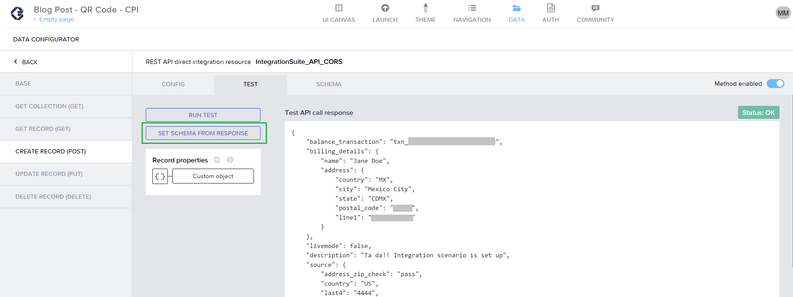

2. Now you can see `receipt_url` from the return message, as a property, like in the following image. Save your configuration.

    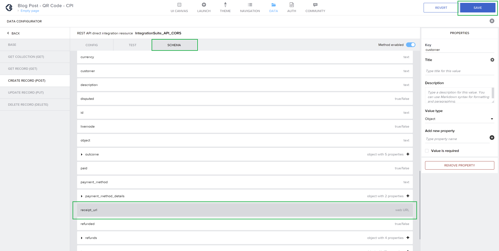

3. Create a variable to enable this `receipt_url` as a variable to be linked in your application UI.

    Click again on `Data` to close it and go back to your application design. Click on `View – Variables` and click on `Add Page Variable` as it is in the following image:

    

### Update your variables to send the Payload

Remember you're following this previous exercise of a custom application developed in SAP AppGyver (as mentioned in the prerequisites first tutorial). The differences are:

1. Add one field to the QR code (ProductID) for the purpose of the integration exercise and update the variables you've already created in the SAP AppGyver app. Of course, in reality you would want to add as many Product fields as necessary to execute the Sales Order transaction.

2. Add an additional Button (to trigger the API call) and an WebView component (to see the Stripe's payment confirmation with the receipt url).

### Create a page variable with a new JSON Object

1. Go back to your QR code generator (you can use this [one](https://www.qr-code-generator.com/)), and paste this JSON object. You may need to change the model and URL too, if you want to test your integration with a different product defined in your SAP Sales and Service Core tenant (SAP Cloud for Customer):

    <!-- cpes-file db/schema.cds -->
    ```JSON
    {
    "ProductID": "<your SAP C4C product ID>",
    "model": "Samsung French Door 29 ft",
    "imgURL": "https://samsungmx.vtexassets.com/arquivos/ids/180853-800-auto?width=800&height=auto&aspect=true"
    }
    ```
    Save the generated QR Code:

    

2. Go back to your SAP AppGyver custom app, and click on `View – Variables`, go to Page Variables and update them by adding `ProductID` as a new property of the parsed Json object:

    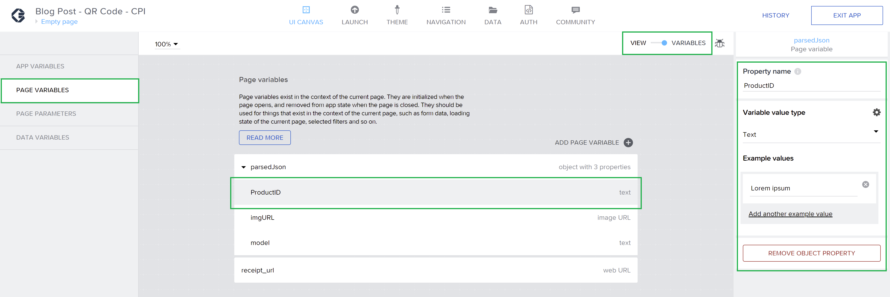

3. Click again in `View – Variables` to go back to your UI editor, change the first title of the Product from `brand` to the `model` page variable, to make it consistent with the generated QR code:

    

4. Add the `ProductID` page variable to the second Product component:

    

5. Leave the image URL as it is in the [original exercise](https://blogs.sap.com/2022/05/08/get-data-from-a-json-object-by-scanning-a-qr-code-with-sap-appgyver/).

### Configure with a button the request call trigger

1. Add the button and change its name to `Create Order consuming CPI`:

    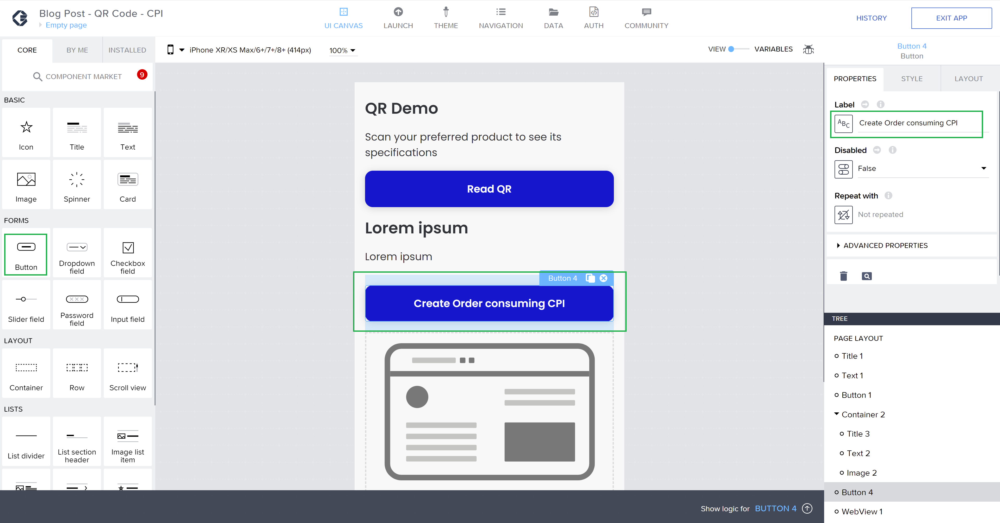

2. Add the `WebView` component (this one, you have to install it):

    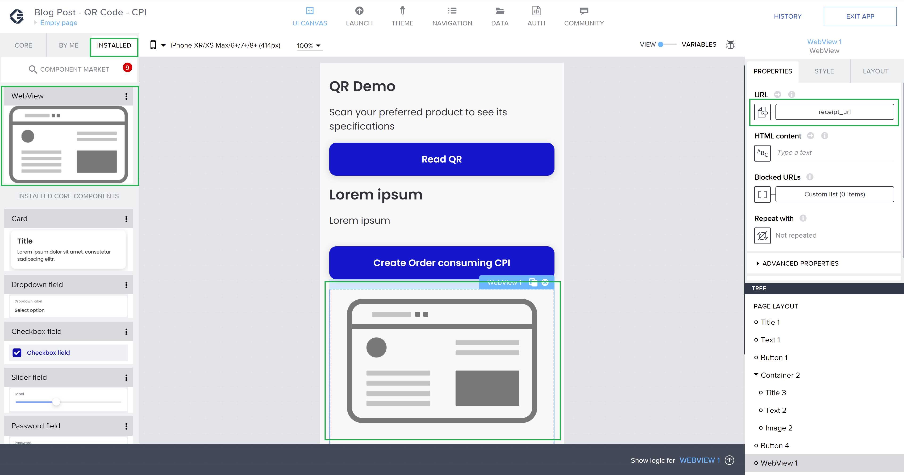

3. And link it to the page variable `receipt_url` you created before. Like this:

    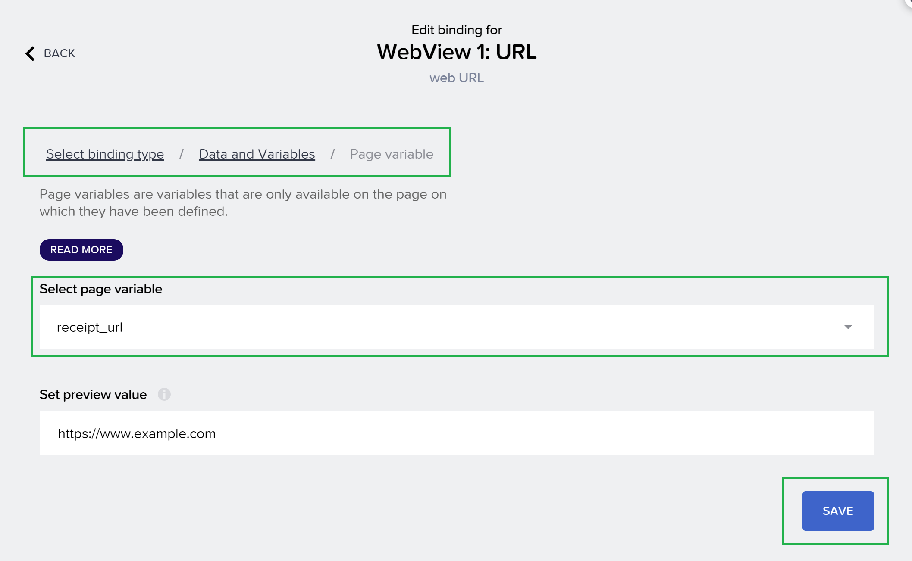

4. Select the button and click on the bottom-right "Show logic for BUTTON" and add a `Create Record` logic component.

    - In the Resource name: select the Data Resource Id you created before `IntegrationSuite_API_CORS`
    - For the Records properties: here you'll see the custom schema we created before for requesting POST calls from SAP AppGyver.

        

5. Click on `Record properties` -> `Custom object`. And add the newly created property: `ProductID`.

    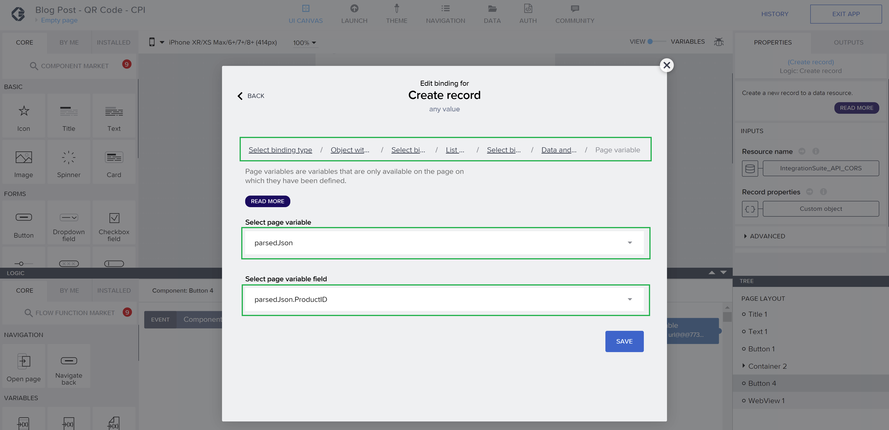

    After save it, you'll see it like this in the Product List Object:

    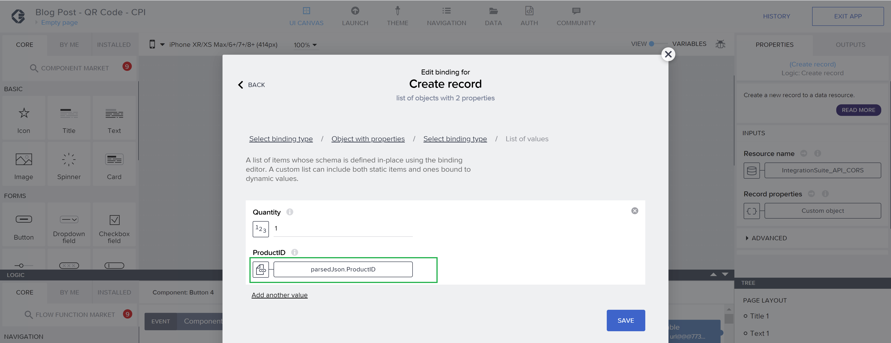

    If you want, you can create as may variables as you want to make the exercise more dynamic. As I mentioned before, for the purpose of the integration exercise I'm using only `ProductID`. You'll see your payload structured in AppGyver, like this:

    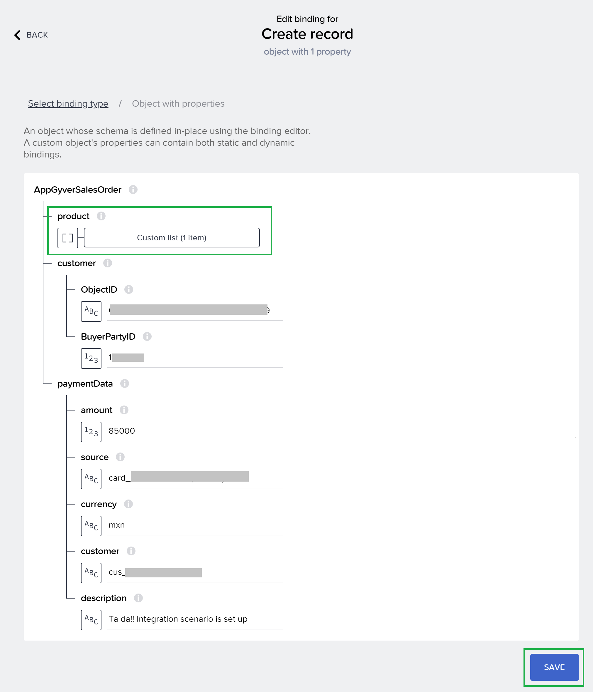

    Click on Save.

6. Add a JavaScript logic component, this is to configure the getting of the `receipt_url` from the Stripe request response.

    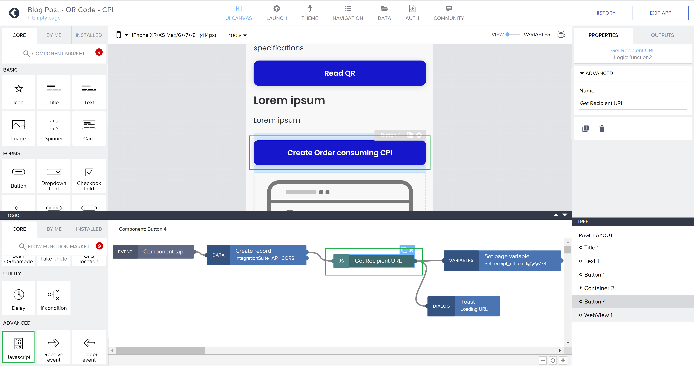

7. Erase the original `input1` name and change it for `response`. Click to bind the data.

    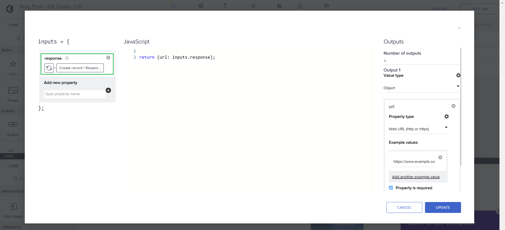

    Select the binding type: Output value of another node, then create record and select `receipt_url` as field you want to get from the response.

    

    Save it and close it.

8. Add a Dialog Toast, just to show up a message that the request call was successful. Write as a Toast Message `Loading URL`, like this:

    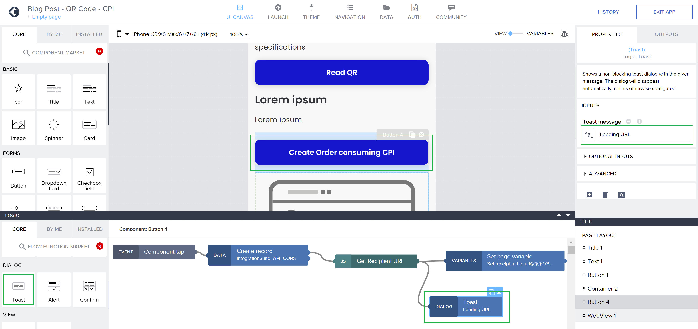

9. Add a `Set page variable` logic component and add as the variable name the page variable you created before `receipt_url`:

    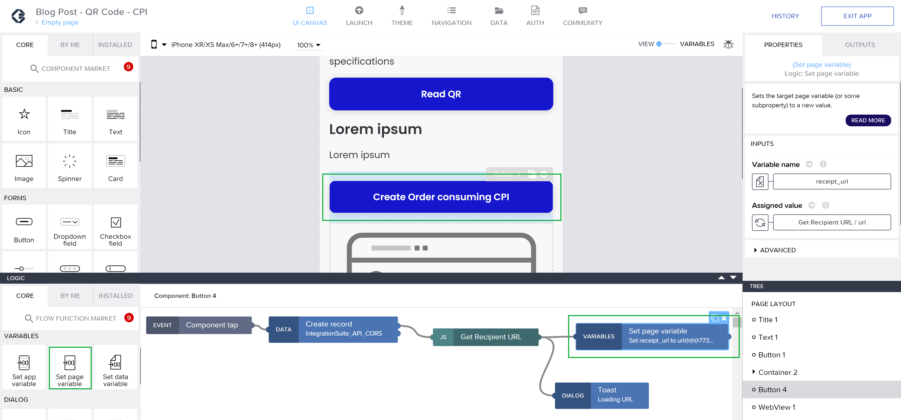

10. Link the variable like this and save it:

    

11. Do the same for assigning the value. Here you are going to link it with the `receipt_url` JavaScript component you created before:

    

Now it's time to test the app and the whole integration.

### Test the whole integration scenario

1. Grab your phone and enter your SAP AppGyver mobile app. Link it to your account as explained in the original exercise. Read the generated QR code:

    

2. Click on `Create Order consuming CPI` and you'll see that the order was successfully created. Like this:

    

3. Check in the SAP Sales and Service Core tenant (formerly SAP Cloud for Customer / SAP C4C):

    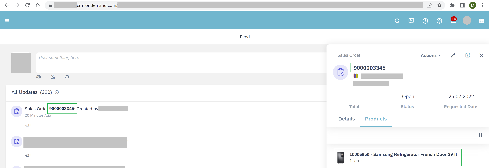

Congratulations! You've successfully created an end-to-end integration scenario leveraging low-code/no-code capabilities from the SAP Integration Suite and SAP AppGyver, for integrating SAP and third-party solutions.

### Review the conclusions

Just to summarize, you've integrated solutions and services from:

- SAP Sales and Service Core (formerly SAP C4C)
- Twilio
- Stripe
- SAP Integration Suite:
    - SAP Open Connectors
    - SAP API Management
    - SAP Cloud Integration
- SAP AppGyver

To create a Sales Order in SAP Sales and Service Core, after a the payment transaction using Stripe is successful, and then sending a SMS with the Order Id confirmation.

Hope you’ve enjoyed this exercise!

### Check your knowledge

### One more time, check your knowledge


