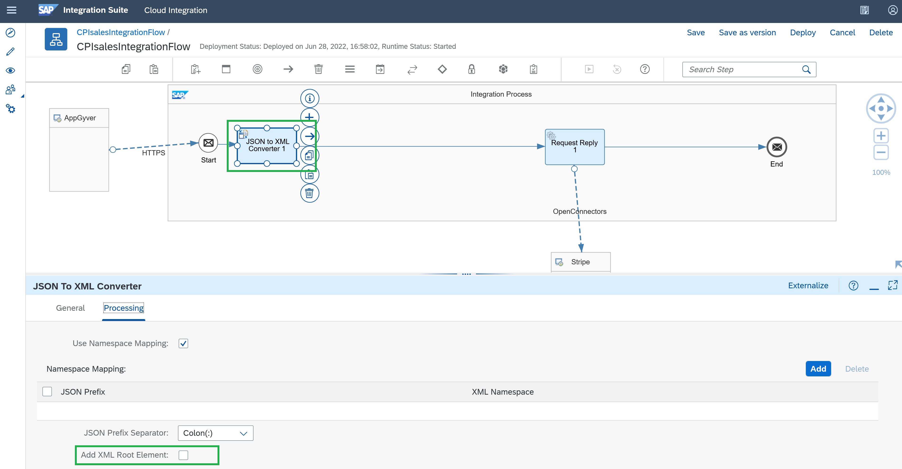
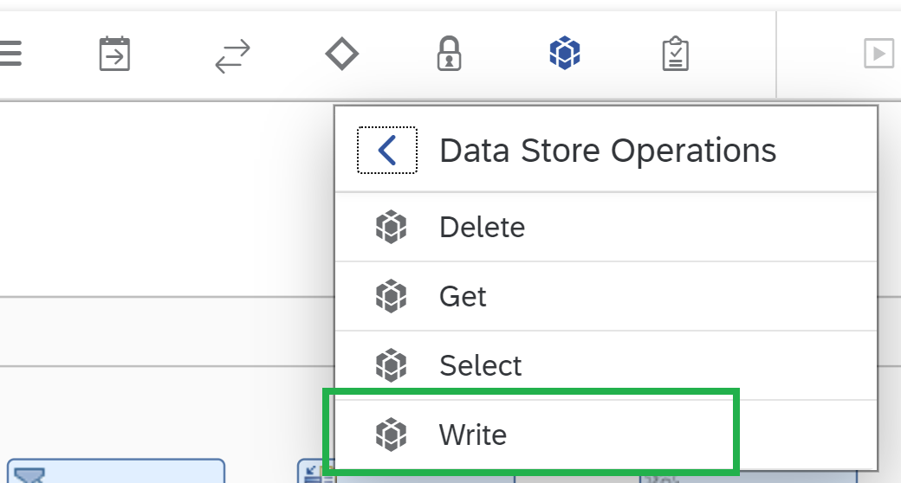
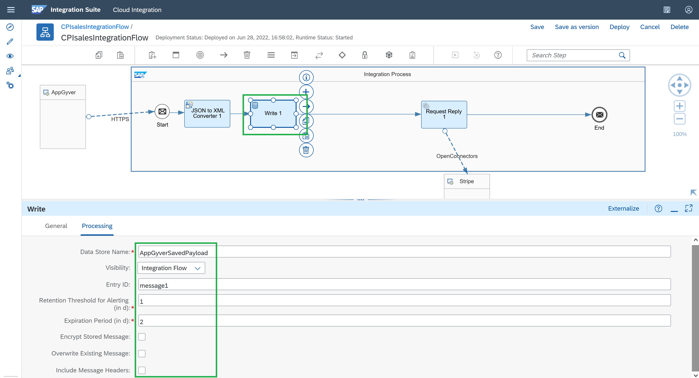
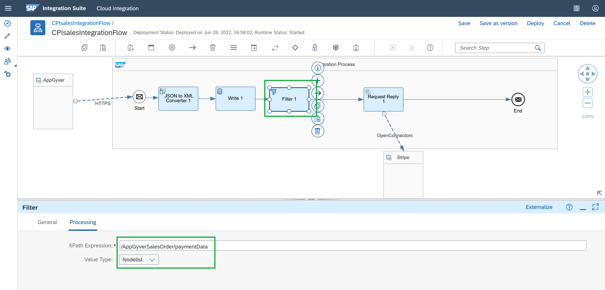
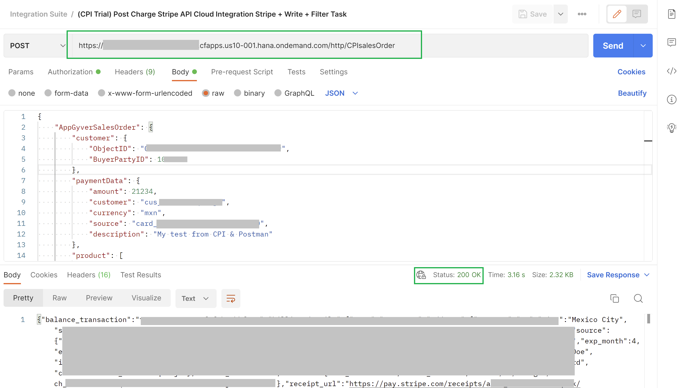
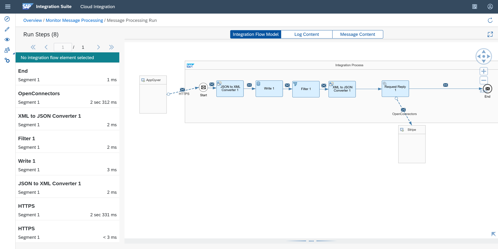
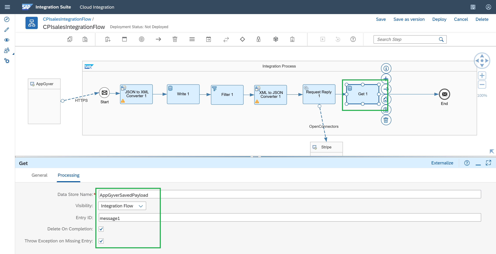

# Save, Filter and Get your needed data in your Integration Flow
<!-- description --> Boost your Integration Suite skills leveraging different tasks to store, get and filter messages travelling through your Integration Flow for executing other operations.

## Prerequisites

 - You have a SAP BTP account or trial account with access to the SAP Integration Suite.
 - You have completed the previous tutorial [Consume a Stripe service from SAP Open Connectors and SAP Cloud Integration to create payment transactions](btp-integration-suite-integral-openconnectors).


## You will learn

  - How to store, get and filter data to prepare your payload for specific request calls within the Integration Flow.

### Add Converters, Write and Filter Tasks

1. As SAP Cloud Integration works with XML and the expected payload from Open Connector/Stripe is in JSON, you need to add a JSON to XML converter in order to store the initial payload from AppGyver in CPI and retrieve it when the payment transaction is successfully done.

2. Uncheck the "Add XML Root Element" box. You'll use the payload with the root as it comes.

    

3. Add a Write task to store the initial payload you are going to send from AppGyver. Select it from the cube "Persistence" and "Data Store Operations".

    

4. Add the following:

    - Data Store Name: `AppGyverSavedPayload`
    - Visibility: Integration Flow
    - Entry ID: message1
    - Retention Threshold for Alerting (in days): reduce it to 1 day.
    - Expiration Period (in days): reduce it to 2 days.
    - Uncheck the "Encrypt Stored Message" box. For this exercise you are not going to encrypt the message.

        

5. Add a "Filter" task. This is needed to only send the payment data to stripe. 

6. Add this Xpath Expression in the Processing Tab: `/AppGyverSalesOrder/paymentData` and select `Nodelist` as the Valuetype. It is needed to select Nodelist as there is a list in the main payload: 

    <!-- cpes-file db/schema.cds -->
    ```JSON
    {
    "AppGyverSalesOrder": {
        "customer": {
        "ObjectID": "<Object ID from SAP C4C>",
        "BuyerPartyID": <BuyerPartyID from SAP C4C>
        },
        "paymentData": {
        "amount": <Payment transaction amount to be processed in Stripe>,
        "customer": "<stripe customer id>",
        "currency": "<currency selected in stripe account>",
        "source": "<card id>",
        "description": "Test payment via CPI"
        },
        "product": [
        {
            "ProductID": "<Product ID from SAP C4C>",
            "Quantity": <Product quantity to be purchased>
        }
        ]
    }
    }
    ```

    >Note: Bear in mind that the "customer" and "product" objects are included as part of the whole scenario. You'll need them for requesting SAP Sales and Service Core a sales order creation, which you'll see in the next tutorial.

    It should look like this:

    

7. Add a XML to JSON converter. Stripe needs a JSON object to create the payment transaction. Make sure you select UTF-8 as the JSON Output Encoding, and check the box "Suppress JSON Root Element", this is important to be able to enter the data inside the XPath Expression without the "parent" root:

    

### Test your Integration Flow

1. Test on Postman and check the payment transaction is still working, use the Payload structure as it is above, just change it to your data. You should be able to generate the payment transaction.

    

2. Go back to Monitor. Remember you need to enable first the Trace option. Check the trace:

    


### Add a Get Task

1. Add a Get task to retrieve the initial payload. You have to put the same name and entry ID as you did in the Write task. Check the “Delete On Completion” box, to delete the stored message when the iFlow transaction is completed.

    

    You can test again if you want to, you should see the whole initial payload as it was saved with the Write task.

    Remember to activate the Trace log after deploying your IFlow. Go to the Monitor Message Processing and Trace.

    

Now, you have successfully retrieve the initial payload using Write and Get task, plus learnt how to filter data using Filter task and `XPath` expressions.

Following the Tutorial Series, you now need to configure the SAP Sales and Service Core API consumption to create Sales Orders. For this step, check out the next tutorial: [Consume a SAP Sales and Service Core API to create Sales Orders using SAP Cloud Integration](btp-integration-suite-integral-sales-service-core).

### Check your knowledge

