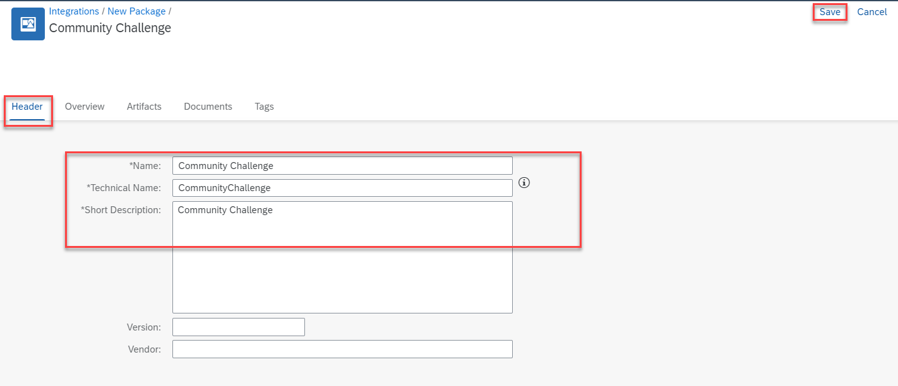
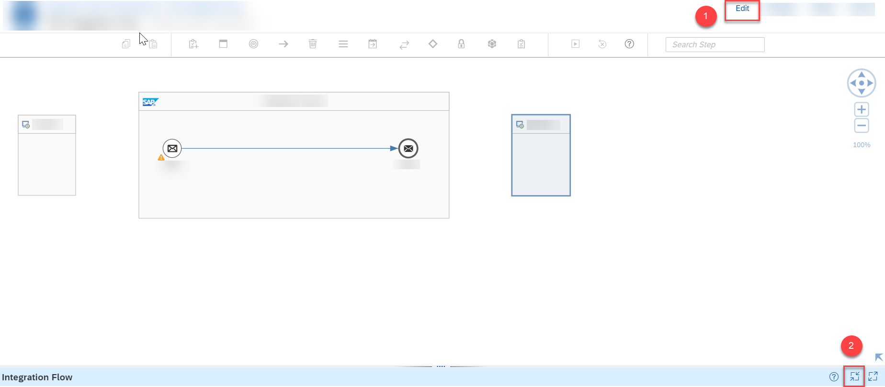
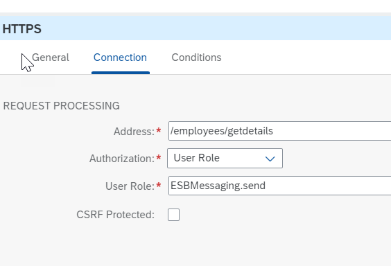
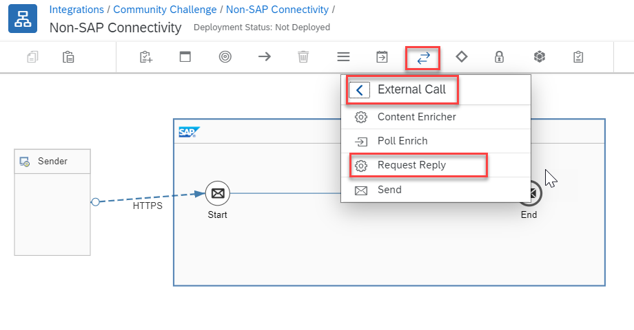
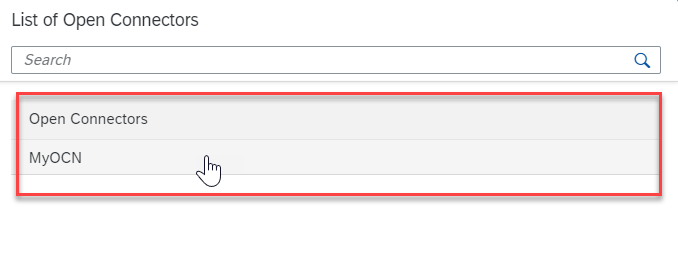
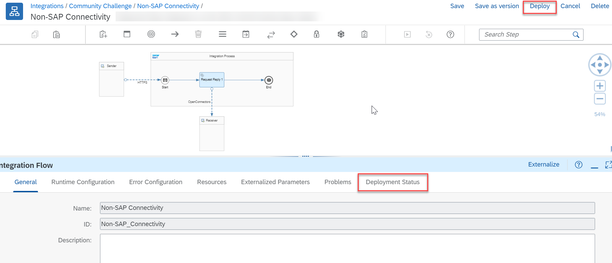

# Design an Integration Flow to Connect with Open Connectors 
<!-- description --> Design an integration flow that fetches data from the third-party system. This integration flow uses the capabilities Cloud Integration and Open Connectors.. In this scenario, Open Connectors provides the endpoint to fetch data from BambooHR trial system.

## You will learn
  - How to design and deploy an integration flow using Cloud Integration's web-based integration flow editor
  - How to design an integration flow to fetch data via an API of Open Connectors

### Create an Integration Package and Integration Flow

1. On the SAP Integration Suite home page, choose **Design** > **Integrations** > **Create** to create an integration package.

    <!-- border -->
    
    > An integration flow is always associated to an integration package.

2. On the **Header** tab, provide a **Name** and **Short Description** for your integration package.

    >The **Technical Name** gets populated automatically based on the name that you provide.

3. Choose **Save**.

    <!-- border -->

4. Choose the **Artifacts** tab. Here you will create your first integration flow. Choose **Add** > **Integration Flow**.

5. Enter a **Name** for the integration flow and choose **OK**.

      <!-- border -->

6. Choose **Save** and open the integration flow by selecting it.

7. Choose **Edit** to start editing the integration flow.

    Choose **Restore** at the bottom right corner to bring up the **Property Sheet**. Property sheet is the place where you configure the parameters for every step in the integration flow.

      <!-- border -->

### Connect Sender Channel with HTTPS Adapter

During this step, you define your sender channel and sender adapter. We use an HTTPS sender adapter to create a simple HTTP connection to invoke the execution of the integration scenario.

1. Choose the **Sender** step. Create the sender channel by clicking the arrow icon on **Sender** and dragging it to the **Start** step.

    <!-- border -->

2. In the **Adapter Type** prompt, select the **HTTPS** adapter.

    <!-- border -->

3. On the property sheet, select the **Connection** tab. In the **Address** field, enter **`/employees/getdetails`**.

    Optionally, you can enter any value of your choice, but ensure that you use **"/"** symbol before specifying the endpoint name. Deselect the **CSRF Protected** checkbox (this will be selected by default).

    <!-- border -->

### Add Request Reply Step

1. From the palette, choose **Call** > **External Call** > **Request Reply**.

    <!-- border -->

2. Connect it to the message path.

    <!-- border -->

### Connect Request Reply to Receiver

1. Move the **Receiver** step right below the **Request Reply** step by selecting and dragging it. You do this to ensure that your integration flow is elegantly designed.

    > **TIP:** Use the pan and zoom controls for resizing the canvas.

2. Drag the arrow icon on **Request Reply** to the **Receiver** step.

    <!-- border -->

3. In the **Adapter Type** dialog, select **OpenConnectors**.

4. Select the **Connection** tab on the Property Sheet. 

5. In the **Base URI** field, paste the copied request URL from **Step 5** of [Establish Connection Between Your BambooHR Trial and Open Connectors](btp-integration-suite-nonsapconnectivity-openconnectors).

    > Do not paste the full URL. Paste only till **/api-v2**. If your request URL is **`https://<request-URL>/elements/api-v2/employees`**, paste only **`https://<request-URL>/elements/api-v2`**.

6. For the **Credential Name**, choose **Select**. A list of available user credentials that are applicable for Open Connectors come up. Select the user credential that you created.

    <!-- border -->

7. For the **Resource**, choose **Select**.

    > At this point, Cloud Integration tests the connection to the mentioned Base URI using the mentioned credential name. This is a way for you to check if everything is going as expected. This connection testing helps you choose the right API resource.

    <!-- border -->

8. For **Method**, choose **GET** operation.

    <!-- border -->

9. Leave the other fields as is. Choose **Save** to keep all your configuration changes.

Now you have configured the Open Connectors receiver adapter to fetch a list of employees from your BambooHR trial account when you attempt to invoke the HTTP endpoint.

### Deploy the integration flow

Now that you have designed your integration flow, let's deploy it for further execution.

1. Choose **Deploy** to deploy the integration flow.

    <!-- border -->

2. Choose **Yes** in the confirmation dialog for deployment. Upon deployment confirmation, choose the **Deployment Status** tab on the property sheet.

3. On the **Deployment Status** tab, you can see details about the deployment for the integration flow. The expected deployment status is **Deployed** and runtime status is **Started**.

    <!-- border -->

Later in the mission, you will use the endpoint of the deployed integration flow. Using **Postman**, you will invoke the endpoint to fetch data from your BambooHR trial system.

---