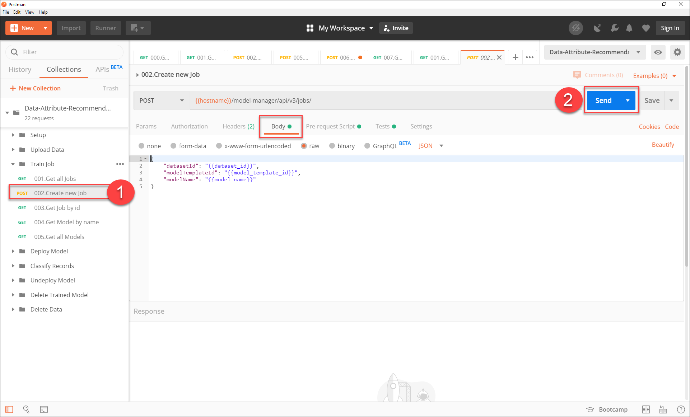
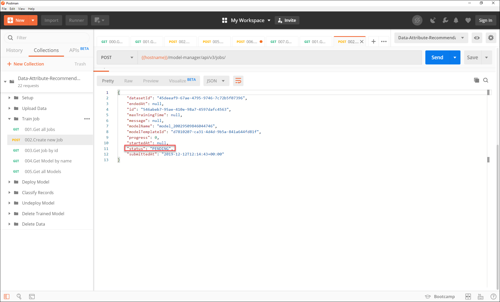
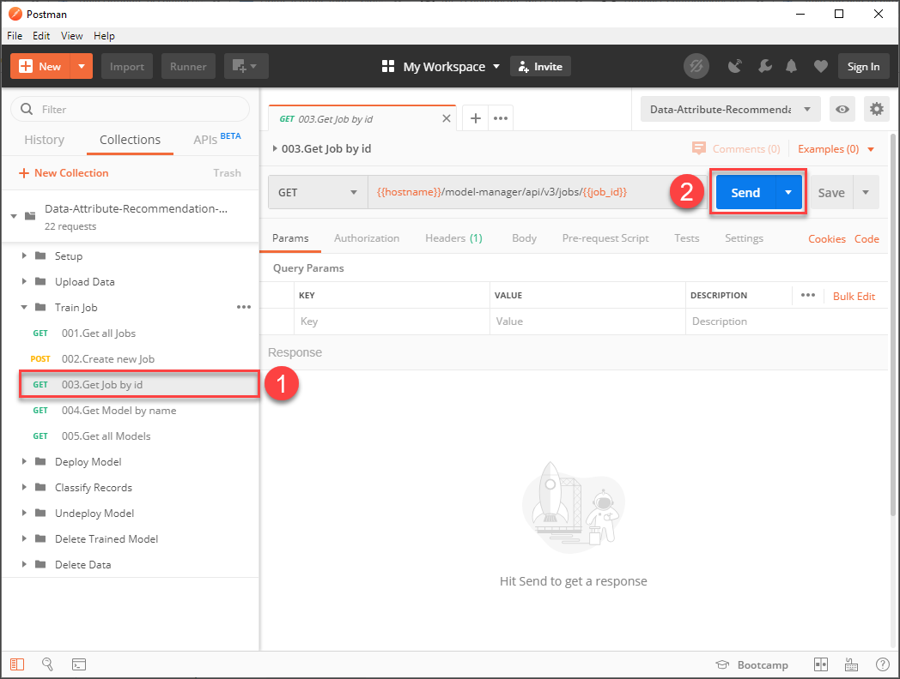
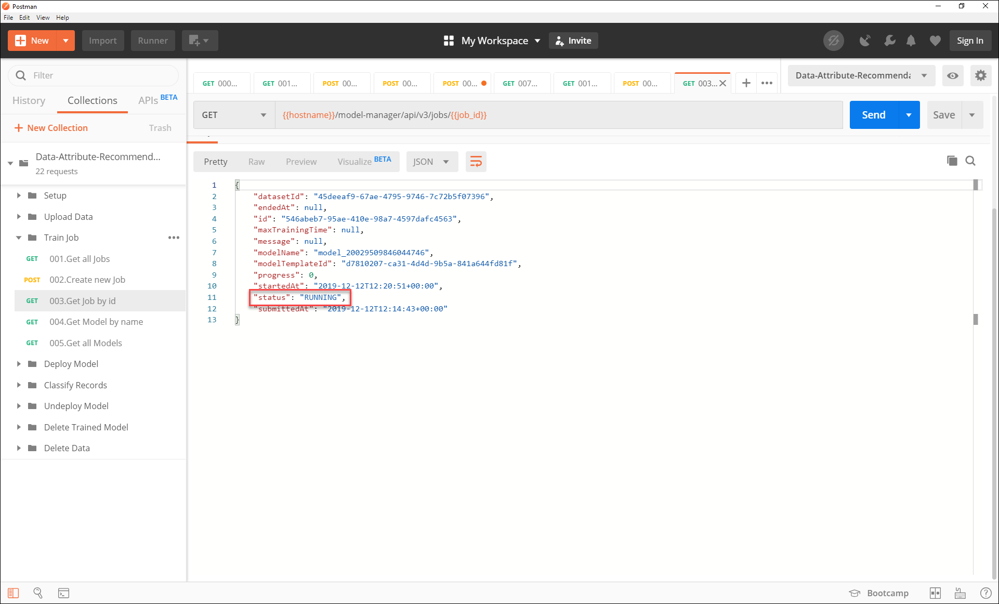
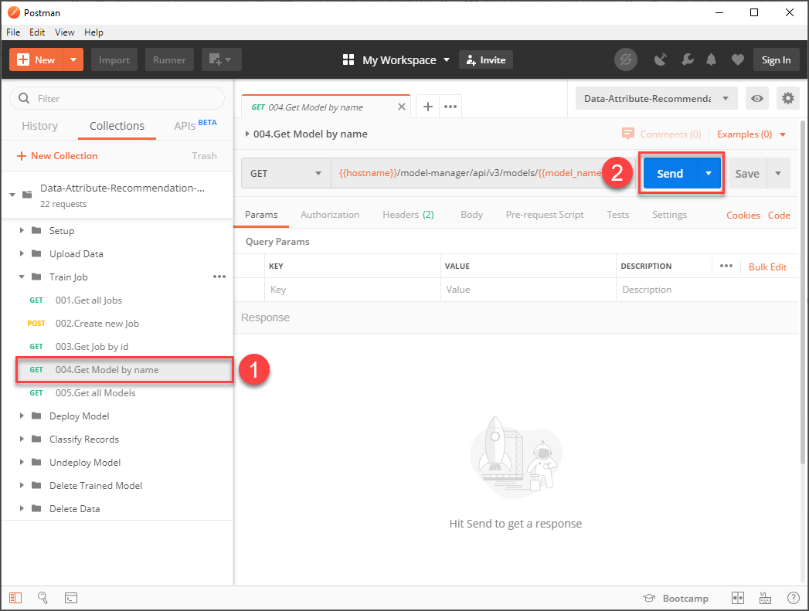
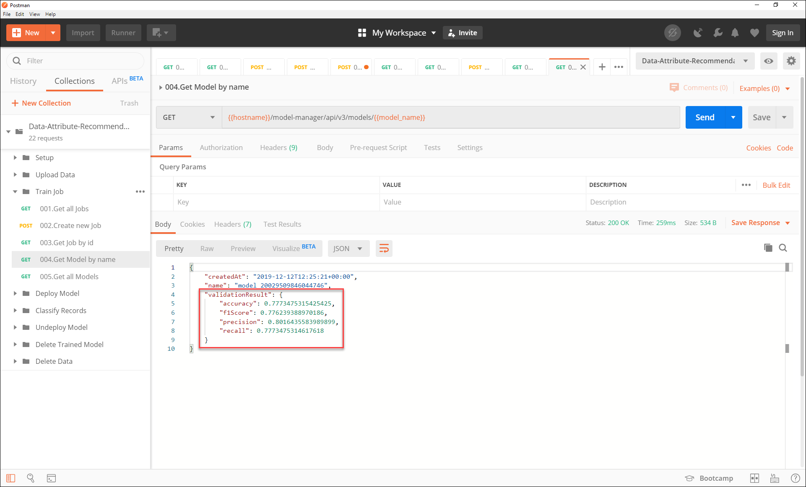
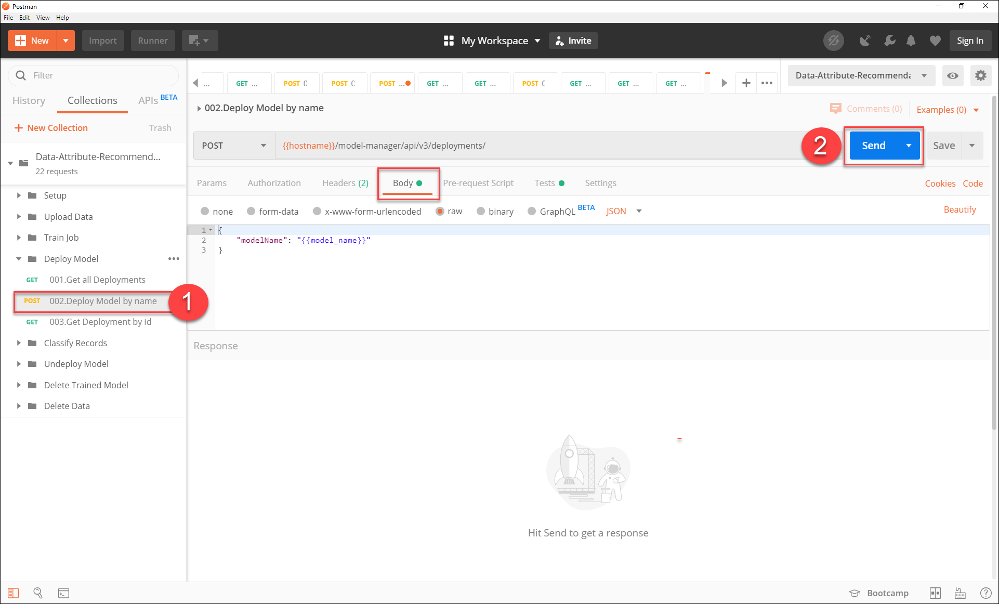
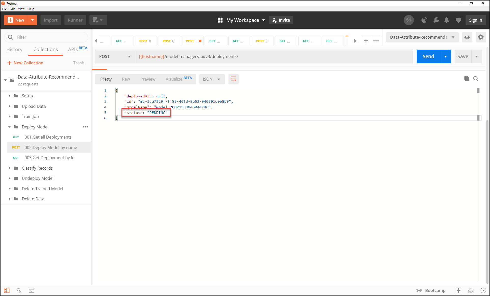
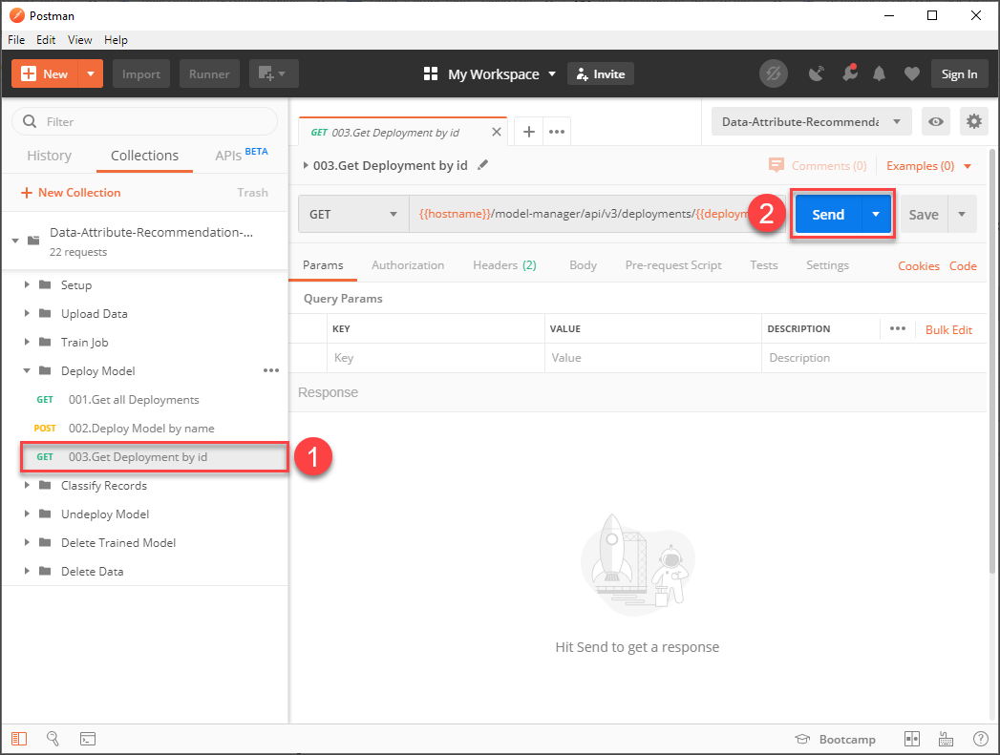
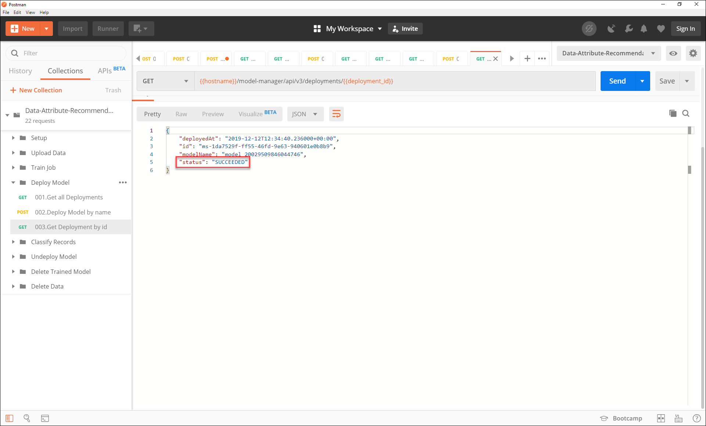

## Details
### You will learn
  - How to create a training job using your Data Attribute Recommendation service instance
  - How to deploy a machine learning model using your Data Attribute Recommendation service instance

To use the data uploaded in [Upload Data to Data Attribute Recommendation](cp-aibus-dar-upload-data), it is necessary to create a training job and deploy the resulting machine learning model. For more information, see [Data Attribute Recommendation help portal documentation](https://help.sap.com/docs/Data_Attribute_Recommendation). For further definition of specific terms, see [Concepts](https://help.sap.com/docs/Data_Attribute_Recommendation/105bcfd88921418e8c29b24a7a402ec3/cff2de73bc9c4625b35eb036439ae70a.html).

Business Use Case: After data preparation and upload, the next step is to train a model using historical data. In this tutorial, you will focus on model training using the training job concept. You will create a training job, check status, get model details, and also deploy the trained model at the end.   

---

[ACCORDION-BEGIN [Step 1: ](Create a training job)]

Based on the uploaded data, you will now train a machine learning model. To create a model, it is necessary to create a training job. A training job is essentially the process whereby the model learns and recognizes the patterns in your data. In this case, it recognizes the patterns and connections between product information and certain product categories.

**Open** Postman and make sure that your `Data Attribute Recommendation environment` is selected.

Expand the subfolder `Train Job` and select the request `Create new Job`. click **Send** to trigger the creation of a training job.

In the response, you find the current status of your training job. Immediately after creation of the training job the status is `PENDING`. Along with the status, additional details are provided (e.g., the `modelName`).

You have successfully created a training job that will now train a machine learning model based on the uploaded data.

[DONE]
[ACCORDION-END]

[ACCORDION-BEGIN [Step 2: ](See training job status)]

To observe the status of your training job, you can request the details of it.

For that, select the request `Get Job by id` within the folder `Train Job`. Click **Send** to receive the details of your training job.

In the response, you find again the current status of your training job along with other details. Immediately after creation of the training job, the status is `PENDING`. Shortly after, it changes to `RUNNING` which means that the model is being trained.

The training of the sample data usually takes about 5 minutes to complete but may run longer, up to a few hours due to limited availability of resources in the trial environment. You can check the status every now and then. Once training is finished, the status changes to `SUCCEEDED`.

You have successfully created and trained a machine learning model.

[DONE]
[ACCORDION-END]

[ACCORDION-BEGIN [Step 3: ](See machine learning model details)]

To see the model details, select the request `Get Model by name` and click **Send**.

In the response, you find the validation results. This includes most importantly the accuracy. The accuracy is the fraction of predictions made by the model that are correct and, thus, is a good quality indicator.

[DONE]
[ACCORDION-END]

[ACCORDION-BEGIN [Step 4: ](Deploy machine learning model)]

To use the trained model, you need to deploy it. Once deployed, the model is ready to classify records.

Expand the subfolder `Deploy Model` and select the request `Deploy Model by name`. click **Send** to start the deployment.

In the response, you receive the current status of your deployment along with other details. Immediately after creation the status is `PENDING`.

[DONE]
[ACCORDION-END]

[ACCORDION-BEGIN [Step 5: ](See deployment status)]

To observe the status of your deployment, you can request its details including the status.

Select the request `Get Deployment by id`. click **Send** to receive the details of your deployment.

In the response, you find the status of your deployment. If the status is `SUCCEEDED`, your model has been deployed. If the status is `PENDING`, the deployment is still in process. In that case, send the request again to observe status changes.

You have now successfully deployed a machine learning model.

[DONE]
[ACCORDION-END]

[ACCORDION-BEGIN [Step 6: ](Test yourself)]

In the text area below, enter the name of your model. You find it as `modelName` in the response of various requests in this tutorial.

[VALIDATE_1]
[ACCORDION-END]
