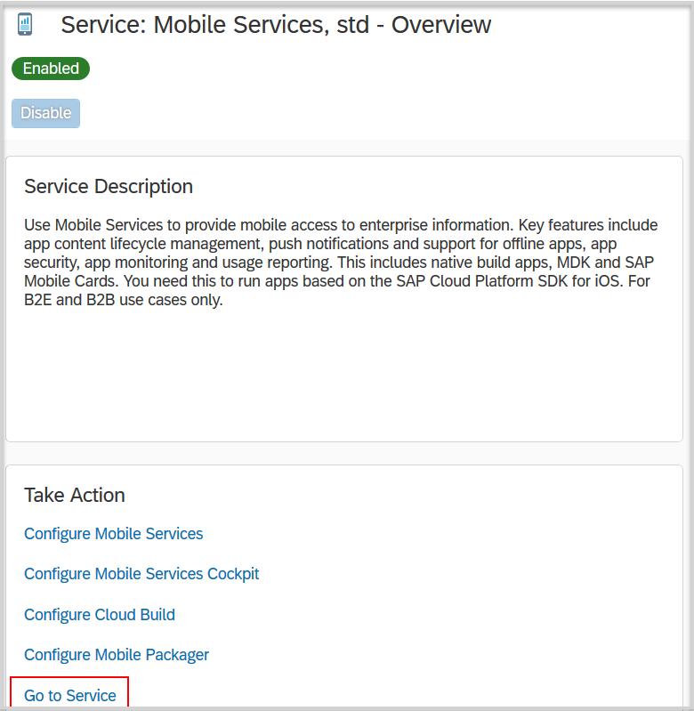
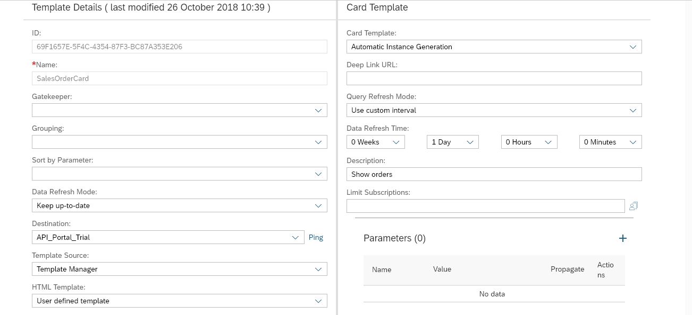
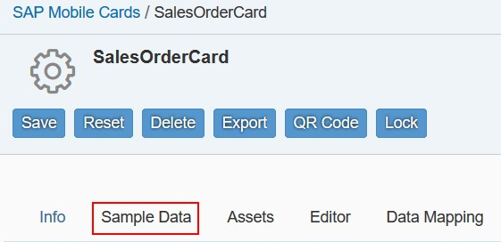
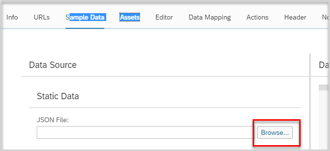

## Prerequisites


## Details
### You will learn
  - How to create a new mobile card
  - How to give the query and collection query URL pointing to the proxy endpoint created in SAP API Management

---

[ACCORDION-BEGIN [Step 1: ](Create a new mobile card)]

1. Open Mobile Services [Cockpit](https://account.hanatrial.ondemand.com ).

    - Under the side menu Select **Services**.

    - Under Services Select **Mobile Services, users**.

    - Click **Go to Service** to launch Mobile Cards.

    

2. Click **Close**.

    

3. In the main screen click **Create** to create a new mobile card.

    

4. Give the following values:

    **Field** | **Value**
    ---- | ----
    Name |`SalesOrderCard`
    Destination |`com.sap.mobile.platform.cards`
    Template Source |`Template Manager`
    HTML Template |`User defined template`
    Card Template |`Automatic Instance Generation`

    

5. Navigate to **URLs** tab and give the following values:

    **Field** | **Value**
    ---- | ----
    Query |`/<yourP#>trial/s4hanacloud/sap/opu/odata/sap/API_SALES_ORDER_SRV/A_SalesOrder?$expand=to_Item`
    Collection Handling |`Generic REST API`
    Query URL Collection Root |`$.d.results`
    Query Entity Key Paths |`$.d.__metadata.uri`

    

6. Click **Save** and click the **Sample Data** tab.

    

7. Copy the below code and save it in text file in your local system with `APIHub_SalesOrder_Response_Item.json`.

    ```  

        {
        {
        "d": {
            "__metadata": {
                "id": "https://sandbox.api.sap.com/s4hanacloud/sap/opu/odata/sap/API_SALES_ORDER_SRV/A_SalesOrder('1')",
                "uri": "https://sandbox.api.sap.com/s4hanacloud/sap/opu/odata/sap/API_SALES_ORDER_SRV/A_SalesOrder('1')",
                "type": "API_SALES_ORDER_SRV.A_SalesOrderType",
                "etag": "W/\"datetimeoffset'2016-09-02T06%3A15%3A47.1257050Z'\""
            },
            "SalesOrder": "1",
            "SalesOrderType": "OR",
            "SalesOrganization": "1710",
            "DistributionChannel": "10",
            "OrganizationDivision": "00",
            "SalesGroup": "",
            "SalesOffice": "",
            "SalesDistrict": "",
            "SoldToParty": "17100001",
            "CreationDate": "/Date(1471392000000)/",
            "CreatedByUser": "CB9980000027",
            "LastChangeDate": "/Date(1472774400000)/",
            "LastChangeDateTime": "/Date(1472796947125+0000)/",
            "PurchaseOrderByCustomer": "gfh",
            "CustomerPurchaseOrderType": "",
            "CustomerPurchaseOrderDate": null,
            "SalesOrderDate": "/Date(1471392000000)/",
            "TotalNetAmount": "52.65",
            "TransactionCurrency": "USD",
            "SDDocumentReason": "",
            "PricingDate": "/Date(1471392000000)/",
            "RequestedDeliveryDate": "/Date(1471392000000)/",
            "ShippingCondition": "01",
            "CompleteDeliveryIsDefined": false,
            "ShippingType": "",
            "HeaderBillingBlockReason": "",
            "DeliveryBlockReason": "",
            "IncotermsClassification": "EXW",
            "IncotermsTransferLocation": "Palo Alto",
            "IncotermsLocation1": "Palo Alto",
            "IncotermsLocation2": "",
            "IncotermsVersion": "",
            "CustomerPaymentTerms": "0004",
            "PaymentMethod": "",
            "AssignmentReference": "",
            "OverallSDProcessStatus": "C",
            "TotalCreditCheckStatus": "",
            "OverallTotalDeliveryStatus": "C",
            "OverallSDDocumentRejectionSts": "A",
            "to_Item": {
                "results": [
                    {
                        "__metadata": {
                            "id": "https://sandbox.api.sap.com/s4hanacloud/sap/opu/odata/sap/API_SALES_ORDER_SRV/A_SalesOrderItem(SalesOrder='1',SalesOrderItem='10')",
                            "uri": "https://sandbox.api.sap.com/s4hanacloud/sap/opu/odata/sap/API_SALES_ORDER_SRV/A_SalesOrderItem(SalesOrder='1',SalesOrderItem='10')",
                            "type": "API_SALES_ORDER_SRV.A_SalesOrderItemType"
                        },
                        "SalesOrder": "1",
                        "SalesOrderItem": "10",
                        "HigherLevelItem": "0",
                        "SalesOrderItemCategory": "TAN",
                        "SalesOrderItemText": "Trad.Good 11,PD,Reg.Trading",
                        "PurchaseOrderByCustomer": "gfh",
                        "Material": "TG11",
                        "MaterialByCustomer": "",
                        "PricingDate": "/Date(1471392000000)/",
                        "RequestedQuantity": "3",
                        "RequestedQuantityUnit": "PC",
                        "ItemGrossWeight": "3.000",
                        "ItemNetWeight": "2.700",
                        "ItemWeightUnit": "G",
                        "ItemVolume": "0.000",
                        "ItemVolumeUnit": "",
                        "TransactionCurrency": "USD",
                        "NetAmount": "52.65",
                        "MaterialGroup": "L001",
                        "MaterialPricingGroup": "",
                        "Batch": "",
                        "ProductionPlant": "1710",
                        "StorageLocation": "",
                        "DeliveryGroup": "0",
                        "ShippingPoint": "1710",
                        "ShippingType": "",
                        "DeliveryPriority": "0",
                        "IncotermsClassification": "EXW",
                        "IncotermsTransferLocation": "Palo Alto",
                        "IncotermsLocation1": "Palo Alto",
                        "IncotermsLocation2": "",
                        "CustomerPaymentTerms": "0004",
                        "SalesDocumentRjcnReason": "",
                        "ItemBillingBlockReason": "",
                        "WBSElement": "",
                        "SDProcessStatus": "C",
                        "DeliveryStatus": "C",
                        "OrderRelatedBillingStatus": "",
                        "to_Partner": {
                            "__deferred": {
                                "uri": "https://sandbox.api.sap.com/s4hanacloud/sap/opu/odata/sap/API_SALES_ORDER_SRV/A_SalesOrderItem(SalesOrder='1',SalesOrderItem='10')/to_Partner"
                            }
                        },
                        "to_PricingElement": {
                            "__deferred": {
                                "uri": "https://sandbox.api.sap.com/s4hanacloud/sap/opu/odata/sap/API_SALES_ORDER_SRV/A_SalesOrderItem(SalesOrder='1',SalesOrderItem='10')/to_PricingElement"
                            }
                        },
                        "to_SalesOrder": {
                            "__deferred": {
                                "uri": "https://sandbox.api.sap.com/s4hanacloud/sap/opu/odata/sap/API_SALES_ORDER_SRV/A_SalesOrderItem(SalesOrder='1',SalesOrderItem='10')/to_SalesOrder"
                            }
                        },
                        "to_ScheduleLine": {
                            "__deferred": {
                                "uri": "https://sandbox.api.sap.com/s4hanacloud/sap/opu/odata/sap/API_SALES_ORDER_SRV/A_SalesOrderItem(SalesOrder='1',SalesOrderItem='10')/to_ScheduleLine"
                            }
                        }
                    }
                ]
            },
            "to_Partner": {
                "__deferred": {
                    "uri": "https://sandbox.api.sap.com/s4hanacloud/sap/opu/odata/sap/API_SALES_ORDER_SRV/A_SalesOrder('1')/to_Partner"
                }
            },
            "to_PricingElement": {
                "__deferred": {
                    "uri": "https://sandbox.api.sap.com/s4hanacloud/sap/opu/odata/sap/API_SALES_ORDER_SRV/A_SalesOrder('1')/to_PricingElement"
                }
            }
        }
        }

    ```

8. Click  **Browse** button next to JSON file.

9. Select the file **`APIHub_SalesOrder_Response_Item.json`** from your local system.

    

10. Click the **Editor** tab.

11.	Copy the below code and paste it into the Source Code box.

        ```
        <div id="mySimpleTemplate" class="myTemplate" data-type="text/x-handlebars-template">
           <div class="header">
               <h1>
                   SalesOrder
               </h1>
               <span class="name">
                   {{SalesOrderId}}
               </span>
           </div>
           <div class="card-content">
               <div class="all">
                   <div class="title-content">
                       <span class="title">
                           Order Created At
                       </span>
                       <br>
                       <span class="content">
                           {{CreatedAt}}
                       </span>
                   </div>
                   <div class="title-content">
                       <span class="title">
                           Overall Delivery Status
                       </span>
                       <br>
                       <span class="content">
                           {{OverallDeliveryStatus}}
                       </span>
                   </div>    
                   <div class="title-content">
                       <span class="title">
                           Sold to ID
                       </span>
                       <br>
                       <span class="content">
                           {{SoldtoID}}
                       </span>
                   </div>
               </div>
               
            </div>
            <div class="desciprtion">
                <div>
                   <span class="d-title">
                       Description
                   </span>
                   <span class="d-title-a">
                       Amount
                   </span>
                   </div>
              <div>
                   <hr>
                   {{#each Items}}
                       {{PurchaseOrderbyCustomer}}
                   <span style="float:right;">
                       {{NetAmount}}
                           {{CurrencyCode}}
                   </span>
                  <div style="clear:both; height: 10px;">
                  </div>
                   {{/each}}
           </div>
        </div>
        </div>
        ```
        

12. Click **Flip to Back**

13.	Copy the below code and paste it into the Source Code box.

        ```
        <div id="mySimpleTemplate" class="myTemplate" data-type="text/x-handlebars-template">
        <div>
          <header>
              <span style="font-weight: bold; font-size: 24px; float: left; display: inline; padding:16px">
                  Sales Order Items Details
              </span>
          </header>
        </div>
        <div style="clear:both;">
        </div>
        <hr>
        <table width="100%" style="margin: 0px;">
        <tr>
          <th>Payment Terms</th>
          <th align="center">Sales Order Date</th>
          <th align="right" >Created By</th>
        </tr>
          {{#each Items}}
        <tr>
          <td>{{CustomerPaymentTerms}}</td>
          <td align="center">{{SalesOrderDate}}</td>
          <td align="right">{{CreatedByUser}}</td>
         </tr>
        <tr>
        {{/each}}
          </table>
        </div>

    ```

14. Click the Editor tab but then select **Data Mapping** tab

     

    >Here we will link the actual backend data to the fields defined in the UI Editor code.

15. Give the following values:

    **Field** | **Value**
    ---- | ----
    `SalesOrderId` |`SalesOrder`
    `CreatedAt` |`CreationDate`
    `OverallDeliveryStatus` |`d.OverallTotalDeliveryStatus`
    `SoldtoID` |`SalesOrder`
    `Items`  |`d.to_Item.results `
    `PurchaseOrderbyCustomer` |`PurchaseOrderByCustomer`
    `NetAmount`  |`NetAmount`
    `CurrencyCode` |`TransactionCurrency`   

16. Click **Flip to Back** and link backend data for additional fields.

    **Field** | **Value**
    ---- | ----
    `CustomerPaymentTerms` |`CustomerPaymentTerms`
    `SalesOrderDate` |`<select format>`
    `CreatedByUser` |`PurchaseOrderByCustomer`

17. Click **Save**.

[VALIDATE_1]

[ACCORDION-END]


[ACCORDION-BEGIN [Step 3: ](Scan QR code)]

1. On the main page click the **APIs** tab.

    

2.	Scan the QR code for your device to register Mobile Cards to your app.

[DONE]
[ACCORDION-END]

[ACCORDION-BEGIN [Step 4: ](Get the mobile card on your device)]

1. Log in to the app using your `<P#>`

    >Skip any passcode requirements.

2. Subscribe to the card `SalesOrderCard`.

    

3.	You will now have a Mobile Card on your phone with record information provided from S4HANA.

    

[DONE]
[ACCORDION-END]
