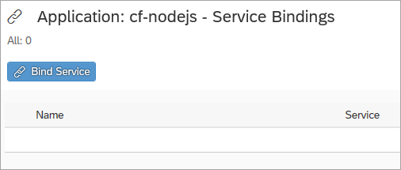
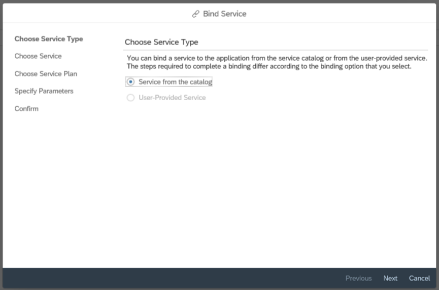
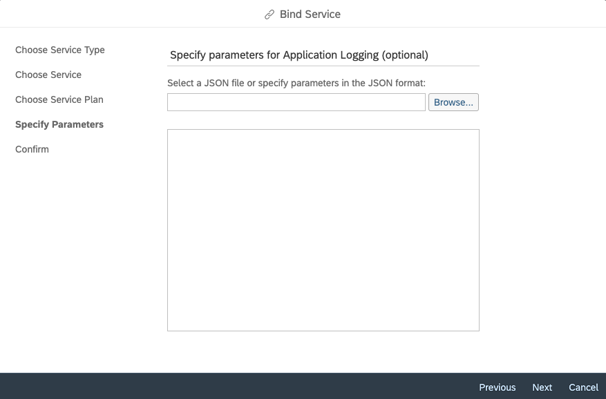

## Details
### You will learn  
- How apps and services are related
- How to bind a service to an app

In the Cloud Foundry environment there are apps and there are services. In many cases, apps are what you write, and services are what are available for your app to make use of.

PostgreSQL is a service that is available and to make use of it you create an instance of that service and bind it to your app. You can manage the availability of services, and the instances thereof, in the SAP Cloud Platform cockpit.

---

[ACCORDION-BEGIN [Step 1: ](Open service bindings for your app)]

In the SAP Cloud Platform Cockpit, navigate to the page for your app, as you learned to do in the [Deploy an App to SAP Cloud Platform Cloud Foundry Environment](https://developers.sap.com/tutorials/cp-cf-dev-02-deploy-app.html) tutorial.

Choose **Service Bindings** in the navigation area.

[DONE]
[ACCORDION-END]

[ACCORDION-BEGIN [Step 2: ](Bind an instance of the PostgreSQL service to your app)]

 1. Choose **Bind Service**.  
 
 1. Choose **Service from the catalog** and choose **Next**. 
 1. Choose the **PostgreSQL** tile and choose **Next**. 
 1.  Choose the **Create new instance** option, select a service plan from the **Plan** field, and then choose **Next**. 
 1.  Skip specifying parameters by choosing **Next**. 
 1.  Enter a name for the service instance and choose **Finish**.

The binding is created and added to the list of service bindings.

In the text area below, enter the name of the service used in the service bindings of your application. **HINT:** The name appears in the **Service** column in the list of service bindings.

[VALIDATE_1]
[ACCORDION-END]

[ACCORDION-BEGIN [Step 3: ](Explore your binding)]

 1.  In the navigation area of the cockpit, choose **Overview**.
 1.  Choose **Restart** to restart your application. 
 1.  In the **Application Routes** section, choose the URL to open the application.

 A new tab opens that displays the app information.

 

 In the app, you can see the additional information about the service binding.

[DONE]
[ACCORDION-END]

---
