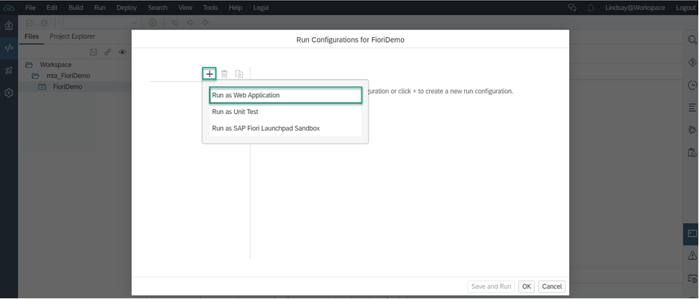
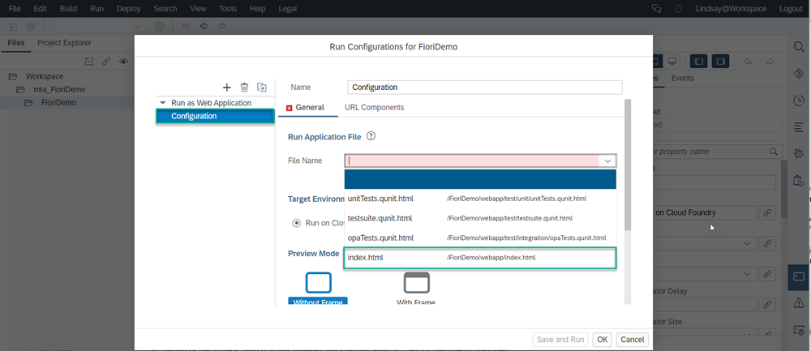
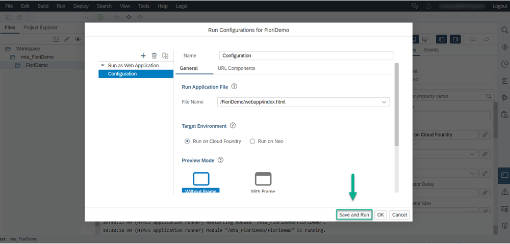
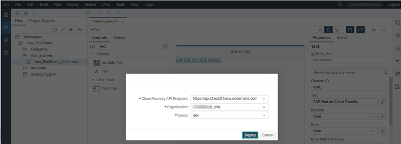
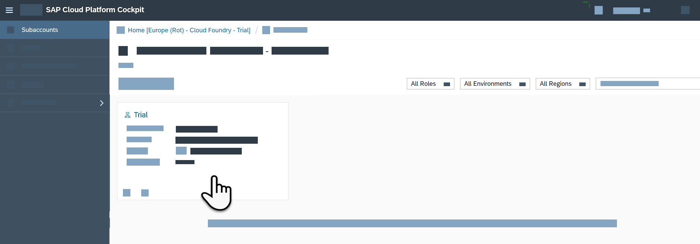
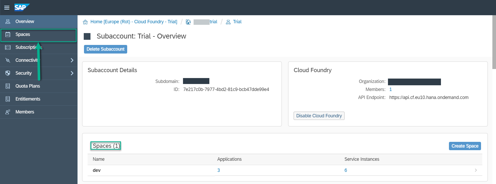

## Prerequisites
 - Make sure you have access to the trial version of SAP Web IDE Full-Stack.
 - To access Web IDE go through tutorial of [Prepare SAP Web IDE for Cloud Foundry Development](https://developers.sap.com/tutorials/sapui5-webide-open-webide.html)

## Details
### You will learn
  - How to create a new SAPUI5 application for SAP Cloud Platform Cloud Foundry
  - How to configure your Cloud Foundry settings in SAP Web IDE
  - How to build and deploy your application to Cloud Foundry

  Create, configure, build, and deploy a simple application on Cloud Foundry in SAP Web IDE Full-Stack.

---

[ACCORDION-BEGIN [Step 1: ](Create a new project)]

1. In SAP Web IDE Full-Stack, right-click your workspace choose **New > Project from Template**.

    

2. In the template wizard that opens, in the **Environment** dropdown list, make sure that **Cloud Foundry** is selected.

    

3. Scroll down and click the **SAPUI5 Application** tile and then click **Next**.

    

4. In the **Basic Information** screen, in the **Module Name** field, enter `FioriDemo`. In the **Namespace** field, enter `mynamespace` and then choose **Next**.

    

5. In the **Template Customization** screen, accept the default values shown below and choose **Finish**.

    

A new MTA project called `mta_FioriDemo` containing the `FioriDemo` HTML5 module now appears in your SAP Web IDE workspace.

  

> You can alternatively choose the Multi-Target Application template which will create an MTA project structure and then add new modules to the project.

[DONE]
[ACCORDION-END]

[ACCORDION-BEGIN [Step 2: ](Open the layout editor)]

Now you need to open the layout editor in SAP Web IDE to easily make a few changes.

1. Choose **`FioriDemo` > `webapp` > `view`** and right-click the `View1.view.xml` file that you created in the wizard in the previous step.

2. Choose **Open Layout Editor**.

    

[DONE]
[ACCORDION-END]

[ACCORDION-BEGIN [Step 3: ](Use the layout editor)]

Now you will make some changes using the layout editor, with no need to do any coding.

1. In the layout editor, in the **Controls** pane, in the Search box on the top enter `Text` to filter the controls list. Select the **Text** control.

    

2. Drag the **Text** control and drop it on the **View** control in the canvas to the right.

    

3. Select the **Text** control, and in the **Properties** pane on the right, in the **Text** property, clear the default text and enter `SAP Fiori on Cloud Foundry`.

    

Save your work by clicking either the **Save** or **Save All** icon located at the top of the workspace.

[DONE]
[ACCORDION-END]

[ACCORDION-BEGIN [Step 4: ](Set Cloud Foundry preferences)]

Now, before you can build and deploy your new application, check your Cloud Foundry preferences.

1. Open the **Preferences** perspective in SAP Web IDE by clicking the **Preferences** icon and then select **Cloud Foundry**.

    

2. In the pane on the right, select the API endpoint, organization and space for your project.

    >If you are using a trial account, these values are automatically populated.

    

3. Click **Save**.

[DONE]
[ACCORDION-END]

[ACCORDION-BEGIN [Step 5: ](Test your new application)]
Now you need  to run your new application to test it.

But first, check the project settings to make sure that Cloud Foundry is enabled for your project.

> By default, the target environment in your run configuration is set to Cloud Foundry.

1. In the workspace, right-click the `FioriDemo` folder, then choose **Run > Run Configurations**.

    

2. In the **Run Configurations for `FioriDemo`** window that opens, click `+` and then select **Run as Web Application**.

    

3. Click on the **Configuration** and then select `indexhtml` as the **File Name** from the dropdown list.

    

4. Click **Save and Run**.

    

[DONE]
[ACCORDION-END]

[ACCORDION-BEGIN [Step 6: ](Build your application)]

Now you need to build your application.

In your workspace, right-click the **`mta_FioriDemo`** folder and choose **Build > Build**.

The build process creates a multi-target archive (`MTAR`) file in your workspace that packages all the project modules for deployment.

[DONE]
[ACCORDION-END]

[ACCORDION-BEGIN [Step 7: ](Deploy your application)]

Now, you need to deploy your application to SAP Cloud Platform, Cloud Foundry environment.

In your workspace, locate and right-click the new `mta_FioriDemo_0.0.1.mtar` file in the `mta_archives` folder, and select **Deploy > Deploy to SAP Cloud Platform**.

The **Deploy to SAP Cloud Platform** dialog box opens. The fields are automatically populated. Click **Deploy**.

The deployment process takes a few minutes. You can see that the deployment is still in progress in the status bar at the bottom right of your screen.

When the deployment process is complete, you should see the notification in the console at the bottom of your screen and also at the top right of the screen.

[DONE]
[ACCORDION-END]

[ACCORDION-BEGIN [Step 8: ]( Get the URL to access your application)]
Now you can access your deployed application in the SAP Cloud Platform cockpit. The steps below show you how to create a URL that you can use to access your new application.

1. From the **Tools** menu click **SAP Cloud Platform Cockpit**.

    

2. Click **Home [Europe (Rot)-Trial]** at the top of the screen.

    

3. Click **Enter your Trial Account**.

    

4. Click the **trial** subaccount box, assuming you are working on the trial version of SAP Web IDE. Otherwise, your subaccount will have a different name.

    

5. Click **Spaces** in the side navigation panel and then click the number link to your Cloud Foundry spaces.

    

6. Click your space box to open it.

    

7. On your **Applications** page, you should see your new application in the list: `mta_FioriDemo_appRouter` and that it has a **Started** status. Click this link.

    

8. A new page opens: **Application: `mta-FioriDemo_appRouter` - Overview.** Right-click the URL under **Application Routes** and save the URL in a text file such as in  **Notepad** or **Notes**.

    

9. In your text editor you need to add the following suffix to the URL that you saved in step 8: `/mynamespaceFioriDemo/index.html`

> For future reference, bear in mind that this is the construct of the final URL: `<URL_from_application_overview_page>/<mynamespace><project_name>/index.html`

You can use this URL in any browser to access your new application.

[VALIDATE_8]
[ACCORDION-END]

---
