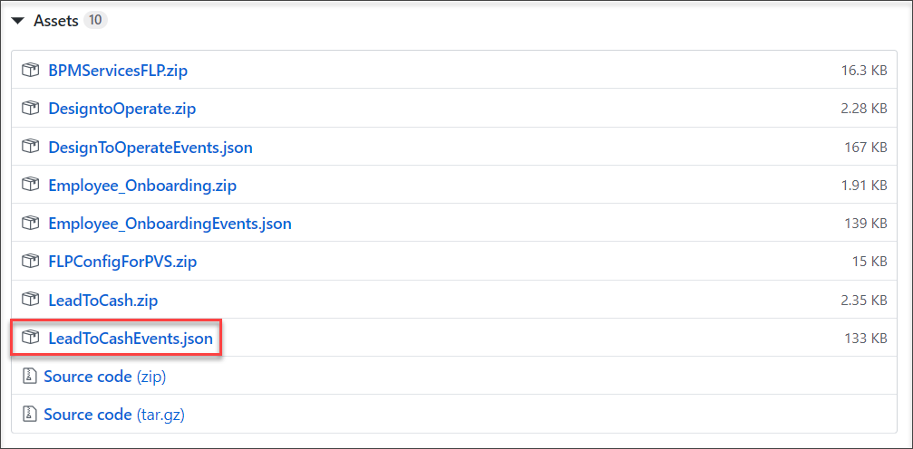
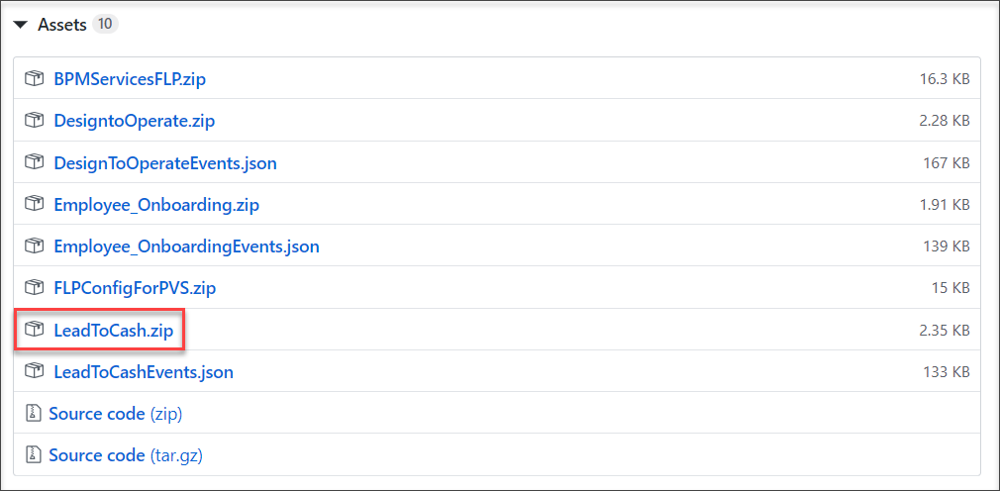
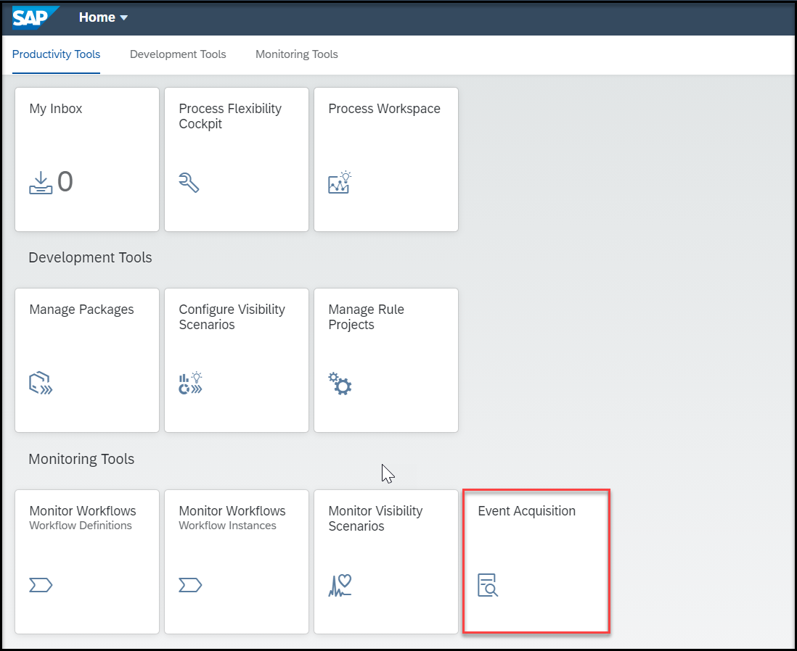
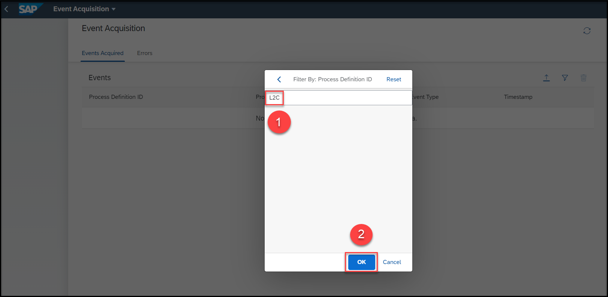
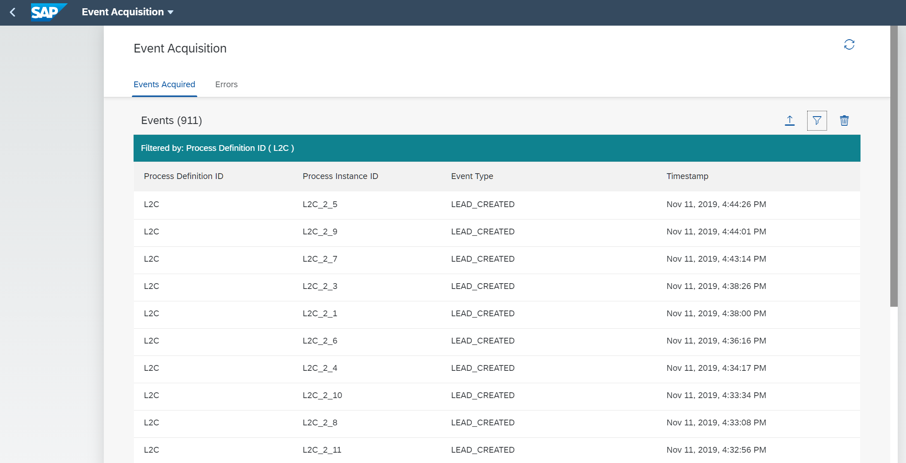
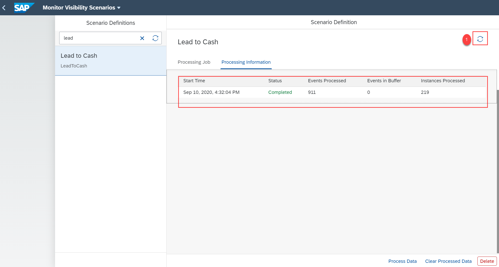

## Prerequisites
- You have set up the Process Visibility service. For more information, see [Set Up the Process Visibility Service](https://developers.sap.com/group.cp-visibility-setup.html)
- You have the **`PVEventSender`**, **`PVAdmin`**, **`PVOperator`**, **`PVDeveloper`**, role assigned to you. For more information, see [Assign Process Visibility Roles to Users](cp-cf-processvisibility-setup-assignroles)

## Details
### You will learn
- How to import a sample lead-to-cash business scenario
- How to import the events for sample lead-to-cash business process
- How to gain visibility on the lead-to-cash business process
- How to quickly get started with the process visibility service using a sample lead-to-cash business process

Lead-to-cash is a business process that provides sales insights, eliminates process inefficiencies, and ensures accurate reporting on business performance and future trends.

In this tutorial, you can learn how to gain visibility on a sample lead-to-cash business process using the Process Visibility service. You are provided with JSON files with events and zip files that contain the business scenario using which you can easily try out the capabilities of the service.

[ACCORDION-BEGIN [Step 1: ](Download files from GitHub)]
1. Use the following link to access [GitHub](https://github.com/SAP-samples/cloud-process-visibility/releases).

2. Choose the `LeadToCashEvents.json` file.

      

    >This downloads the `LeadToCashEvents.json` file to your local system.

3. Now, from the GitHub, choose the `LeadToCash.zip` file.

    

    >This downloads the `LeadToCash.zip` file to your local system.

    You now have the two downloaded files in your local system with the events and business scenario relevant to lead-to-cash process.

[DONE]
[ACCORDION-END]

[ACCORDION-BEGIN [Step 2: ](Import events)]
In this step, you will import the `LeadToCashEvents.json` to the Event Acquisition application.

1. Log on to the **Event Acquisition** tile on SAP Fiori launchpad.

    

2. Choose the **Import** icon.

    

3. In the **Import From Tile** dialog, browse for the `LeadToCashEvents.json` that is in your local file system.

    

4. Choose **Import**.  

    

5. Check if the events are imported successfully, by choosing the **View Filter Settings** icon.

    

    Choose the **Process Definition ID** option. Provide the value as **`L2C`** and choose **OK**.

      

     You can view a list of events imported for this process definition ID.

      

[DONE]
[ACCORDION-END]

[ACCORDION-BEGIN [Step 3: ](Import the business scenario)]

In this step, you will import the `LeadtoCash.zip` file to the Configure Business Scenarios application.

1. Log on to the **Configure Business Scenarios** tile on SAP Fiori launchpad.

    

2. Choose the **Import Business Scenario** icon.

    

3. In the **Import Business Scenario** dialog, browse for the `LeadtoCash.zip` file from your local system. Then choose **Import**.

    

    You can now see the imported business scenario as shown.

    

4. Choose the **Lead to Cash** business scenario.

    

      Choose **Activate**.

      

    > You will see a message upon successful activation of the business scenario.

[DONE]
[ACCORDION-END]

[ACCORDION-BEGIN [Step 4: ](Process the data)]

In this step, you can process the data of the activated business scenarios using the Monitor Scenarios application.

1. Log on to the **Monitor Scenarios** tile on SAP Fiori launchpad.

      

2. Choose the **Lead to Cash** scenario definition, then choose **Process Data**.

      

3. On successful processing of data, choose the refresh icon to view the processing information listed out under **Processing Information**.

      

[DONE]
[ACCORDION-END]

[ACCORDION-BEGIN [Step 5: ](Track business scenario)]

In this step, you will be able to track the progress of the sample business scenario using the visual representation of the Process Workspace application.

1. Log on to the **Process Workspace** tile on SAP Fiori launchpad.

    

2. Choose the **Lead to Cash** business scenario.

    

    You can view the overview page for the **Lead to Cash** business scenario as shown below. You can view information such as open orders, cycle time, open orders by product category and so on.

    

    >You can customize the cards displayed on the overview page by modifying the business scenario in the **Configure Business Scenario** application. For more information, see [SAP Help](https://help.sap.com/viewer/62fd39fa3eae4046b23dba285e84bfd4/Cloud/en-US/df284fd12073454392c5db8913f82d81.html).

[VALIDATE_1]
[ACCORDION-END]

---
