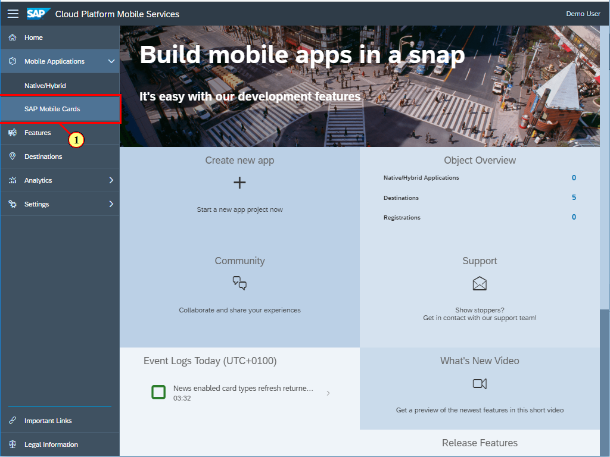
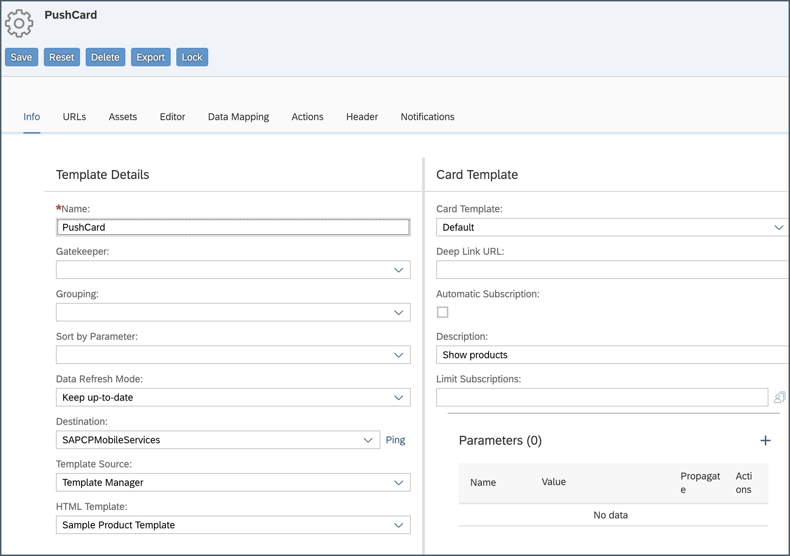
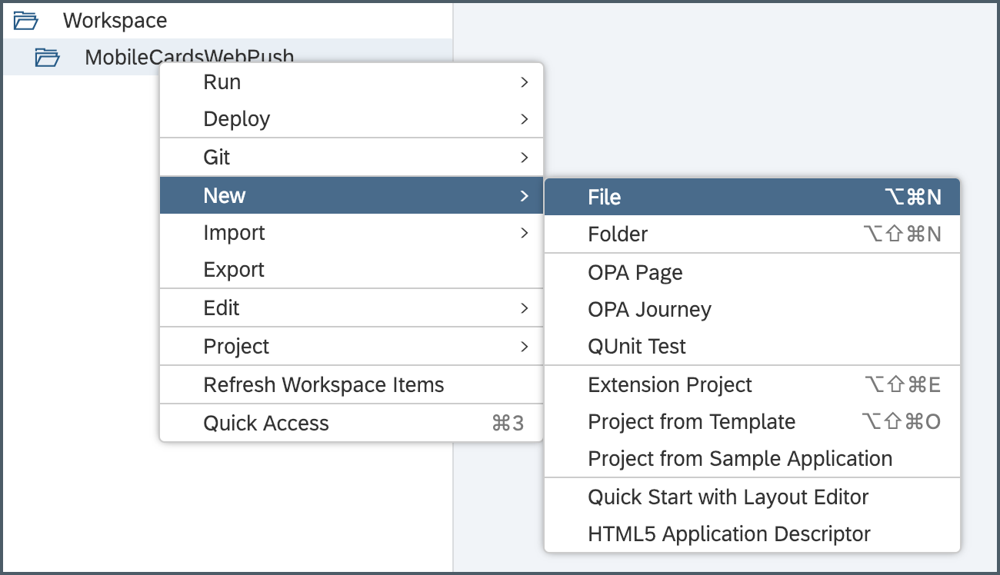
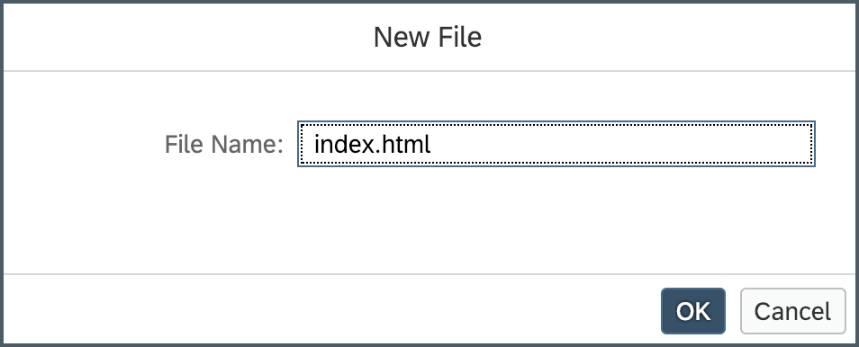
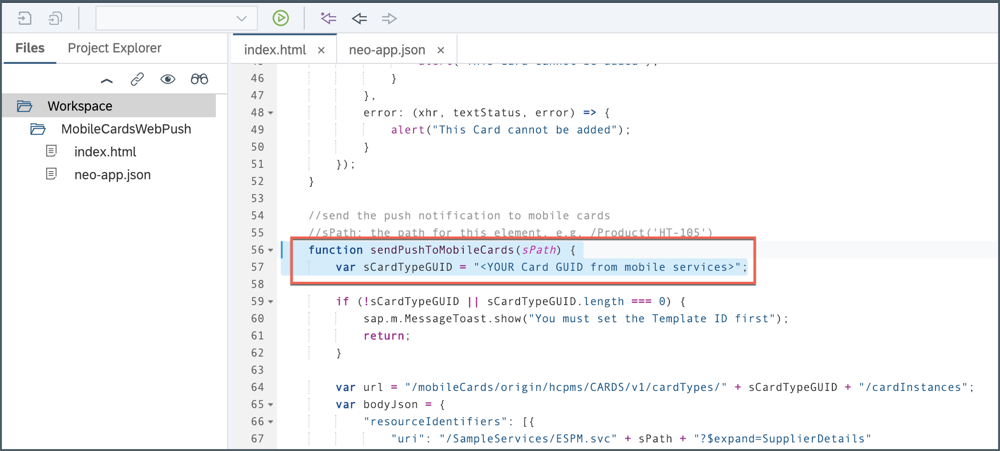
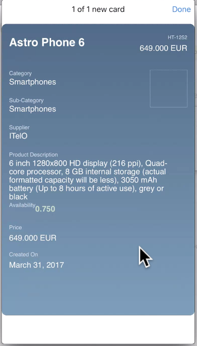

## Prerequisites
- [Sign up for a free trial account on SAP Cloud Platform](hcp-create-trial-account)
- [Enable SAP Cloud Platform Mobile Services](fiori-ios-hcpms-setup)
- **Install SAP Mobile Cards Application:** Download and install on your [iPhone](https://itunes.apple.com/us/app/sap-content-to-go/id1168110623?mt=8) or [Android](https://play.google.com/store/apps/details?id=com.sap.content2go)

## Details
### You will learn
 - How to push content from a web application to SAP Mobile Cards by choosing Default card template
 - Java script code needed to embed in your webpage

The Default card allows you to mobilize content which the user can push from any system and will be updated in the background so that the cards are always up to date.

---

[ACCORDION-BEGIN [Step 1: ](Get familiar with real world use case)]

A company wants to enable it's sales team to have the latest information about certain products. Each salesperson should be able to decide on when and what products he or she wants to have on their mobile devices. The salesperson can do this by sending the selected product from a webpage to the mobile device. From this point on, the product will be on the mobile device available offline and the product details will update in the background so that the data on the mobile device is always up to date.

[DONE]
[ACCORDION-END]

[ACCORDION-BEGIN [Step 2: ](Create a new card)]

Make sure you have logged into the SAP Cloud Platform Mobile Services cockpit. Navigate to **SAP Mobile Cards** to look into Mobile Cards configuration.



Click the **Create a New Card** icon.


Provide the required information:

| Field | Value |
|----|----|
| **Name** | `PushCard` |
| **Destination** | `SAPCPMobileServices` |
| **Template Source** | `Template Manager` |
| **HTML Template** | `Sample Product Template` |
| **Card Template** | `Default` |

> If you see a pop-up, click **OK** for the confirmation.



> **Destination** defines the root for the queries that are going to be used for this card.

Click **Save**.


**Yes** means that when you do any modifications to this card, you need to unlock it first. For this tutorial, click **No**.


[DONE]
[ACCORDION-END]

[ACCORDION-BEGIN [Step 3: ](Clone a GitHub project into SAP Web IDE)]

Open SAP Web IDE Full-Stack.

> If SAP Web IDE Full-Stack service is not enabled, enable it first. Follow [this](sapui5-webide-open-webide) tutorial for more details.

Click **Clone from Git Repository** to get a copy of the sample web application.


Copy and paste the following URL and click **Clone**.

```url
https://github.com/sapCPms/demoHtmlPushCard
```



Click **Do it later**.



Look for `Object.controller.js` file in the project and double click on it.



Scroll down until you see the function `onShareToC2GPress`.

> `YOUR_CARD_UID` is a placeholder for the Mobile Cards ID. When a new card is created in Mobile Services Cockpit, a unique identifier is assigned to it.


[DONE]
[ACCORDION-END]

[ACCORDION-BEGIN [Step 4: ](Copy the Mobile Card ID)]

Switch back to SAP Cloud Platform Mobile Services Cockpit, go to `PushCard` configuration.


Copy the **ID**.


[DONE]
[ACCORDION-END]

[ACCORDION-BEGIN [Step 5: ](Paste the Mobile Cards ID in Web IDE project)]

Switch back to SAP Web IDE Full-Stack and paste the ID in place of `YOUR_CARD_UID`.


Click on **Save** icon.


[DONE]
[ACCORDION-END]

[ACCORDION-BEGIN [Step 6: ](Push a Product info as a card from the Web application)]

Click on run icon to run the web application.


Select `index.html` and click **OK**.


>In case if you see **Disable pop-up blocker**, click on the right most icon in the address bar and select **Always allow** option and click **Done**.

>If you still see nothing happening, close the blocker pop-up and re-run the app by clicking on run icon.


Click any of the available products.


Click on **share** icon.


Click **Send E-Mail** to send this card to your SAP Mobile Cards app.

>In `Object.view.xml` file, application code has been modified to send the product information as a card instead of an email.


Once the card has been added, you will see a success message.


[VALIDATE_1]
[ACCORDION-END]

[ACCORDION-BEGIN [Step 7: ](View a Product info in Mobile Cards application)]

In SAP Mobile Cards application you will see a new card that has been shared from the web application.



[DONE]
[ACCORDION-END]
