## Prerequisites
- **Tutorial**: [Set Up Initial Configuration for an MDK App](cp-mobile-dev-kit-ms-setup)
- **Download the latest version of Mobile Development Kit SDK** either from [SAP Software Content Downloads](https://developers.sap.com/trials-downloads.html) or [SAP Marketplace](https://launchpad.support.sap.com/#/softwarecenter/template/products/%20_APP=00200682500000001943&_EVENT=DISPHIER&HEADER=Y&FUNCTIONBAR=N&EVENT=TREE&NE=NAVIGATE&ENR=73555000100900002601&V=MAINT&TA=ACTUAL&PAGE=SEARCH/MDK%20CLIENT%203.0) if you are a SAP Cloud Platform Mobile Services customer
- **Apple ID**: A paid Apple developer account is required

## Details
### You will learn
  - How to set up push notifications on an Apple Developer account & Google Firebase account
  - How to configure push settings on SAP Cloud Platform Mobile Services

---

[ACCORDION-BEGIN [Step 1: ](Set up the application foundation)]

Make sure that you have already created a new destination `mobileservices_cf` as per [previous tutorial](fiori-ios-hcpms-setup). This is required to connect SAP Web IDE to Mobile Services on Cloud Foundry environment and have setup initial configuration in SAP Cloud Platform Mobile Services as per [this tutorial](cp-mobile-dev-kit-ms-setup).

This step includes creating the Mobile Development Kit project in the Editor.

1.  Launch the SAP Web IDE and select the **MDK perspective** by clicking on the icon in the left panel.

    Right-click the workspace folder and select **New** | **MDK Empty Project**.

    

    >More details on _MDK template_ is available in [help documentation](https://help.sap.com/viewer/977416d43cd74bdc958289038749100e/Latest/en-US/cfd84e66bde44d8da09f250f1b8ecee6.html)

2.  Enter the **Project Name** as `mdk_push` and click **Next**.

    

    Leave the default values in _Application Creation_ step as it is, click **Finish**.

    After clicking Finish, the wizard will generate your MDK project `mdk_push` based on your selections.


[DONE]
[ACCORDION-END]

[ACCORDION-BEGIN [Step 2: ](Create MDK actions to register for push notifications)]

In this step, you will create the following actions:

* **Push Notification Register action**: this will register the device with SAP Cloud Platform Mobile Services for push notification.

* **Message actions**: these will display a message if Push Notification Register action has succeeded or failed.


1. Create a Push Notification Register action.

    Right-click the **Actions** folder | **New MDK Action** | choose **MDK Other Actions** in **Category** | click **Push Notification Register Action** | **Next**.

    

    Provide the below information:

    | Property | Value |
    |----|----|
    | `Action Name`| `PushRegister` |

    

    >More details on _Push Notification Action_ is available in [help documentation](https://help.sap.com/viewer/977416d43cd74bdc958289038749100e/Latest/en-US/2c9594625f464a6aa91cd59dfbc6a04a.html).

    Click **Next** and then **Finish** on the confirmation step.

2. Define a success message if the Push Register Notification action is succeeded.

    Right-click the **Actions** folder | **New MDK Action** | choose **MDK Message Actions** in **Category** | click **Message Action** | **Next**.

    

    Provide the below information:

    | Property | Value |
    |----|----|
    | `Action Name`| `PushRegisterSuccessMessage` |
    | `Type` | select `Message` |
    | `Message` | `Push Notification registered` |
    | `Title` | `Success` |
    | `OKCaption` | `OK` |
    | `OnOK` | `--None--` |
    | `CancelCaption` | leave it blank |
    | `OnCancel` | `--None--` |

    

    Click **Next** and then **Finish** on the confirmation step.


3. Define a failure message if the Push Register Notification action is failed.

    Right-click the **Actions** folder | **New MDK Action** | choose **MDK Message Actions** in **Category** | click **Message Action** | **Next**.

    

    Provide the below information:

    | Property | Value |
    |----|----|
    | `Action Name`| `PushRegisterFailureMessage` |
    | `Type` | select `Message` |
    | `Message` | `Push Notification didn't register` |
    | `Title` | `Failure` |
    | `OKCaption` | `OK` |
    | `OnOK` | `--None--` |
    | `CancelCaption` | leave it blank |
    | `OnCancel` | `--None--` |

    

    Click **Next** and then **Finish** on the confirmation step.

4. Define _Success_ and _Failure_ actions for `PushRegister.action`.

    In the action editor for the new action, expand the **Common Action Properties** and provide the below information:

    | Property | Value |
    |----|----|
    | `Success Action` | `PushRegisterSuccessMessage.action` |
    | `Failure Action` | `PushRegisterFailureMessage.action` |

>When `PushRegister.action` gets executed successfully then `PushRegisterSuccessMessage.action` will be triggered or if `PushRegister.action` fails then `PushRegisterFailureMessage.action` will be triggered.


Save the changes to the `PushRegister.action`.

[DONE]
[ACCORDION-END]


[ACCORDION-BEGIN [Step 3: ](Call the push register action)]

In the step, you will set and call the Push Register Notification action when app is updated with the new metadata.

>It is up to developers how they want to call a Push Register Notification action.

1.  Double-click `Application.app` file, select the `PushRegister.action` for the `OnDidUpdate` event.

    

2. Save the changes to `Application.app` file.

[DONE]
[ACCORDION-END]

[ACCORDION-BEGIN [Step 4: ](Deploy and activate application)]

So far, you have learned how to build an MDK application in the SAP Web IDE editor. Now, we deploy this application definition to Mobile Services.

1.  Right-click the `mdk_push` MDK Application in the project explorer pane and select **MDK Deploy and Activate**.

    

2. Let the default configuration as it is and click **Next**.

    

    >**Filter files**: will be filtered and ignored in web packing process.

    >**Externals**: are the list of NPM modules that are part of the MDK Client application and should not be validated in the bundle.


3.  Click the dropdown for Destination Name and select the `mobileservices_cf` destination, you will find list of existing application IDs, select the one you have chosen while creating the project.

    

    >By default, automatically deploy option is selected, In other words, the application is automatically deployed from Mobile Services to your MDK client.

4.  Click **Next** to finish the deployment from SAP Web IDE.

You should see **Application deployed successfully** message in console log.


[DONE]
[ACCORDION-END]


[ACCORDION-BEGIN [Step 5: ](Generate push configuration for Android/iOS device)]

>Make sure you are choosing the right device platform tab above.

[OPTION BEGIN [Android]]

1. Open the [Firebase console](https://console.firebase.google.com/u/0/?pli=1), login with your Google account and click **Add Project**.

    

2. Provide a Project Name, click **Continue**.

    

3. Let the default configuration as it is, click **Continue**.

    

4. Agree to terms & conditions, click **Create project**.

    

5. Once the project is ready, click **Continue**.

6. Click **Android** icon to add Firebase to your Android app.

    

7. Provide a unique name to Android package name, click **Register app**.

    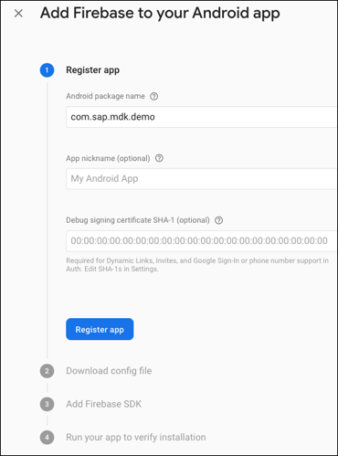

8. `Download config file`, click **Next**.

    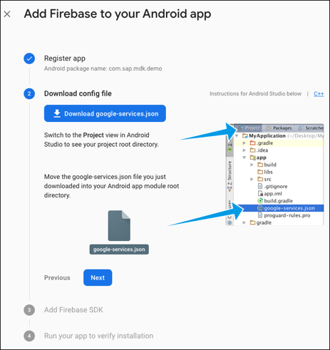

9. In the following step, click **Next** and then click **Continue to console**.

    

[OPTION END]

[OPTION BEGIN [iOS]]

In order to implement Push Notifications, a paid Apple developer account is required. Students or other developers with a personal Apple ID for their team will not be able to use push notifications, because they will not have access to the Developer Portal to generate the required certificate.

To enable your app for push notifications, you need to carry out the following tasks:

* Obtain a certificate signing request
* Register an iOS App ID
* Create a new development certificate .CER file
* Install the .CER file and create the .p12 file
* Register your device

1. Obtain a certificate signing request

    In order to use the **Apple Push Notification service**, you need to create a **CSR file**.

    On your Mac, open the **Keychain Access** application, and navigate to **Keychain Access > Certificate Assistant > Request a Certificate From a Certificate Authority...**

    

    In the dialog, enter the email address which is associated with your Apple Developer account. Also, make sure you check the **Request is saved to disk** option.

    

    Click **Continue**.

    Choose a folder to store the certificate -- it is good practice to store generated files in a separate folder for each project -- and click **Save**.

    Once you see a dialog saying the certificate is saved successfully, click **Done** to finish.

    

2. Register an iOS App ID

    Go to your [Apple Developer Account](https://developer.apple.com) and click **Certificates, Identifiers & Profiles**.

    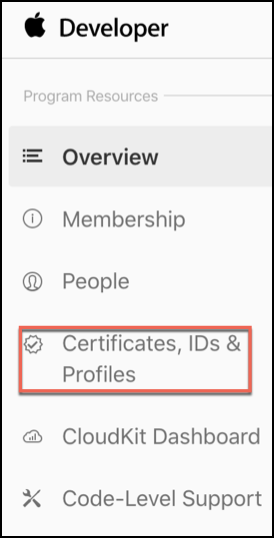

    Click **+** icon to register a unique **Identifiers** for your application.

    

    Select **App IDs** and click **Continue**.

    

    Provide a unique **Bundle ID** name and **Description**.

    

    Scroll down and select the **Push Notifications** capability from the list, click **Continue**.

    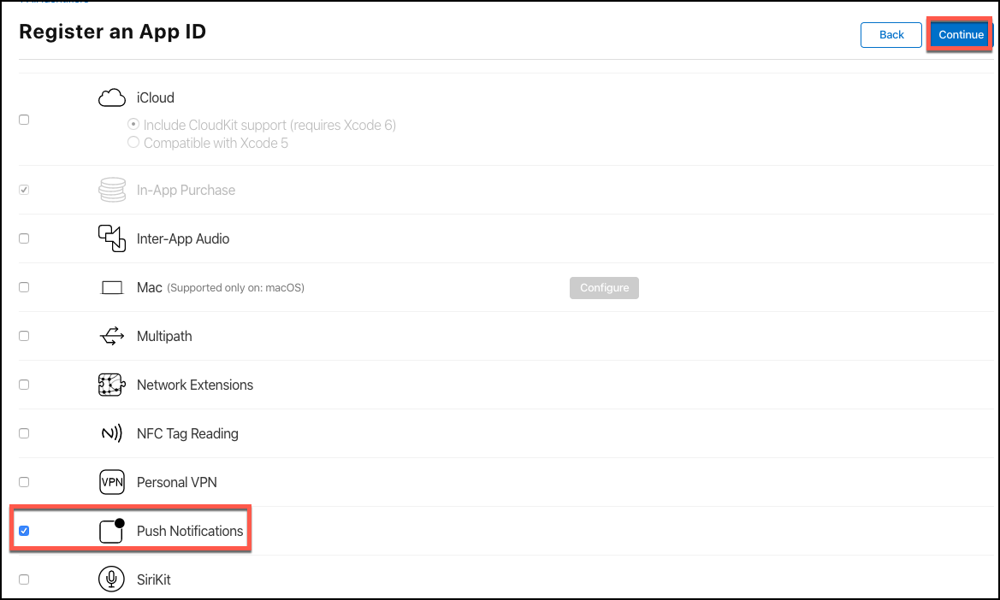

    In the following screen, select option for **Deployment Details** and then click **Continue**.

    Confirm your App ID by clicking on **Register**.

3. Create a new development certificate .CER file

    Under **Identifiers**, search for the App ID that you registered in previous step.

    

    Scroll down and select the **Push Notifications** capability, click **Configure**.

    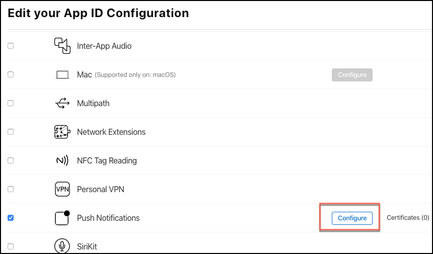

    To configure push notifications for the App ID `com.sap.mdk.demo`, a Client SSL Certificate is required that will allow the notification server to connect to the Apple Push Notification Service. Each App ID requires its own Client SSL Certificate.

    Click **Create Certificate** to start the process for creating the needed `.CER` file.

    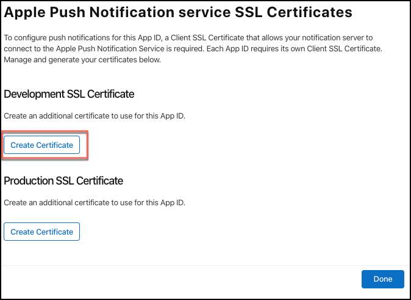

    Click **Choose File** and browse to the downloaded Signing Request `CSR` file, click **Continue**.

    Apple will now create a `.CER` file for you which is issued by the **Apple Worldwide Developer Relations Certification Authority**.

    

    Click **Download** to download your certificate.

    

4. Install the .CER file and create the .p12 file

    In order to configure the `APNS` on **SAP Cloud Platform Mobile Services**, you need to install the `.CER` file and create the needed `.p12` file.

    >A `.p12` file is a encrypted container for the certificate and private key. This file is needed by Mobile Services for the `APNS` configuration.

    Locate your downloaded `.CER` file and double-click it in order to install the certificate.

    >In case the **Add Certificate** dialog pops up make sure to choose **Login** from the dropdown and click **Add**.

    If the certificate is added correctly to the Keychain you should see it in the `MyCertificates` section, make sure you selected **login** as keychain.

    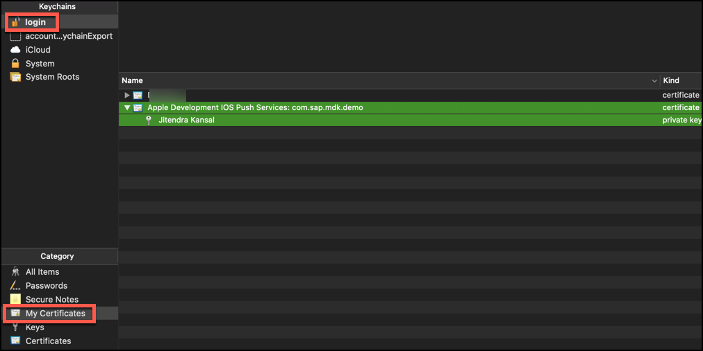

    Select the certificate as well as the private key and right-click to export those two items.

    

    Make sure that in the dropdown **Personal Information Exchange (.p12)** is selected and click **Save**. You will be prompted to enter a password, click **OK** to export the files.

    

5. Register your device

    Click **+** icon to register your iOS device.

    

    Provide **Device Name** & **Device ID (UDID)** and then click **Continue**.

    

[OPTION END]

[DONE]
[ACCORDION-END]

[ACCORDION-BEGIN [Step 6: ](Assign push notification in app configuration)]

1. Open the [SAP Cloud Platform Mobile Services cockpit](cp-mobile-dev-kit-ms-setup), click **+** icon to assign a new feature.

    

2. Select **Mobile Push Notification**, click **OK**.

    

[DONE]
[ACCORDION-END]


[ACCORDION-BEGIN [Step 7: ](Provide information to Mobile Services)]

>Make sure you are choosing the right device platform tab above.

[OPTION BEGIN [Android]]

1. In Firebase console page, click gear icon and then click **Project Settings**.

    

2. Navigate to **Cloud Messaging** tab, copy the **Server key**.

    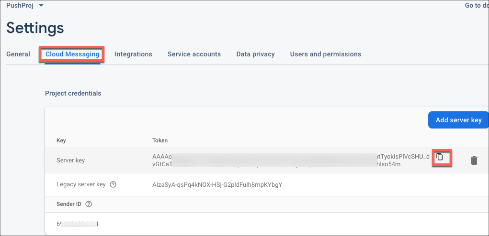

3. Paste this Server Key value in **Android** push settings in Mobile Services cockpit.

    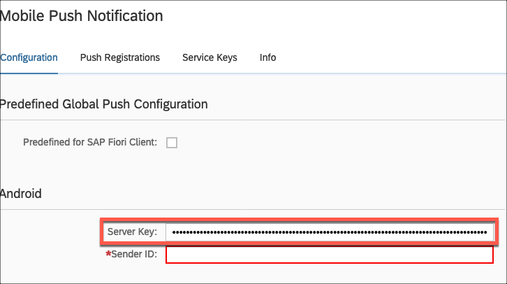

4. Repeat the above step for **Sender ID** and then click **Save**.

[OPTION END]

[OPTION BEGIN [iOS]]

1. In Mobile Services cockpit, navigate to the **Mobile Push Notification** feature for app id `com.sap.mdk.demo`.

    

2. Provide the following details to the **Apple** panel:


    |  Field Name     | Value
    |  :------------- | :-------------
    |  APNS Endpoint | Select `Sandbox`
    |  Authenticate | Select `Certificate`
    |  Certificate | `Browse to the `.p12` certificate you just exported`
    |  Password | Enter the password you provided during the export

3. Click **Save**. You have now successfully configured the APNS Endpoint on the server side in Mobile Services cockpit.

    

[OPTION END]

[DONE]
[ACCORDION-END]

[ACCORDION-BEGIN [Step 8: ](Place push files in local MDK project)]

>Make sure you are choosing the right device platform tab above.

[OPTION BEGIN [Android]]

Paste the downloaded `google-services.json` file to `/demosampleapp.mdkproject/App_Resources/Android/` path.


[OPTION END]

[OPTION BEGIN [iOS]]

1. Create a new file named as `app.entitlements` and place it under `/demosampleapp.mdkproject/App_Resources/iOS/` path.

    

2. Open this file and copy & paste the below information:

```XML
<?xml version="1.0" encoding="UTF-8"?>
<!DOCTYPE plist PUBLIC "-//Apple//DTD PLIST 1.0//EN" "http://www.apple.com/DTDs/PropertyList-1.0.dtd">
<plist version="1.0">
<dict>
	<key>aps-environment</key>
	<string>development</string>
</dict>
</plist>
```

>Assign a value of development or production to aps-environment key, depending only on which activity you are creating the provisioning profile for.

[OPTION END]

[DONE]
[ACCORDION-END]

[ACCORDION-BEGIN [Step 9: ](Create MDK client)]

>Make sure you are choosing the right development platform tab above.

[OPTION BEGIN [Mac]]

1. You can create a client by running `./create-client.command` and providing the path to a valid `.mdkproject` directory.

    

2. You will be asked whether you would like to build for iOS or Android or All?

    

    >**All** option was chosen in this tutorial as you will learn how to create the MDK client for iOS and Android.

3. Then, you will be asked whether you would like to build for device or simulator?

    

>**device** option was chosen for this tutorial.

Once the `create-client.command` script executed successfully, you will see **Application ready** message in terminal console.

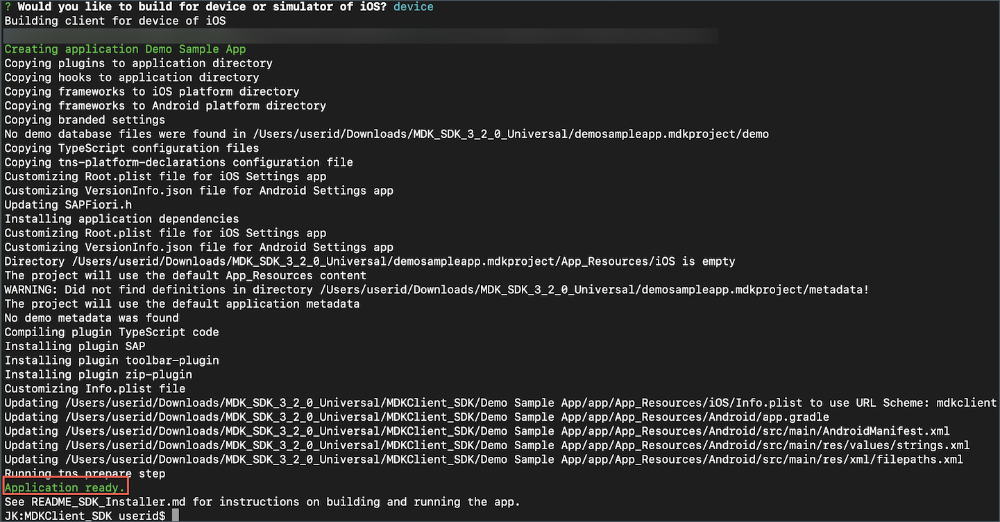

You will also find your app created under the `MDKClient_SDK` folder.

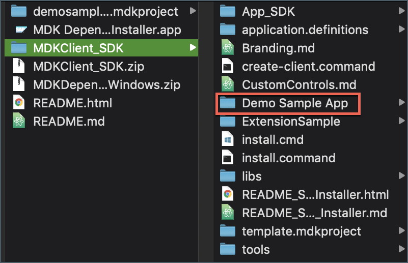

[OPTION END]

[OPTION BEGIN [Windows]]

1. You can create a client by running `create-client.cmd` and providing the path to a valid `.mdkproject` directory.

    

2. Once the `create-client.cmd` script executed successfully, you will see **Application ready** message in terminal console.

    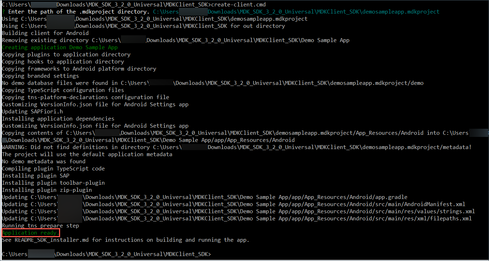

 You will also find your app created under the `MDKClient_SDK` folder.

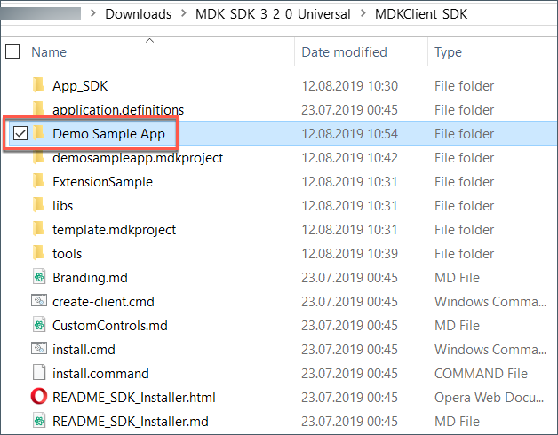

[OPTION END]

>This name of this folder is based on the `<App Name>` provided in the `MDKProject.json file` and this is the `NativeScript` project.

[VALIDATE_1]
[ACCORDION-END]

[ACCORDION-BEGIN [Step 10: ](Run MDK client)]

>Make sure you are choosing the right device platform tab above.

[OPTION BEGIN [Android]]

1. In this step, you will run the app on an android device. Attach the device to your Mac or Windows machine and run `tns device android` command to print a list of attached devices.

    

    >Make sure **Developer option** and **USB debugging** option is enabled in android device.

2. Copy the **Device Identifier** value for your device.

3. In terminal or command line window, navigate to the app name folder `Demo Sample App` (in `MDClient_SDK` path) and use `tns run android --device <device identifier>` command to run the MDK client on android device.

    

    >To run the MDK client on Android simulator, use `tns run android --emulator` command. Make sure that you have created a virtual device in Android Studio prior to running this command.

    >Before trying to launch the client on Android emulator, make sure that you have already configured a virtual device (Android Studio>AVD Manager). Otherwise, you may get error like No emulator image available for device identifier.

    Once, above command gets successfully executed, you will see new MDK client up and running in Android device.

      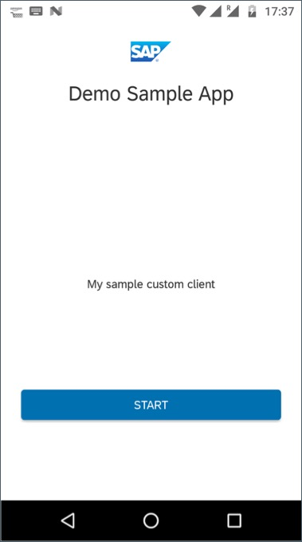

4. Tap **START** to connect MDK client to SAP Cloud Platform.

5. Enter Email address and password to login to SAP Cloud Platform and tap **Log On** to authenticate.

    

6. Tap **AGREE** on `End User License Agreement`.

    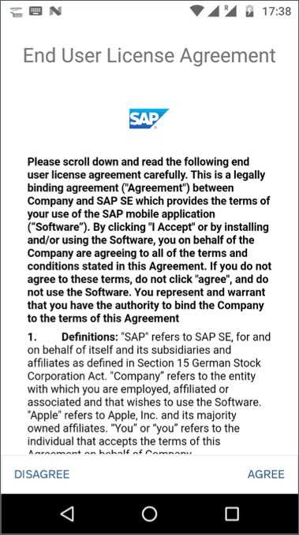

7. Choose a passcode with at least 8 characters for unlocking the app and tap **NEXT**.

    

8. Confirm the passcode and tap **DONE**.

    

9. The MDK client receives deployed metadata definitions as a bundle. Click **OK** to confirm.

    

10. If push registration is successful, a message should show **Push Notification Registered**. Click **OK**.

    

    >You can always interrupt running process in terminal window by pressing `CTRL-C`.

    >To build an **`APK` for an Android device**, use `tns build android --release`. More information about archiving can be found in `NativeScript` documentation [here](https://docs.nativescript.org/tooling/docs-cli/project/testing/build-android).

    It is time now to send the first push notification from the **SAP Cloud Platform Mobile Services push notification feature**.

11. Navigate to Mobile Services cockpit. In **Mobile Push Notification** feature, switch to **Push Registrations** tab.

12. There you will find information about user registered for push notification and also details about Push providers. Identify your Device ID and click **Send Notification**.

    

13. In notification dialog, type a notification message and click **Send**.

    

You will see a success toast message.


After sending notification, mobile device should receive the message.


[OPTION END]

[OPTION BEGIN [iOS]]

1. In this step, you will run the app on an iOS device. Attach the device to your Mac and run `tns device ios` command to print a list of attached devices.

    

2. Copy the **Device Identifier** value for your device.

3. In terminal window, navigate to the app name folder `Demo Sample App` (in `MDClient_SDK` path) and use `tns run ios --device <device identifier>` command to run the MDK client on iOS device.

    

    You can also run the app in Xcode. Open the project in Xcode with the command `open platforms/ios/<app name>.xcworkspace`, or open the workspace using the `File -> Open...` dialog in Xcode. Configure the application's code signing settings, then run the application for the target device.

    Once, above command gets successfully executed, you will see new MDK client up and running in your device.

    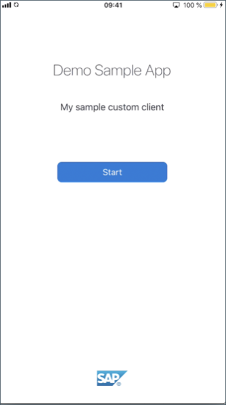

4. Tap **Start** to connect MDK client to SAP Cloud Platform.

5. Enter Email address and password to login to SAP Cloud Platform and tap **Log On** to authenticate.

    

6. Tap **Agree** on `End User License Agreement`.

    

7. Choose a passcode with at least 8 characters for unlocking the app and tap **Next**.

    

8. Confirm the passcode and tap **Done**.

    

9. The MDK client receives deployed metadata definitions as a bundle. Click **OK** to confirm.

    

    You will also notice that it will first ask permission to display notifications.

    

10. If push registration is successful, a message should show **Push Notification Registered**. Click **OK**.

    

    >You can always interrupt running process in terminal window by pressing `CTRL-C`.

    >To build an **IPA for an iOS device**, use `tns build ios --for-device --release`. This can also be accomplished in Xcode by opening the workspace and selecting the Archive option. More information about archiving can be found in Apple's documentation [here](https://developer.apple.com/library/content/documentation/IDEs/Conceptual/AppDistributionGuide/UploadingYourApptoiTunesConnect/UploadingYourApptoiTunesConnect.html).

    It is time now to send the first push notification from the **SAP Cloud Platform Mobile Services push notification feature**.

11. Navigate to Mobile Services cockpit. In **Mobile Push Notification** feature, switch to **Push Registrations** tab.

12. There you will find information about user registered for push notification and also details about Push providers. Identify your Device ID and click **Send Notification**.

    

13. In notification dialog, type a notification message and click **Send**.

    

You will see a success toast message.


After sending notification, mobile device should receive the message.


If you have Apple watch connected to the iPhone device, you can also see same push notification on the Apple Watch.


>MDK supports rich push notification. MDK does not run on smart watches or as an Apple watch application.

[OPTION END]

[DONE]
[ACCORDION-END]

---
