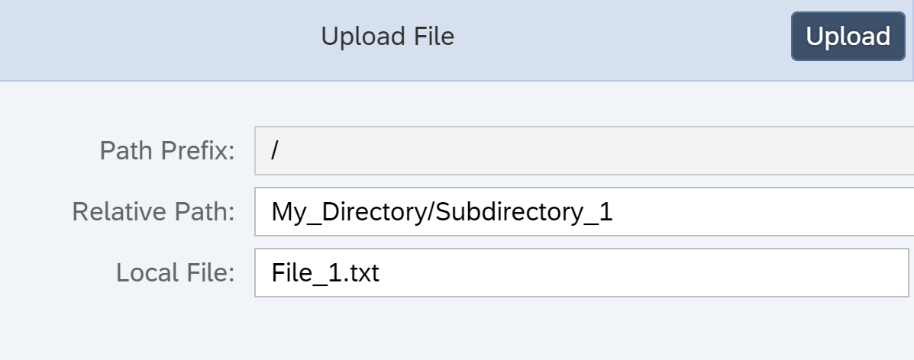
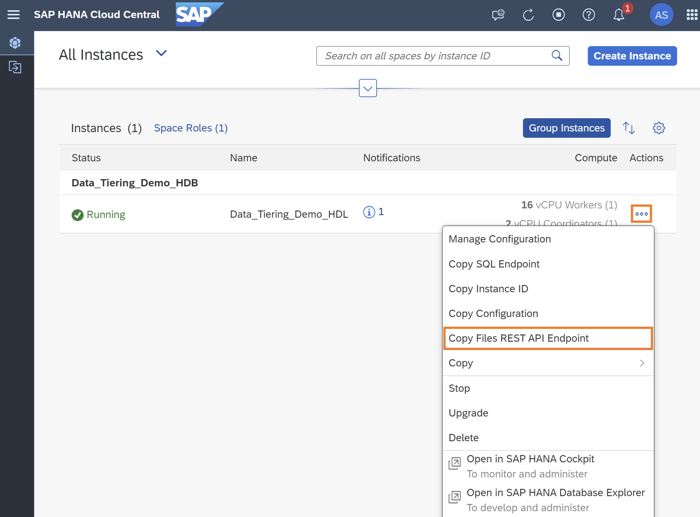

# Copy Data Between Data Lake Files Instances Using Python
<!-- description --> Copy a root directory from a source SAP HANA data lake Files instance to a target SAP HANA data lake files instance. A Python script is provided to execute this copy which leverages the SAP HANA Cloud, data lake Files REST API. 

## Prerequisites
 - Two running non-trial SAP HANA data lake Files instances – a source and a target
 - Both instances added to SAP HANA database explorer; [instructions to add](data-lake-hdlfs-dbx-connection)
 - Read permissions on the source instance
 - Read and write permissions on the target instance
 - Client certificates set up on both instances, and a copy of the client certificate and client key files for each instance; [instructions to set up certificates](https://blogs.sap.com/2021/08/05/setting-up-initial-access-to-hana-cloud-data-lake-files/)
 - Python 3.10 or later; [download Python](https://www.python.org/downloads/)

## You will learn
  - How to copy a directory from the source data lake file container to the target data lake file container

## Intro
Note that for simplicity, the same client certificate will be used for both the target and the source instance in this tutorial. 

---

### Set up a directory in the source data lake Files instance

In this step, we will create a directory called `My_Directory` with two subdirectories, `Subdirectory_1` and `Subdirectory_2`, with a file in each subdirectory. The files can be of any format, however this tutorial will use text files. 

1. Create and save the following  text files locally. 

    ```File_1.txt
    This is my first text file.
    ```
    Ensure to recall the location of your text files.

    ```File_2.txt
    This is my second text file. 
    ```

2. In database explorer, upload these files to your source HDLFS instance. Upon uploading the file with the following relative path, the directory `My_Directory` with subdirectory `Subdirectory_1` will be created. 

    

    

3. Upload `File_2.txt` using the relative path `My_Directory/Subdirectory_2`.


### Set up a Python script


1. In this step you will need to access the REST API endpoints for both your source and target HLDFS instances. The REST API endpoint for a given instance can be found by clicking the action menu in SAP HANA Cloud Central. 

    

2. Create a Python script beginning with the code below and save the file as `copy_HDLFS.py`. Edit the source and target instance variables with the appropriate REST API endpoints for each of your containers. Edit the certificate variables with the appropriate path to the certificate and key used for both HDLFS containers. 

    ```Python
    # Source information
    SOURCE_FILES_REST_API_ENDPOINT = '<File Container REST API>'

    # Target information
    TARGET_FILES_REST_API_ENDPOINT = '<File Container REST API>'

    # Certificates information
    CERTIFICATE_PATH = '<Path to client.crt>'
    KEY_PATH = '<Path to client.key>'
    ```

### Set up a copy script

1. Append the following code to the end of your `copy_HDLFS.py file`

    ```Python
    # This script copies a directory including all subdirectories and files from a root directory
    # in the source HDLFS instance to the target HDLFS instance.
    
    # This script is run with the following arguments:
    #   root='root_dir_name'
    #       where root_dir_name is the name of the root directory in the source instance
    #       that is being copied
    #   index=i
    #       (optional) where i is a non-negative integer and the index of the file in the source
    #       instance that will be used as a starting point for the copy -- in other words, the first i
    #       files will be skipped and thus will not be copied; if no value is given, the default index 0
    #       will be used -- all files will be copied
    #
    # Ex. The following arguments would execute a copy from root directory 'TPCH_SF100' starting at the
    # file at index 42
    # py copy_HDLFS.py root='TPCH_SF100' index=42
    
    ###################################################################################################
    
    # Importing dependencies
    import http.client
    import json
    from datetime import datetime
    import ssl
    import sys
    
    ###################################################################################################
    
    # Handling arguments if either have been provided
    # In either order, root and index can be specified by the user in the following format:
    # py copy_HDLFS.py root='TPCH_SF100' index=42
    def assign_arguments(arg_list):
        args = {}
        if len(arg_list) <= 3:
            for arg in arg_list:            
                if arg[:6] == 'root=\'' and arg[-1] == '\'' and not ('root' in args):
                    args['root'] = arg[6:-1]
                elif arg[:6] == 'index=' and not ('index' in args):
                    try:
                        args['index'] = int(arg[6:])
                        args['index'] >= 0
                    except:
                        raise Exception(f'ERROR: Invalid argument {arg}.')
                else:
                    raise Exception(f'ERROR: Invalid argument {arg}.')
        else:
            raise Exception('ERROR: Too many arguments.')
        return args
    
    argument_assignment = assign_arguments(sys.argv[1:])
    if 'root' in argument_assignment:
        ROOT_DIR = argument_assignment['root']
    else:
        raise Exception('ERROR: No root directory was provided. To copy the entire source instance use root=\'\'.')
    if 'index' in argument_assignment:
        STARTING_INDEX = argument_assignment['index']
    else:
        STARTING_INDEX = 0
    
    ###################################################################################################
    
    # Creating an SSL context using the certificate path and key path variables
    ssl_context = ssl.create_default_context()
    ssl_context.load_cert_chain(CERTIFICATE_PATH, KEY_PATH)
    
    # Creating container variables for the source and target instances
    source_container = SOURCE_FILES_REST_API_ENDPOINT.partition('.')[0]
    target_container = TARGET_FILES_REST_API_ENDPOINT.partition('.')[0]
    
    # Creating connections to the source and target instances
    source_connection = http.client.HTTPSConnection(
        SOURCE_FILES_REST_API_ENDPOINT, port=443, timeout=30, context=ssl_context)
    target_connection = http.client.HTTPSConnection(
        TARGET_FILES_REST_API_ENDPOINT, port=443, timeout=30, context=ssl_context)
    
    # Creating JSON request variables needed to access the present source and target HDLFS directories
    # at the root directory provided
    json_request_path = f'/{ROOT_DIR}'
    json_request_url = f'/webhdfs/v1/{json_request_path}?op=LISTSTATUS_RECURSIVE'
    source_json_request_headers = {
        'x-sap-filecontainer': source_container,
        'Content-Type': 'application/json'
    }
    target_json_request_headers = {
        'x-sap-filecontainer': target_container,
        'Content-Type': 'application/json'
    }
    
    # Creating request headers for reading and writing binary data from the source and target HDLFS
    # directories
    source_request_headers = {
        'x-sap-filecontainer': source_container,
        'Content-Type': 'application/octet-stream'
    }
    target_request_headers = {
        'x-sap-filecontainer': target_container,
        'Content-Type': 'application/octet-stream'
    }
    
    # http.client connection requests are made and if the request is successful, the read data
    # is returned
    def fetch(fetch_connection, fetch_method, fetch_url, fetch_body, fetch_headers):
        fetch_connection.request(
                    method = fetch_method,
                    url = fetch_url,
                    body = fetch_body,
                    headers = fetch_headers)
        response = fetch_connection.getresponse()
        data = response.read()
        response.close()
        return data
    
    ###################################################################################################
    
    # Connecting to the target instance and requesting a list of the current target HDLFS directory at
    # the root directory provided
    # If connection is unsuccessful the http.client will raise an exception
    print('\nConnecting to target instance...')
    target_json_data = fetch(target_connection, 'GET', json_request_url,
                            None, target_json_request_headers)
    target_files_dict = json.loads(target_json_data)
    print('Successfully connected to target instance.\n')
    
    # If the root directory already exists in the target instance, the user is prompted to confirm that
    # they would like to proceed
    if 'DirectoryListing' in target_files_dict:
        print(f'WARNING: The directory {ROOT_DIR} already exists at the target HDLFS.')
        print('Proceeding could result in overwriting files in this directory of the target instance.')
        user_input = input('Would you like to proceed? (Y/N): ')
        while user_input not in ['Y', 'N']:
            print('ERROR: Invalid response. Please enter Y or N.')
            user_input = input('Would you like to proceed? (Y/N): ')
        if user_input == 'N':
            quit()
    
    # The start timestamp is declared
    print('\nStarting copy...')
    start = datetime.now()
    print('Start time:\t', start, '\n')
    
    # Connecting to the source instance and requesting a list of the current source HDLFS directory at
    # the root directory provided
    # If connection is unsuccessful the http.client will raise an exception
    print('Connecting to source instance...')
    source_json_data = fetch(source_connection, 'GET', json_request_url,
                            None, source_json_request_headers)
    source_files_dict = json.loads(source_json_data)
    print('Successfully connected to source instance.\n')
    
    # Accessing the path suffix of each file in the root directory of the source instance
    source_files_paths = []
    for file in source_files_dict['DirectoryListing']['partialListing']['FileStatuses']['FileStatus']:
        source_files_paths.append(file['pathSuffix'])
    
    # Starting with the starting index provided (or the first file if no starting index was provided),
    # the copy begins
    cur_index = STARTING_INDEX
    while cur_index < len(source_files_paths):
        try:
            file_path = source_files_paths[cur_index]
            request_path = f'/{ROOT_DIR}/{file_path}'
            offset = 0
            length = 10000000
            read_length = length
            merge_count = 0
            to_merge = {'sources': []}
            list_of_temp = []
    
            # While each chunk of bytes read continues to be the length of bytes requested, indicating
            # that the EOF has not been reached, more bytes are read
            while read_length == length:
                source_request_url = f'/webhdfs/v1/{request_path}?op=OPEN&offset={offset}&length={length}'
                source_data = fetch(source_connection, 'GET', source_request_url,
                                    None, source_request_headers)
                read_length = len(source_data)
                
                # If the first request returns less than 10MB, the entire file has been read and can be
                # written to a file under the same name in the target location, without creating any
                # temporary files
                if offset == 0 and read_length < length:
                    target_request_url = f'/webhdfs/v1/{request_path}?op=CREATE&data=true'
                    target_data = fetch(target_connection, 'PUT', target_request_url, source_data,
                                        target_request_headers)
                    print(f'Created and wrote {read_length} bytes to {request_path}')
    
                # Otherwise a temporary file is created for the current read and each subsequent read;
                # the files will later be merged
                else:
                    merge_count += 1
                    temp_path = request_path[:-8] + str(merge_count) + '.parquet'
                    target_request_url = f'/webhdfs/v1/{temp_path}?op=CREATE&data=true'
                    target_data = fetch(target_connection, 'PUT', target_request_url, source_data,
                                        target_request_headers)
                    print(f'Created temporary file {temp_path}')
                    list_of_temp.append(temp_path)
                    temp_to_merge = {'path': temp_path}
                    to_merge['sources'].append(temp_to_merge)
                    offset += length
    
            # If there are files to merge, they are merged here and delete the temporary files
            if merge_count != 0:
                cur_file_bytes_read = offset + read_length
                print(f'Read and wrote {cur_file_bytes_read} bytes to {merge_count}',
                    f'temporary files for file {request_path}')
    
                # Creating the file where we will merge all temporary files to
                target_request_url = f'/webhdfs/v1/{request_path}?op=CREATE&data=true'
                target_data = fetch(target_connection, 'PUT', target_request_url, None,
                                    target_request_headers)
                print(f'Created {request_path}')
    
                # Merging the files to the merge destination file
                target_request_url = f'/webhdfs/v1/{request_path}?op=MERGE&data=true'
                target_data = fetch(target_connection, 'POST', target_request_url,
                                    json.dumps(to_merge), target_request_headers)
                print(f'Merged {merge_count} files to {request_path}')
    
                # Deleting the temporary files after the merge is complete
                to_delete = {'files': to_merge['sources']}
                target_request_url = f'/webhdfs/v1/?op=DELETE_BATCH&data=true'
                target_data = fetch(target_connection, 'POST', target_request_url,
                                    json.dumps(to_delete), target_request_headers)
                print(f'Deleted {merge_count} temporary files')
            
        # If an exception is raised, the error is printed and arguments are provided to rerun the
        # script beginning with the file in which the error occured
        except Exception as error:
            print(error)
            print('To rerun this script begining with the most recently accessed file, run:',
                f'\npy {sys.argv[0]} root=\'{ROOT_DIR}\' index={cur_index}')
            quit()
        # If any other error occurs, arguments are provided to rerun the script beginning with the file
        # in which the error occured
        except:
            print('To rerun this script begining with the most recently accessed file, run:',
                f'\npy {sys.argv[0]} root=\'{ROOT_DIR}\' index={cur_index}')
            quit()
        else:
            cur_index += 1
    
    end = datetime.now()
    print(f'Successfully copied {ROOT_DIR} from index {STARTING_INDEX}',
        'from source instance to target instance.')
    print('End time:\t', end)
    print('Elapsed time:\t', end - start)
    ```

### Run the copy script

1. To copy the directory `My_Directory` from the source to the target HDLFS, execute the following in command prompt. 

    ```Terminal
    py copy_HDLFS.py root='My_Directory'
    ```

2. Verify that `My_Directory` as well as its contents are now visible in the target container. 


### Knowledge check

Congratulations! You have now copied the directory `My_Directory` between HDLFS instances. 

---
