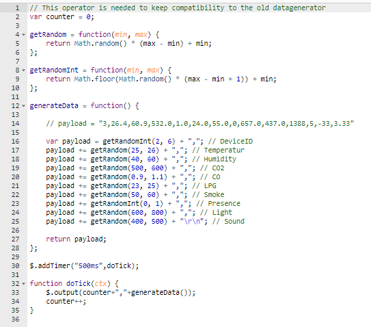

## Details
### You will learn  
- How to use a **Data Generator** to generate random sample data
- How to visualize the generated data via a **Terminal**
Please note that this tutorial is similar to the `Generate sensor data` tutorial from [SAP Data Hub, developer edition tutorial group](https://developers.sap.com/group.datahub-pipelines.html).
Also note here in this tutorial GCP refers to Google Cloud platform and AWS refers to Amazon Web Services and Azure refers to Microsoft Azure.

---

[ACCORDION-BEGIN [Step 1: ](Create a data pipeline)]

Open the modelling environment for building pipelines via SAP Data Hub Modeler. To access the Sap Data Hub Launchpad in AWS or GCP or Azure you need go to the chapters 3.3 and 3.4 as described in the [Getting Started with SAP Data Hub, trial edition] (https://caldocs.hana.ondemand.com/caldocs/help/8772c957-0de5-459b-b98a-27180932f0da_Getting_Started_Guide_v28.pdf) guide. From Sap Data Hub Launchpad you could access the Sap Data Hub Modeler.

>As the above URL is a local URL, it will be accessible only if you are doing the tutorials and have already configured the hosts file. If not, please refer to [Getting Started with SAP Data Hub, trial edition 2.4](https://caldocs.hana.ondemand.com/caldocs/help/8772c957-0de5-459b-b98a-27180932f0da_Getting_Started_Guide_v28.pdf) guide.

Enter **DEFAULT** as the **Tenant**, `DATAHUB` as **Username** and the password which you have selected during system setup as **Password** to logon.

While being in the **Graphs** tab in the **Navigation** on the left, click **Create Graph (1)** to create a new pipeline. The pipeline opens in the **editor (2)**.

Click **Save (1)**. Then enter a **Name** `(test.myFirstPipeline)` and **Description** `(My first pipeline)` in the **pop-up window (2)**.

[DONE]
[ACCORDION-END]

[ACCORDION-BEGIN [Step 2: ](Add and configure Data Generator)]

Open the **Operators (1)** tab in the navigation pane on the left. Then search for **Data Generator (2)**.

Add the **Data Generator (3)** operator to the pipeline by drag & drop.

>**Attention**: The SAP Data Hub, trial edition comes with a Example Graph as well as with an operator called **Data Generator**. If you miss to open the **Operators** tab, you might end up opening the graph called **Data Generator** instead of adding the operator.

Click **Script (4)** to display the JavaScript snippet which is executed by the **Data Generator**. The JavaScript snippet opens in a new tab of the editor.

You see that the **Data Generator** creates a new random sample record every 500 milliseconds and sends it via the output port of the operator.

The sample data represents sensors for humidity, temperature etc.

Close the tab for the JavaScript snippet.

[DONE]

[ACCORDION-END]

[ACCORDION-BEGIN [Step 3: ](Add and configure Terminal)]

Add a **Terminal** operator to the pipeline by drag & drop (you find this also in the **Operators** tab). Then connect the `output` port of the **Data Generator** operator to the `in1` port of the **Terminal** operator. **You need to place the connection exactly on the `green circle`**.

Afterwards click **Save (1)**.

[DONE]

[ACCORDION-END]

[ACCORDION-BEGIN [Step 4: ](Execute the data pipeline)]

Click **Run (1)** to execute the pipeline.

When the **Status (2)** tab indicates that the pipeline is running, use the context menu **Open UI** of the **Terminal (3)** operator to see the generated sensor data.

Stop the pipeline by clicking **Stop** (you find it next to the **Run** button).

[DONE]

[ACCORDION-END]

---
