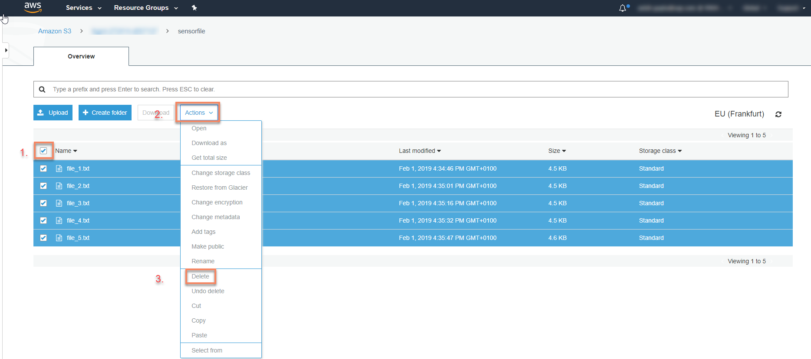
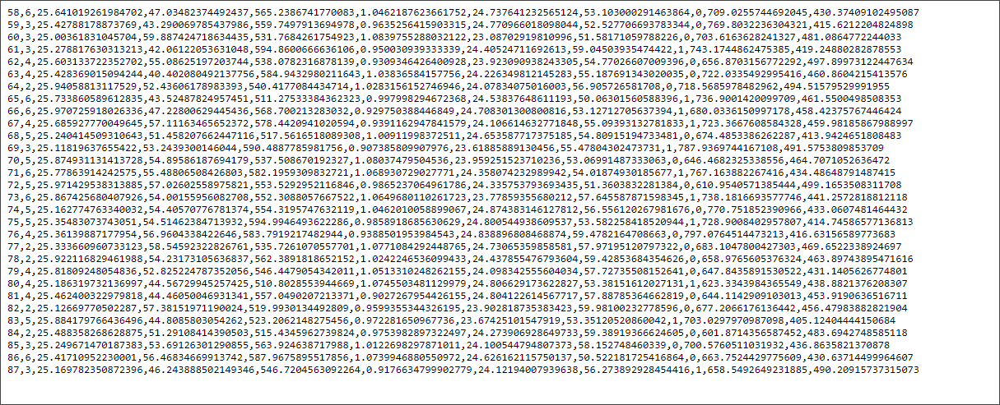

## Details
### You will learn  
- How to bundle the sensor data before storing in AWS S3 or Google Cloud Storage or Azure WASB
- How to use a **JS String Operator**

Please note that this tutorial is similar to the `Bundle data (via JavaScript)` tutorial from [SAP Data Hub, developer edition tutorial group](https://developers.sap.com/group.datahub-pipelines.html).
Also note here in this tutorial GCP refers to Google Cloud platform and AWS refers to Amazon Web Services and Azure refers to Microsoft Azure.

---

[ACCORDION-BEGIN [Step 1: ](Add JS String Operator)]

Open the pipeline which you have created in the [previous tutorial](datahub-trial-v2-pipelines-part01) `(test.myFirstPipeline)`, in the modelling environment. To access the SAP Data Hub Launchpad in AWS or GCP or Azure you need go to the chapters 3.3 and 3.4 as described in the [Getting Started with SAP Data Hub, trial edition] (https://caldocs.hana.ondemand.com/caldocs/help/Getting_Started_Data_Hub23.pdf) guide. From SAP Data Hub Launchpad you could access the SAP Data Hub Modeler.

>As the above URL is a local URL, it will be accessible only if you are doing the tutorials and have already configured the hosts file. If not, please refer to [Getting Started with SAP Data Hub, trial edition 2.4](https://caldocs.hana.ondemand.com/caldocs/help/Getting_Started_Data_Hub23.pdf) guide.

Remove the connection between the **Data Generator** operator and the **Write File** operator.

Add a **JS String Operator** to the pipeline by drag & drop.

Connect the `output` port of the **Data Generator** operator to the `input` port of the **JS String Operator**. Connect the `output` port of the **JS String Operator** to the `inFile` port of the **Write File** operator.


[DONE]

[ACCORDION-END]

[ACCORDION-BEGIN [Step 2: ](Create JavaScript extension)]

Right click the JS String Operator and click on **Open Script** to display the JavaScript snippet which is executed by the **JS String Operator**. The JavaScript snippet opens in a new tab.


Currently the JavaScript snippet creates an incremental **counter** every time it receives data via the input port and sends the **counter** to the output port.

Replace the code with the following snippet to ensure that `bundles` of 30 sensor records are sent to the output port.

```javascript

var counter = 0;
var bundle = "";

$.setPortCallback("input",onInput);

function onInput(ctx,s) {
    counter++;
    bundle = bundle + s;

    if(counter==30) {
      $.output(bundle);
      counter = 0;
      bundle = "";
    }
}
```
Navigate back to the pipeline tab and click **Save** to save the pipeline including the modified script.

[DONE]

[ACCORDION-END]


[ACCORDION-BEGIN [Step 3: ](Execute the data pipeline)]

Before you execute the pipeline, delete the contents from the `/sensordata/` folder in the GCS or AWS S3 bucket or WASB container.

Therefore, login to Google Cloud Platform - [http://console.cloud.google.com](http://console.cloud.google.com) and navigate to **GCP Left menu** > **Storage** > **Browser** > **Your Bucket name** > `sensordata` folder. Please keep this window opened as we would be checking the generated files here again in the following steps.

For AWS open [https://s3.console.aws.amazon.com](https://s3.console.aws.amazon.com) and navigate to **Search for Buckets** > **Your Bucket name** > `sensordata` folder. Please keep this window opened as we will check the generated files here again in the following steps.

For Azure open [https://portal.azure.com/](https://portal.azure.com/) and navigate to **Storage accounts** > **filter your Storage account** > **Blob service** > **click Blob** > **Your Container name** > `sensordata folder`. Please keep this window opened as we will check the generated files here again in the following steps.

Here you are able to see all the files that were created in previous executions of the pipeline. Click on the **Select All Checkbox (1)** and then click on  **Delete (2)** for GCS.


 For AWS S3 click on the **Select All Checkbox (1)** , click on **Actions (2)** and then click on **Delete (3)**. Make sure that all the files in the folder are deleted.



For Azure select all the files and click on **Delete**. Make sure all the files in the folder are deleted.


Click **Run** to execute the pipeline.

When the **Status** tab indicates that the pipeline is running, use the context menu **Open UI** of the **Terminal** operator to see the generated sensor data. You can notice that this time the output is grouped in a chunk of 30 records.

For GCP open [http://console.cloud.google.com](http://console.cloud.google.com) and navigate to the `/sensordata/` directory and for AWS open [https://s3.console.aws.amazon.com](https://s3.console.aws.amazon.com) and navigate to **Search for Buckets** > **Your Bucket name** > `sensordata` folder. For Azure open [https://portal.azure.com/](https://portal.azure.com/) and navigate to **Storage accounts** > **filter your Storage account** > **Blob service** > **click Blob** > **Your Container name** > `sensordata folder`. You see that the system does not create a file for each single sensor record, but only for each 30 sensor records.

Stop the pipeline by clicking **Stop**.

[DONE]

[ACCORDION-END]

[ACCORDION-BEGIN [Step 4: ](Check the created files in GCS or AWS S3 or Azure WASB)]

Login to Google Cloud Platform - [http://console.cloud.google.com](http://console.cloud.google.com) and navigate to **GCP Left menu** > **Storage** > **Browser** > **Your Bucket name** > `sensordata` folder.

For AWS open [https://s3.console.aws.amazon.com](https://s3.console.aws.amazon.com) and navigate to **Search for Buckets** > **Your Bucket name** > `sensordata` folder.

For Azure open [https://portal.azure.com/](https://portal.azure.com/) and navigate to **Storage accounts** > **filter your Storage account** > **Blob service** > **click Blob** > **Your Container name** > `sensordata folder`.



You can open any of the generated file by clicking on the filename which opens in a new tab for GCS. For AWS S3 click on the filename and then click on Open. For Azure WASB click the filename and then click on Edit blob.


[VALIDATE_1]

[ACCORDION-END]

---
