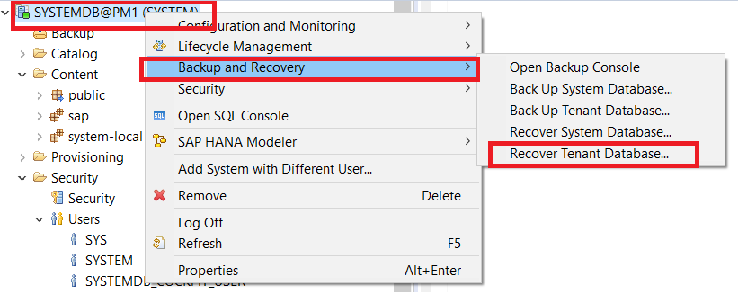
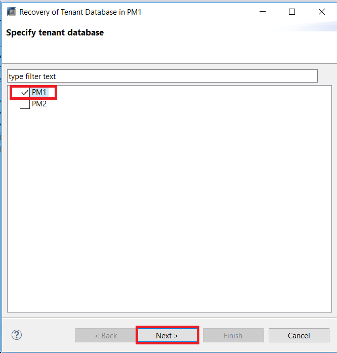
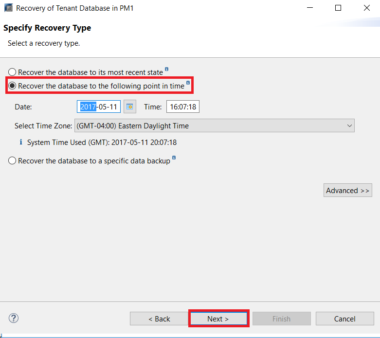
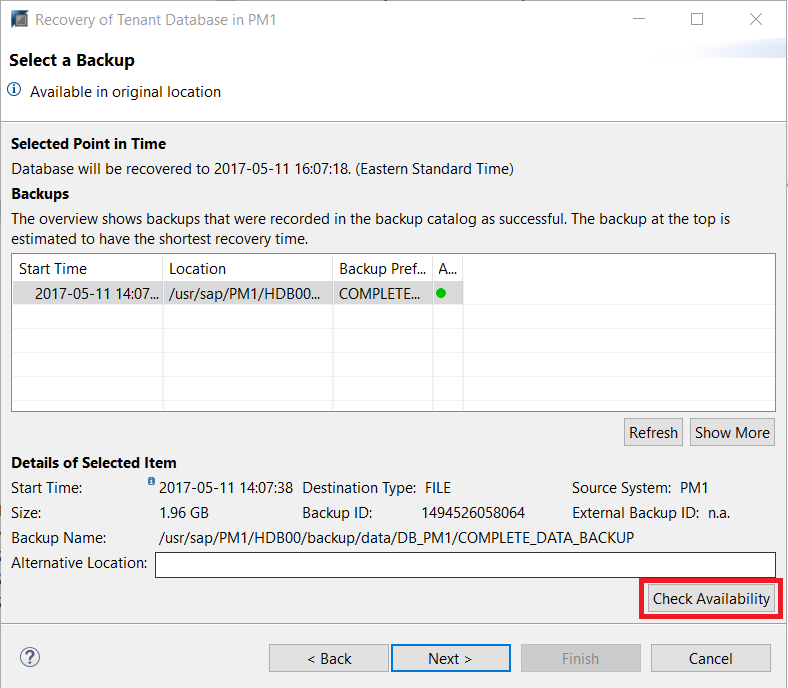
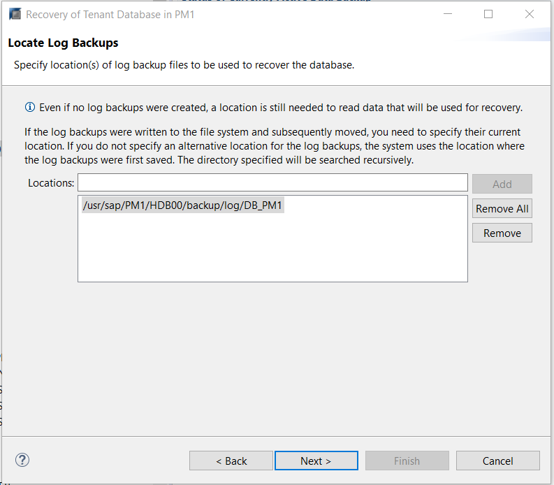
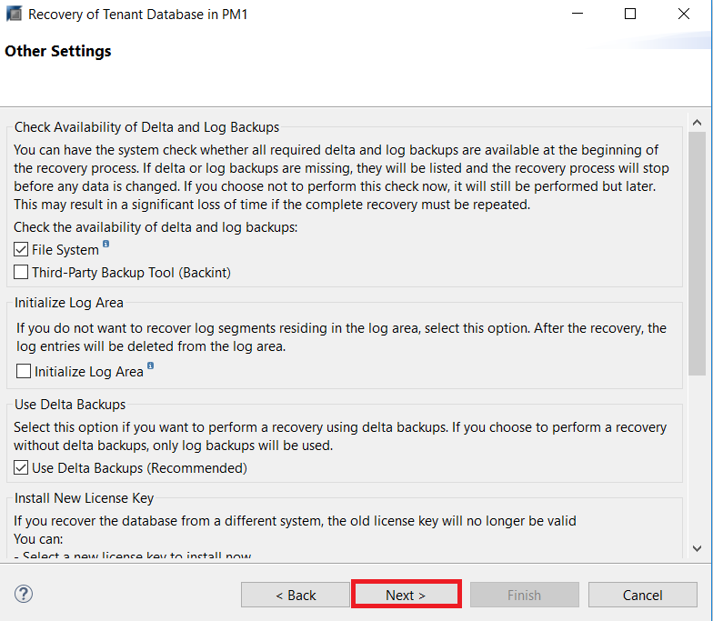
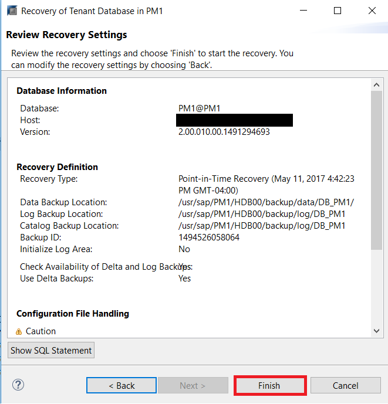
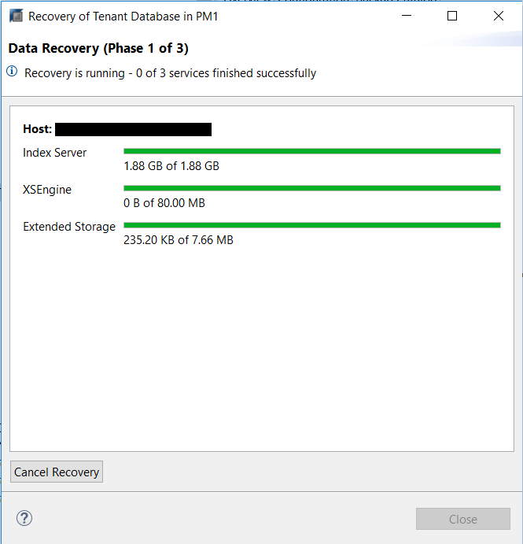

## Prerequisites
 - **Proficiency:** Beginner
 - **Tutorials** [Creating Database Backups](https://developers.sap.com/tutorials/dt-backup-recovery-part2.html)
 - **Credentials:** Have access to the SYSTEM user of  `SystemDB` and "`<SID>adm`" for a SSH session on the HANA hosts.

## Next Steps
  - **Tutorials** [Reviewing Available Backups](https://developers.sap.com/tutorials/dt-backup-recovery-part4.html)

## Details
### You will learn
- How to choose which type of recovery to perform
- How to select backup location and prefixes

### Time to Complete
**15 Min**

---

[ACCORDION-BEGIN [Step 1: ](Recovering Your Database)]
Database recovery can be done either from a command line or from HANA Studio. The preferred way is via HANA Studio.

From the SAP HANA Administrative Console perspective, right click on the System Database in the Systems panel with the `SYSTEM` user, hover over "**Backup and Recovery**" in the pop up menu and select "**Recover Tenant Database...**" Similar to backing up Tenant Databases, recovering Tenant Databases must also be done through the System Database.

> Note: You can similarly select "**Recover System Database...**" to recover your System Database instead.

If this is your first time performing a database recovery, HANA Studio will prompt you for the user credentials of the `<sid>adm` Linux user. After, the HANA System will prompt you to confirm stopping the database.

Once you click OK, HANA will start to prepare the recovery wizard.

When the Recovery Wizard is ready, you will be prompted to specify your Tenant system. Check the one you wish to recover and click **Next**

Next, you will be prompted to choose the type of recovery. For the purpose of this lesson, we will be choosing to recover the database to a desired point in time. Select "**Recover the database to the following point in time.**" and then click "**Next**"

Ensure that the backup directory you will be recovering from is correct. After, click "**Next**"

> Note: The default is shown directory is shown, which you can leave unmodified. This directory also needs to match the location chosen when creating the backup.

The backups created before the chosen time on the previous screen will appear in the recovery wizard and you can select what backup you want to recover your database to. Click the "**Check Availability**" button on the bottom right to ensure that backup is active.

Select the desired backup and click "**Next**".

Ensure that the log backup directory is correct and click "**Next**" as below.

> Note: The default is shown directory is shown, which you can leave unmodified.

The follow settings below will now appear. You can leave the default settings and click "**Next**".

It will then present the "**Review Recovery Settings**" window. If the information matches what you've specified in the previous steps, then you can click "**Finish**" to run the recovery.

You can now view the recovery being performed for both Dynamic Tiering and the core HANA host.
> Note: To perform recovery, you should have the same or higher version of SAP HANA installed as the version used to create the BACKUP

Once the recovery process completes, the Recovery Execution Summary screen will be displayed.

[ACCORDION-END]

