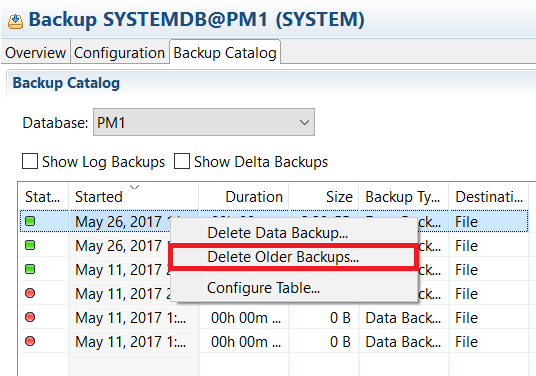

## Prerequisites
 - **Proficiency:** Beginner
 - **Tutorials** [Reviewing Available Backups](https://developers.sap.com/tutorials/dt-backup-recovery-part4.html)

## Next Steps
 - **Tutorials** [Creating and Recovering Delta Backups](https://developers.sap.com/tutorials/dt-backup-recovery-part6.html)

## Details
### You will learn
- Why managing backup files is important
- How to delete old HANA backup Files
- How to delete old Dynamic Tiering backup files

### Time to Complete
**15 Min**

---

[ACCORDION-BEGIN [Step 1: ](Introduction)]
Managing backups is also important. It will be your duty to make sure that the data backup location and log backup location do not run out of disk space. If the locations overflow, the log backup system will not write new log backups when attempted.

When the data backups and log backups are not properly managed, this will lead to the log volume becoming full, preventing any further backups from being created.

[ACCORDION-END]

[ACCORDION-BEGIN [Step 2: ](Deleting Old HANA Backup Files)]

In order to avoid running out of disk space for you log volume, you will need to delete older backups using HANA Studio.

Navigate to the backup editor for a system in your Systems Panel by right clicking the system, selecting **Backup and Recovery** > **Open Backup Console**.

After you reach the Backup Console, navigate to the backup catalog. You may right click on a backup in the backup editor and select "**Delete Older Backups...**"

> Note: For the purpose of this tutorial, we will be working from the `SystemDB`'s SYSTEM user.

When doing so, you will have the option to either delete just the catalog or to delete the catalog and the backup data. HANA will delete all data and log backups older than the backup ID corresponding to the backup choice.

> Note: The data and log backups for core HANA or Dynamic Tiering should not be deleted based on the timestamp. The older timestamp backups might still contain significant log backups. Hence deleting backups based on date would ruin the consistency of the system. Therefore, it is better to investigate which are the necessary data and log backups to be kept for Dynamic Tiering or core HANA.

[ACCORDION-END]
