# Create a Cloud Foundry or XS Advanced App that Queries SAP HANA
<!-- description --> Create a Node.js app that queries SAP HANA and can be run in Cloud Foundry or XS Advanced.

## Prerequisites
 - You have completed the first 4 tutorials in this mission

## You will learn
  - How to use the command line interface (CLI) to deploy a Node.js app to Cloud Foundry or XS advanced
  - How to view the logs and enable tracing in the deployed app
  - How to connect from a Node.js app running in Cloud Foundry to an on-premise SAP HANA instance through the Cloud Connector

## Intro
In the previous tutorials, applications that queried SAP HANA were run on a local machine.  In this tutorial, a simple application will be run within the SAP BTP which uses Cloud Foundry or within the SAP HANA, express edition which uses XS advanced (and is also based on Cloud Foundry).  

For additional details, consult  [The XS Advanced Programming Model](https://help.sap.com/viewer/4505d0bdaf4948449b7f7379d24d0f0d/latest/en-US/df19a03dc07e4ba19db4e0006c1da429.html).  For a more complete example, see the Node.js topics in week 3 of [Software Development on SAP HANA](https://open.sap.com/courses/hana7).

---

### Get started with the Command Line Interface (CLI)


The command line interface (CLI) for Cloud Foundry is named `cf` while the CLI used for apps running in SAP HANA, express edition is named `xs`.

1. Check to see if you have the CLI installed and verify the version.  

    ```Shell
    cf -v
    ```

      


    To install the CLI, see [Installing the CLI](https://tutorials.cloudfoundry.org/trycf/docs/cli/) and [Installing the cf CLI](https://docs.cloudfoundry.org/cf-cli/install-go-cli.html). After installing, add the `Cloud Foundry` folder to the path.

    >If a different version of CLI is installed, for instance version 7, then use `cf7 -v` instead of `cf -v`. Check the `Cloud Foundry` installation folder to find the CLI version.

    ```Shell
    xs -v
    ```

      

    The installer for xs can be downloaded from [SAP Software Downloads](https://launchpad.support.sap.com/#/softwarecenter/support/index) under **SAP HANA PLATFORM EDITION | SAP HANA PLATFORM EDITION 2.0 | XS RUNTIME 1**.

2. Access help by running the following:

    ```Shell
    cf help
    cf help login
    ```

    ```Shell
    xs help
    xs help login
    ```

3. Log in to the Cloud Foundry or XS advanced.

    ```Shell
    cf login
    ```

    

    >If you are an SAP employee, you may need to enter your password followed by a two-factor authentication passcode.

    The API URL, if requested, can be found in the [SAP BTP cockpit](https://account.hanatrial.ondemand.com/trial/).

      
    .

    ```Shell
    xs login
    ```

    

    The API URL, if requested, can be verified in the XSA is up app.

    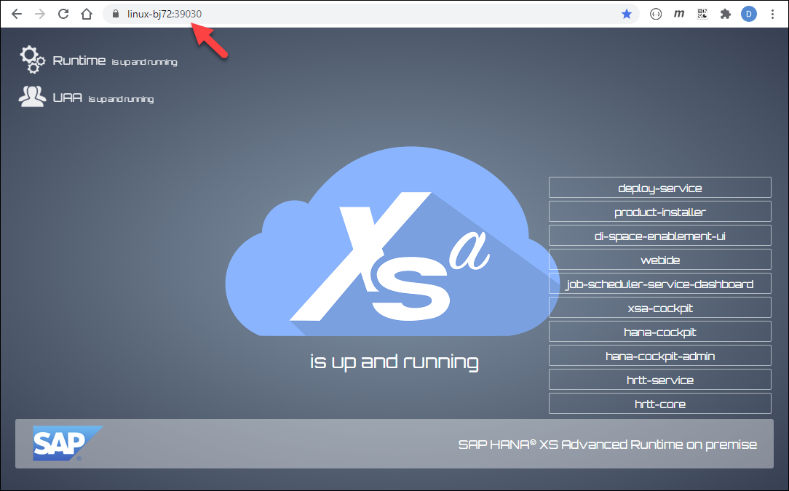

4. Additional examples are shown below to view the target information, running services, and deployed apps.

    ```Shell
    cf target
    cf services
    cf apps
    cf buildpacks
    ```

    ```Shell
    xs target
    xs services
    xs apps
    xs buildpacks
    ```

      

    Additional details can be found at [Getting Started with the cf CLI](https://docs.cloudfoundry.org/cf-cli/getting-started.html) and [Get Started with the XS CLI Client](https://help.sap.com/viewer/4505d0bdaf4948449b7f7379d24d0f0d/latest/en-US/c00ed3f74c12479e9f3a8cdeb6e1519a.html).    


### Create Node.js app that queries SAP HANA


1.  Create a folder named `nodeCF\nodeQueryCF` and enter the newly created directory.

    ```Shell (Microsoft Windows)
    mkdir %HOMEPATH%\HANAClientsTutorial\nodeCF\nodeQueryCF
    cd %HOMEPATH%\HANAClientsTutorial\nodeCF\nodeQueryCF
    ```

    ```Shell (Linux or Mac)
    mkdir $HOME/HANAClientsTutorial/nodeCF/nodeQueryCF
    cd $HOME/HANAClientsTutorial/nodeCF/nodeQueryCF
    ```

2.  Initialize the project, install [express](https://www.npmjs.com/package/express), and `@sap/hana-client` from NPM.

    ```Shell
    npm init -y
    npm install express
    npm install @sap/hana-client
    ```

3.  Open a file named `server.js` in an editor.

    ```Shell (Microsoft Windows)
    notepad server.js
    ```

    ```Shell (Linux or Mac)
    pico server.js
    ```

4. Add the code below to `server.js`.  

    ```JavaScript    
    var express = require('express');
    var hana = require('@sap/hana-client');
    var app = express();

    app.get('/', function (req, res) {
        res.send('Hello World');
    })

    app.get('/Customers', function (req, res) {
        var connOptions = {
            serverNode: 'XXXXXX.hana.trial-XXXXX.hanacloud.ondemand.com:443',
            //serverNode: 'linux-bj72:39015',
            UID: 'USER1',
            PWD: 'Password1'
            //traceFile: 'stdout',
            //traceOptions: 'sql=warning'
        };

      var connection = hana.createConnection();
      connection.connect(connOptions, function(err) {
          if (err) {
              return console.error(err);
          }
          var sql = 'select * from HOTEL.CUSTOMER;';
          var rows = connection.exec(sql, function(err, rows) {
              if (err) {
                  return console.error(err);
              }
              console.log(rows);
              res.send(rows);
              connection.disconnect(function(err) {
                  if (err) {
                      return console.error(err);
                  }   
              });
          });
      });
    })

    const port = process.env.PORT || 3000;
    var server = app.listen(port, function () {
        var host = server.address().address
        var port = server.address().port
        console.log("Example app listening at http://%s:%s", host, port)
    })
    ```

    Update the values for host and port.  


5. Run and test the app locally.

    ```Shell
    node server.js
    ```

    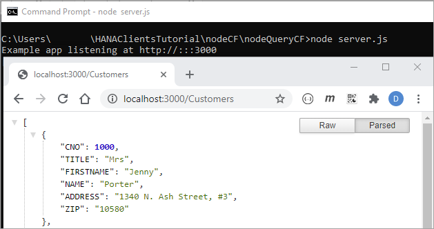


### Deploy and test in SAP BTP or XS Advanced


1. Create a deployment descriptor.

    ```Shell (Microsoft Windows)
    cd ..
    notepad manifest.yml
    ```

    ```Shell (Linux or Mac)
    cd ..
    pico manifest.yml
    ```    

    Add the code below to `manifest.yml`.

    ```yml
    ---
    applications:
    - name: nodeQueryCF
      random-route: true
      type: nodejs
      path: nodeQueryCF
      command: node server.js
      memory: 128M
    ```

    For additional details, consult [App Manifest Attribute Reference](https://docs.cloudfoundry.org/devguide/deploy-apps/manifest-attributes.html).

2. Deploy the app to Cloud Foundry or XS advanced.
   
    Before deploying the app to Cloud Foundry, ensure that you have the **Cloud Foundry Runtime Environment** entitlement enabled for your subaccount. You can find the Entitlements page in the left-hand side menu of SAP BTP Cockpit. 
    
    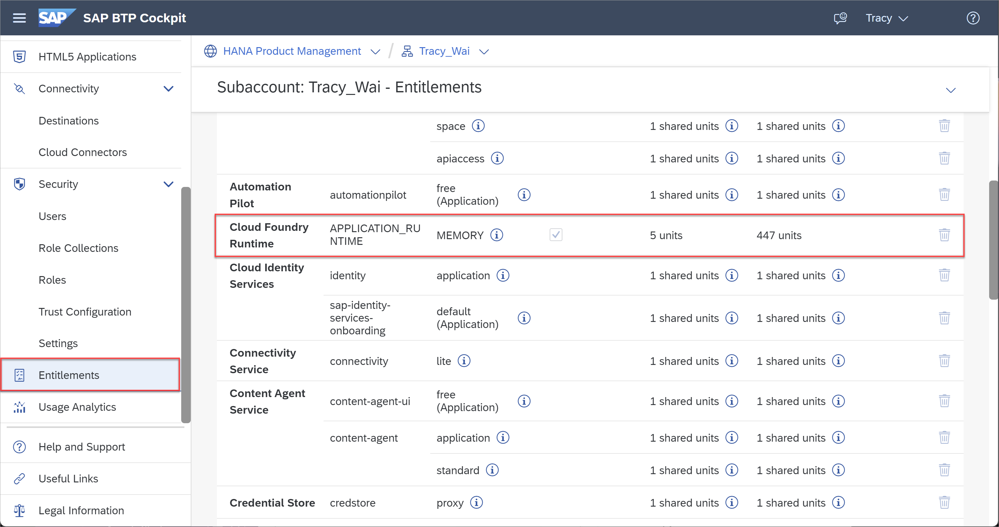  
    
    If necessary, you can add the entitlement by clicking **Configure Entitlements** > **Add Service Plans** > **Cloud Foundry Runtime**. Then select the `MEMORY` plan. Don't forget to save your changes when finished. 
    
    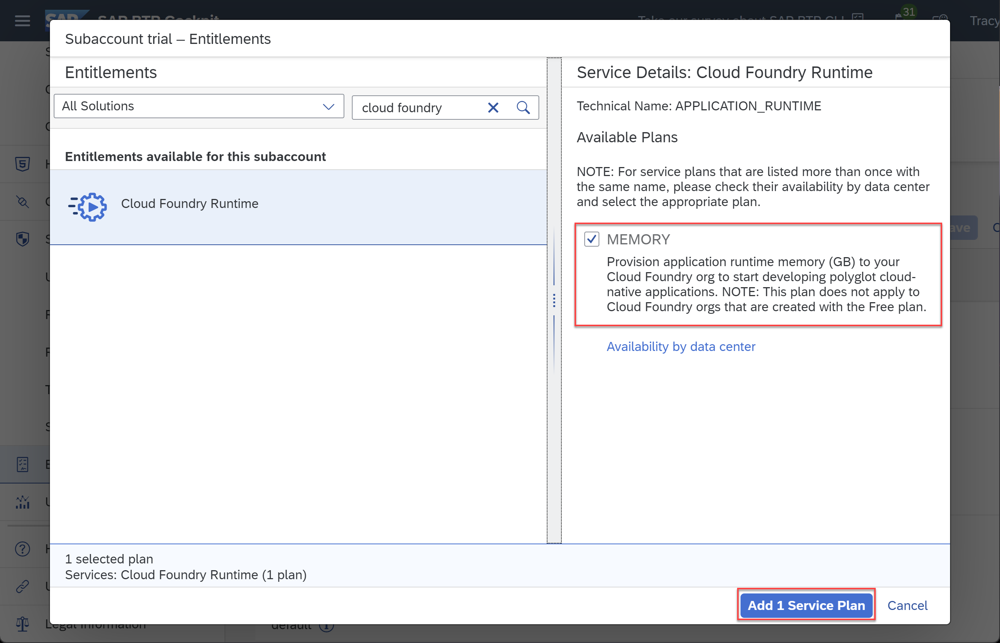

    After verifying that you have the necessary entitlements, run the following:

    ```Shell
    cf push
    ```

    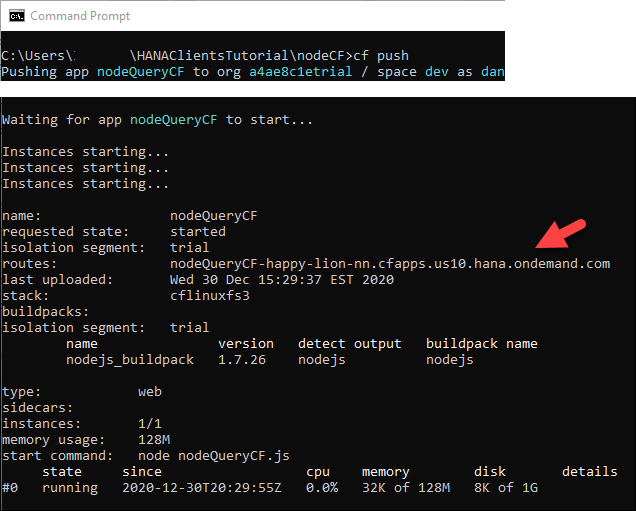

    Notice above the URL to open the app was generated as the `manifest.yml` contained the random-route setting.

    ```Shell
    xs push
    ```
    
    

    Alternatively, the URL of the app can be found by running the following command:

    ```Shell
    cf app nodeQueryCF
    ```

    ```Shell
    xs app nodeQueryCF
    ```

3.  Test the app.  

    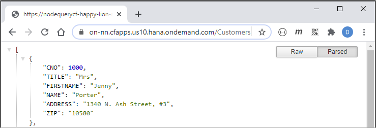  
    .

    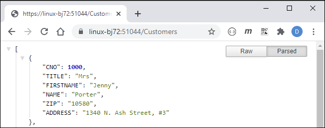


For additional details see:

[Developing Node.js in the Cloud Foundry Environment](https://help.sap.com/viewer/65de2977205c403bbc107264b8eccf4b/Cloud/en-US/3a7a0bece0d044eca59495965d8a0237.html)

[Tutorial: Setting up your JavaScript Application in XS Advanced](https://help.sap.com/viewer/4505d0bdaf4948449b7f7379d24d0f0d/latest/en-US/30d629eab05d41b9b853d417bdb2fc08.html)


### Additional commands


1.  The app can be stopped and started with the below commands:

    ```Shell
    cf stop nodeQueryCF
    cf start nodeQueryCF
    ```

2.  The applications lifecycle events can be seen with the below command:

    ```Shell
    cf events nodeQueryCF
    ```

    

3.  The logs of the application can be seen with the below command:

    ```Shell
    cf logs --recent nodeQueryCF
    ```

    The following command will show the tail of the log.

    ```Shell
    cf logs nodeQueryCF
    ```

4.  As of version 2.7, the SAP HANA client interfaces can output trace information to `stdout` or `stderr`.

    ```Shell
    cf set-env nodeQueryCF HDB_SQLDBC_TRACEFILE stdout
    cf set-env nodeQueryCF HDB_SQLDBC_TRACEOPTS SQL=WARN
    cf restage nodeQueryCF
    cf env nodeQueryCF
    cf logs nodeQueryCF
    ```
    > Alternatively, the trace settings can be specified in the application code.

    Refresh the browser and notice that the trace information can now be seen.

    

5.  The deployed app can also be managed in the associated cockpit.

    SAP BTP Cockpit  

    

    Details of the application `nodeQueryCF`

    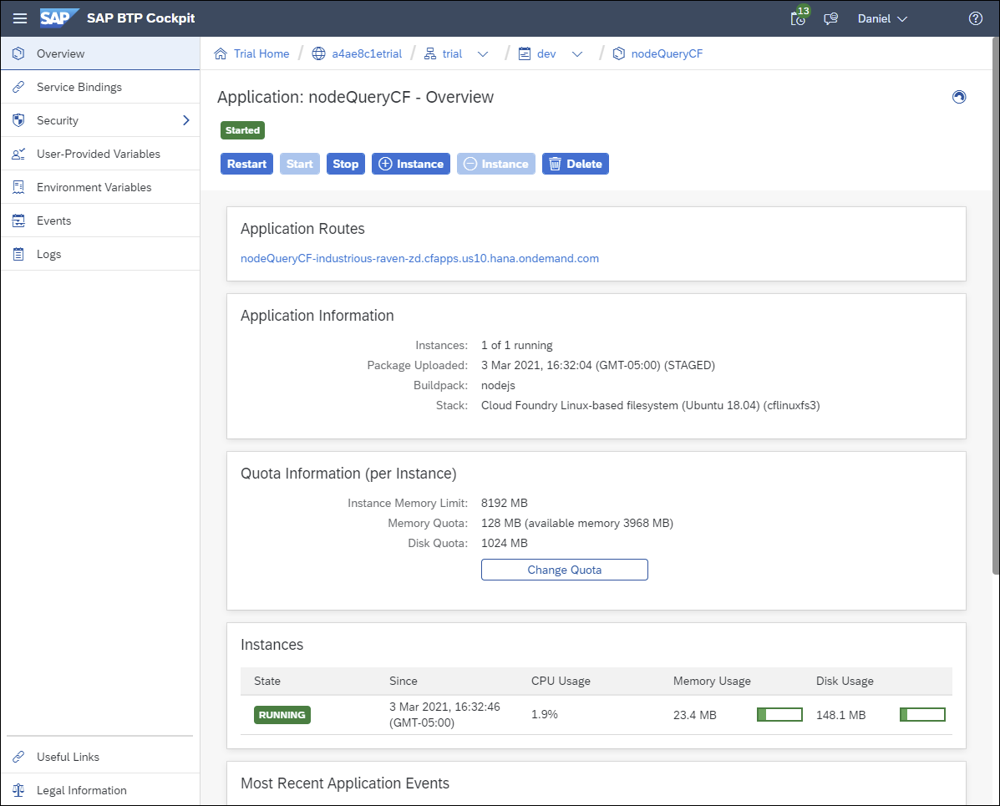

    SAP HANA XS Advanced Cockpit

    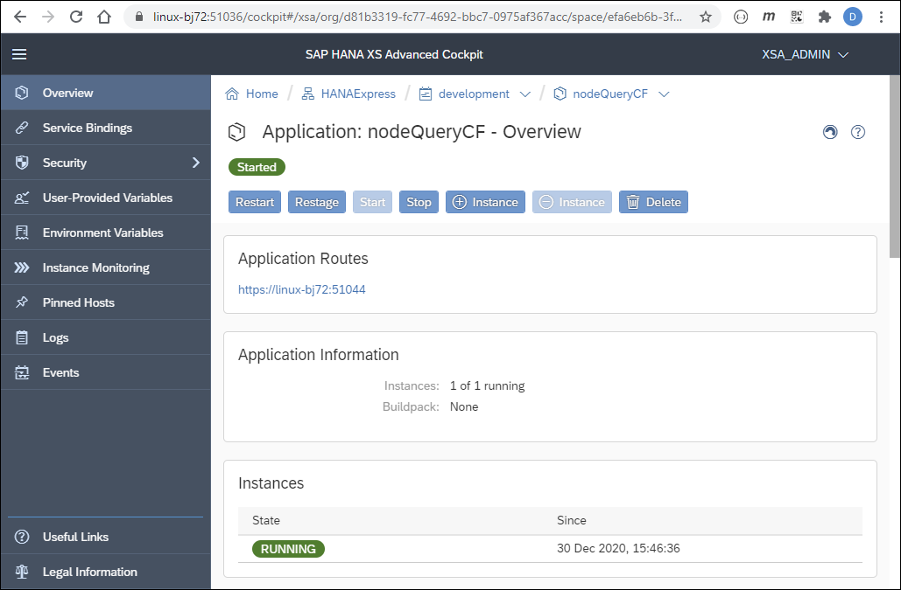

    Note that the number of running instances can be [scaled](https://docs.cloudfoundry.org/devguide/deploy-apps/cf-scale.html) if needed.


### Connect from the Node.js app running in the cloud to an on-premise database (optional)


The [Cloud Connector](https://help.sap.com/viewer/cca91383641e40ffbe03bdc78f00f681/Cloud/en-US/e6c7616abb5710148cfcf3e75d96d596.html#loioe6c7616abb5710148cfcf3e75d96d596__context) enables communication from the SAP BTP running in the public internet to securely connect to a configured on-premise system such as SAP HANA, express edition.  The following steps demonstrate how to do this with the previously deployed app `nodeQueryCF`.

1. Follow step 3 at [Access Remote Sources with SAP HANA Database Explorer](hana-dbx-remote-sources) to install and configure the Cloud Connector.

2. In the project created in step 2, perform the following steps to bind a connectivity service instance to the application.

    * Navigate to **Service Bindings** and choose **Bind Service**.

        

    * Add the **Connectivity** service.

        

    * Provide an instance name such as `MyConnectivityService`.

        

    * Examine the values of the connectivity service.  In particular, the indicated values below are used for the `proxyPort` and `proxyHostname` values in the server.js file and will be to access the proxy service which enables communication with the cloud connector.

        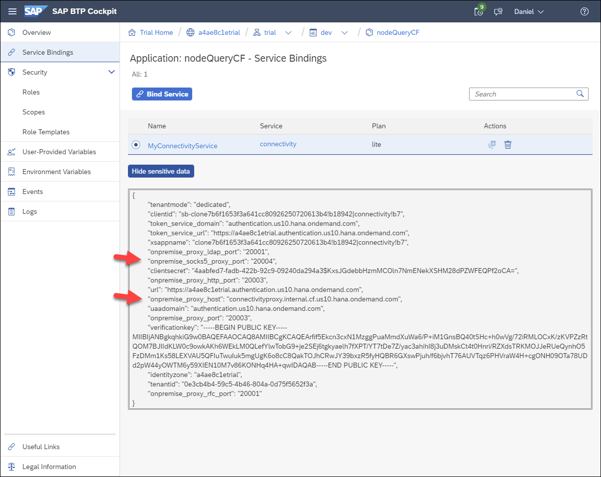

3. Add the service name to the project's manifest.yml.

    ```Shell (Microsoft Windows)
    cd %HOMEPATH%\HANAClientsTutorial\nodeCF
    notepad manifest.yml
    ```

    ```Shell (Linux or Mac)
    cd $HOME/HANAClientsTutorial/nodeCF
    pico manifest.yml
    ```

    ```yml
      services:
      - MyConnectivityService
    ```

4. Make a backup of the server.js file and add the node module `axios` which is promise based HTTP client and is used to fetch a JWT token.  For further details see [SAP Cloud Platform: How to call – on-Premise System – from Node.js app – via Cloud Connector](https://blogs.sap.com/2020/08/07/sap-cloud-platform-how-to-call-onprem-system-from-node.js-app-via-cloud-connector).

    ```Shell (Microsoft Windows)
    cd nodeQueryCF
    copy server.js server.js.bak
    npm install axios
    ```

    ```Shell (Linux or Mac)
    cd nodeQueryCF
    cp server.js server.js.bak
    npm install axios
    ```

5. Open the file named `server.js` in an editor and replace its contents.

    ```Shell (Microsoft Windows)
    notepad server.js
    ```

    ```Shell (Linux or Mac)
    pico server.js
    ```

    ```JavaScript
    var axios = require('axios');
    var express = require('express');
    var hana = require('@sap/hana-client');
    var app = express();

    const VCAP_SERVICES = JSON.parse(process.env.VCAP_SERVICES);
    const conSrvCred = VCAP_SERVICES.connectivity[0].credentials;

    app.get('/', function (req, res) {
        res.send('Hello World');
    })

    app.get('/Customers', async function (req, res) {
        const connJwtToken = await _fetchJwtToken(conSrvCred.token_service_url, conSrvCred.clientid, conSrvCred.clientsecret);

        var connOptions = {
            serverNode: 'v-linux-bj72:39015', // Virtual host specified in the Cloud Connector
            proxyUsername: connJwtToken,
            proxyPort: conSrvCred.onpremise_socks5_proxy_port,
            proxyHostname: conSrvCred.onpremise_proxy_host,
            //proxyScpAccount: 'myLocID',  // Cloud Connector's location ID if specified in the Cloud Connector
                                           // A location ID is used when multiple Cloud Connectors are connected to the same subaccount
            UID: 'USER1',
            PWD: 'Password1'
            //traceFile: 'stdout',
            //traceOptions: 'sql=warning'
        };

        var connection = hana.createConnection();
        connection.connect(connOptions, function(err) {
            if (err) {
                return console.error(err);
            }
            var sql = 'select * from HOTEL.CUSTOMER;';
            var rows = connection.exec(sql, function(err, rows) {
                if (err) {
                    return console.error(err);
                }
                console.log(rows);
                res.send(rows);
                connection.disconnect(function(err) {
                    if (err) {
                        return console.error(err);
                    }   
                });
            });
        });
    })

    const port = process.env.PORT || 3000;
    var server = app.listen(port, function () {
         var host = server.address().address
         var port = server.address().port
         console.log("Example app listening at http://%s:%s", host, port)
    })

    const _fetchJwtToken = async function(oauthUrl, oauthClient, oauthSecret) {
    	return new Promise ((resolve, reject) => {
    		const tokenUrl = oauthUrl + '/oauth/token?grant_type=client_credentials&response_type=token'  
            const config = {
    			headers: {
    			   Authorization: "Basic " + Buffer.from(oauthClient + ':' + oauthSecret).toString("base64")
    			}
            }
    		axios.get(tokenUrl, config)
            .then(response => {
    		   resolve(response.data.access_token)
            })
            .catch(error => {
    		   reject(error)
            })
    	})   
    }

    ```

6. Redeploy the app.

    ```Shell
    cd ..
    cf push
    ```

7.  The application running in the cloud, is now accessing data from an on-premise SAP HANA, express instance.

    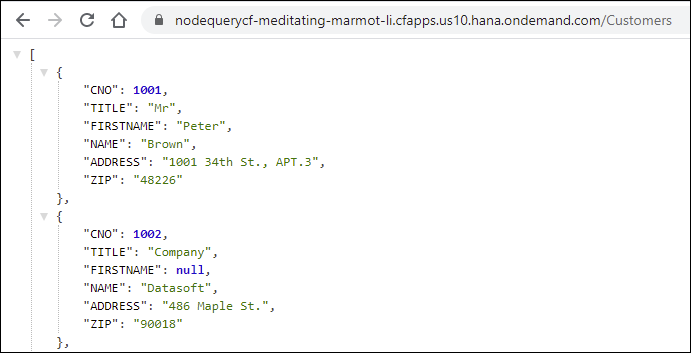

### Knowledge check

Congratulations, you have built, deployed and run an app that queries SAP HANA in Cloud Foundry and XS advanced as well as become familiar with the command line interface.


---
