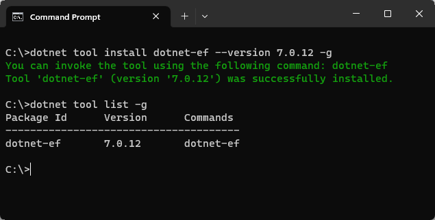
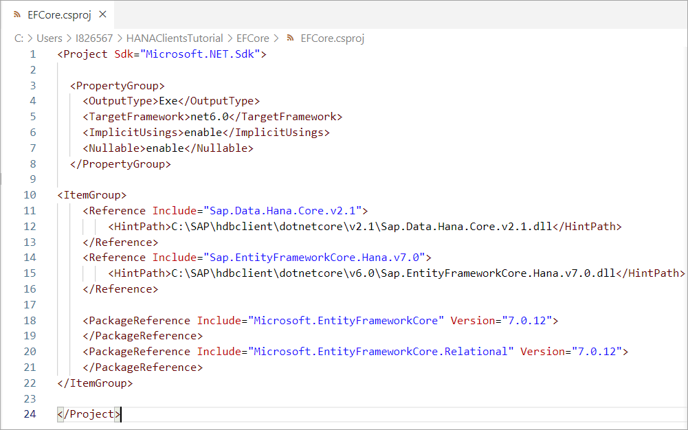
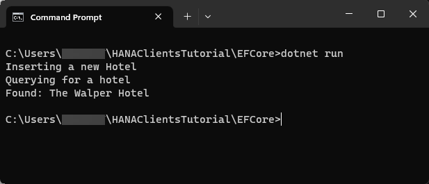
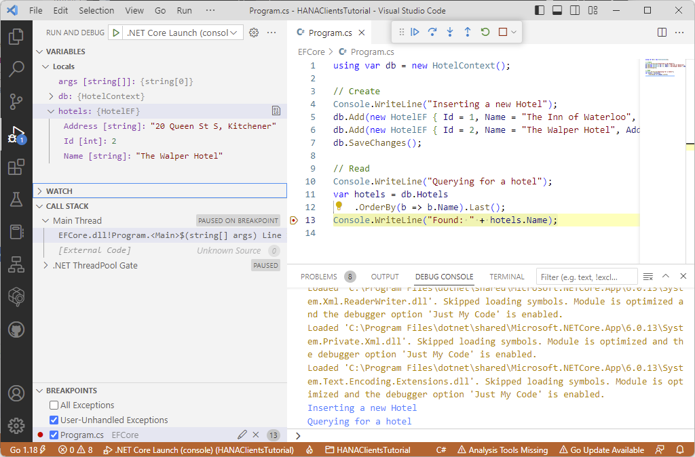

# Connect Using the Microsoft Entity Framework Core (EF Core)
<!-- description --> Create and debug an EF Core application that connects to SAP HANA.

## Prerequisites
 - You have completed the first 3 tutorials in this mission
 - You have completed the 8th tutorial on .NET in this mission

## You will learn
  - How to install the .NET Core EF CLI
  - How to create and debug an EF Core application that queries an SAP HANA database

## Intro
[.NET](https://en.wikipedia.org/wiki/.NET_Core) is a free and open source software framework for Microsoft Windows, Linux and Mac operating systems and is the successor to the .NET Framework.  Entity Framework Core is a modern object-database mapper for .NET and can reduce data access code in an application.

---

### Install the .NET Core EF CLI
The `dotnet` tool command can be used to install and manage tools that extend .NET.  The following are a few examples that can be run to show help, to list the local and globally installed tools, to uninstall `dotnet-ef` if an incompatible version is installed, and to search the repository for version details of the `dotnet-ef` tool.

```
dotnet tool -?
dotnet tool list -?
dotnet tool list
dotnet tool list -g
dotnet tool uninstall dotnet-ef -g
dotnet tool search dotnet-ef --detail
```

The SAP HANA Client 2.17 release supports EF Core 6.0 & 7.0.  For a list versions and support dates see [EF Core releases and planning](https://learn.microsoft.com/en-us/ef/core/what-is-new/) and SAP Note [3165810 - SAP HANA Client Supported Platforms](https://launchpad.support.sap.com/#/notes/3165810).

Run the following command to install version 6 of the dotnet-ef tool.

```Shell
dotnet tool install dotnet-ef --version 6.0.14 -g
dotnet tool list -g
```  




### Create a .NET Core EF application that queries an SAP HANA database

1.  Create a new console app with the below commands:

    ```Shell (Microsoft Windows)
    cd %HOMEPATH%/HANAClientsTutorial
    dotnet new console -o EFCore
    ```  

    ```Shell (Linux or Mac)
    cd $HOME/HANAClientsTutorial
    dotnet new console -o EFCore
    ```

2.  Open the `dotNET.csproj` file:

    ```Shell (Microsoft Windows)
    cd EFCore
    notepad EFCore.csproj
    ```

    ```Shell (Linux or Mac)
    cd EFCore
    pico EFCore.csproj
    ```

    Add the following below the `PropertyGroup` section (within the `Project` section) to indicate where to load the SAP HANA Client .NET and entity driver from.  Modify the `HintPath` section with the information about where the dlls are located on your machine.

    ```Shell (Microsoft Windows)
    <ItemGroup>
        <Reference Include="Sap.Data.Hana.Core.v2.1">
            <HintPath>C:\SAP\hdbclient\dotnetcore\v2.1\Sap.Data.Hana.Core.v2.1.dll</HintPath>
        </Reference>
        <Reference Include="Sap.EntityFrameworkCore.Hana.v6.0">
            <HintPath>C:\SAP\hdbclient\dotnetcore\v6.0\Sap.EntityFrameworkCore.Hana.v6.0.dll</HintPath>
        </Reference>

        <PackageReference Include="Microsoft.EntityFrameworkCore" Version="6.0.14">
        </PackageReference>  
        <PackageReference Include="Microsoft.EntityFrameworkCore.Relational" Version="6.0.14">
        </PackageReference>
    </ItemGroup>
    ```

    ```Shell (Linux or Mac)
    <ItemGroup>
        <Reference Include="Sap.Data.Hana.Core.v2.1">
            <HintPath>/home/dan/sap/hdbclient/dotnetcore/v2.1/Sap.Data.Hana.Core.v2.1.dll</HintPath>
        </Reference>
        <Reference Include="Sap.EntityFrameworkCore.Hana.v6.0">
            <HintPath>/home/dan/sap/hdbclient/dotnetcore/v6.0/Sap.EntityFrameworkCore.Hana.v6.0.dll</HintPath>
        </Reference>

        <PackageReference Include="Microsoft.EntityFrameworkCore" Version="6.0.14">
        </PackageReference>  
        <PackageReference Include="Microsoft.EntityFrameworkCore.Relational" Version="6.0.14">
        </PackageReference>
    </ItemGroup>
    ```
    

    Once the `dotNet.csproj` file has been updated, save, and close the file.    

3.  Run the app to validate that SAP HANA DLLs can be loaded:

    ```Shell
    dotnet run
    ```
    The expected output is `Hello, World!`.

    >If a warning occurs mentioning that a reference could not be resolved, revisit the `EFCore.csproj` file and double check that the hintpath is correct.

4. Open an editor and create a file named `HotelModel.cs`.

    ```Shell (Windows)
    notepad HotelModel.cs
    ```

    ```Shell (Linux or Mac)
    pico HotelModel.cs
    ```

5. Copy the below code into `HotelModel.cs` with the code below:  

    ```C#
    using Microsoft.EntityFrameworkCore;
    using Sap.EntityFrameworkCore.Hana;

    public class HotelContext : DbContext
    {
        public DbSet<HotelEF> Hotels { get; set; }

        public HotelContext()
        {
            var folder = Environment.SpecialFolder.LocalApplicationData;
            var path = Environment.GetFolderPath(folder);

            Database.EnsureDeleted();
            Database.EnsureCreated();
        }

        protected override void OnConfiguring(DbContextOptionsBuilder options) {
            options.UseHana("Server=xxxxxxxx-xxxx-xxxx-xxxx-xxxxxxxx.hana.prod-xxxx.hanacloud.ondemand.com:443;UserName=User2;Password=Password2");
        }
    }

    public class HotelEF
    {
        public int Id { get; set; } = 0;
        public string Name { get; set; } = string.Empty;
        public string Address { get; set; } = string.Empty;
    }
    ```

    Be sure to update the host URL and optionally the user name and password.  Note that calls to EnsureDeleted and EnsureCreated will delete and recreate the objects in the schema USER2. As documented at [RelationalDatabaseCreator.EnsureDeleted Method](https://learn.microsoft.com/en-us/dotnet/api/microsoft.entityframeworkcore.storage.relationaldatabasecreator.ensuredeleted) it will delete all objects in the schema USER2.

6.  Open an editor to edit the file `Program.cs`.

    ```Shell (Windows)
    notepad Program.cs
    ```

    ```Shell (Linux or Mac)
    pico Program.cs
    ```

7.  Replace the entire contents of `Program.cs` with the code below. Save and close the file when finished.

    ```C#
    using var db = new HotelContext();

    // Create
    Console.WriteLine("Inserting a new Hotel");
    db.Add(new HotelEF { Id = 1, Name = "The Inn of Waterloo", Address = "475 King St N, Waterloo" });
    db.Add(new HotelEF { Id = 2, Name = "The Walper Hotel", Address = "20 Queen St S, Kitchener" });
    db.SaveChanges();

    // Read
    Console.WriteLine("Querying for a hotel");
    var hotels = db.Hotels
        .OrderBy(b => b.Name).Last();
    Console.WriteLine("Found: " + hotels.Name);
    ```

    Save and close the `Program.cs` file after replacing the code.

    Further details on SAP HANA Client entity core driver can be found at [Entity Framework Core Support](https://help.sap.com/docs/SAP_HANA_CLIENT/f1b440ded6144a54ada97ff95dac7adf/3e6ef454ffc94cda8fefb0acf5be007b.html).  Further .NET API details can be found in the [.NET API browser](https://learn.microsoft.com/en-us/dotnet/api/?view=efcore-6.0).

8.  Run the app:

    ```Shell
    dotnet run
    ```
    >Before running the program make sure to be in the directory where Program.cs is saved

    


### Debug the application


1. Open Visual Studio Code. If needed, download the application [here](https://code.visualstudio.com/Download).

2. If you have not already done so, choose **File | Add Folder to Workspace**, and then add the `HANAClientsTutorial` folder.

    

3. Open the file `Program.cs` and set a breakpoint.

4. Select **Run | Start Debugging | .NET Core**.  A configuration will be added.  Choose **Run | Start Debugging**.

    Notice that the debug view becomes active and that the RUN option is .NET Launch.

    Notice that the program stops running at the breakpoint that was set.

    Observe the variable values in the leftmost pane.  Step through code.

      

    For further information on debugging .NET apps consult [Tutorial: Debug a .NET Core console application using Visual Studio Code](https://docs.microsoft.com/en-us/dotnet/core/tutorials/debugging-with-visual-studio-code) and [Instructions for setting up the .NET Core debugger](https://github.com/OmniSharp/omnisharp-vscode/blob/master/debugger.md).

### Knowledge check

Congratulations! You have now created and debugged a .NET application that connects to and queries an SAP HANA database.  


---
