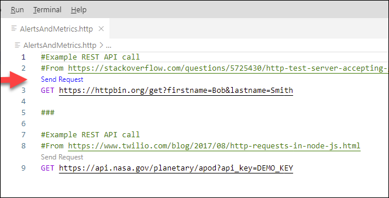
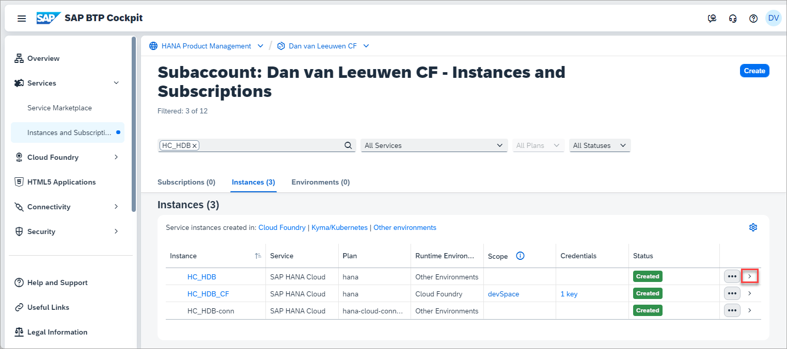
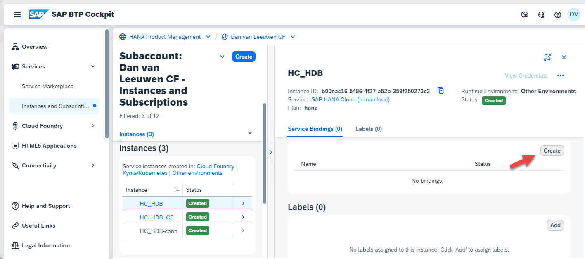
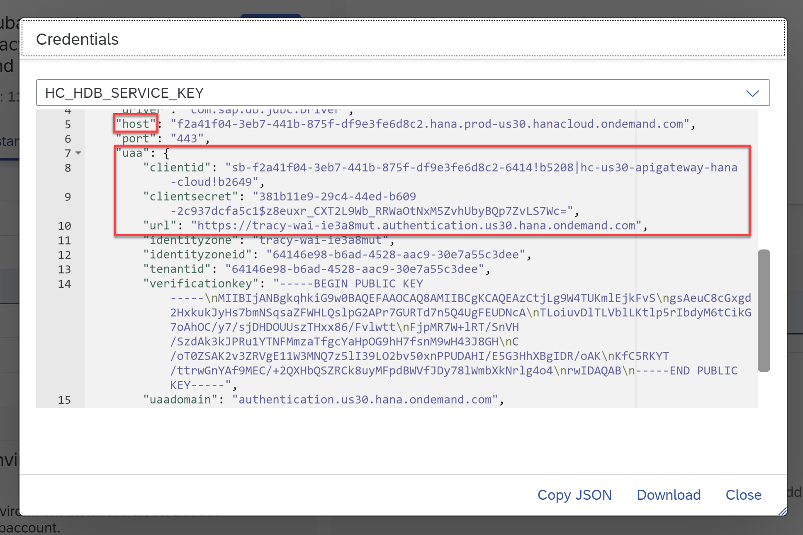
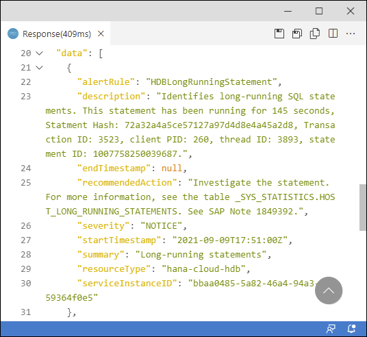
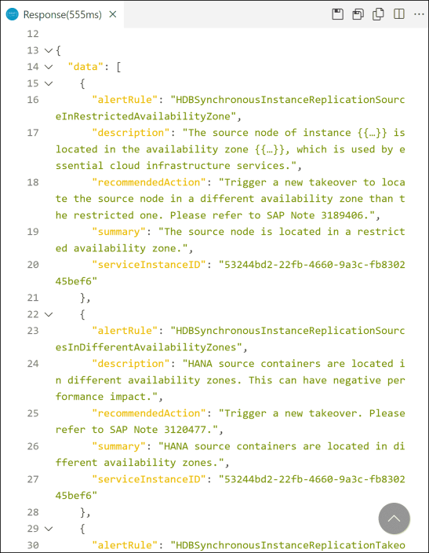
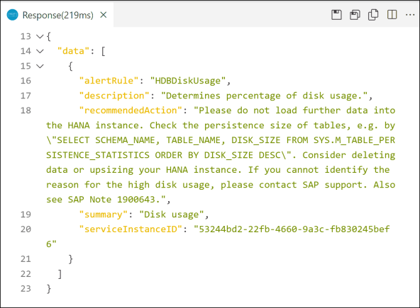
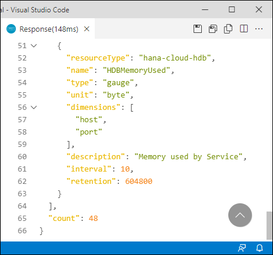

# Access SAP HANA Cloud Alerts and Metrics using a REST API
Learn how to access details of triggered alerts, as well as how to access the list of available database metrics and values of a specified metric using a REST API.

## Prerequisites
 - Access to an SAP HANA Cloud trial or production instance with a version of 2021 QRC 3 or higher.
 - A tool such as the REST Client extension for Visual Studio Code enabling the calling of a REST API.

## You will learn
  - An overview of alerts and metrics
  - How to use the REST API to access alerts and metrics

## Intro
Alerts can inform you of potential issues that should be addressed or investigated.  Metrics provide measurements for a given time or interval that can aid in troubleshooting or root-cause analysis of issues.  As an example, after receiving an alert of type `HDBLongRunningStatement`, a follow up step may be to investigate metric values such as `HDBCPU` and `HDBMemoryUsed` in the period around the time that the alert occurred.

The REST API provides a simple and easy to consume method to enable access to alerts and metrics from applications.

---

### Get started with the REST Client extension for Visual Studio Code


There are multiple tools that enable making calls to a REST API such as Postman, browser extensions, libraries in programming languages such as [requests](https://realpython.com/api-integration-in-python/#rest-and-python-consuming-apis) in Python or [https](https://nodejs.org/api/https.html) in Node.js.  Feel free to use the tool of your choice.  This tutorial will be using the [REST Client](https://marketplace.visualstudio.com/items?itemName=humao.rest-client) extension for Visual Studio Code.

1. If required, download [Visual Studio Code](https://code.visualstudio.com/Download).


2. Create a folder and a text file that will contain REST API calls and open the file with Visual Studio Code.

    ```Shell (Microsoft Windows)
    mkdir %HOMEPATH%\AlertsAndMetricsTutorial
    cd %HOMEPATH%\AlertsAndMetricsTutorial
    code AlertsAndMetrics.http
    ```

3. Paste the following into the opened file and save it.

    ```HTTP
    #Example REST API call
    #From https://stackoverflow.com/questions/5725430/http-test-server-accepting-get-post-requests and
    GET https://httpbin.org/get?firstname=Bob&lastname=Smith

    ###

    #Example REST API call
    #From https://www.twilio.com/blog/2017/08/http-requests-in-node-js.html
    GET https://api.nasa.gov/planetary/apod?api_key=DEMO_KEY

    ###

    #Pet Store
    #From https://petstore.swagger.io/#/pet/findPetsByStatus
    GET https://petstore.swagger.io/v2/pet/findByStatus?status=available

    ###
    ```

    >The # is used as a single line comment character and ### is used to separate REST API calls.

4. Add the REST Client extension from Marketplace after opening the extensions view.

    

5. Try calling the sample REST APIs by clicking on the blue text `Send Request`.  

    

    The results should appear in another pane.  An example result is shown below.

    

    Notice that the URL includes the URL parameters `firstname` and `lastname`.  The first parameter is indicated with a `?`, while the subsequent parameters are indicated by an `&`.


### Request a bearer token to enable access to the REST APIs

The following steps are required to create a bearer token that will be used in subsequent steps that make REST API calls to access alerts and metrics.  The bearer token is generated by a login request and can be understood as "give access to the bearer of this token".  Additional details can be found at [User Account and Authorization Service](https://docs.cloudfoundry.org/api/uaa/version/75.7.0/index.html#token) for Cloud Foundry.

1. In the SAP BTP Cockpit, navigate to the **Instances** section, select your SAP HANA Cloud, SAP HANA database instance.

    

    Create a service binding if one does not exist.

    

    When creating a service key, a JSON file or parameters section is not needed and can be left empty.

2. View the created service key.  The next step will require the `host`, `uaa.url`, `clientid`, and `clientsecret` values.

    

3. Replace the contents of AlertsAndMetrics.http file with the contents below.  Highlighted values are to be updated with details from your service key.

    ```HTTP[4, 9, 12, 15, ]
    #REST Client variables -------------------

    #From first part of host.  Example shown below
    @serviceInstance = f2a41f04-3eb7-441b-875f-df9e3fe6d8c2

    @oauth = oauth/token?grant_type=client_credentials

    #From the uaa.url field.  Example value shown below
    @uaa_url = https://tracy-wai-ie3a8mut.authentication.us30.hana.ondemand.com

    #From the clientid field.  Example value shown below.
    @clientid = sb-f2a41f04-3eb7-441b-875f-df9e3fe6d8c2-6414!b5208|hc-us30-apigateway-hana-cloud!b2649

    #From the clientsecret field.  Example value shown below.
    @clientsecret = 381b11e9-29c4-44ed-b609-2c937dcfa5c1$z8euxr_CXT2L9Wb_RRWaOtNxM5ZvhUbyBQp7ZvLS7Wc=

    #Provides start and end timestamps for alerts or metrics using REST Client plugin's dynamic variables
    @startTSAlerts  = {{$datetime iso8601 -4 d}}
    @endTSAlerts    = {{$datetime iso8601 -3 d}}
    @startTSMetrics = {{$datetime iso8601 -2 h}}
    @endTSMetrics   = {{$datetime iso8601 -1 h}}

    #Generated by the request bearer token call.  Copy the access_token value from the result without the quotes
    @bearer =

    #Authorization REST API call --------------------

    #Request Bearer Token
    GET {{uaa_url}}/{{oauth}}
    Authorization: Basic {{clientid}}:{{clientsecret}}

    ###
    ```

4. Execute the Request Bearer Token call using the Send Request link.  Copy the returned `access_token` value to the **bearer** variable on line 24 of the file AlertsAndMetrics.http.

    


### Retrieve triggered alerts


The following instructions will show a few examples of how to view the list of triggered SAP HANA Cloud, SAP HANA database alerts.  If there are no alerts returned, visit the [Alerts in SAP HANA Database and Data Lake](hana-cloud-alerts) tutorial to see examples of how to generate a few alerts, including a test alert.

1. Add the following variables to the end of the REST Client variables section of the `AlertsAndMetrics.http` file. Update the highlighted value from your service key.

    ```HTTP[4]
    @gateway_url = https://api.gateway.orchestration

    #From host, part after instanceID.hana
    @host = prod-us30.hanacloud.ondemand.com
    ```

2. Add the following calls to the bottom of the `AlertsAndMetrics.http` file after the line with ###.

    ```HTTP
    #Alerts REST API calls --------------------------

    #Get the triggered alerts (events) for a specific instance
    GET {{gateway_url}}.{{host}}/alerts/v1/serviceInstances/{{serviceInstance}}/events?alertState=All&severity=NOTICE,WARNING,ERROR
    Authorization: Bearer {{bearer}}

    ###

    #Get the triggered alerts (events) for a specific instance for a specific time period such as 4 days ago
    #The data is kept only for a certain duration, such as 7 days
    GET {{gateway_url}}.{{host}}/alerts/v1/serviceInstances/{{serviceInstance}}/events?alertState=All&severity=NOTICE,WARNING,ERROR&startTimestamp={{startTSAlerts}}&endTimestamp={{endTSAlerts}}
    Authorization: Bearer {{bearer}}


    ###
    ```

    > Alert data is only persisted for a fixed amount of time after the current date such as 7 days.

    > ---

    > The `endTimestamp` is optional.

3. Try out the events calls.

    

    For additional details on the alerts REST API, see [APIs for Alerts](https://help.sap.com/viewer/f9c5015e72e04fffa14d7d4f7267d897/latest/en-US/81d5c960888741cc8875ab225c540f0a.html).

4. Available alert rules can also be accessed with the REST API. Add the following content to `AlertsAndMetrics.http` above the `#Authorization REST API call` line.

    ```HTTP
    #A specific alert rule
    @alertRule = HDBDiskUsage
    ```

5. Add the following calls to the bottom of the REST API calls section of the `AlertsAndMetrics.http` file after the last line with ###.

    ```HTTP
    #Get the list of alerts (rules) for a specific instance
    GET {{gateway_url}}.{{host}}/alerts/v1/serviceInstances/{{serviceInstance}}/rules
    Authorization: Bearer {{bearer}}

    ###

    #Get the alert rules for a specific alert rule and for a specific instance
    GET {{gateway_url}}.{{host}}/alerts/v1/serviceInstances/{{serviceInstance}}/rules/{{alertRule}}
    Authorization: Bearer {{bearer}}

    ###
    ```

6. Try out the alert rules calls. The first call will return a list of all alert rules.

    

    The second call will return only the information for the `HDBDiskUsage` alert rule.

    

    For additional details on the alerts REST API, see [APIs for Alerts](https://help.sap.com/docs/HANA_CLOUD_DATABASE/f9c5015e72e04fffa14d7d4f7267d897/81d5c960888741cc8875ab225c540f0a.html) and [SAP HANA Cloud Service Database Events](https://help.sap.com/docs/ALERT_NOTIFICATION/5967a369d4b74f7a9c2b91f5df8e6ab6/6f75804854254aa59f0faf399688f467.html).  


### Access database metrics


The following instructions will show a few examples of how to view metrics through a REST API in SAP HANA Cloud, SAP HANA database.

1. Add the following calls to the bottom of the REST API calls section of the `AlertsAndMetrics.http` file after the last line with ###.

    ```HTTP
    #Metrics REST API calls -------------------------

    #Get the list of the available metrics (definitions)
    GET {{gateway_url}}.{{host}}/metrics/v1/serviceInstances/{{serviceInstance}}/definitions
    Authorization: Bearer {{bearer}}

    ###    

    #Get the metric HDBMemoryUsed (values)
    GET {{gateway_url}}.{{host}}/metrics/v1/serviceInstances/{{serviceInstance}}/values?names=HDBMemoryUsed
    Authorization: Bearer {{bearer}}

    ###

    #Get the metric HDBMemoryUsed (values) for a specific time range, such as 2 hours ago
    GET {{gateway_url}}.{{host}}/metrics/v1/serviceInstances/{{serviceInstance}}/values?names=HDBMemoryUsed&startTimestamp={{startTSMetrics}}&endTimestamp={{endTSMetrics}}
    Authorization: Bearer {{bearer}}

    ###
    ```

    > Metrics data is only persisted for a fixed amount of time after the current date such as 7 days.

    > ---

    > The `endTimestamp` is optional.

2. Try out the definitions call to get a list of the available metrics

    

    A few of the returned values are explained below:  

    * `resourceType` whose value is hana-cloud-hdb indicates that this entry applies to an SAP HANA Cloud, SAP HANA database.

    *  `type` can be a gauge such `HDBMemoryUsed`, or a delta such as `HDBCSUnloadCount`.  A
     gauge reflects the current value of a metric at a specific time while a delta represents a value within an interval.

    * `unit` such as %, ms (milliseconds), bytes, or an empty value for a count.

    * `interval` or frequency that the metric is collected.

    * `retention` time (7 days) is shown in seconds.  If a start and end time are not specified, the default is to return values from the last hour.

    * `count` is shown at the end of the JSON request.  In this case there were 48 metrics available.

3. Try out the values call to see the values for a specific metric.

    

    As seen above the memory used at 13:02 was approximately 4.98 GB.  Of note is that these metrics are recorded for multiple services.  In the above example port 30040 corresponds to the index server service.

    

    >Metrics can also be accessed via SQL queries.  For additional details see [`M_LOAD_HISTORY_SERVICE` System View](https://help.sap.com/viewer/c1d3f60099654ecfb3fe36ac93c121bb/latest/en-US/261022b7e22b4de9b04f931b78c4c6b4.html).  Note that when accessing metrics via SQL queries, the database must be accessible as the data is stored in the tenant database.  When accessing metrics via the REST API, the metrics data is stored outside of the tenant database.

    For additional details on the metrics REST API, see [APIs for Metrics](https://help.sap.com/viewer/f9c5015e72e04fffa14d7d4f7267d897/latest/en-US/c20295e8e76345da98f2c374a94bda3c.html) and [Overview of Available Metrics](https://help.sap.com/docs/HANA_CLOUD_DATABASE/f9c5015e72e04fffa14d7d4f7267d897/46e370ced3ef4d2bbd0ec2337df5f565.html).

### Knowledge check

Congratulations! You have now seen how to use a REST API to access alerts and metrics from an SAP HANA Cloud, SAP HANA database.


---
