# Create Users and Manage Roles and Privileges
<!-- description --> Learn how to create users and assign roles and privileges in SAP HANA Cloud, SAP HANA database SQL statements or the SAP HANA cockpit.

## Prerequisites
- You have access to [SAP HANA Cloud trial](hana-cloud-mission-trial-2) or [SAP HANA Cloud free tier](hana-cloud-mission-trial-2-ft), or a production environment of SAP HANA Cloud, SAP HANA database
- You have completed the tutorial to [provision an instance of SAP HANA Cloud, SAP HANA database](hana-cloud-mission-trial-3)
- You have completed the tutorial to [import data in SAP HANA Cloud, SAP HANA database](hana-cloud-mission-trial-5)


## You will learn
- The basics about the role-based security model in SAP HANA Cloud, SAP HANA database
- How to create users in SAP HANA cockpit
- How to assign roles in SAP HANA cockpit
- How to create users using SQL statements in SAP HANA database explorer
- How to assign roles and privileges using SQL statements in SAP HANA database explorer


## Intro
>
> 
>
> Reminder: This tutorial is part of a mission, in which you will help Alex, the CEO of Best Run Travel, to answer a concrete business question with SAP HANA Cloud, SAP HANA database.
>
> *Alex needs to know the top 5 partners of their agency and wants to find out the days with maximum booking of each partner.*

---

### Understand roles and privileges


SAP HANA Cloud, SAP HANA database defines user permissions and privileges using a **role-based security model**.

Roles and privileges can be granted to users or revoked from users. A role is a set of privileges that can, as a group, be assigned to a user. Then, as the role's privileges change, the user's privileges change accordingly. Roles can be broken down as follows:

-	**User-Defined Roles** are a custom collection, often created to group privileges and tasks
-	**System Roles** are built-in and automatically created with a new database

A privilege provides the ability to perform an operation on the system. A permission, on the other hand, is that ability in the given environment. A user may not have permission to perform a task if they have the privilege, but not on the currently acted on object. Privileges are broken down as follows:

-	**System privileges** give you the right to perform the action
-	**Object-level privileges** restrict your right to perform the action to the specified objects, on which the privilege is granted.

When a new object is created, the owner can be defined, otherwise, the creator becomes the owner. This gives privileges to modify the structure of the table and grant other privileges to other database users.

Ownership of a table is not sufficient to load the table with data. The user must also have `INSERT` permission on the table.


### Create users and roles and manage privileges


Before you add users to an instance, you should create user roles that fit your needs. You can leverage some of the default user roles, edit them, or create completely customized ones.

There are two ways of creating roles you need to know: You can create roles in the SQL console within HANA Cloud Central or SAP HANA database explorer.   Secondly, you can use the users and roles apps within SAP HANA Cloud Central or SAP HANA cockpit.

In this step, you can find instructions on both of these options. Click on **SQL Console** or **SAP HANA cockpit** under the headline of this step to select the option you prefer.

[OPTION BEGIN [SQL Console]]

**Create users and roles using the SQL console in HANA Cloud Central**

1.	Open SAP HANA Cloud Central. Then navigate to the **SQL console** tab.

    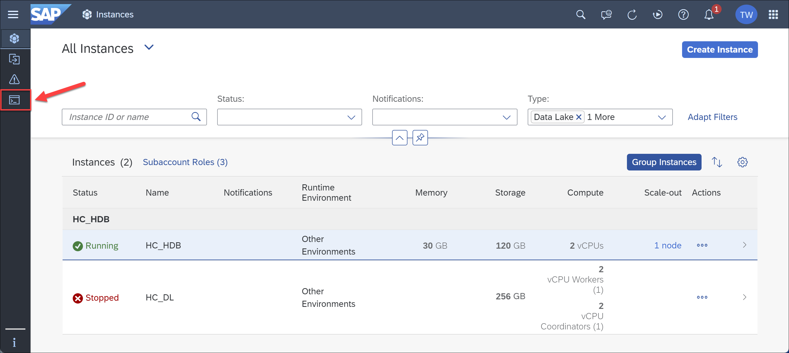

    >**Note:** You may optionally execute these steps using the SQL console in SAP HANA database explorer instead.

2.	To use the SQL console in HANA Cloud Central, you must first connect to a database instance. You can do so by clicking on the database icon in the top right corner. Select the name of your SAP HANA Cloud, SAP HANA database instance and uncheck the **Use cached credentials id possible** option.

    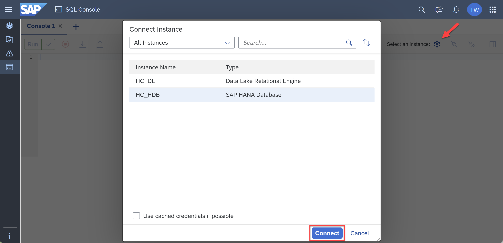

    Click **Connect**. You will be prompted to enter your database credentials. If you have yet to create a new user, use the default super user associated with your instance, `DBADMIN`, along with the password you set when you first provisioned the instance.  

    The SQL Console will appear and you will now be able to execute the necessary SQL statements for this tutorial.

    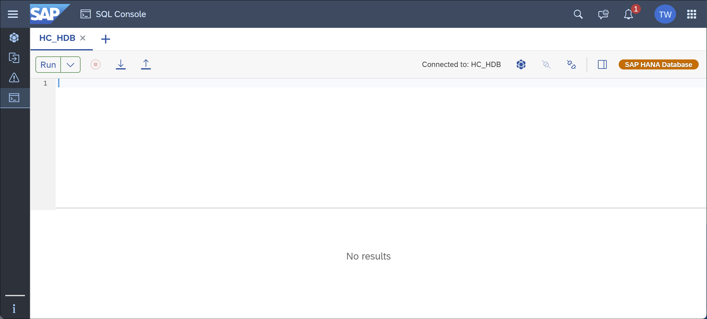

3.	Users can be created with this simplified statement. You can replace the contents inside the `<>` placeholders to set your desired credentials for your new user. The username must be unique in the database and the password must contain lower case, upper case, and a digit.

    ```
    CREATE USER <username> PASSWORD "<password>";
    ```

    > Please note that this statement is simplified for an easy start, and you have many more options to create the user the way you need it. For example, you can choose different authentication options, validity specifications, optional user parameter options, or specify users to be restricted.

    To avoid using the super-user `DBADMIN`, we will now create a new user `UPSGRANTOR`. This user will be used in a later tutorial when you create a user-provided service in SAP HANA Business Application Studio. Paste the following query and execute the statement.

    ```SQL
    -- Create a database user that should assign these privileges
    CREATE USER UPS_GRANTOR PASSWORD "Password1" NO FORCE_FIRST_PASSWORD_CHANGE SET USERGROUP DEFAULT;
    ```

4.	To grant this user roles and privileges, you can use the `GRANT` statement. To use this statement to grant a certain privilege, you must have the privilege and permissions required to grant this privilege.

    First create `genericRoleForOO` and `genericRoleForAP` roles. These are generic roles for an object owner (OO) and application user (AP), which will be later used in a later tutorial with SAP Business Application Studio.

    ```SQL
    -- Create SQL roles
    CREATE ROLE "genericRoleForOO";
    CREATE ROLE "genericRoleForAP";
    ```

    When granting roles to users, the statement needs to be adjusted as follows:

    ```
    GRANT <role_name> TO <user_name>;
    ```

5. To allow a user to grant a privilege to other users themselves, you need to add `WITH GRANT OPTION` to the end of the statement. For roles and system privileges, you need to add `WITH ADMIN OPTION` to the statement.

    Assign the newly created roles `SELECT` privileges on the SFLIGHT schema you previously imported from a previous tutorial. The object owner role `genericRoleForOO` will be assigned a grant option.

    The generic structure to grant privileges on a certain schema or object to a user is as follows:

    ```
    GRANT <privilege> ON <SCHEMA_or_OBJECT> <schema_or_object_name> TO <user_name>;
    ```

    Paste the following queries in a SQL console and execute the statements.
        
    ```SQL
    -- Assign privileges that these roles should grant
    GRANT SELECT ON SCHEMA SFLIGHT TO "genericRoleForOO" WITH GRANT OPTION;
    GRANT SELECT ON SCHEMA SFLIGHT TO "genericRoleForAP";
    -- Allow UPS_GRANTOR to grant the respective roles
    GRANT "genericRoleForOO" to UPS_GRANTOR WITH ADMIN OPTION;
    GRANT "genericRoleForAP" to UPS_GRANTOR WITH ADMIN OPTION;
    ```


> You can find all the details about syntax elements and all available privileges to grant in the technical documentation [here](https://help.sap.com/viewer/c1d3f60099654ecfb3fe36ac93c121bb/LATEST/en-US/20f674e1751910148a8b990d33efbdc5.html).

[OPTION END]
[OPTION BEGIN [SAP HANA cockpit]]

**Create users and roles in the users and roles apps**

1.	Within SAP HANA Cloud Central, select your instance by clicking on it.

    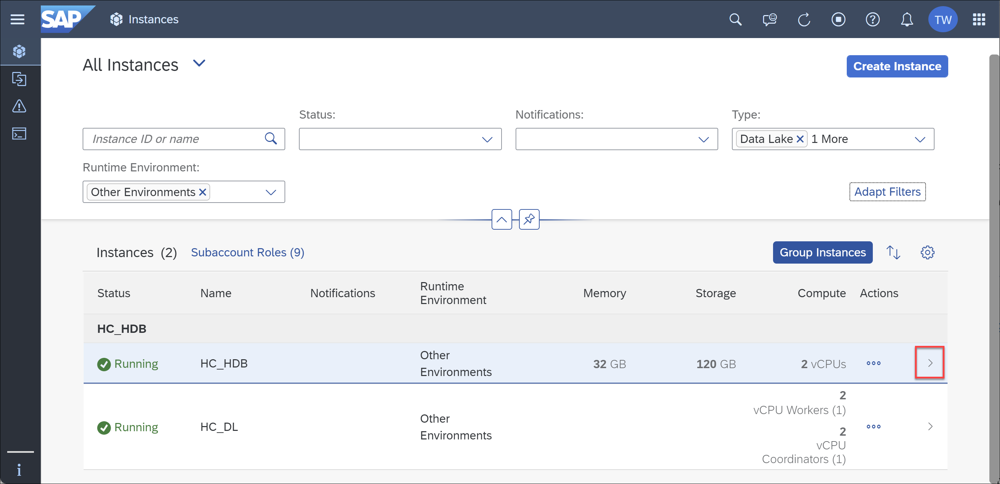

    If this is the first time you are opening the instance, you will need to insert the initial database username and the instance password.

    >You can optionally fulfill this tutorial by launching SAP HANA cockpit from the Actions menu.
    >
    >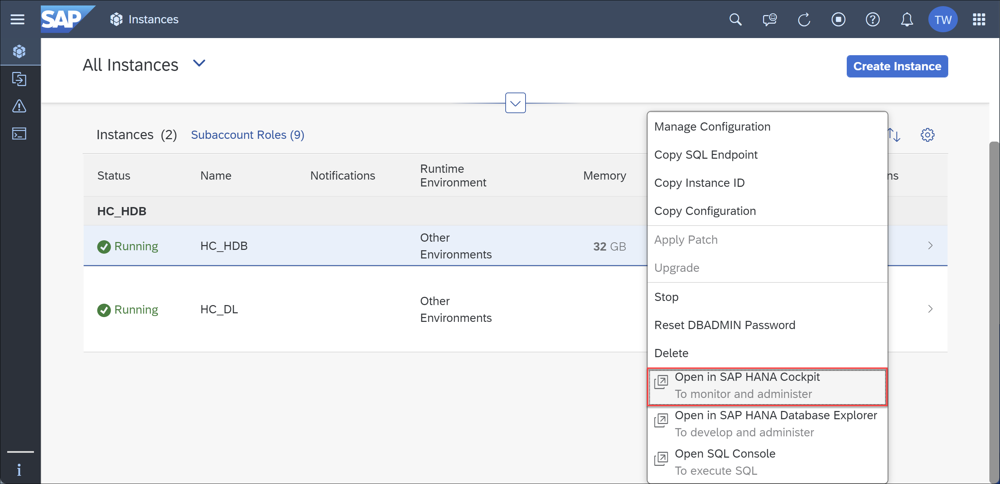
    >
    >**Security and User Management** can then be accessed by using the menu on the top left-hand side of the screen. There, you will have options to manage users and roles through the **User & Role Management** card.
    >
    >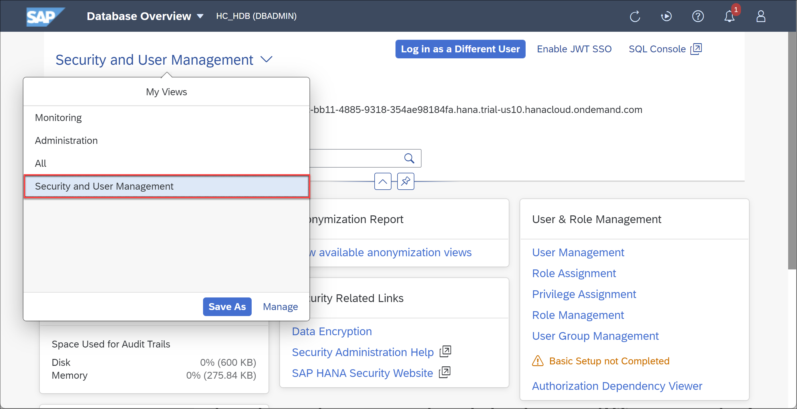

2.	For a better viewing experience, enter full screen mode by clicking on the full screen icon at the top-right corner of the screen, beside the `X` icon.

    Scroll to the **User & Authorization Management** card, then click on **Roles** to get started.

    

3.	You will be directed to the Role Management page, where you can see a list of all existing user roles as well as role groups. If you click on one of them, you will see the details of this role on the right-hand side of the screen. Clicking on one of the roles allows you to edit them, for example, you can assign System, Object and Analytic Privileges and more.

    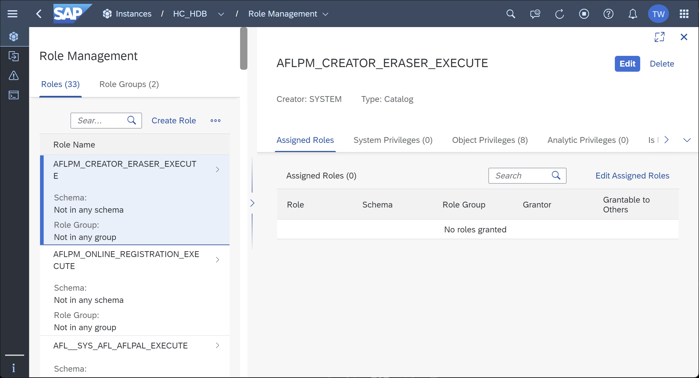

5.	To create a new user role, click on the **Create role** button.

    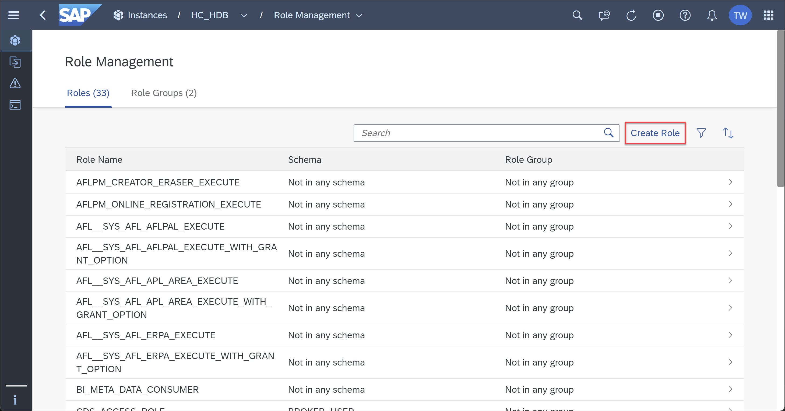

6.	This opens the role creation wizard on the right-hand side of the screen. First create a role named `genericRoleForOO`. Leave the rest of the settings as is. This role will be used in a later tutorial when you create a development project using SAP Business Application Studio.

    Click on **Create** at the bottom right corner of the screen.

    

7. Create another role named `genericRoleForAP`, which represents a generic role for an application user. Leave the rest of the settings as is. This role will be used in a later tutorial when you create a development project using SAP Business Application Studio.

    

8.	Now that you created the necessary roles, it's time to assign privileges to it. You have a few options here. You can add some of the existing roles into this one, combining the privileges into one single role. You can also select individual privileges, be it system, object, or analytic privileges. 

    For the `genericRoleForAP` user, go to the **Object Privileges** tab and select **Edit Object Privileges**, then **Add Object** at the top of the table.

    

    >For more technical details on creating roles and deciding on privileges, please see our technical documentation [here](https://help.sap.com/viewer/c82f8d6a84c147f8b78bf6416dae7290/LATEST/en-US/dec8d273bb571014b4c2b771d3e0f166.html).

9. Under **Object**, search for `SFLIGHT`. Select the result with Object Type **SCHEMA**.
    
    

    Press **Select** at the bottom-right corner. 

10.	Under **Select Privileges**, scroll to find **SELECT** and click on the checkbox. This will grant SELECT privileges to your user. 

    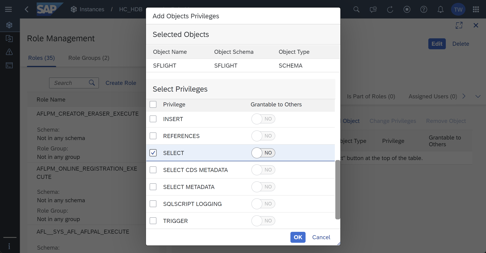

    Press **OK** when done. Then press **Save** to ensure that your changes are saved. 

11.	Repeat steps 8 - 9 for the `genericRoleForOO` role. When you reach the **Add Objects with Privileges** pop-up, scroll to `SELECT` and click the checkbox **and** enable the toggle under **Grantable to Others**.

    

    Don't forget to press **Save** when finished.

    *Your first big step is done! Now it's time to create individual users.*

12.	To get started, go back to SAP HANA cockpit view within HANA Cloud Central by clicking on the arrow icon in the top-left corner.

13.	Select **Users** under the Users & Authorization Management card.

    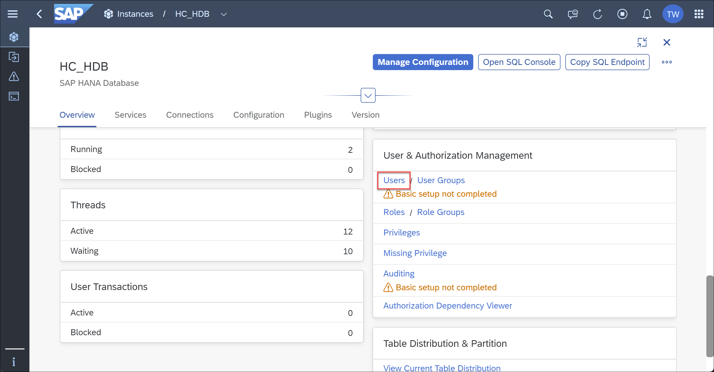

14.	This screen works just like the Role Management page, so click on the **Create User** to add a new user.

    

15.	Give the User Name `UPS_GRANTOR` and a Password of `Password1`. 

    

    After retyping the password to confirm it, select **No** under **Force Password Change on Next Logon**. Press **Save** when finished.

    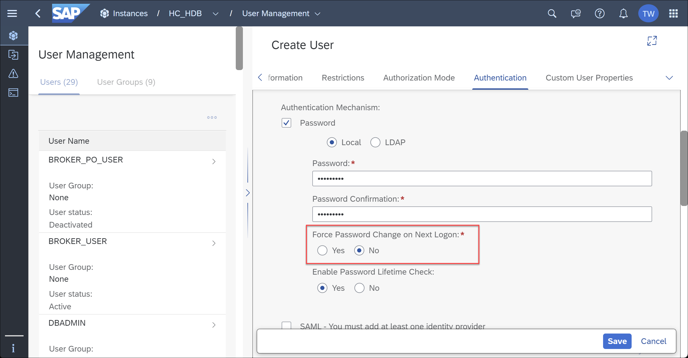

    >To know more about creating user and restricted users, visit the documentation [here](https://help.sap.com/viewer/9630e508caef4578b34db22014998dba/LATEST/en-US/b3db382e906646849e227156bd4e0c6e.html).

16.	Click on **Role Assignment** in the top-right corner.

    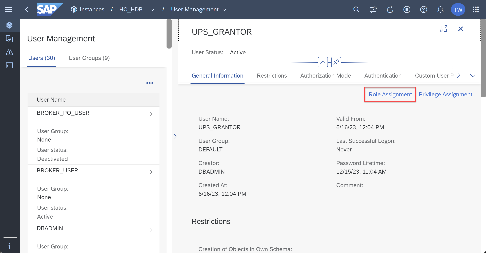


17. Click **Edit Assigned Roles**, then **Add**.

    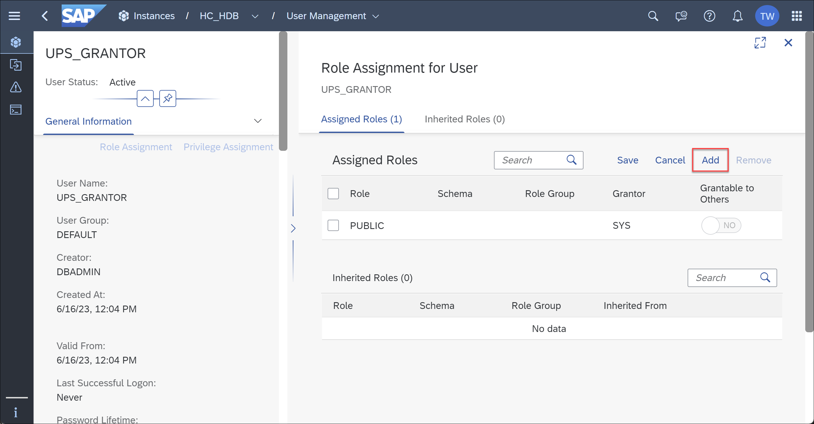

18. Search for `generic` and check the checkboxes both `genericRoleForAP` and `genericRoleForOO`. Press **Select** when done.

    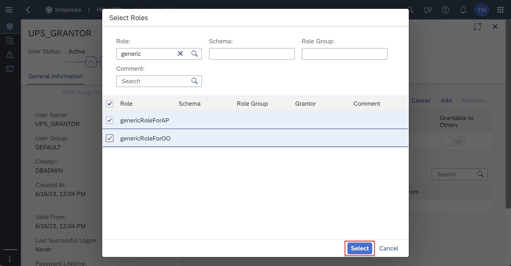

19. Under the **Grantable to Others** column, enable the toggles by clicking on them.
    
    

    Press **Save** at the top of the table when finished. 

>You can follow the steps on our technical documentation to create each user and make decisions about the roles, privileges and authorizations to give them: [Creating a Database User](https://help.sap.com/viewer/9630e508caef4578b34db22014998dba/LATEST/en-US/0c27278700ea47f9944db7f1b569e7dd.html).

[OPTION END]

Well done!

You have completed the fourth tutorial of this mission! Now you know how you can manage access rights in your instance by creating users, and granting roles and privileges using SAP HANA cockpit and the SAP HANA database explorer. You also have the necessary users, roles, and privileges to proceed with the [Create a Development Project in SAP Business Application Studio](hana-cloud-mission-trial-8) tutorial.

You now know all the basics to start working with our sample data and help Alex gain business insights about their company, **Best Run Travel**.


Learn in the next tutorial how to query the database using SQL statements. 


### Knowledge Check


---
