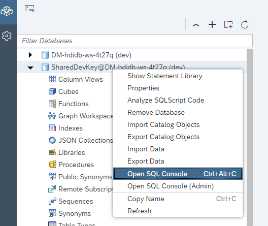
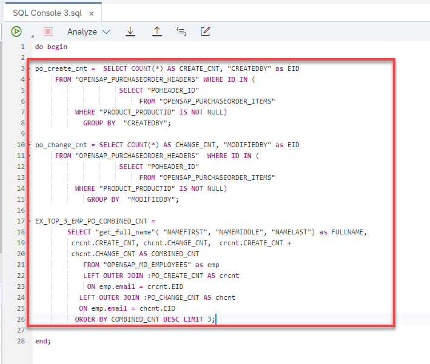
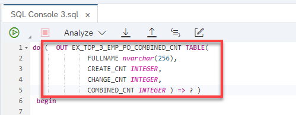
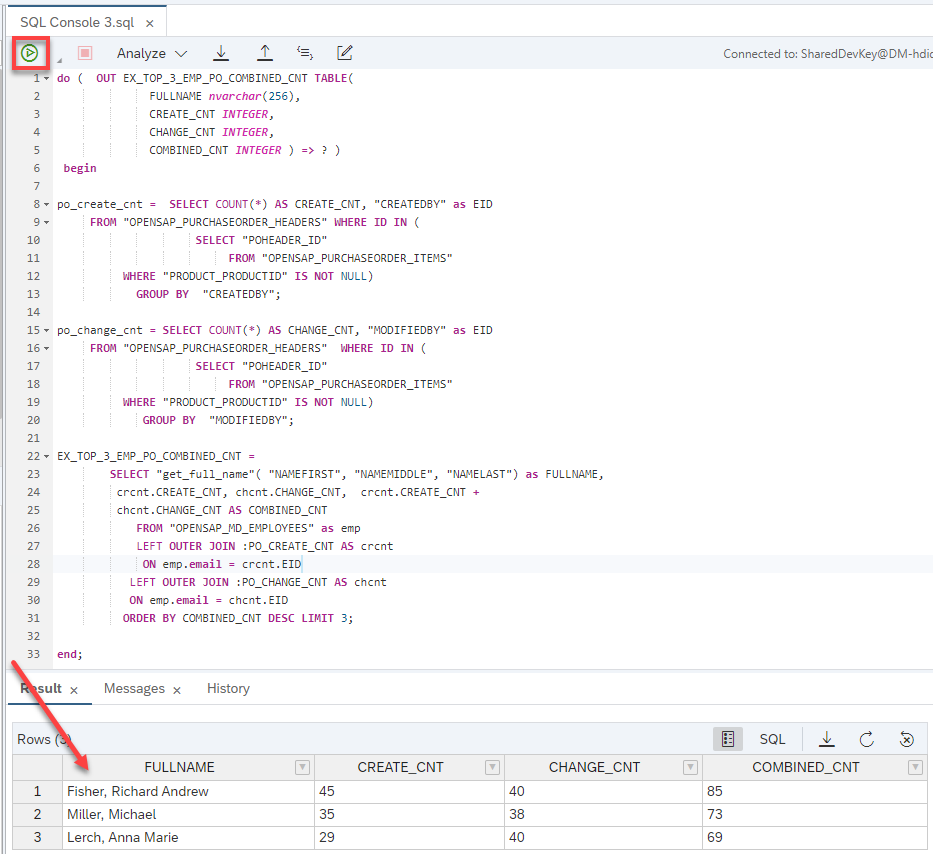

--- Checked and tested 1/24/2022

title: Anonymous Blocks
description: Leverage SQLScript in stored procedures, user-defined functions, and user-defined libraries.
author_name: Rich Heilman
author_profile: https://github.com/rich-heilman
primary_tag: products>sap-hana
tags: [  tutorial>intermediate, topic>sql, products>sap-hana, products>sap-hana-cloud, products>sap-business-application-studio]  
time: 15
---
## Prerequisites  
- This tutorial is designed for SAP HANA Cloud.
- **Tutorials:** [Creating SQLScript User Defined Libraries](hana-cloud-sqlscript-libraries)

## Details
### You will learn  
- How to invoke SQLScript logic without a persistent logic container  

In this exercise, we will show you how you can invoke SQLScript logic without the need to create a persistent logic container such as a procedure or function. Instead we will use so called anonymous blocks.

---

[ACCORDION-BEGIN [Step 1: ](Create Anonymous Block )]

1. From the Database Explorer page, open a new SQL Console, by right-clicking on the container, and choosing **Open SQL Console**.

    !

2. To have an anonymous block you need a do begin … end.  Enter the this code in the SQL tab.

    !

3. Copy the logic from the procedure `get_po_header_data` into the body.  Make sure to only copy the code between the BEGIN and END statements

    !

4. Copy the signature from the procedure `get_po_header_data` into the signature part of the anonymous block. Ensure the parameter is assigned to a query parameter placeholder (?) as shown.

    !

5. The completed code should look very similar to this.

    ```SQLCRIPT
    do (  OUT EX_TOP_3_EMP_PO_COMBINED_CNT TABLE(
                  FULLNAME nvarchar(256),
                  CREATE_CNT INTEGER,
                  CHANGE_CNT INTEGER,
                  COMBINED_CNT INTEGER ) => ? )
     begin

    po_create_cnt =  SELECT COUNT(*) AS CREATE_CNT, "CREATEDBY" as EID
         FROM "OPENSAP_PURCHASEORDER_HEADERS" WHERE ID IN (
                         SELECT "POHEADER_ID"
                              FROM "OPENSAP_PURCHASEORDER_ITEMS"
              WHERE "PRODUCT_PRODUCTID" IS NOT NULL)
                GROUP BY  "CREATEDBY";

    po_change_cnt = SELECT COUNT(*) AS CHANGE_CNT, "MODIFIEDBY" as EID
         FROM "OPENSAP_PURCHASEORDER_HEADERS"  WHERE ID IN (
                         SELECT "POHEADER_ID"
                              FROM "OPENSAP_PURCHASEORDER_ITEMS"
              WHERE "PRODUCT_PRODUCTID" IS NOT NULL)
                 GROUP BY  "MODIFIEDBY";

    EX_TOP_3_EMP_PO_COMBINED_CNT =
            SELECT "get_full_name"( "NAMEFIRST", "NAMEMIDDLE", "NAMELAST") as FULLNAME,
             crcnt.CREATE_CNT, chcnt.CHANGE_CNT,  crcnt.CREATE_CNT +
             chcnt.CHANGE_CNT AS COMBINED_CNT
                FROM "OPENSAP_MD_EMPLOYEES" as emp
                LEFT OUTER JOIN :PO_CREATE_CNT AS crcnt
                 ON emp.email = crcnt.EID
               LEFT OUTER JOIN :PO_CHANGE_CNT AS chcnt
               ON emp.email = chcnt.EID
              ORDER BY COMBINED_CNT DESC LIMIT 3;

    end;
    ```

[DONE]

[ACCORDION-END]


[ACCORDION-BEGIN [Step 2: ](Run and Check Results)]

1. Click **Run**.  You will notice that the SQLScript code is executed and results are shown.  Again, there is no procedure or function created here, just the SQLScript being executed by the engine.

    !


[DONE]
[ACCORDION-END]
