# Help Thomas Get Started with SAP HANA Cloud

<!-- description --> Use SAP HANA Cloud to help Thomas get started with help from other developers in the community using in-database text analytics, graph algorithms and geospatial processing.

## You will learn

- How to start with your own free SAP HANA Cloud instance in the SAP Business Technology Platform
- How to leverage SAP Business Application Studio to develop with advanced analytics features in SAP HANA Cloud, including JSON table, geospatial, graph and text search functions

## Intro

Ready to explore SAP HANA Cloud? As a fun exercise, you can first help our fictional developer, Thomas, work with other developers in the community to create his own database schema on SAP HANA Cloud to use text, graph and geospatial processing inside the database.

## Get to know SAP HANA Cloud

SAP HANA Cloud is a complete database and application development platform. It lets you use advanced data processing capabilities — text, spatial, predictive, and more — to pull insights from all types of data.

By combining in-memory storage with columnar store, data operations are performed faster than in a traditional database with a disk-based storage. SAP HANA is also `translytical`, which means that developers can perform both transactional and analytical operations from the same structure, in real time, and without creating additional copies of the data such as materialized views.

> ## This tutorial is based on an SAP HANA Cloud instance that you get in a free SAP BTP trial account or SAP BTP free tier.
> If you do not want to use this method, you can check other [available options to download or install SAP HANA, express edition](https://developers.sap.com/topics/hana.html), and corresponding tutorials.

## How do we help Thomas?

Like most developers, Thomas wants to stay on top of the latest technologies. His first step is to get started with free tutorials, like this one. The second step is to connect with other developers and experts in the community to share knowledge and learn together.

Fellow developers from all around the world connect daily to exchange information. And we are going to find out if they share Thomas' interest for SAP HANA Cloud and related topics by using **text processing** on their opinions in the community.

Thanks to the multiple engines in SAP HANA Cloud, we will also combine text processing with **graph algorithms** to find out how community members are connected.

Finally, we will use the **geospatial capabilities** in SAP HANA Cloud to find developers closer to Thomas' location in Munich.

<!-- border -->

---

### Log in to the community

This tutorial uses validations to track completion and make sure you are all set after finishing important steps.

1. **Sign in or register** by clicking on the `person` icon in the top right corner. If you're registering for the first time, all you need is an email address or social media account.

    <!-- border -->

2. Use your email address or social media account.

    <!-- border -->

### Sign up for a trial or free tier in the SAP Business Technology Platform

While the free tier is the go-to option for individuals and enterprises wanting to try out SAP BTP, it is not yet available in all regions of the world.  Therefore we suggest you start by trying to use the Free Tier, but if it is unavailable to you; you can always still use the Free Trial for SAP HANA Cloud access. However both options are described in the following tutorial group. If you are completely new to SAP BTP and have neither a Free Trial nor a Free Tier account, you should go through this tutorial group in order to get started: [Set Up an SAP BTP Account for Tutorials](group.btp-setup). Otherwise you can skip ahead to the next step.

### Configure your account and add SAP HANA Cloud

Now that you have an SAP BTP account (either Free Tier or Free Trial) you need to add SAP HANA Cloud to it.  While both free environments have access to SAP HANA Cloud, neither create an SAP HANA Cloud database instance by default.  If you've never setup SAP HANA Cloud in your SAP BTP Account, you must follow the steps in the this tutorial group in order to get started: First [Start Using SAP HANA Cloud Trial in SAP BTP Cockpit](hana-cloud-mission-trial-2) to ensure that you have the entitlements and subscription you need. And then [Provision an Instance of SAP HANA Cloud, SAP HANA Database](hana-cloud-mission-trial-3). But during this second tutorial step, please take the following additional steps/checks.

1. Complete the tutorial steps in [Provision an Instance of SAP HANA Cloud, SAP HANA Database](hana-cloud-mission-trial-3) This wizard used in the above tutorial will walk you through the process of creating an SAP HANA Cloud instance. Just one note as you go through this guided tour: Make sure that in the "Advanced Settings" part of the setup, that you select "Allow all IP addresses" in the "Connections" setting. This setting will allow you to develop against your SAP HANA Cloud using a variety of external development tools.

    <!-- border -->

1. Also while in the "Advanced Settings", we want to configure the Instance Mapping. The HANA Cloud instance lives at your BTP sub account level and isn't immediately available in either the Cloud Foundry nor Kyma runtimes. In order to use HANA for HDI or CAP based development, you need to map the instance to your runtime of choice. For this Tutorial we will map to the default Cloud Foundry runtime of your trial account.  

    <!-- border -->

1. In the Environment Instance ID of the Mapping supply the Organizational ID from your Cloud Foundry Environment (which can be found in the Subaccount Overview in the SAP BTP Cockpit).  Note: you can also supply a Space ID in the Environment Group column but it is not required. If no value is supplied the HANA Cloud instance is automatically available to all spaces within an Organization.

    <!-- border -->

1. After completing the previous step, you should now have a new SAP HANA Cloud instance created in the SAP BTP trial or free tier.

    <!-- border -->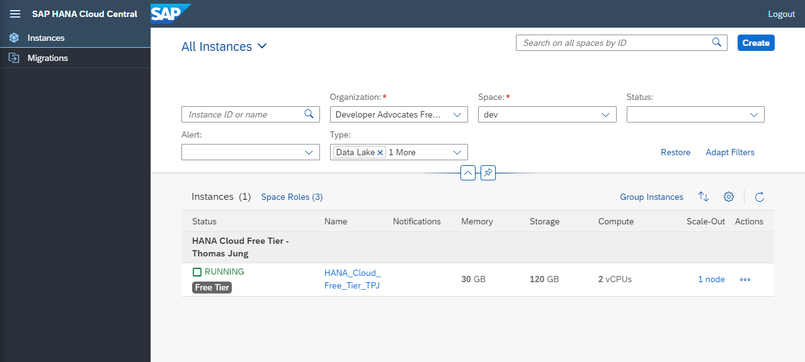

1. Once the SAP HANA Cloud instance is created, take note of the admin user needed to connect to the database. This will be needed in subsequent steps in this tutorial.

1. Finally it is important to take note that the SAP HANA Cloud instance in both the free tier and free trial shuts down at the end of each day automatically to save costs from unused systems. Therefore you must return to this SAP HANA Cloud administration screen each day you want to use  SAP HANA Cloud and choose to start the system from the **Action** menu.  If you forget to restart the instance, you will receive HANA connection errors whenever you try to interact with it in later steps.

    <!-- border -->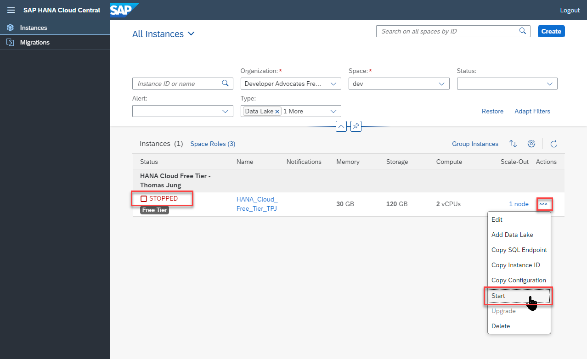

1. As an optional step if you are completely new to the SAP HANA Cloud environment, you might want to consider also going through this tutorial: [Tools to Manage and Access the SAP HANA Cloud, SAP HANA Database](hana-cloud-mission-trial-3) in order to familiarize yourself with the various tools that can be used to manage and develop with SAP HANA Cloud.

### Create SAP Business Application Studio Dev Space

1. Set Up SAP Business Application Studio for development (if you've never used SAP Business Application Studio) by following [this tutorial](appstudio-onboarding)

2. Creating SAP Business Application Studio Dev Space - Dev spaces are like isolated virtual machines in the cloud that can be quickly spun-up. Each dev space type contains tailored tools and pre-installed run-times for a target scenario such as SAP Fiori or mobile development. This simplifies and saves time in setting up the development environment as there's no need to install anything or upgrade; letting developers focus on their business domain, anytime, anywhere. Go to your SAP Business Technology Platform subaccount and click the **Services -> Instances and Subscriptions** option.

    <!-- border -->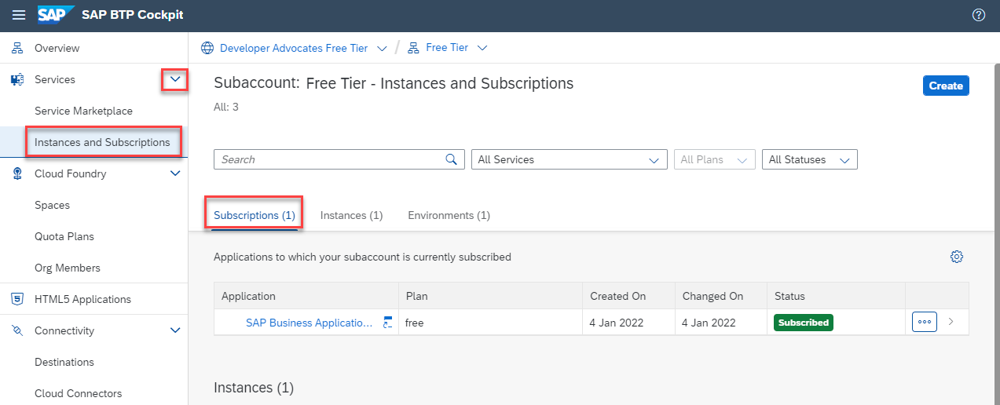

3. Locate the **SAP Business Application Studio** entry and click **Go to Application**

    <!-- border -->

4. Choose **Create Dev Space**. Please NOTE: In the SAP BTP trial and free tier you are limited to only two Dev Spaces and only one can be active at a time. If you have performed other tutorials, you might already have reached your maximum. In that case you might have to delete one of the other dev spaces in order to continue with this tutorial.

    <!-- border -->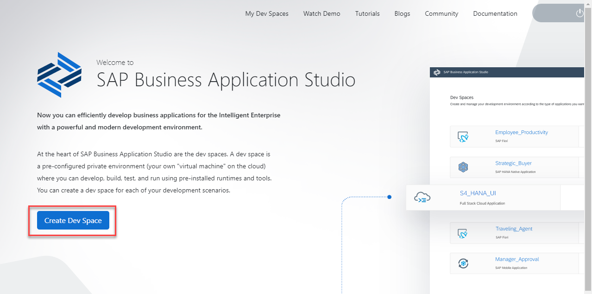

5. Enter **HANA** for your dev space name and choose **SAP HANA Native Application** as the kind of application you are creating.

    <!-- border -->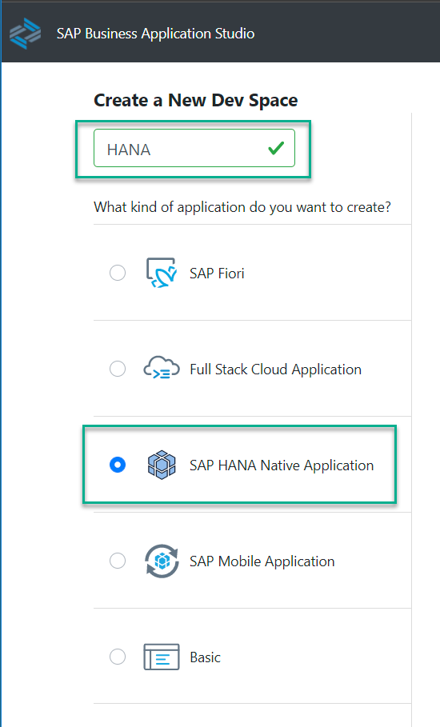

6. The Dev space will automatically be configured with the most common tools you need for the type of application you choose. However you can also choose additional, optional extensions. For example you might want to add the optional SAP HANA Performance Tools to your HANA Dev Space.

    <!-- border -->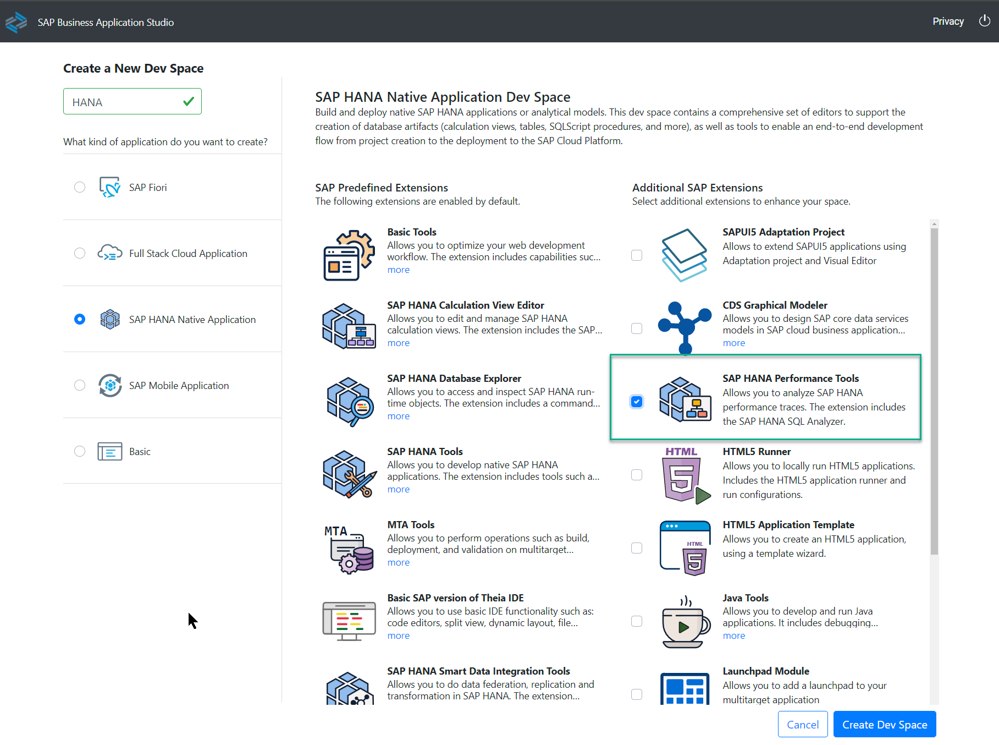

7. Once all selections are completed, press **Create Dev Space**

    <!-- border -->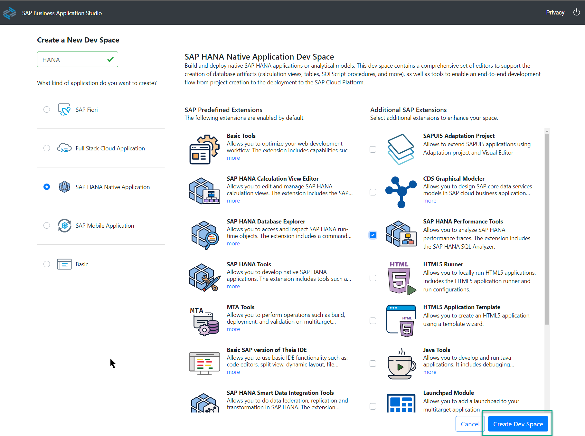

8. The Dev Space will then begin starting and the process will take a minute or so as your cloud environment is being created

    <!-- border -->

9. Once the Dev Space reaches the green status of **RUNNING**, you can click on the name of the Dev Space and it will load into the editor within your browser

    <!-- border -->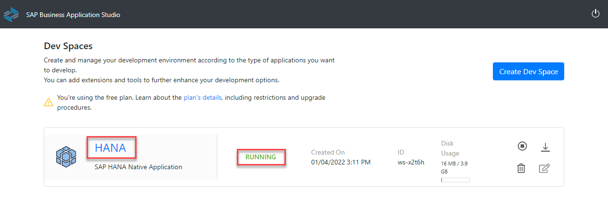

10. You'll be redirected to your newly created SAP Business Application Studio Dev Space. We recommend you bookmark this URL so it's easier for you to access this dev space of your SAP Business Application Studio in the future

    <!-- border -->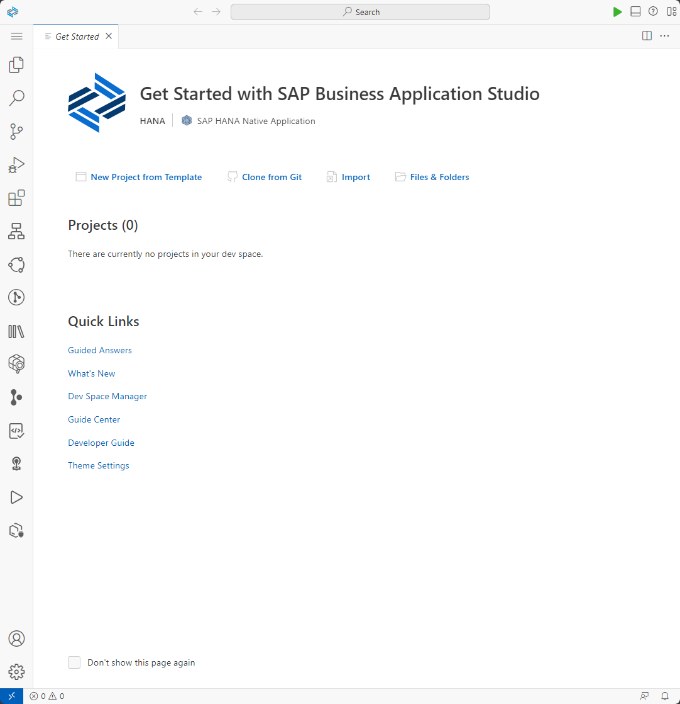

### Configure SAP Business Application Studio Dev Space

Before we create our SAP HANA project, we want to do a few more one-time configuration steps to prepare the Dev Space

1. In the left side of the Business Application Studio click on the Cloud Foundry targets icon

    <!-- border -->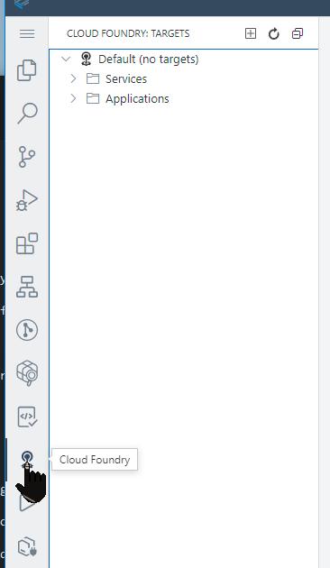

2. Now in the Cloud Foundry Targets window you can expand either Service or Applications and then click on the Logon icon to continue the configuration process

    <!-- border -->

3. The Cloud Foundry Sign In and Targets window will then open at the right side of the SAP Business Application Studio. The first input will prompt you for the API endpoint

    <!-- border -->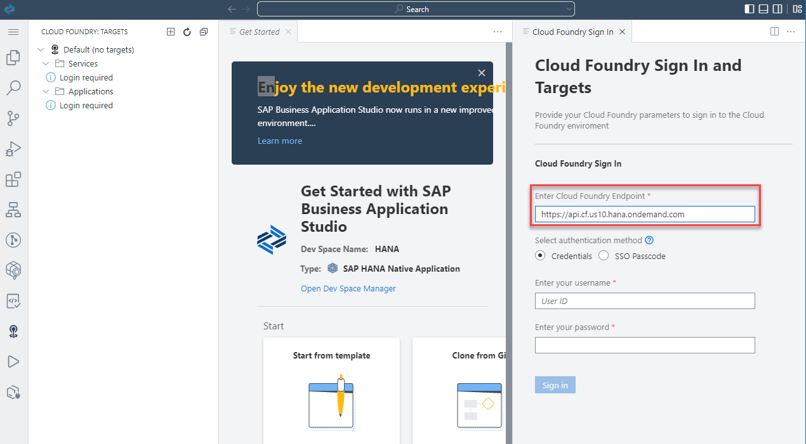

4. The default value proposed may NOT be the correct value, you need to confirm! The value can be found in the SAP BTP cockpit at the Subaccount level

    <!-- border -->

5. The next input field will ask you for the email address you used to create your SAP BTP account

    <!-- border -->

6. The next input will ask you for your SAP BTP account password. After entering the password, the **Sign in** button will become enabled. Press that.

    <!-- border -->

7. If you successfully sign in, the next input will ask you for your Organization. In most situations you will have a single choice. But like the API endpoint earlier, if you need to confirm the correct value it will be displayed in the top navigation of the SAP BTP cockpit

    <!-- border -->

8. The final input will ask you for your Space. You can then press **Apply**.

    <!-- border -->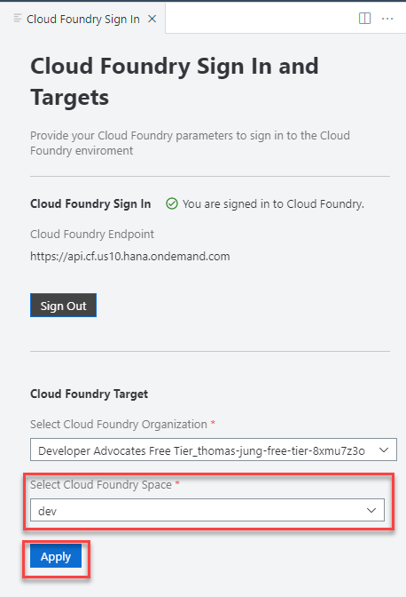

9. Upon completion of all the inputs, you should see that the Organization and Space have been set and you will see any service instances or application instances from the target space. You will see less items than this screenshot.

    <!-- border -->

### Clone repository

You can now clone an existing GitHub repository into your workspace. This repository contains the artifacts to create a schema and a document store and add data into it.

1. Return to the **Explorer** view and choose **Clone Repository** from the SAP Business Application Studio Welcome screen

    <!-- border -->

2. Enter the following URL and press **Enter**. ```https://github.com/SAP-samples/hana-cf-get-started-trial```

    <!-- border -->

3. If asked for the project location, choose the **/home/user/projects/** folder and then press **OK**

    <!-- border -->

4. The clone log will be shown in the bottom of the screen. Upon completion, please press the **Open** button in the dialog in the bottom right.

    <!-- border -->

> At any time if you get stuck, you can view the completed solution in GitHub as well at this URL: [Project Solution](https://github.com/SAP-samples/hana-cf-get-started-trial/tree/solution)

### Create database artifacts

The cloned repository contains files with design-time definitions to create artifacts in the database using the SAP HANA Deployment Infrastructure, or HDI for short. HDI provides a service that enables you to deploy database development artifacts to so-called containers and to build run-time database objects. You can think of HANA container as an isolation that contains a single database schema for all objects.

Artifacts in the current project will be translated into a physical database schema and into a JSON document store.

1. Expand the **SAP HANA PROJECTS** window and press the **Bind** button

    <!-- border -->

1. In the first dialog at the top of the screen, choose **Bind to an HDI container**

    <!-- border -->

1. In the dialog that appears near the top of the screen, choose the **Create a new service instance**

    <!-- border -->

1. Accept the default service instance name

    <!-- border -->

1. Press **Enter**.  It will take a minute or so to complete the creation

    <!-- border -->

1. Occasionally the binding will fail on the first try with a timing issue. If you receive this error, just repeat the process of binding but this time you will see the HDI container (my-hdi) in the **Select a service instance** list (since it did actually create successfully). Choose it from the list to continue.

    <!-- border -->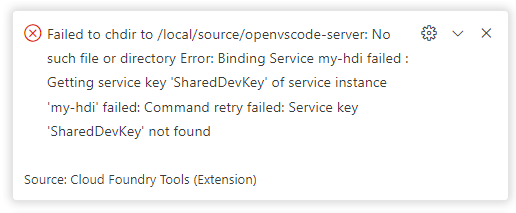

1. Once created, return to the **SAP HANA PROJECTS** view. Press the **Deploy** button.

    <!-- border -->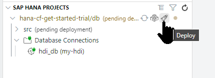

    > ### What's going on?
    > The design-time definitions will be deployed by HANA Deployment Infrastructure - a service layer in SAP HANA.
    >
    > With HDI the physical artifacts will be created and managed by technical users in corresponding container. You would normally only deploy database artifacts into these containers through design-time definitions, as the physical build of database artifacts is the role of HDI.
    >
    > Later in this exercise, you will create some more database objects in the database directly for learning purposes. But the recommendation is to use HDI and build database objects by modeling design-time artifacts and their deployment to HDI containers.

    You will see the build log in the console. Wait until the build has finished successfully.

    <!-- border -->

1. Press the **Open HDI container** button.

    <!-- border -->

    The database explorer will start loading in a new browser tab. If asked to add a database connection, click **No**.

1. You can see your container with a schema and the table `COMMUNITY`. They were generated from definitions in the cloned repository.

    <!-- border -->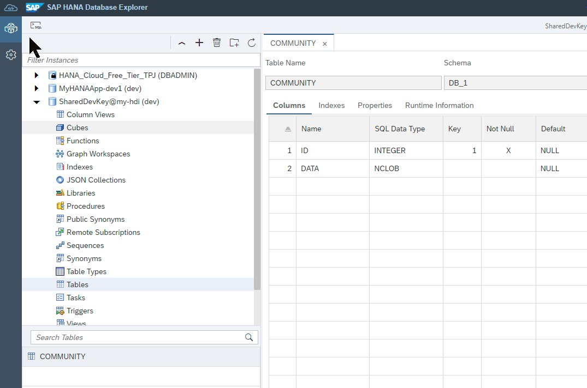

### NoSQL time! Load data into JSON table

1. Open an SQL console.

    <!-- border -->

2. Paste the following statements to insert new JSON documents into your table and run <!-- border --> the statements.

    > The statements may be marked with errors by the editor. You can ignore the errors.

    ```SQL
    insert into "COMMUNITY" (DATA)  values('{"name" : "Sol" , "hint" :"I love using SAP HANA to develop applications", "learns_from" :"Sam", "office" :"Toronto", "tenure" :17, "geolocation" : "Point( -79.380186 43.647944 )" }');
    insert into "COMMUNITY" (DATA) values('{"name" :"Sam", "hint" :"I like developing in different languages and SQLScript", "learns_from" :"Sol", "office" :"Walldorf", "tenure" :3, "geolocation" : "Point( 8.636789 49.29487 )" }');
    insert into "COMMUNITY" (DATA) values('{"name" :"Jose", "hint" :"I use SAP Cloud platform to deploy cloud-native applications", "learns_from" :"Sol", "office" :"Palo Alto", "tenure" :5, "geolocation" : "Point( -122.146603 37.398989 )" }');
    insert into "COMMUNITY" (DATA) values('{"name" :"Charlotte", "hint" :"Developing apps with SAP HANA has been a game changer. I used to need several databases, now I only need one", "learns_from" :"Sam", "office" :"Australia", "tenure" :6, "geolocation" : "Point( 151.209092 -33.834509 )" }');
    insert into "COMMUNITY" (DATA) values('{"name" :"Maria", "hint" :"I am a coder. In my country, we say developing with SAP HANA is muito legal", "learns_from" :"Charlotte", "office" :"Sao Leopoldo", "tenure" :3, "geolocation" : "Point( -51.148393 -29.796256 )" }');
    insert into "COMMUNITY" (DATA) values('{"name" :"Wei", "hint" :"System administrator here, excited to learn you technologies", "learns_from" :"Sam", "office" :"Beijing", "tenure" :12, "geolocation" : "Point( 121.601862 31.20235 )" }');
    insert into "COMMUNITY" (DATA) values('{"name" :"Hiroshi", "hint" :"I developed many applications with both HANA and SQL Anywhere. I like both", "learns_from" :"Sol", "office" :"Fukuoka", "tenure" :8, "geolocation" : "Point( 130.399091 33.592314 )" }');
    insert into "COMMUNITY" (DATA) values('{"name" :"Saanvi", "hint" :"Developing apps from bangalore to the world", "learns_from" :"Sol", "office" :"Bangalore", "tenure" :7, "geolocation" : "Point( 77.637116 12.972402 )" }');
    insert into "COMMUNITY" (DATA) values('{"name" :"Rick", "hint" :"My team plays with databases regularly. HANA is one of the favorites", "learns_from" :"Maria", "office" :"Irving", "tenure" :11, "geolocation" : "Point( -96.938460 32.873744 )" }');
    insert into "COMMUNITY" (DATA) values('{"name" :"Ann", "hint" :"I like meeting other fellow coders", "learns_from" :"Casey", "office" :"San Ramon", "tenure" :1, "geolocation" : "Point( -121.961661 37.766586 )" }');
    insert into "COMMUNITY" (DATA) values('{"name" :"Hugo", "hint" :"I had never developed such cool apps before", "learns_from" :"Maria", "office" :"Monterrey", "tenure" :2, "geolocation" : "Point( -100.353643 25.64757 )" }');
    insert into "COMMUNITY" (DATA) values('{"name" :"Sofia", "hint" :"I connected SAP Analytics Cloud to HANA", "learns_from" :"Hiroshi", "office" :"Copenhagen", "tenure" :1, "geolocation" : "Point( 12.589387 55.710640 )" }');
    insert into "COMMUNITY" (DATA) values('{"name" :"Muhammed", "hint" :"I used to prefer Excel spreadsheets but Lumira changed that for me", "learns_from" :"Charlotte", "office" :"Ra anana", "tenure" :11, "geolocation" : "Point( 34.882402 32.201905 )" }');
    ```

    You should get success messages as in the following example:

    <!-- border -->

    > ### What's going on?

    > Tables with JSON columns allow you to store all of the information related to the same record in the same document. These documents do not have a predefined format or number of fields like a typical relational table.
    >
    > This is particularly useful when relationships across documents are not too relevant and data structure needs to be flexible. For example, data for user accounts where fields like the phone number may not be entered and may not be stored at all. In this same scenario, there is no need for foreign keys and relations between the user records.
    >
    > This type of database is also referred to as `NoSQL` because it stores Not-only Structured data. SAP HANA uses SQL for CRUD operations in JSON columns.
    >

3. The following statement demonstrates a use of the JSON Object Expression in the `select` statement. Run this statement to complete the validation below:

    ```SQL
    SELECT *
    	FROM JSON_TABLE(COMMUNITY.DATA, '$'
    	COLUMNS
        (
            LOCATION NVARCHAR(200) PATH '$.office',
            NAME NVARCHAR(200) PATH '$.name'
        )
    	) AS JT where NAME = 'Maria'
    ```

    > You can clear the statements before entering new ones in SQL console (recommended).
    > Alternatively select (highlight) the statements you want to execute.

### SQL time! Select experienced community members

Free resources, like this tutorial, are a great way to get started. People in the community with more experience are often willing to help you on your learning journey. For our developer, Thomas, choosing people with more experience means that he can get up to speed quickly.

You will select people whose experience is 2 years or more. You'll also need to move those records into a columnar table so that you can perform advanced analytics that are only available in the columnar store.

1. Create the columnar table first by returning to the SAP Business Application Studio editor view and creating a file named `DEVS.hdbtable` in the `db/src` folder.

    <!-- border -->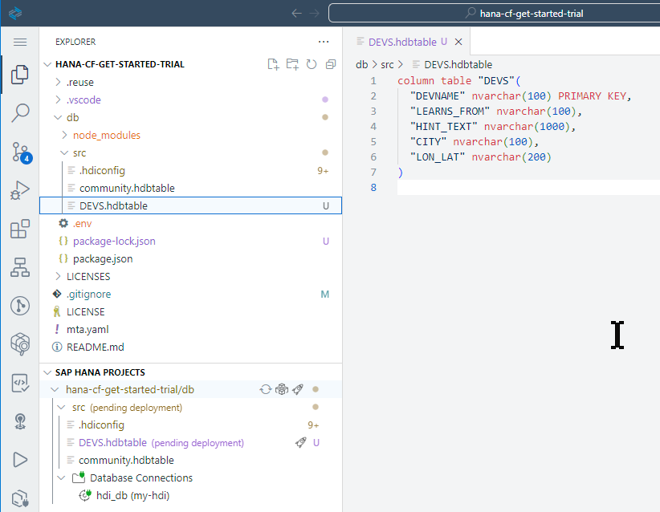

    Here is the content for this file.

    ```SQL
    column table "DEVS"(
      "DEVNAME" nvarchar(100) PRIMARY KEY,
      "LEARNS_FROM" nvarchar(100),
      "HINT_TEXT" nvarchar(1000),
      "CITY" nvarchar(100),
      "LON_LAT" nvarchar(200)
    )
    ```

    > ### Note `column` table definition in the statement
    > SAP HANA creates columnar tables by default. The `column` keyword is optional, but is used in the example to remind about the native column-based storage of tables in SAP HANA.
    >

2. Press **Deploy** in the **SAP HANA PROJECTS** window.

    Upon completion of the build, return to the database explorer view of your HDI container and refresh the Tables selection. You should see the new table listed under `TABLES`:

    <!-- border -->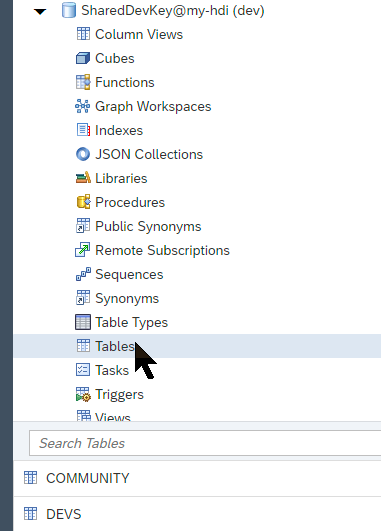

3. Insert the data from the documents store into the columnar table, filtering out community members with tenure below 1 year:

    ```SQL
    insert into DEVS
    SELECT NAME, LEARNS_FROM, HINT, OFFICE, GEOLOCATION
    	FROM JSON_TABLE(COMMUNITY.DATA, '$'
    	COLUMNS
        (
            LOCATION NVARCHAR(200) PATH '$.office',
            NAME NVARCHAR(200) PATH '$.name',
            LEARNS_FROM NVARCHAR(200) PATH '$.learns_from',
            HINT NVARCHAR(200) PATH '$.hint',
            OFFICE NVARCHAR(200) PATH '$.office',
            GEOLOCATION NVARCHAR(200) PATH '$.geolocation',
            TENURE NVARCHAR(30) PATH '$.tenure'
        )
    	) AS JT where to_bigint(TENURE) > 1
    ```

4. Count the inserted records in the new columnar table:

    ```SQL
    select count(*) from "DEVS";
    ```

Insert the result of the previous SQL command in the box below to complete the following validation:

### Use text search to find developers who can help

There are plenty of different ways to work with SAP HANA. Some developers are interested in its analytics, some keep it running smoothly through system and database administration, and others use it to create data-driven applications. In order to help Thomas, you'll need to look for people who like to develop applications.

You'll use a `contains` text search to find out who has said anything related to developing applications.

```SQL
select DEVNAME, TO_NVARCHAR(HINT_TEXT) as "testimony", LEARNS_FROM
from DEVS
where contains(HINT_TEXT, '%develop%')
```

<!-- border -->

You will use these results to create a table (as a new `hdbtable` artifact as you did earlier) back in the Business Application Studio tab to show who learns from whom. This table will be used to create a graph workspace.

Create it using the following syntax in a new `hdbtable` file -- remember to deploy your `db` module again:

```SQL
column table LEARNING_RELATION(
	ID int NOT NULL UNIQUE GENERATED ALWAYS AS IDENTITY (START WITH 10 INCREMENT BY 1),
	SOURCE nvarchar(100) NOT NULL,
	TARGET nvarchar(100) NOT NULL
)
```

Insert the records into the new table:

```SQL
insert into LEARNING_RELATION
(SOURCE, TARGET)
select LEARNS_FROM, DEVNAME
from DEVS
```

How many records were inserted into the new table?

### Use graph to find out who learns from whom

Now that you have a table populated with learning relationships and expert developers in the community, you can find out how these people are related to each other. One of the ways to represent a network of people is by using a graph database.

In SAP HANA, graphs are represented by vertices (in this example, developers) and edges (the connections between them, taken from the field `LEARNS_FROM`).


> Find more information about the graph data model in the [SAP HANA reference](https://help.sap.com/viewer/f381aa9c4b99457fb3c6b53a2fd29c02/latest/en-US).

Create a graph workspace to define a graph in terms of tables and columns by returning to the SAP Business Application Studio editor and creating a file with the extension `hdbgraphworkspace` (and be sure to Deploy again):

```SQL
graph workspace HANA_GRAPH
  edge table LEARNING_RELATION
    source column SOURCE
    target column TARGET
    key column ID
  vertex table DEVS
    key column DEVNAME
```

You can preview the graph by navigating into **Graph Workspaces**, selecting the graph you have just created and choosing **View Graph**.


Here's the graph:


### Find the closest geographical location

So far, you've found the most connected developers with two or more years of experience, plus an interest in developing applications. Now find out who is closest to Thomas, so that they can meet him at the next community event.

Thomas is located in Munich, Germany. The geolocation of the city is:

|-|-|
|Longitude|`11.57548`|
|Latitude |`48.13702`|


Use the following query to calculate distance to Thomas' location:

```SQL
select DEVNAME,
round(st_geomFromText('Point( 11.57548 48.13702 )', 4326).st_distance(st_geomFromtext(LON_LAT, 4326), 'kilometer'),0) as DISTANCE_KM
from DEVS
where contains(HINT_TEXT, '%develop%')
order by DISTANCE_KM
```

### Keep building your skills

Congratulations on helping Thomas find and collaborate with other developers!

If you are ready to explore more features with your own local copy of SAP HANA, you can also download SAP HANA, express edition. SAP HANA, express editions is **free** up to 32 GB of RAM, **even for productive use**. You can:

- [Register for a free download](https://www.sap.com/cmp/td/sap-hana-express-edition.html)

Or you can continue to use the free SAP HANA Cloud trial as a part of your overall SAP BTP trial or free tier.

Here's how you can get started with any developer-focused topic in SAP HANA and more:

- **SAP Developer Center**: You'll find plenty of free downloads and tutorials to help you with different topics on [developers.sap.com](http://developers.sap.com). You can continue your journey with the basics of SAP HANA Cloud [Jump Start Your SAP HANA Cloud, SAP HANA Database (free tier model or trial)](mission.hana-cloud-database-get-started). Or you can learn new topics like [geospatial](group.hana-aa-spatial-get-started), working with the various [HANA client interfaces](mission.hana-cloud-clients) or switch to a full SAP HANA, express edition, image with XS Advanced, to [create cloud native applications with micro-services](mission.xsa-get-started).
- **The community**: Fellow developers write about their experiences and recommendations in [blog posts](https://blogs.sap.com/), and many are willing to answer your questions [in the Q&A](https://answers.sap.com).
- **Community events**: You can also check out [events](https://community.sap.com/events) closest to you in order to meet other developers.

---
