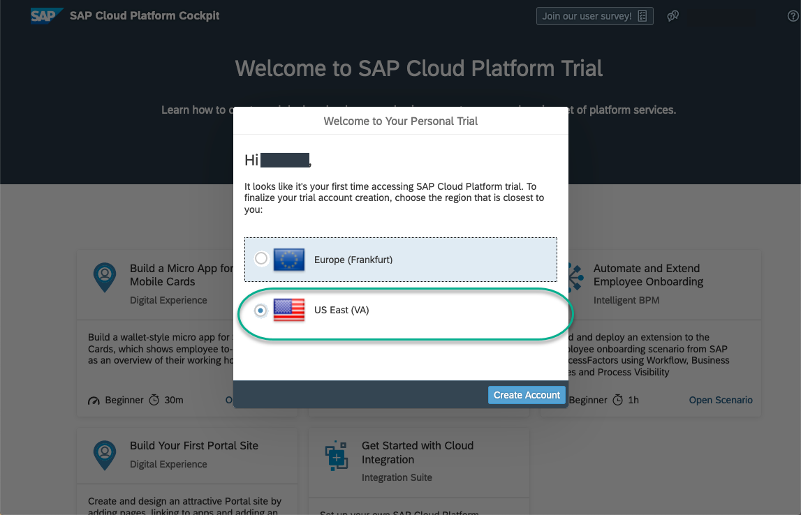
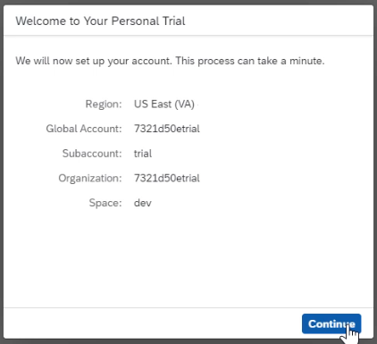
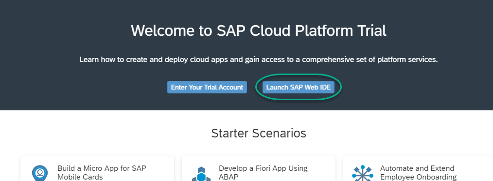
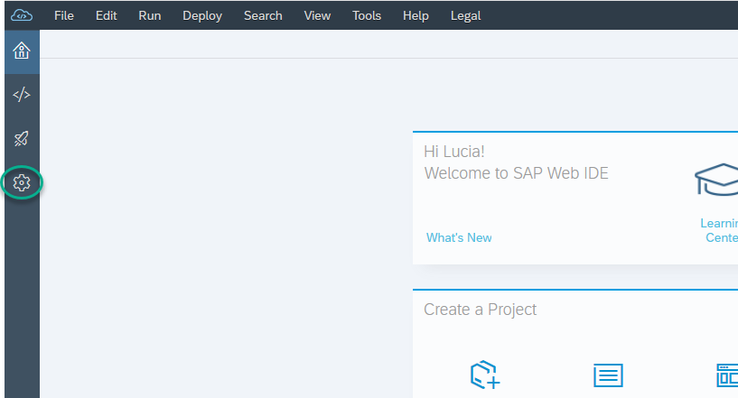

## Intro
SAP HANA is a complete database and application development platform. It lets you use advanced data processing capabilities —text, spatial, predictive, and more— to pull insights from all types of data.

By combining in-memory storage with columnar store, data operations are performed up to 33,000 times faster than in a traditional, disk-based database. SAP HANA is also `translytical`, which means that developers can perform both transactional and analytical operations from the same structure, in real time, and without creating copies of the data such as materialized views or additional indices.


## Details

Ready to explore SAP HANA? As a fun exercise, you can first help our fictional developer, Thomas, work with other developers in the community to create his own database schema on SAP HANA to use text analytics, graph and geospatial capabilities.


### You will learn

  - How to use advanced analytics features in SAP HANA, including the document store, geospatial, graph and linguistic text search functions

This tutorial uses a trial account in SAP Cloud Platform. If you do not want to use this method, you can check other [available options to download or install SAP HANA, express edition](https://developers.sap.com/topics/sap-hana-express.html).

## How do we help Thomas?
Like most developers, Thomas wants to stay on top of the latest technologies. His first step is to get started with free tutorials, like this one. The second step is to connect with other developers and experts in the SAP Community to share knowledge and learn together.

Fellow developers from all around the world connect daily to exchange information. And we are going to find out if they share Thomas' interest for SAP HANA and related topics by using text analytics on their opinions in the community.

Thanks to the multiple engines in SAP HANA, we will also combine text analytics with graph analytics to find out how community members are connected.

Finally, we will use the geospatial capabilities in SAP HANA to find out developers closer to Thomas' location in Munich.


---

[ACCORDION-BEGIN [Step 1: ](Log in to the community)]

This tutorial uses validations to track completion and make sure you are all set after finishing important steps.

**Sign in or register** by clicking on the `person` icon in the top right corner. If you're registering for the first time, all you need is an email address or social media account.


Use your email address or social media account.


[DONE]
[ACCORDION-END]

[ACCORDION-BEGIN [Step 2: ](Sign up for a trial in SAP Cloud Platform)]

Navigate to the trial landscape for [SAP Cloud Platform](https://cockpit.hanatrial.ondemand.com/cockpit/#/home/trialhome).

Follow steps to log in or register for an account. If you need detailed steps, you can [follow this tutorial](hcp-create-trial-account).


[DONE]
[ACCORDION-END]

[ACCORDION-BEGIN [Step 3: ](Configure your trial account)]

If you haven't already, you will be prompted to validate your account using a phone number. Complete the validation.


After completing the validation, click the **Log On** again and choose **US East (VA)**.



> ### Already have an account in another data center?
> To transfer your trial entitlements to the new subaccount in `US East (VA)`, refer to the [instructions in this blog post](https://blogs.sap.com/2019/04/16/how-to-change-the-region-in-your-cloud-foundry-trial/) .

Once the provisioning is finished, click **Continue**:



Click **Launch SAP Web IDE** back in the main landing page.



[DONE]
[ACCORDION-END]


[ACCORDION-BEGIN [Step 4: ](Configure SAP Web IDE)]

Once SAP Web IDE Full stack opens, access the configuration.



Click **Extensions** and enable **SAP HANA Database Development Tools**


Click **Save**. When prompted, **Refresh**.


After SAP Web IDE has refreshed, Click **Cloud Foundry**.


Choose `US10` as the API Endpoint.


Enter your credentials for the trial when prompted and **Log on**.


The subaccount and space will populate automatically.

Finally, configure the **Database explorer**. Choose the region `US10` and click **Save**.


[DONE]
[ACCORDION-END]


[ACCORDION-BEGIN [Step 5: ](Clone a repository)]

You can now clone an existing GitHub repository into your workspace. This repository contains the artifacts to create a schema and a document store and add data into it.

Right-click on the Workspace and choose **Git > Clone Repository**.


Enter the following URL and click **Clone**:

```URL
https://github.com/SAP-samples/hana-cf-get-started-trial/
```


When prompted about ignoring system files, choose **Do it later**.

[DONE]
[ACCORDION-END]

[ACCORDION-BEGIN [Step 6: ](Create database artifacts)]

The repository you have just cloned contains design-time definitions to create artifacts in the database. These artifacts will be translated into a physical schema and a JSON document store.

Expand the cloned folder and right-click on the `db` folder. Choose **Build**.


> ### What is going on?
> The design-time definitions will be deployed by a service layer in SAP HANA called HANA Deployment Infrastructure.
>
> The physical artifacts will be created and managed by technical users in a container and you would normally only deploy database artifacts into these containers through design-time definitions.
>
> In this exercise, you will interact with the database directly for introductory purposes.

You will see the build log in the console. Wait until the build has finished successfully.


Right-click on the `db` module and choose **Open HDI container**.


The database explorer will start loading. If asked to add a database connection, click **No**.

You can see your schema and the JSON collection generated from the cloned repository.


[DONE]
[ACCORDION-END]

[ACCORDION-BEGIN [Step 7: ]( NoSQL time! Load data into your document store)]

Open a SQL console.


Paste the following statements to insert new documents into your collection and run  the statements.

> ### Note: The statements may be marked with errors by the editor. You can ignore the errors.

```SQL
insert into COMMUNITY VALUES({ "name" : 'Sol' ,   "hint" :'I love using SAP HANA to develop applications',  "learns_from" :'Sam',  "office" :'Toronto',  "tenure" :17,  "geolocation" :  'Point(    -79.380186  43.647944 )' });
insert into COMMUNITY VALUES({"name" :'Sam',  "hint" :'I like developing in different languages and SQLScript',  "learns_from" :'Sol',  "office" :'Walldorf',  "tenure" :3,  "geolocation" :  'Point(    8.636789  49.29487 )' });
insert into COMMUNITY VALUES({"name" :'Jose',  "hint" :'I use SAP Cloud platform to deploy cloud-native applications',  "learns_from" :'Sol',  "office" :'Palo Alto',  "tenure" :5,  "geolocation" :  'Point(     -122.146603  37.398989 )' });
insert into COMMUNITY VALUES({"name" :'Charlotte',  "hint" :'Developing apps with SAP HANA has been a game changer. I used to need several databases, now I only need one',  "learns_from" :'Sam',  "office" :'Australia',  "tenure" :6,  "geolocation" :  'Point(    151.209092    -33.834509 )' });
insert into COMMUNITY VALUES({"name" :'Maria',  "hint" :'I am a coder. In my country, we say developing with SAP HANA is muito legal',  "learns_from" :'Charlotte',  "office" :'Sao Leopoldo',  "tenure" :3,  "geolocation" :  'Point(    -51.148393    -29.796256 )' });
insert into COMMUNITY VALUES({"name" :'Wei',  "hint" :'System administrator here, excited to learn you technologies',  "learns_from" :'Sam',  "office" :'Beijing',  "tenure" :12,  "geolocation" :  'Point(    121.601862    31.20235 )' });
insert into COMMUNITY VALUES({"name" :'Hiroshi',  "hint" :'I developed many applications with both HANA and SQL Anywhere. I like both',  "learns_from" :'Sol',  "office" :'Fukuoka',  "tenure" :8,  "geolocation" :  'Point(    130.399091    33.592314 )' });
insert into COMMUNITY VALUES({"name" :'Saanvi',  "hint" :'Developing apps from bangalore to the world',  "learns_from" :'Sol',  "office" :'Bangalore',  "tenure" :7,  "geolocation" :  'Point(    77.637116  12.972402 )' });
insert into COMMUNITY VALUES({"name" :'Rick',  "hint" :'My team plays with databases regularly. HANA is one of the favorites',  "learns_from" :'Maria',  "office" :'Irving',  "tenure" :11,  "geolocation" :  'Point(     -96.938460    32.873744 )' });
insert into COMMUNITY VALUES({"name" :'Ann',  "hint" :'I like meeting other fellow coders',  "learns_from" :'Casey',  "office" :'San Ramon',  "tenure" :1,  "geolocation" :  'Point(    -121.961661    37.766586 )' });
insert into COMMUNITY VALUES({"name" :'Hugo',  "hint" :'I had never developed such cool apps before',  "learns_from" :'Maria',  "office" :'Monterrey',  "tenure" :2,  "geolocation" :  'Point(    -100.353643    25.64757 )' });
insert into COMMUNITY VALUES({"name" :'Sofia',  "hint" :'I connected SAP Analytics Cloud to HANA',  "learns_from" :'Hiroshi',  "office" :'Copenhagen',  "tenure" :1,  "geolocation" :  'Point(    12.589387    55.710640 )' });
insert into COMMUNITY VALUES({"name" :'Muhammed',  "hint" :'I used to prefer Excel spreadsheets but Lumira changed that for me',  "learns_from" :'Charlotte',  "office" :'Ra anana',  "tenure" :11,  "geolocation" :  'Point(    34.882402    32.201905 )' });

```

You should get success messages as in the following example:


> ### What is going on?

> Document store allows you to store all of the information related to the same record in the same document. These documents do not have a predefined format or number of fields like a table.
>
> Document stores do not have tables or schemas, they use collections and documents. Documents in the same collection may have different structures and data types.
>
> This is particularly useful when relationships across documents are not too relevant and data structure needs to be flexible. For example, data for user accounts where fields like the phone number may not be entered and may not be stored at all. In this same scenario, there is no need for foreign keys and relations between the user records.
>
> This type of database is also referred to as `NoSQL` because data operations are not performed using SQL in other platforms. However, SAP HANA uses SQL for CRUD operations in JSON document store.
>
> For more information about the document store in SAP HANA, [refer to the help](https://help.sap.com/viewer/6b94445c94ae495c83a19646e7c3fd56/2.0.03/en-US/5e783b7f5a9749bcbfffe167524aeccc.html)


Use the following statement to complete the validation below:


```sql
 select TO_NVARCHAR("hint"), TO_NVARCHAR("office") from COMMUNITY where "name"  = 'Maria';
```

>   ### Note: You can clear the statements before entering new ones (recommended) or select the statements you want to execute.

[VALIDATE_1]
[ACCORDION-END]

[ACCORDION-BEGIN [Step 8: ]( SQL time! Select people in the community with at least one year of experience)]

Free resources, like this tutorial, are a great way to get started. People in the community with more experience are often willing to help you on your learning journey. For our developer Thomas, choosing people with more experience means that he can get up to speed quickly.

You will select people whose experience is 2 years or more. You'll also need to move those records into a columnar table so that you can perform advanced analytics that are only available in the columnar store.

Create the columnar table first:

```sql
create column table "DEVS"
  (
  "DEVNAME" nvarchar(100) PRIMARY KEY,
  "LEARNS_FROM" nvarchar(100),
  "HINT_TEXT" text FAST PREPROCESS OFF ASYNC,
  "CITY" nvarchar(100),
  "LON_LAT" nvarchar(200)
);
```
> ### Note:
> The columnar table has a text index on the field `HINT_TEXT`.

You should see the new table listed under `TABLES`:


Insert the data from the documents store into the columnar table, filtering out community members with tenure below 1 year:

```sql
insert into "DEVS"
select "name", "learns_from", "hint", "office", "geolocation"
	from community where to_bigint("tenure") > 1
```

Count the inserted records in the new columnar table:

```sql
select count(*) from "DEVS";
```

Insert the result of the previous SQL command in the box below to complete the following validation:

[VALIDATE_2]
[ACCORDION-END]

[ACCORDION-BEGIN [Step 9: ](Use linguistic text search to find developers who can help)]

There are plenty of different ways to work with SAP HANA. Some developers are interested in its analytics, some keep it running smoothly through system and database administration, and others use it to create data-driven applications. In order to help Thomas, you'll need to look for people who like to develop applications.

You'll use a linguistic text search to find out who has said anything related developing applications.

```SQL
select "DEVNAME", TO_NVARCHAR("HINT_TEXT"), "LEARNS_FROM"
  from "DEVS"
  where contains(hint_text, 'develop', linguistic)
```
Notice how the linguistic search brings all records containing the verb `develop` as a stem.


> ### Note:
> Other functions such as fuzzy search, text mining and sentiment analysis can be applied using the text engine in SAP HANA. To learn more about linguistic and other types of search, visit [the official documentation](https://help.sap.com/viewer/691cb949c1034198800afde3e5be6570/2.0.00/en-US/83dc5e659691429f85e8eb02b50a9260.html)

You will use these results to create a table to show who learns from whom. This table will be used to create a graph workspace. Create it using the following SQL statement:

```sql
create column table learning_relation (
	"ID" int generated always as identity(start with 10 increment by 1) unique not null,
	"SOURCE" NVARCHAR(100) not null,
    "TARGET" NVARCHAR(100) not null
);
```

Insert the records into the new table:

```sql
insert into learning_relation
(source, target)
select learns_from, devname from devs
```
How many records were inserted into the new table?

[VALIDATE_3]
[ACCORDION-END]

[ACCORDION-BEGIN [Step 10: ](Use Graph to find out who learns from whom)]

Now that you have a table populated with learning relationships and expert developers in the community, you can find out how these people are related to each other. One of the ways to represent a network of people is by using a graph database.

In SAP HANA, graphs are represented by vertices (in this example, developers) and edges (the connections between them, taken from the field `learns_from`).


> Find more information about the graph data model in the [SAP HANA reference](https://help.sap.com/viewer/f381aa9c4b99457fb3c6b53a2fd29c02/2.0.00/en-US/7734f2cfafdb4e8a9d49de5f6829dc32.html) and [how to apply to text analytics](https://help.sap.com/viewer/62e301bb1872437cbb2a8c4209f74a65/2.0.02/en-US/f585411bd05c49c58bdd2b99710f66c3.html).

Create a graph workspace to define a graph in terms of tables and columns:

```sql
CREATE GRAPH WORKSPACE "HANA_GRAPH"
	edge table "LEARNING_RELATION"
	    SOURCE COLUMN "SOURCE"
	    TARGET COLUMN "TARGET"
	    KEY COLUMN "ID"
	VERTEX TABLE "DEVS"
	    KEY COLUMN "DEVNAME";

```

You can preview the graph by navigating into **Graph Workspaces**, selecting the graph you have just created and choosing **View Graph**.


There are some known algorithms to apply on a graph. One of them is the `strongly connected components`. As this is a directed graph (the `learns_from` establishes has a direction from one node to the other), you can establish an index with the most strongly connected members.

In this example, you'll find those developers to whom most other developers in the community are connected. In turn, others can learn from them directly or indirectly.

Click **Algorithm**, choose **Strongly connected** and click **Apply**.


The names connected in both directions in the directed graph are marked in the same color:


[DONE]
[ACCORDION-END]

[ACCORDION-BEGIN [Step 11: ](Find the closest geographical location)]

So far, you've found the most connected developers with two or more years of experience, plus an interest in developing applications. Now find out who is closest to Thomas, so that they can meet him at the next community event.

Thomas is located in Munich, Germany. The geolocation is longitude:  11.569299 latitude: 48.145130


Use the following query to calculate distance to Thomas' location:

```sql
select devname, st_geomFromText( 'Point( 11.569299 48.145130 )', 4326).st_distance(st_geomFromtext( devs.lon_lat, 4326), 'kilometer')  as DISTANCE_KM
  from "DEVS"
  where contains(hint_text, 'develop', linguistic)
    order by distance_km asc
```

[VALIDATE_5]
[ACCORDION-END]

[ACCORDION-BEGIN [Step 12: ](Who can help me get started?)]

Congratulations on helping Thomas find and collaborate with other developers!

If you are ready to explore more features without limitations, you can download SAP HANA, express edition. SAP HANA, express editions is **free** up to 32 GB of RAM, **even for productive use**. You can either:

  -  [Register for a free download](https://www.sap.com/cmp/td/sap-hana-express-edition.html)
  -  [Or deploy an instance in the cloud](https://developers.sap.com/tutorials/hxe-database-xs-advanced.html)

Here's how you can get started with any developer-focused topic in SAP HANA and more:

-   **SAP Developer Center**: You'll find plenty of free downloads and missions to help you with different topics on developers.sap.com. You can learn new topics like [machine learning](https://developers.sap.com/group.hxe-aa-movielens-sql.html), dive into [geospatial](https://developers.sap.com/group.hana-aa-spatial-get-started.html) or switch to a full SAP HANA, express edition image with XS Advanced, to [create cloud native applications with micro-services](https://developers.sap.com/mission.xsa-get-started.html)
-   **The community**: Fellow developers write about their experiences and recommendations in [blog posts](https://blogs.sap.com), and many are willing to answer your questions [in the Q&A](https://answers.sap.com/index.html)
-   **Community events**: You can also check out [events](https://www.sap.com/community/events.html) closest to you in order to meet other developers.


[DONE]
[ACCORDION-END]


---
