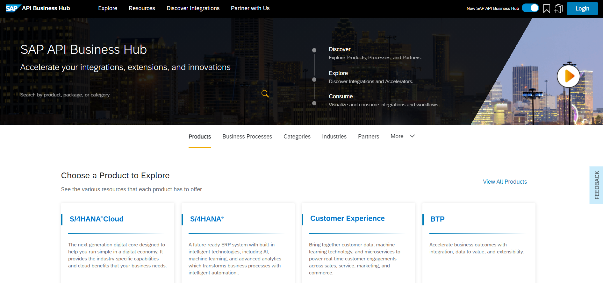
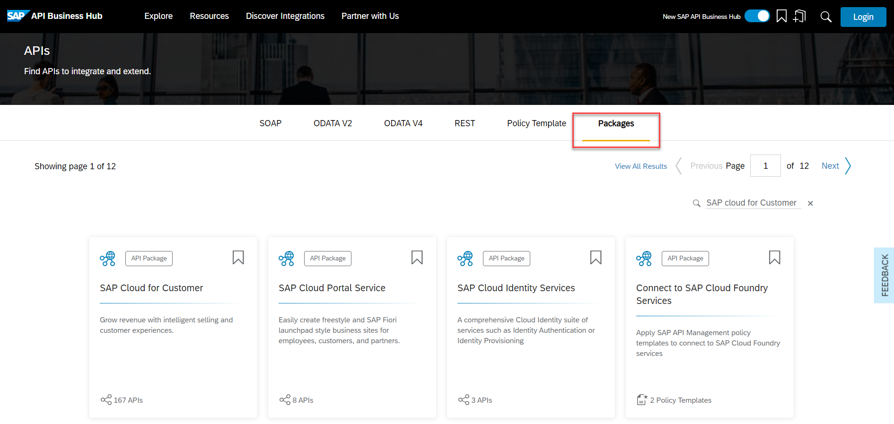
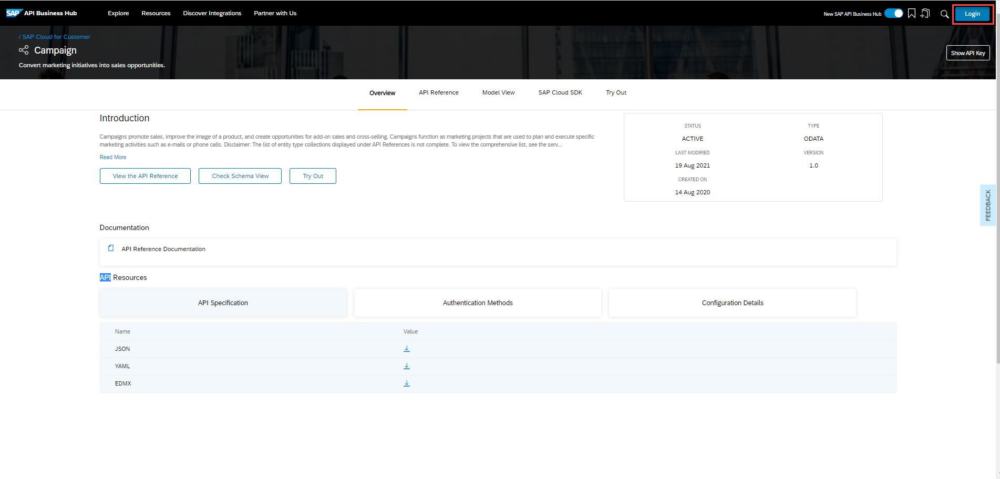
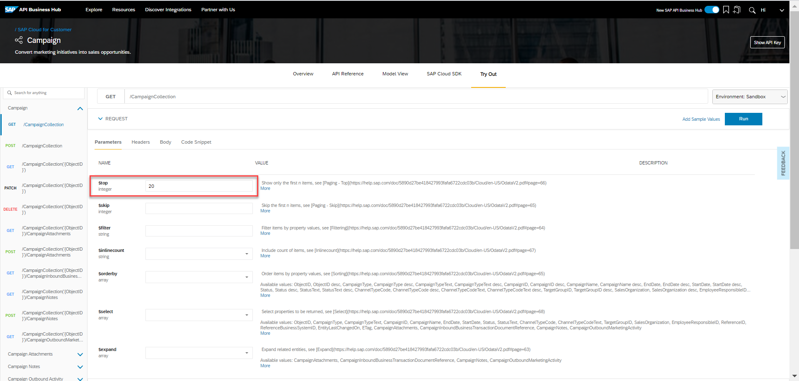
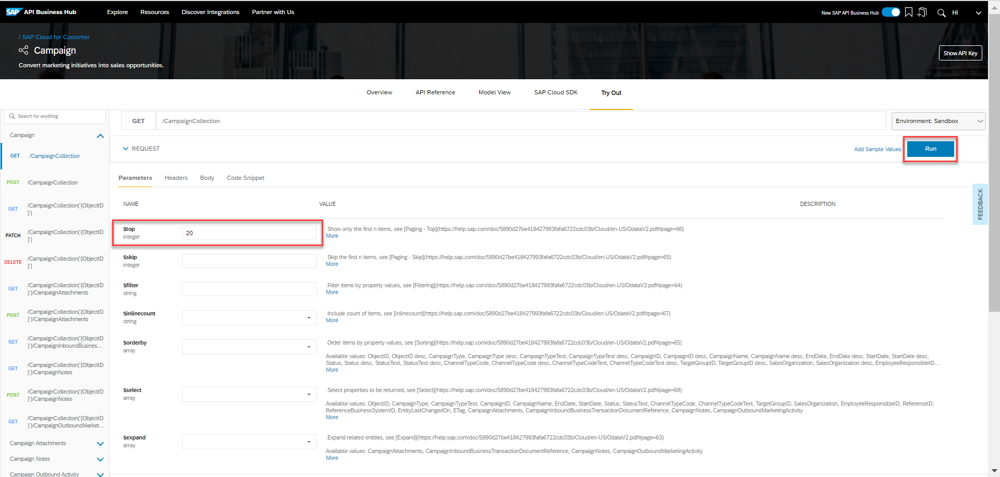
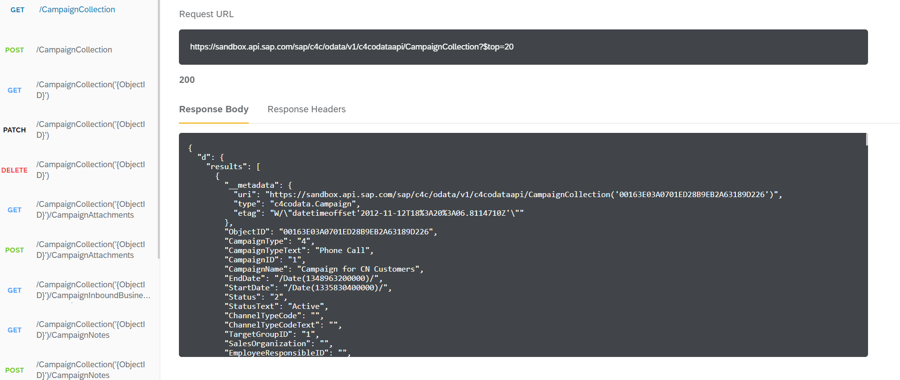

## Prerequisites  
 - **Proficiency:** Beginner

## Next Steps
 - [Testing API Business Hub APIs with Curl](https://developers.sap.com/tutorials/hcp-abh-test-locally.html)

## Details
### You will learn  
Want to learn more about the new SAP API Business Hub? Not sure where to get started? Find more about how to find and enable the SAP API Business Hub in your SAP Cloud Platform instance. Once you are in the SAP API Business Hub, start learning about and testing one of the many available APIs.

### Time to Complete
**15 Min**.

---

[ACCORDION-BEGIN [Step 1: ](Open SAP API Business Hub)]
Go to [api.sap.com](https://api.sap.com/).

[DONE]
[ACCORDION-END]

[ACCORDION-BEGIN [Step 2: ](Find the APIS in the Hub)]
On the SAP API Business Hub homepage, select **APIs** under _Content Types_ to see the available packages in the API Business Hub.

This will take you to the APIs section on the Homepage. Select the **View More** link to see all available APIs.

This will take you to API listing on the SAP API Business Hub.

[DONE]
[ACCORDION-END]

[ACCORDION-BEGIN [Step 3: ](Select an API to use)]

In the search box, type `SuccessFactors` to find the all Success Factors APIs. Click the **Search Icon** or hit **Enter** to search.

This will bring up all the APIs relating to SuccessFactors.

Click on the **SAP Success Factors Foundation/Platform** package.

This will bring up the SAP SuccessFactors Foundation/Platform API artifact details.

[DONE]
[ACCORDION-END]

[ACCORDION-BEGIN [Step 4: ](Test the API in the Hub)]
Let's select an API to test and see some results. Select the **User Management** tile.

In order to test the API in the API Business Hub, you need to login. Click the **Log On** button at the top of the page to do so.

When you look at the API Documentation again for the `GET /User` endpoint, you will see a _Parameters_ section with a bunch of fields. To test different query parameters, you need to click the **Try Out** button on the API endpoint.

This will enable to Parameter fields to make them editable. You can test different query parameters by providing a value in the input of the specified data type for that parameter.

The `GET /User` method will return a list of users from Success Factors. That could be a long list, so set the `$top` parameter to **5**. The top parameter tells the query to retrieve only the top _n_ results once all the other filtering is done. In the `$select` parameter, using the _control_ key for Windows or _command_ key for Macs, select `firstName`, `lastName`, and `jobTitle`. This will limit the data set returned to this 3 fields for the matching results. If you don't need to see all a users data, only select data points, you can use the `$select` parameter to pick the data you want. This will help reduce the size of the resulting data set if performance is an issue.

Once your parameters are all set, click the **Execute** button at the bottom of the documentation for that method.

If there aren't any issues, you will see the resulting request URL and the response body (in `JSON`) on your page.

Feel free to keep playing around in the SAP API Business Hub to better understand the methods available in the User Management API.

[VALIDATE_4]
[ACCORDION-END]
