 
# Create an SAP Mobile Services App for the SAP Service and Asset Manager Mobile App
<!-- description -->Create and update an SAP Mobile Services app for the SAP Service and Asset Manager mobile app using the Mobile Services App Create program /MERP/CORE_CPMS_APPCREATE_PROG in the SAP GUI.

## Prerequisites
- Access to SAP BTP Mobile Services service in your SAP BTP subaccount.
- Implement note 3329001 to get the latest updates for the MS App Create program.

## You will learn
- How to create and update an SAP Mobile Services app using the MS App Create program.
- How to review the created MS app.
- Additional options to use RFC Destination and add 'sap-client' header to the destinations.
- How to troubleshoot.

## Intro
In this mission you will learn how to create and update an SAP Mobile Services app for the SAP Service and Asset Manager mobile app using the Mobile Services App Create program **`/MERP/CORE_CPMS_APPCREATE_PROG`** in the SAP GUI. The Mobile Services app created by the program may be used to On-Board your SAP Service and Asset Manager mobile app.

---

### Gather the Required Information

1. **Admin API link**. The Admin API link can be found in the 'Important Links' section of the SAP BTP Mobile Services service in your SAP BTP subaccount.

    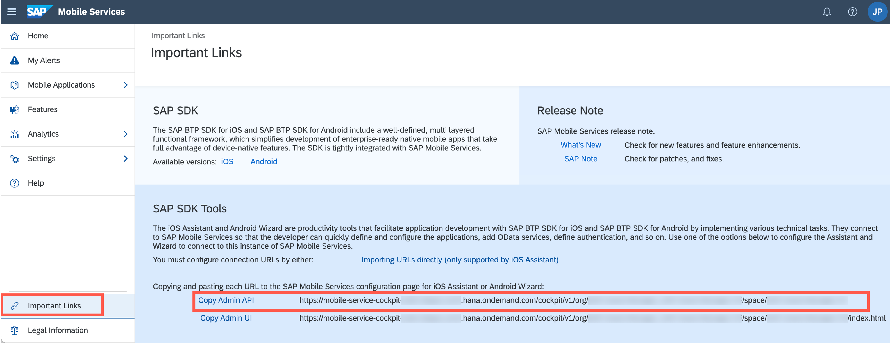

2. **SAP Cloud Connector Location Id, Virtual Host & Port**. The SCC Location Id, Virtual Host & Port can be found in the Cloud Connector section of the SAP BTP Cockpit for your subaccount.

    

    1. **SAP Cloud Connector Location Id**: The Location Id is within the parenthesis (i.e., `ConvergedCloud`). If there are no parenthesis, then the Location Id is not required.

    2. **Virtual Host & Port**: The Virtual Host and Port are separated by a colon (i.e., `<host>`:`<port>`).


### Create the Mobile Services App via the MS App Create Program

1. Execute report **`/MERP/CORE_CPMS_APPCREATE_PROG`** in **SE38**, then choose a variant.
    
    

2. Fill in the **Admin API, SCC Location Id, Virtual Host & Port** and execute.
   
    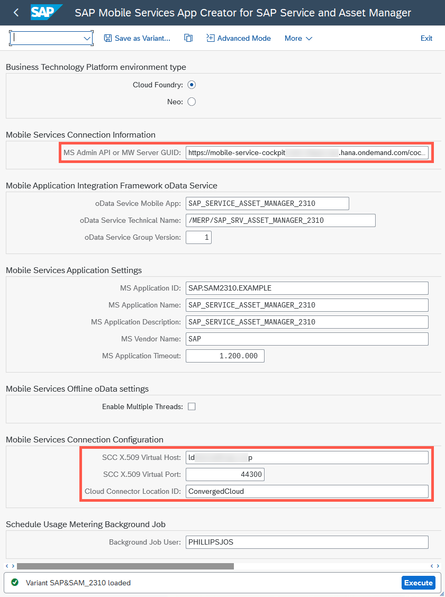

    >**IMPORTANT:** The Background Job User is used to schedule the Usage Metering background job with daily frequency. If no user is provided, then the user executing the program is used. Please ensure the Background Job User will maintain authorization to run background jobs.
   
3. If you receive a prompt to sign-in after execution, please use your SAP BTP sign-in credentials to sign-in.

    

4. Take note of the **Mobile Services App ID, Middleware Server and Background Job** name.

    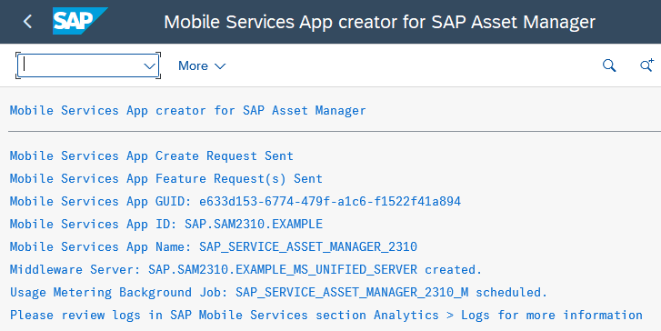

    >Please allow ~5 minutes to complete processing.

    Your Mobile Services app is now created and can be viewed within the SAP Mobile Services service in your subaccount.

5. The application can be updated by re-executing the program with and selecting the features to update when prompted. See additional info for each option below.

    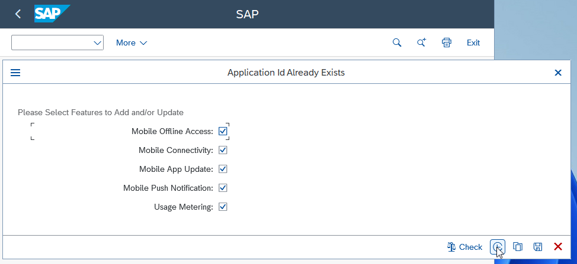

    | Feature                  | What is Updated?                                                                                                       |
    | :----------------------- | :--------------------------------------------------------------------------------------------------------------------- |
    | Mobile Offline Access    | Updates the offline configuration file of your app                                                                     |
    | Mobile Connectivity      | Updates the offline and online destination settings of your app                                                        |
    | Mobile App Update        | Assigns the feature to your app if not already assigned                                                                |
    | Mobile Push Notification | Assigns the feature to your app if not already assigned                                                                |
    | Usage Metering           | Creates Usage Metering Middleware Server and Background Job. Existing Middleware Server and Background Job are deleted |


### Review the Created Mobile Services App

1. In the **Native/MDK** section of the SAP Mobile Services service for your subaccount you should see your app in a **Started State** with the **MS Application ID** provided in the selection screen during step 2 of the app creation.

    

2. Select your app to see the Assigned Features. The following features should be assigned to your app:

    

    | Assigned Feature         |
    | :----------------------- |
    | Mobile App Update        |
    | Mobile Connectivity      |
    | Mobile Offline Access    |
    | Mobile Push Notification |
    | Mobile Settings Exchange |

3. Select the Mobile Connectivity feature. You should see two destinations created. Clicking the **Launch in Browser Action** should return the metadata, if prompted to sign in after clicking the **Launch in Browser Action** then please see troubleshooting step 1.
   
   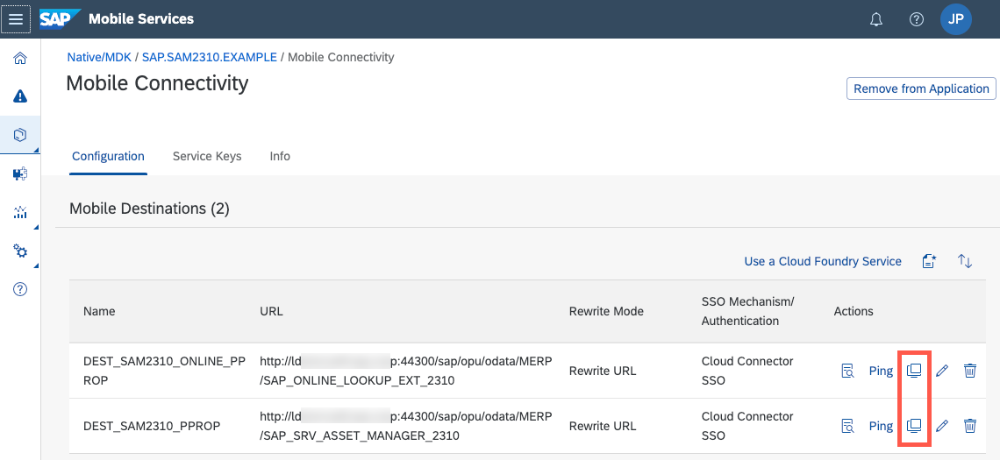

   1. **Launch in Browser Action**


   | Destination Name                 | Destination Path                                      |
   | :------------------------------- | :---------------------------------------------------- |
   | `DEST_SAM<version>_PPROP`        | `/sap/opu/odata/MERP/SAP_SRV_ASSET_MANAGER_<version>` |
   | `DEST_SAM<version>_ONLINE_PPROP` | `/sap/opu/odata/MERP/SAP_ONLINE_LOOKUP_EXT_<version>` |

4. If you select the Service keys tab in the Mobile Connectivity feature you should see a key with an alias matching your system and client. If the key is missing, then please see troubleshooting step 3. 

    

5. If you select the Mobile Offline Access feature you should be able to display the offline configuration file. The name in the file should match the destination name `DEST_SAM<version>_PPROP`. If the offline configuration file does not exist, then please see troubleshooting step 2.

    
    
    Example File Snippet:

    

6. The onboarding QR Code is available in the APIs tab of your application.
    
    

7. In the Admin Panel (transaction **/SYCLO/ADMIN**) verify that the Metrics Middleware Server created by the App Create program has the properties below. If the middleware server and/or properties are missing the please see troubleshooting step 5.

    

    | Property               | Value                                          |
    | :--------------------- | ---------------------------------------------- |
    | Mobile Application     | `<mobile_app>`                                 |
    | Server Name            | `<ms_app_id>_MS_UNIFIED_SERVER`                |
    | `Middleware Svr SerNo` | SCP                                            |
    | Server GUID            | `<autogenerated_guid>`                         |
    | Port                   | 00443                                          |
    | UI Host Name           | `https://example.cfapps.sap.hana.ondemand.com` |

    

    | Property Group | Property Name  | Property Value                         |
    | :------------- | :------------- | :------------------------------------- |
    | METERING       | X-API-Key      | `<autogenerated_key>`                  |
    | METERING       | `service_path` | `/mobileservices/service-key/metering` |

8. Verify the Metrics Background Job is scheduled in transaction **SM37** with a daily frequency. If the background job is missing, then please see troubleshooting step 5.
   
   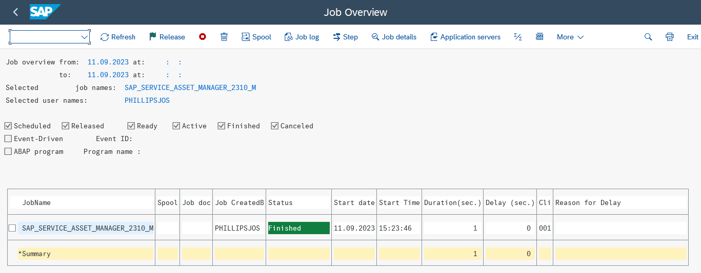

   Display Job:

   


### Additional Options

1. Create the MS App using an RFC Destination (Middleware Server).

   1. In transaction **SM59**, create an RFC destination and fill out the Target System settings. The Target Host and Path Prefix can be derived from the MS Admin API (see example below). Please ensure you append **`/app`** to the Path Prefix as it is not part of the Admin API by default. The **HTTP Proxy Options** are available in the RFC Destination Technical Settings if required.

        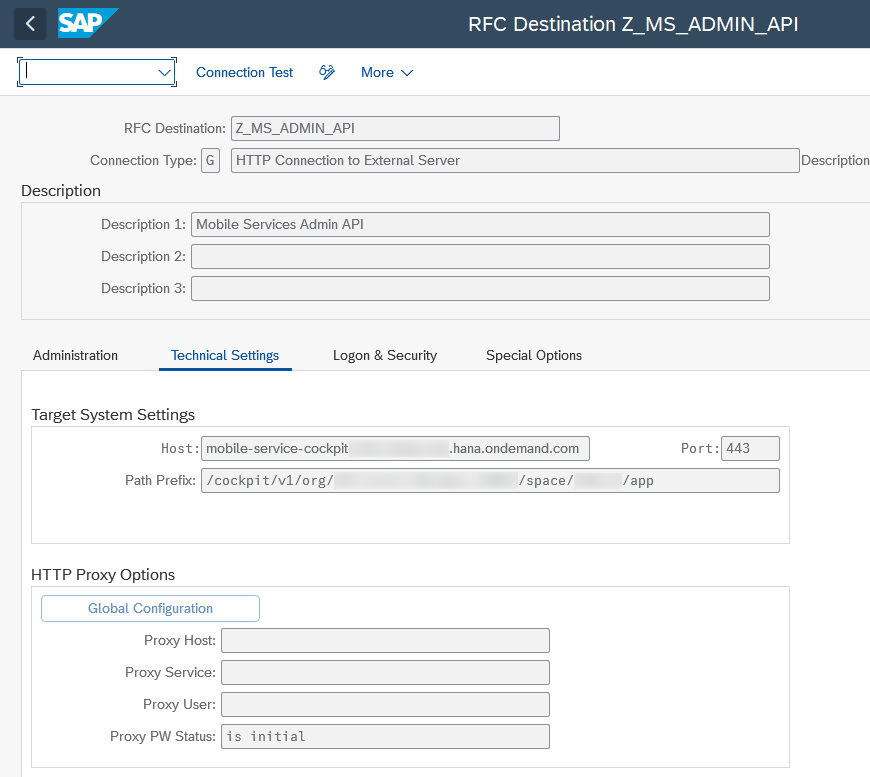

        | Setting           | Value                                                      |
        | :---------------- | :--------------------------------------------------------- |
        | Target Host       | **`mobile-service-cockpit-example.sap.hana.ondemand.com`** |
        | Service No.(Port) | **`443`**                                                  |
        | Path Prefix       | **`/cockpit/v1/org/ExampleOrg/space/ExampleSpace/app`**    |
    
    2. In the **Logon & Security** tab of your RFC destination please activate the **SSL** setting. Using **Basic Authentication** is optional. Using Basic Authentication will bypass the sign-in prompt during step 3 of the app creation. If you are using **Basic Authentication** then please provide your SAP BTP credentials as the User and Password.

        

        | Setting | Value        |
        | :------ | :----------- |
        | SSL     | **`Active`** |

   2. Go to the Admin Panel (transaction **/SYCLO/ADMIN**) and navigate to the **Administration** > **Server Management** section. Click **Create** to create a new Middleware Server.

          
    
    3. Please fill out the required information below and click **Save**.

         

        | Property               | Value                      |
        | :--------------------- | :------------------------- |
        | Mobile Application     | **`<mobile_app>`**         |
        | Server Name            | **`Z_MS_ADMIN_API`**       |
        | Server GUID            | **`<autogenerated_guid>`** |
        | Port                   | **`07003`**                |
        | `Middleware Svr SerNo` | **`SCP`**                  |
        | RFC Destination        | **`Z_MS_ADMIN_API`**       |

   3. The generated Middleware Server GUID can now be used in the selection screen of the App Create program instead of the Admin API during step 2 of the app creation. The Middleware Server can also be searched for from the selection screen of the App Create program using F4 Help.

        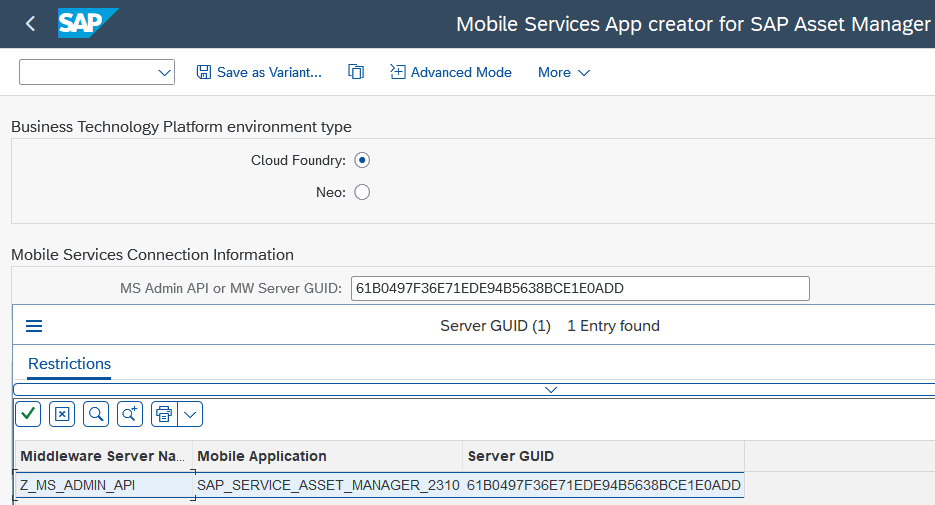 

2. Add the **sap-client** header to the offline and online destinations.
    
    1. In the selection screen of the App Create program click **Advanced Mode**.

         
    
    2. Under the Mobile Services Connection Configuration, fill out the Destination Headers for the offline and online destinations with
        ```JSON
        {"name": "sap-client", "value": "<client>", "overwrite": false}
        ``` 
        substituting `<client>` with the desired client.

        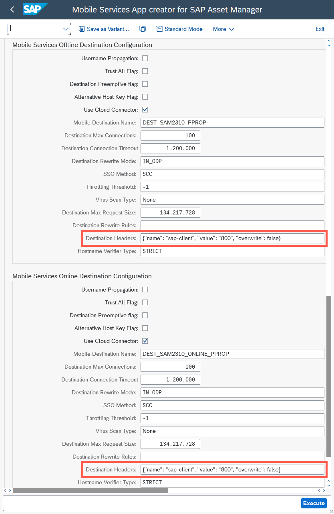 


### Troubleshooting

1. After selecting the **Launch in Browser Action** for the destinations created, a sign-in prompt appears.

    

    1. To fix, add the **sap-client** header to the offline and online destinations by following the steps for Additional Option 2, or by editing each destination in the SAP Mobile Services Mobile Connectivity feature.

        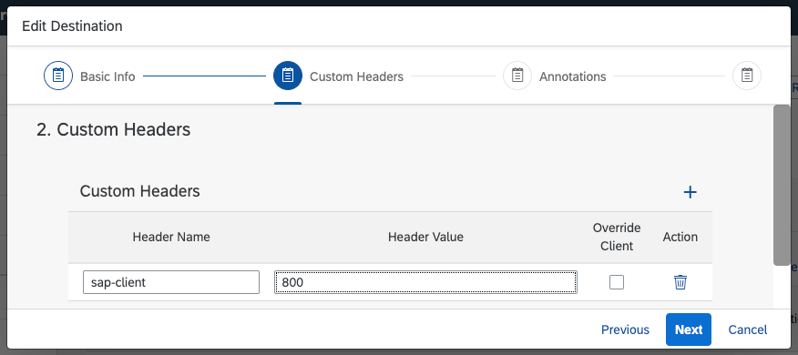 

        >Click **Next** to go through the settings and then click **Save**.

        | Header Name | Header Value |
        | :---------- | :----------- |
        | sap-client  | `<client>`   |

        Substitute `<client>` with the desired client.


2. Missing Offline Configuration file

   1. Follow step 5 of the app creation and select **Mobile Offline Access** feature when prompted. The offline configuration file will be re-generated and sent to SAP Mobile Services. If the file is still missing in Mobile Services, you may try the next step.

   2. Alternately, you may generate the file using the Offline Configuration program **`/MERP/CORE_OFFLINE_CONFIG_PROG`**. The generated file can then be uploaded in the SAP Mobile Services Mobile Offline Access feature for your app.

        1. Execute the program **`/MERP/CORE_OFFLINE_CONFIG_PROG`** in **SE38**, then select a variant and execute. Please ensure to save the file with a `.ini` file extension.

            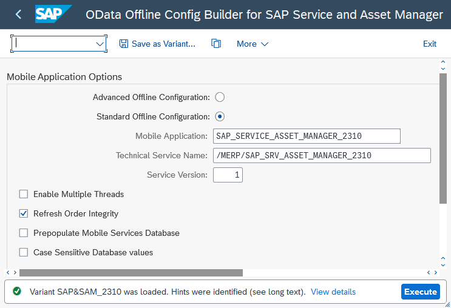 
    
        2. Upload the file in the Mobile Offline Access feature of your app.

            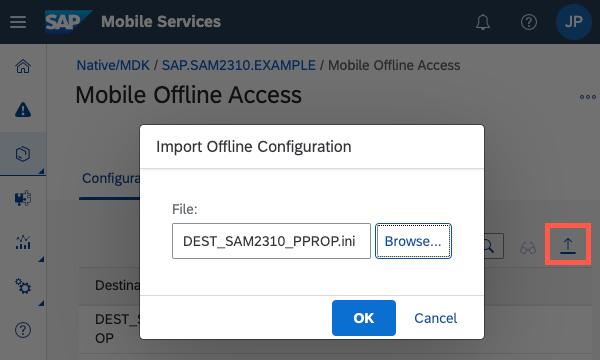 

3. Metrics Middleware Server Missing and/or Properties Missing.

   1. Follow step 5 of the app creation and select **Usage Metering** feature when prompted. If the Metrics Middleware Server is still missing, you may try the next steps.

   2. Go to the Admin Panel (transaction **/SYCLO/ADMIN**) and navigate to the **Administration** > **Server Management** section. Click **Create** to create a new Middleware Server with the following values:

        

        | Property               | Value                                          |
        | :--------------------- | ---------------------------------------------- |
        | Mobile Application     | `<mobile_app>`                                 |
        | Server Name            | `<ms_app_id>_MS_UNIFIED_SERVER`                |
        | `Middleware Svr SerNo` | SCP                                            |
        | Server GUID            | `<autogenerated_guid>`                         |
        | Port                   | 00443                                          |
        | UI Host Name           | `https://example.cfapps.sap.hana.ondemand.com` |
        >The UI Host name can be found in the APIs tab of the Mobile Services app created.
        >
        >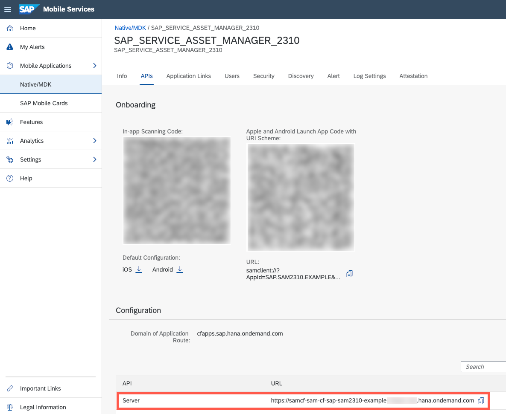 

   3. Add the following properties to the Middleware Server (case sensitive).

         

        | Property Group | Property Name  | Property Value                         |
        | :------------- | :------------- | :------------------------------------- |
        | METERING       | X-API-Key      | `<key>`                                |
        | METERING       | `service_path` | `/mobileservices/service-key/metering` |
        >**IMPORTANT:** To generate X-API-Key go to the Mobile Connectivity feature in your Mobile Services and select the **Service Keys** tab. Click **+** to add a service key with the following values:
        >
        >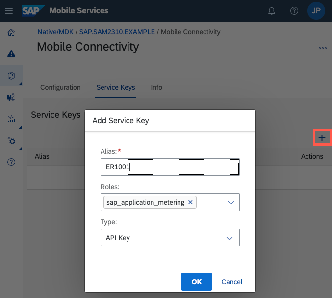 
        >|Property|Value|
        >|:-|:-|
        >|Alias|Any Alias is okay (i.e., **`PR1`**)|
        >|Roles|**`sap_application_metering`**|
        >|Type|**`API Key`**|
        >
        >Copy the generated key.
        >
        >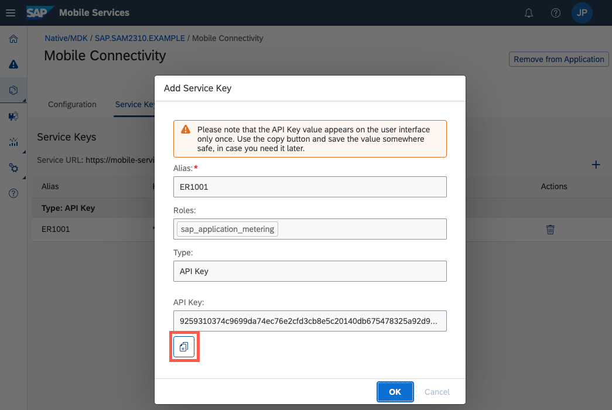 

4. Metrics Background Job Missing.

   1. Follow step 5 of the app creation and select **Usage Metering** feature when prompted. If the background job is still missing, you may try the next step.

   2. Execute report **`/MFND/CORE_CLOUD_METRICS_PROG`** and provide Mobile Application. Then click **F9** or select menu option **Program** > **Execute in Background**. Click **Date/Time** and set **Period Values** to **Daily** then click **Save**

        
