## Prerequisites
 - SAP Screen Personas SP06 or higher
 - Completion of the **Build a Simple SAP Screen Personas Dashboard** tutorial

## Details
### You will learn
  - How to further simplify screens in SAP Screen Personas
  - How to insert scripts into your SAP Screen Personas flavors

The focus of this tutorial is on simplifying the main screen of transaction IW51 (Create Service Notification) so that it can be used on a tablet. Not only does this involve hiding unneeded fields, but also adding barcode scanning functionality to make it simpler for users to enter the relevant equipment number. By the end of this tutorial, you will have a completed mobile app for a tablet. The next tutorial will cover optimizing the app for tablet and mobile phone use by modifying the spacing and size of screen objects to best fit on each device.

---

[ACCORDION-BEGIN [Step 1: Open IW51](Open IW51)]
In the previous tutorial, you created a new flavor that featured a simple dashboard for your users to access transaction IW51. You must now navigate to the main screen of the transaction to begin simplifying it. In order to do so, open your flavor and click the **Create Notification** button you created in the last tutorial.

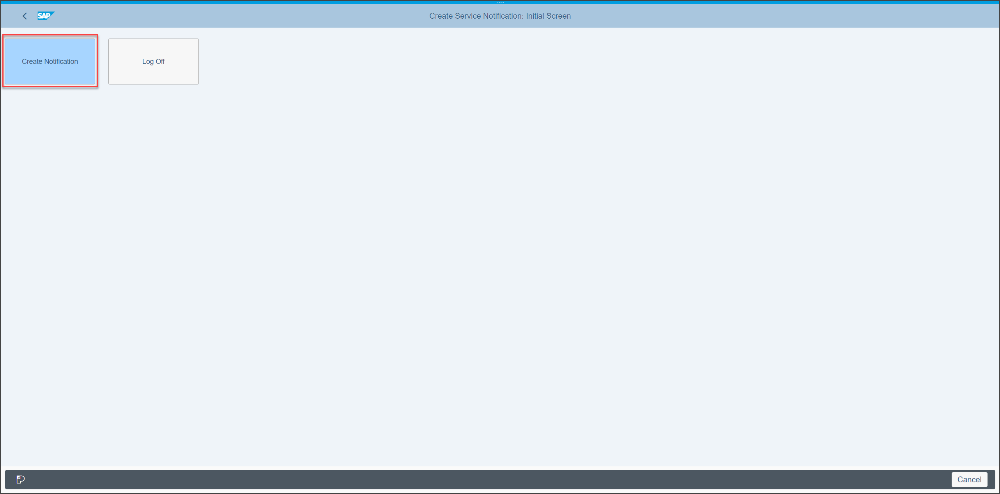

You will then navigate to this screen:

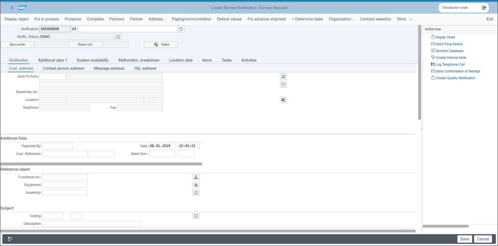

This will be the basis of your app. To simplify this screen, you will hide the fields, tab strips, and other objects not needed by your users.


[DONE]
[ACCORDION-END]

[ACCORDION-BEGIN [Step 2: Simplify the main screen](Simplify the main screen)]
To begin, open the SAP Screen Personas **flavor editor**. The first step in simplifying this flavor is hiding the **Action Box** container on the right side of the screen. Select it and then click **Hide**.

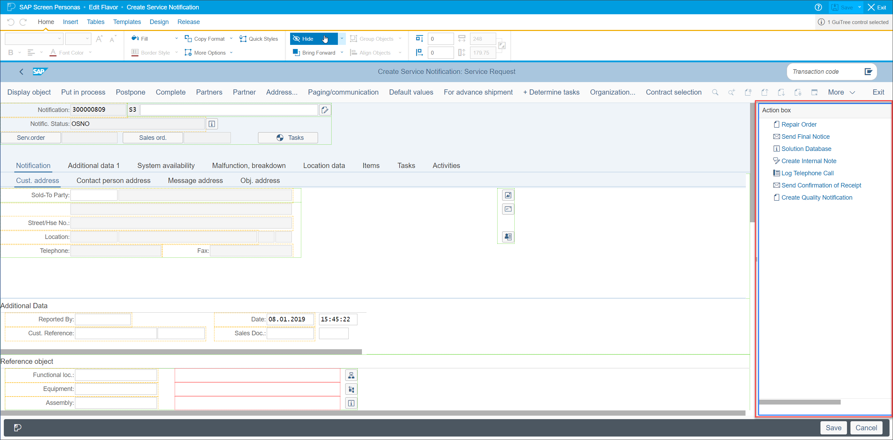

Your flavor should now have empty space on the right and should look like this:

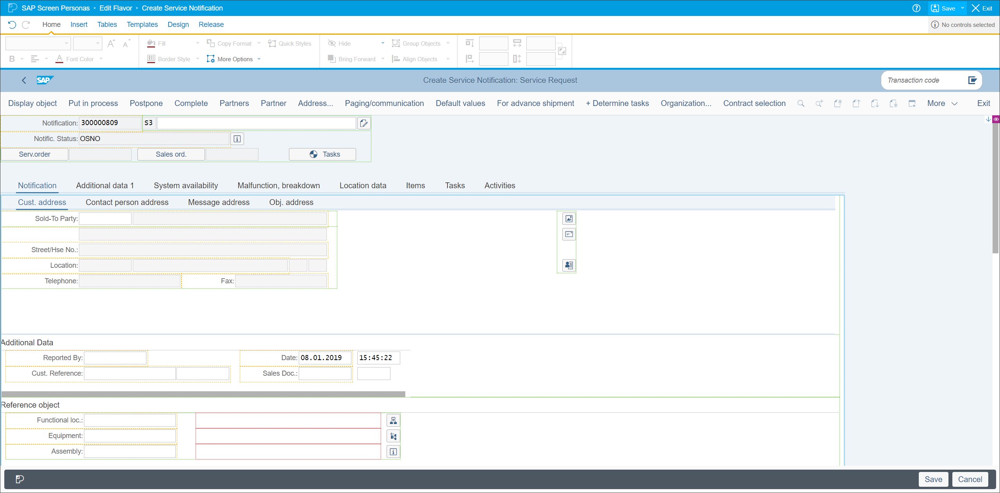

You also do not need the **Notification** container. Select the area around the fields to select the entire container, rather than the individual fields and labels, and click **Hide** again.

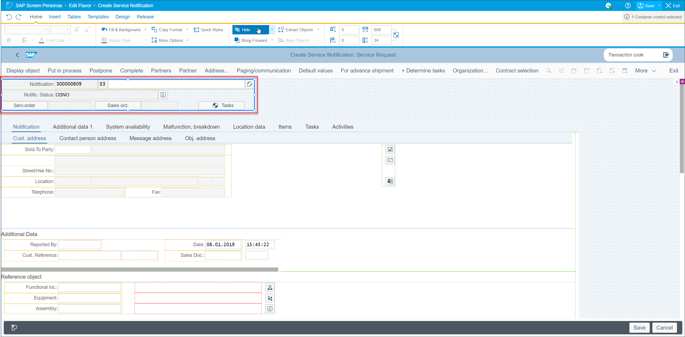

Your screen should now look like this:

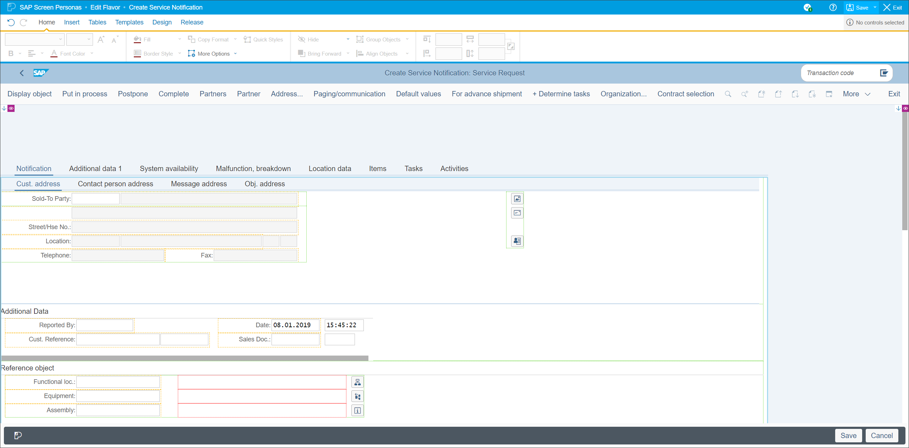

Next, you will hide the entire tab strip. Before you can do that, however; you must remove some of the fields that you wish to keep.

Select the container with the **Sold-To Party** and contact information, then drag it out of the tab strip.
>This container is nested. You will have to click on it several times to select it instead of the various objects in the tab strip.

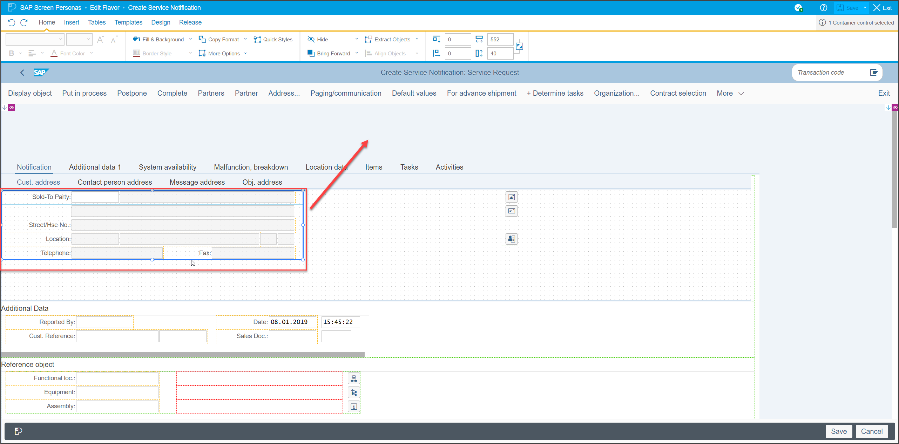

Next, you will move the **Functional Location** and **Equipment** fields out of the tab strip, just like the previous container. Select the **Functional Location** and **Equipment** labels and fields and drag them next to the container your previously removed.
>You can multi-select objects by pressing and holding **`CTRL`** while clicking on them

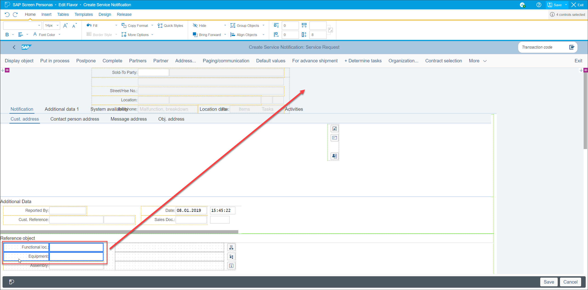

Your users also require the **Description** field and long text box. They can be found in the **Subject** group box further down on the screen. Select the **Description** label, field, and long text box and drag them out of the tab strip. Place them next to the other screen objects removed from the tab strip.

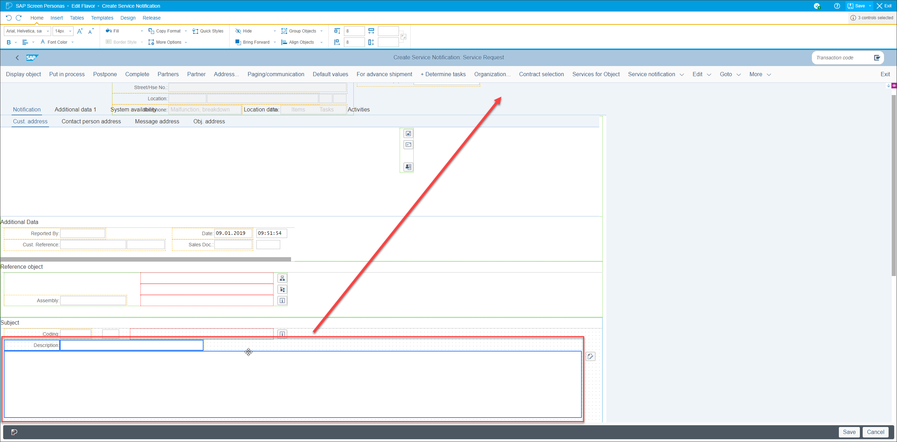

The last group of required fields are **Required Start**, **Malfunction Start**, **Required End**, and **Malfunction End**. They can be found in the **Execution** group box. Select them and drag them out of the tab strip.

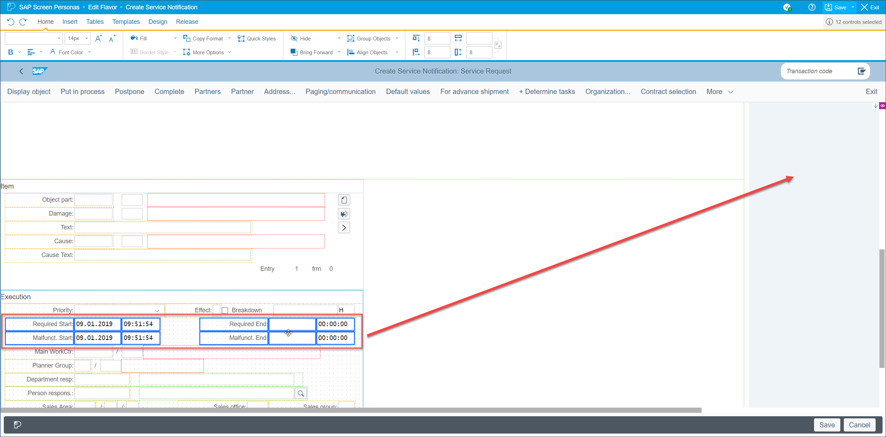

You are now ready to hide the rest of the tab strip. Click its top left corner to easily select the entire object and click **Hide**.


The next screen simplification involves hiding the top toolbar. Since your users will not need it, select it and click **Hide**.

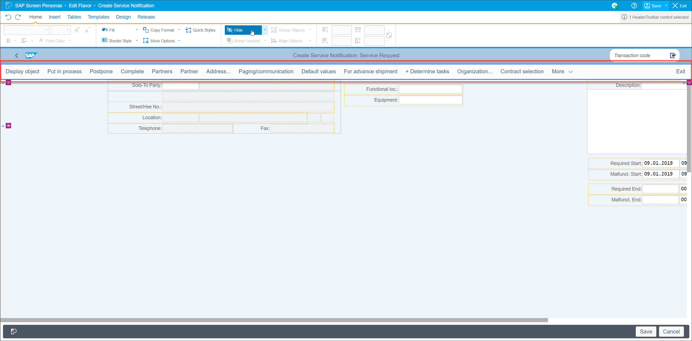

Finally, since you are building this flavor for a tablet, your users do not require the transaction code field or the small **Save** and **Cancel** buttons. Select and hide them. The **Save** and **Cancel** buttons will be replaced with buttons meant for touch interaction after you rearrange the screen.


At this point, your screen should only contain the fields required for your app. While their placement may differ, based on where you placed them outside of the tab strip, your screen should look similar to this:

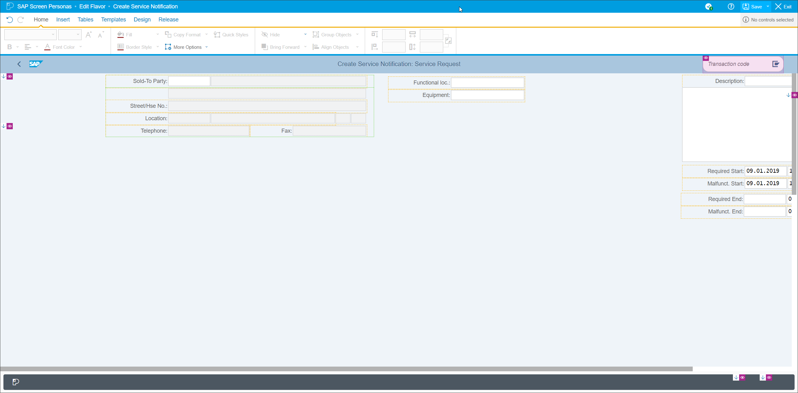

At this point, you are finished with hiding screen objects. You will now arrange the remaining objects so that they can more easily be used by someone on a tablet.

[DONE]
[ACCORDION-END]


[ACCORDION-BEGIN [Step 3: Arrange the Required Fields](Arrange the required fields)]

In order to make your app more user friendly, as well as more aesthetically pleasing, you will now tidy the screen by grouping the previously scattered fields together. To begin, select your the container with the **Sold-To** and contact information and move it to the left side of the screen. Using the control in the **Home** tab, ensure the container is still selected and give it the following coordinates: **`25pt`** down and **`10pt`** right.


Next, you will move the fields containing the relevant date information for the malfunction. Multi-select the **Required Start** label and fields and give them the following coordinates: **`70pt`** down and **`10pt`** right.

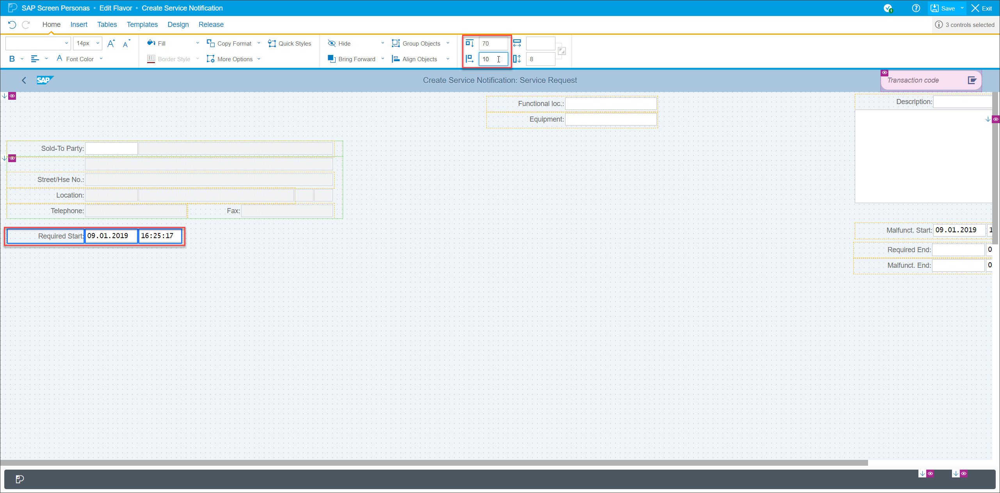

Similarly, multi-select the **Required End** label and fields. Give them the following coordinates: **`80pt`** down and **`10pt`** right.


Once the **Required** fields are in place. Multi-select the **Malfunction Start** label and fields and give them the coordinates, **`95pt`** down and **`10pt`** right.


Then multi-select the **Malfunction End** label and fields and give them the coordinates **`105pt`** down and **`10pt`** right.

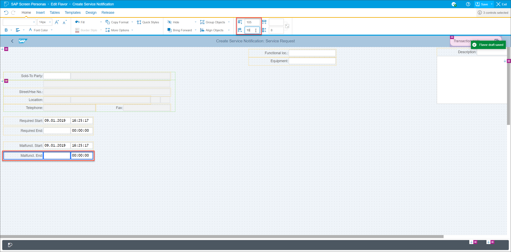

With the date and time information in place, you will now put the **Functional location** and **Equipment** fields in position. Multi-select the **Functional location** and **Equipment** fields and labels and give them the coordinates **`120pt`** down and **`10pt`** right.


Lastly, you will put the description fields into place. Multi-select the **Description** label and short text field and give it the coordinates **`25pt`** down and **`575pt`** right. You will then place the long text field below, with the coordinates **`34pt`** down and **`575pt`** right. To finish up with the long text box, change its dimensions using the fields in the **Home** tab. It should be **`456pt`** wide and **`122pt`** tall.

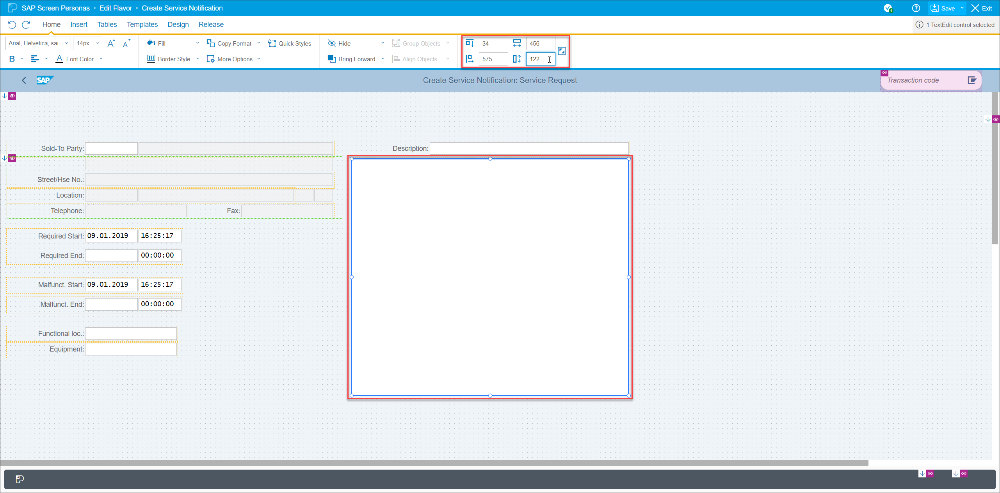

With the fields in the proper position, you will now perform one last adjustment to the labels by making them left aligned. Multi-select all of the labels on screen and select **`Left Align`** using the text alignment tool in the **Home** tab.

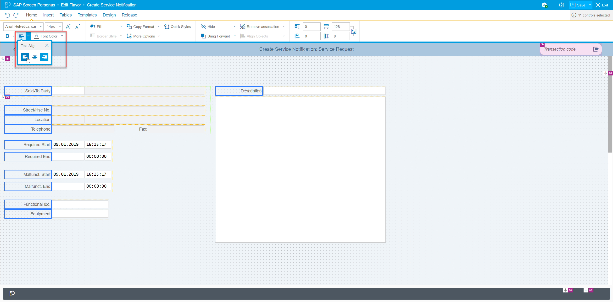

You have now completed the bulk of the modifications for this flavor. It should look like the screen below:


[DONE]
[ACCORDION-END]

[ACCORDION-BEGIN [Step 4: Create Save and Cancel buttons](Create Save and Cancel buttons)]
To begin wrapping up this application, you will now add larger **Save** and **Cancel** buttons to your screen that are better suited for touch interaction.

You will begin by creating a **Save** button. To do so, click on **Menu Items Button** in the **Insert** tab.

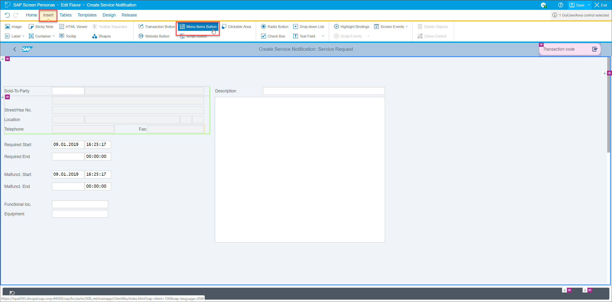

This will open a pop-up where you can give the button a label and select its function. Enter **`Save`** as the label text and select **`Service Notification/Save`** as the Menu Item type. Click **Done** to create the button.

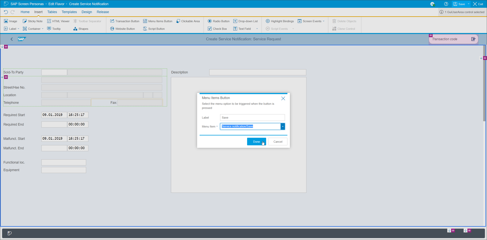

Now you are going to modify the button. First, to ensure that it is aligned with all of the labels, place it at the following coordinates: **`5pt`** down and **`10pt`** right. Then change its dimensions to **`150pt`** wide and **`15pt`** tall. Lastly, change its fill color to a light blue using the **Fill & Icon** button in the **Home** tab.


Next you are going to create your **Cancel** button. Just like the **Save button**, begin by clicking on **Menu Items Button** in the **Insert** tab. Set the label text as **`Cancel`** and the Menu Item type as **`Edit/Cancel`**. Click **Done** to insert the button.

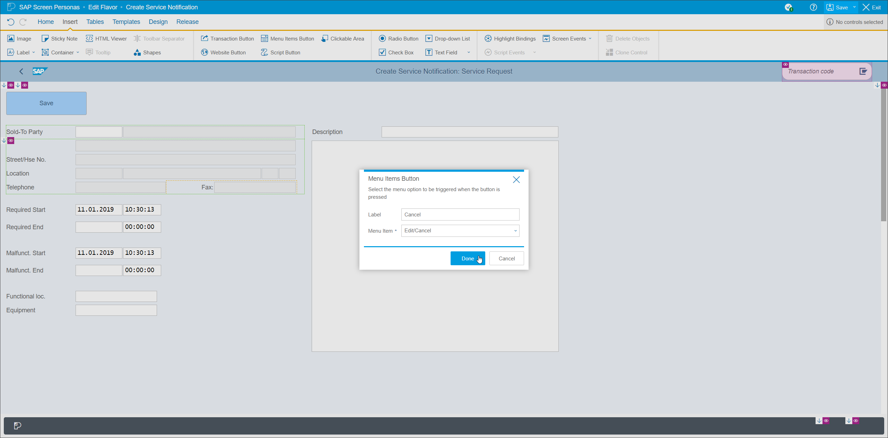

Give your new **Cancel** button the same dimensions as the **Save** button: **`150pt`** wide and **`15pt`** tall. Place it at the following coordinates: **`5pt`** down and **`175pt`** right.

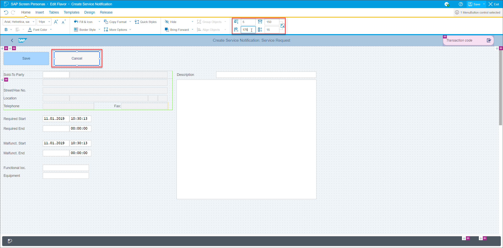

[DONE]
[ACCORDION-END]

[ACCORDION-BEGIN [Step 5: Create barcode scanning functionality](Create barcode scanning functionality)]

With all of the required functionality on the screen, your next step will be to give your users additional functionality to simplify service notification creation even further. This next step will give them access to a barcode scanner so that they do not need to manually enter the equipment number. Once completed, your users will be able to press a button to open the scanner, use their device's camera to scan the barcode, and then a script will populate the **Equipment** field.
>As this feature requires the use of a mobile device camera, it will not work when accessed on a desktop.

To begin, you need to create a script button. To do so, navigate to the **Insert** tab and click **Script Button**.

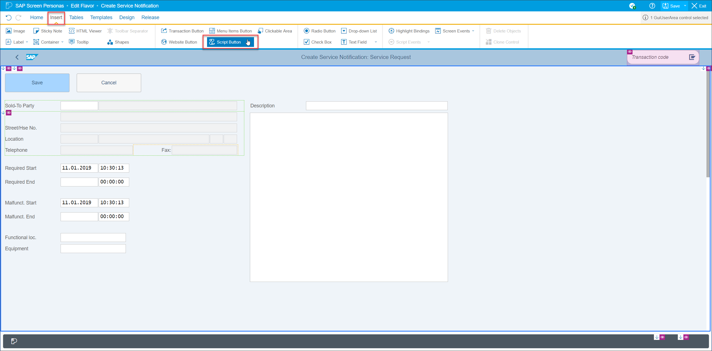

This will open a pop-up where you can enter the button label text. Enter **`Scan Equipment`** and click **Done** to insert the button.

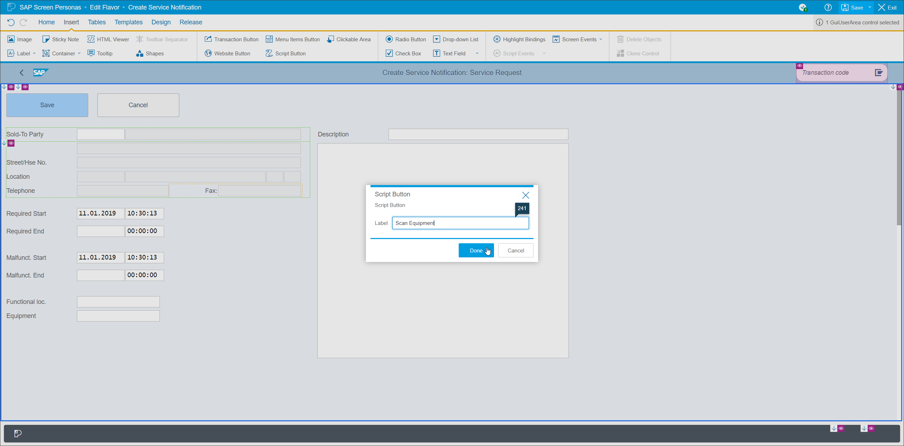

Next, you will enlarge the button so that it is easily pressed and easily noticed. Give it the following dimensions: **`278pt`** wide and **`15pt`** tall. Place it underneath the **Equipment** field, at **`141pt`** down and **`10pt`** right.

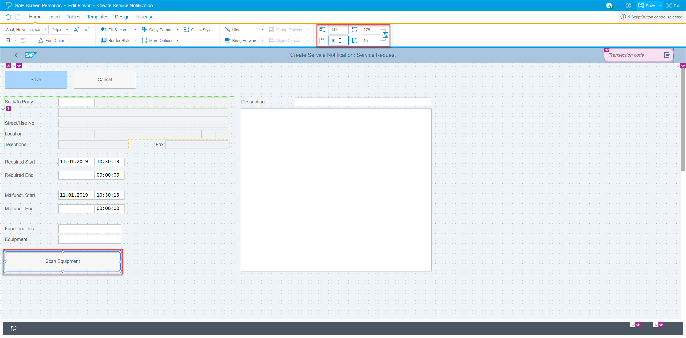

Now that your button is in position, you will now create the first of the two required scripts for the barcode scanner. This first script will open and enable the scanner. To access the **Script Editor**, you must first **Save** your flavor and then **Exit** the flavor editor.


Next, open the **Flavor Bar** and press the **Scripts** button to open the Script Editor.

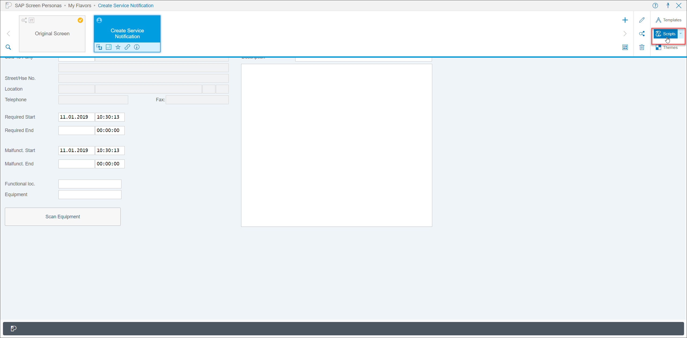

Now that you have opened the Script Editor, press the **Create Script** button.

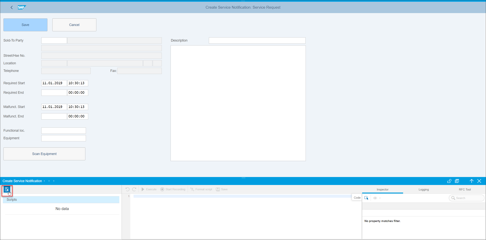

Title the script **`openScanner`** and click the **Confirm Creating New Script** button to add the script to your flavor.


Next, paste the following **`JavaScript`** code into the script window:

```JavaScript
// Callback functions for scanner
function scanSuccessCallback(result) {
                if (!result.cancelled) {
                                session.utils.put("scanvalue", result.text);
                                // This is called asynchronously, so the setText call is executed too late in Scripting Engine.
                                // It is already after ClientSideScriptEngine executing set property update for all the controls.
                                // So we use a 2nd script call to pick up async property update.
                                session.utils.executeScriptAsync("wnd[0]/scrptPersonas_UNIQUE_ID");
                } else {
                                session.utils.alert("Last scan cancelled");
                }
}

function scanErrorCallback(error) {
                session.utils.alert("Scanning failed");
}

if (cordova) {
	cordova.plugins.barcodeScanner.scan(scanSuccessCallback, scanErrorCallback);
} else {
	session.utils.alert("Native API access not supported");
}
```

Pay attention to the **`UNIQUE_ID`** placeholder in line 8. You will replace it with the script ID from your next script.

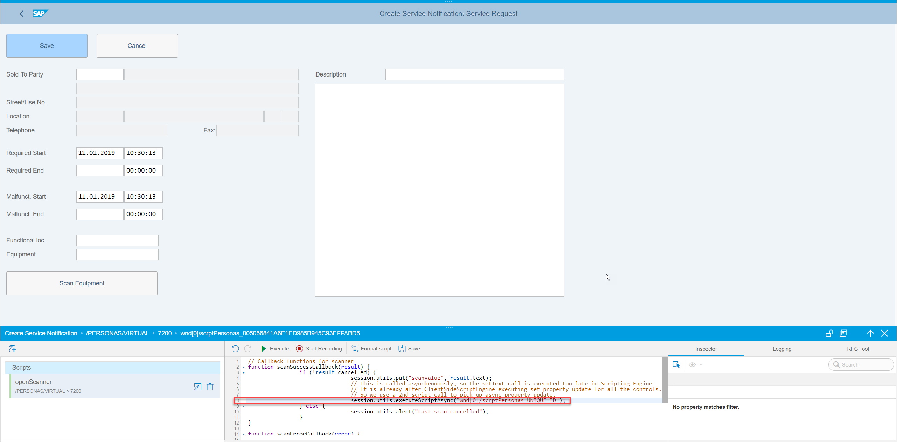

For now you will move on to create your next script, which will read the scanned value, write the equipment number into the **Equipment** field, and send that information to the backend.

**Save** the **`openScanner`** script and press the **Create New Script** button to create the next script. Name the next script **`writeBarcode`**. Then, paste the following **`JavaScript`** code into the script window:

```JavaScript
var sText = session.utils.get("scanvalue");
session.findById("wnd[0]/usr/tabsTAB_GROUP_10/tabp10\\TAB01/ssubSUB_GROUP_10:SAPLIQS0:7235/subCUSTOM_SCREEN:SAPLIQS0:7212/subSUBSCREEN_2:SAPLIQS0:7322/subOBJEKT:SAPLIWO1:0100/ctxtRIWO1-EQUNR").text = sText;
session.activeWindow.sendVKey(0);
```

Next, save your **`writeBarcode`** script and copy your script ID, as illustrated below. You need to it complete your **`openScanner`** script.
>**CAUTION:** Your script ID will differ from the one in this image.


To complete the **`openScanner`** script, open it by selecting it from the scripting window.


Now, delete the **`UNIQUE_ID`** placeholder in line 8 and replace it with your script ID from the **`writeBarcode`** script. Line 8 should now read like this: ` session.utils.executeScriptAsync("wnd[0]/scrptPersonas_005056841A6E1ED985B9A8C0E3532CB8");`


**Save** your **`openScanner`** script and exit the script editor.

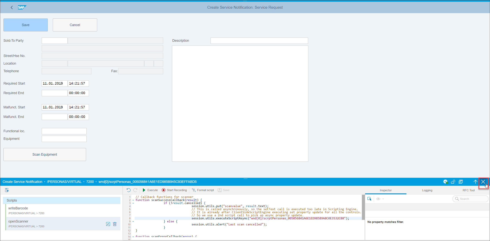

 Your final step is to bind the **`openScanner`** script to the **Scan Equipment** button. Reopen the flavor editor and select the button. Navigate to the **Insert** tab, click **Script Events**, scroll down to **`onClick`** and select your **`openScanner`** script. It will now be triggered every time the user clicks the button.

 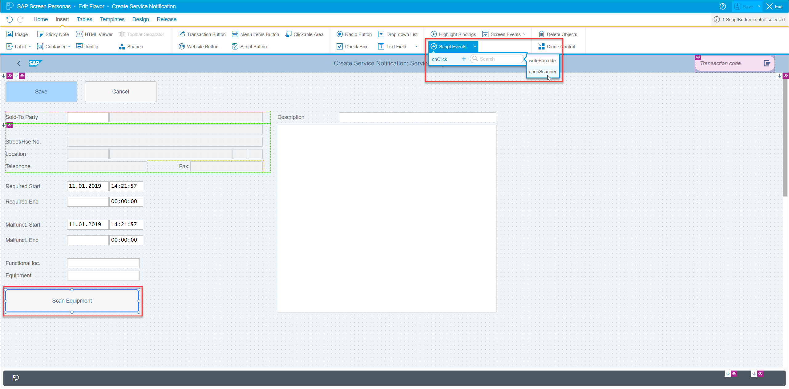

Your initial application is now complete. In the next tutorial, you will optimize this flavor for use on tablets and mobile phones though the use of **Adaptive Flavors** -- an SAP Screen Personas feature that allows you to create differently sized variations on your flavors.

[VALIDATE_1]

[ACCORDION-END]
---
