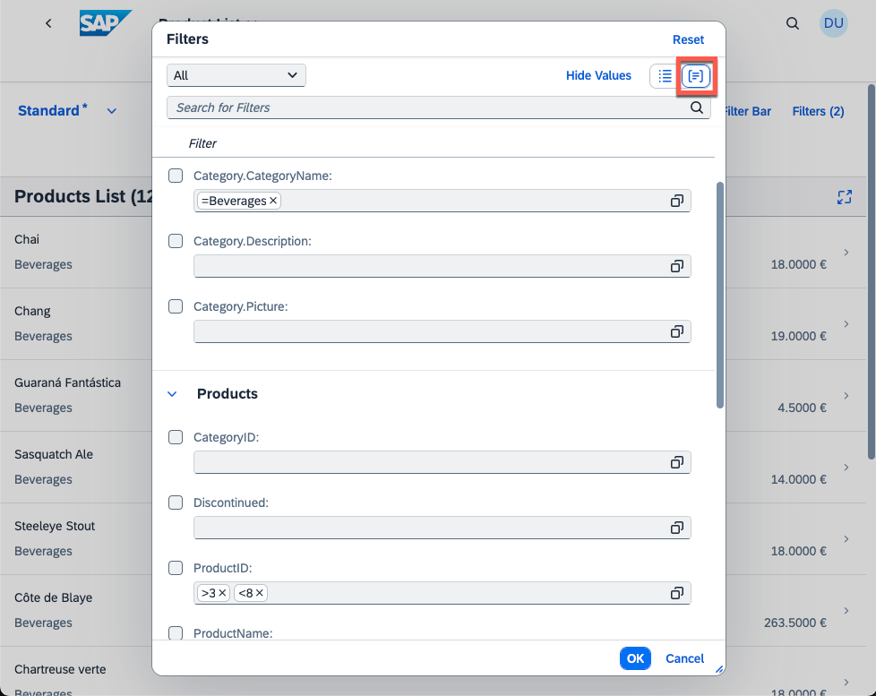
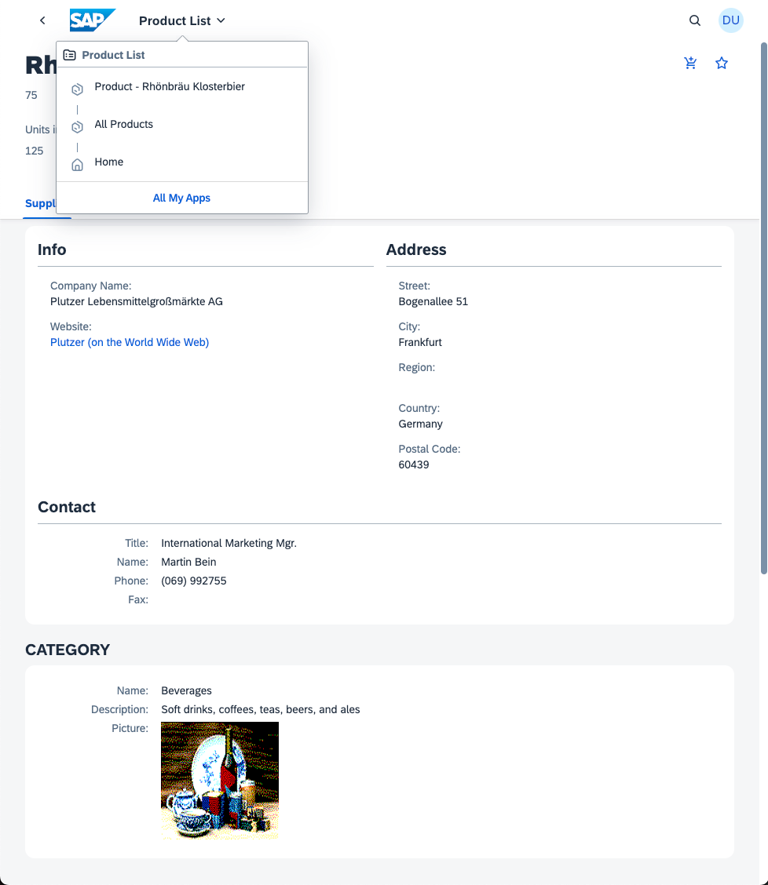

## Details
### You will learn
  - How to use smart controls like the `SmartFilterBar`, `SmartList`, or the `ObjectPage`
  - Why smart controls can save you much boilerplate code


---

[ACCORDION-BEGIN [Step : ](Enrich the products page)]
1. To import smart controls to the view, *add* new XML namespaces to the `uimodule/webapp/view/Products.view.xml` file.
2. Replace <Page> in the same view with a page that contains the smart controls `smartFilterBar` and `smartList`

```XML [2-4,6-12]
<mvc:View controllerName="tutorial.products.controller.Products" displayBlock="true"
xmlns="sap.m"
xmlns:smartFilterBar="sap.ui.comp.smartfilterbar"
xmlns:smartList="sap.ui.comp.smartlist"
xmlns:smartTable="sap.ui.comp.smarttable"
xmlns:mvc="sap.ui.core.mvc">
<Page id="Products">
  <smartFilterBar:SmartFilterBar id="smartFilterBar" persistencyKey="UniqueAndStablePersistencyKey" entitySet="Products" considerSelectionVariants="true" />
  <smartList:SmartList id="smartProductList" smartFilter="smartFilterBar" entitySet="Products" expandFields="Category" header="Products List" showRowCount="true" showFullScreenButton="true" enableAutoBinding="true">
    <smartList:listItemTemplate>
      <StandardListItem id="listTemplate" type="Navigation" press="handleListItemPress" title="{ProductName}" info="{= ${UnitPrice} + ' €' }" description="{Category/CategoryName}" />
    </smartList:listItemTemplate>
  </smartList:SmartList>
</Page>
</mvc:View>
```

Your page should now display product names and contain a smart header.

!

> Did you notice that the list items display the category names, even though the selected entity set [Products](https://services.odata.org/V2/Northwind/Northwind.svc/Products?$format=json) doesn't contain these values. We can still see it because we defined the property `expandFields="Category"` which expands the `CategoryID` to a full, nested entity. There is nothing we need to do, expect to define the field names to expand. All magic happens behind the scenes in the OData protocol.
    Feel free to remove this property from the view to see how the displayed data changes.


[DONE]
[ACCORDION-END]
[ACCORDION-BEGIN [Step : ](Use the smart filter bar)]

You've already learned about the cool expand-feature of OData in the previous step. In this step, you'll learn about the complex filter operations OData supports out-of-the-box. For this, click on the **Filters** button. A dialog pops up, and you'll be able to define filters on all properties of the displayed entities. Select the grouped view and define a filter for the following criteria:

* The `ProductID` shall be larger than 3
* The `ProductID` shall also be less than 8
* The name of the category should be "Beverages"

!


[VALIDATE_1]
[ACCORDION-END]
[ACCORDION-BEGIN [Step : ](Navigate to the detail view)]

**Click** on item **`Rhönbräu Klosterbier`** to navigate to the detail view. You'll upgrade this simple view to a full `ObjectPage` [control](https://sapui5.hana.ondemand.com/#/api/sap.uxap.ObjectPageSubSection) in the next steps.

!


[DONE]
[ACCORDION-END]
[ACCORDION-BEGIN [Step : ](Use an ObjectPage in the detail view)]

1. Similar to step 1, **include** new XML namespaces to the `uimodule/webapp/view/ProductDetail.view.xml` view to allow the usage of new controls.
2. **Replace** the current page of the view with this smart `ObjectPage`.

```XML [2-4, 6-29]
<mvc:View controllerName="tutorial.products.controller.ProductDetail" displayBlock="true"
  xmlns="sap.m"
  xmlns:uxap="sap.uxap"
  xmlns:layout="sap.ui.layout"
  xmlns:form="sap.ui.layout.form"
  xmlns:mvc="sap.ui.core.mvc">
  <uxap:ObjectPageLayout id="ProductDetail">
    <uxap:headerTitle>
      <uxap:ObjectPageHeader id="headerForTest" objectTitle="{ProductName}" objectSubtitle="{ProductID}">
        <uxap:actions>
          <uxap:ObjectPageHeaderActionButton id="buttonCart" icon="sap-icon://cart-4" press="addToCart" tooltip="Add to cart" />
          <uxap:ObjectPageHeaderActionButton id="buttonFav" icon="sap-icon://unfavorite" press="markAsFav" tooltip="Mark as favorite" />
        </uxap:actions>
      </uxap:ObjectPageHeader>
    </uxap:headerTitle>
    <uxap:headerContent>
      <layout:VerticalLayout>
        <Label id="labelUnits" text="Units in Stock" />
        <ObjectAttribute id="attrUnits" text="{UnitsInStock}" />
      </layout:VerticalLayout>
      <layout:VerticalLayout>
        <Label id="labelOrder" text="Units on Order" />
        <ObjectAttribute id="attrOrder" text="{UnitsOnOrder}" />
      </layout:VerticalLayout>
      <layout:VerticalLayout>
        <Label id="labelState" text="Discontinued" />
        <ObjectAttribute id="attrState" text="{= ${discontinued} ? 'Yes' : 'No' }" />
      </layout:VerticalLayout>
    </uxap:headerContent>
  </uxap:ObjectPageLayout>
</mvc:View>
```

> As of now, this page only consists of a header that leverages data binding to display data. Note the control `attrState` uses a special type of binding, the so-called [expression binding](https://sapui5.hana.ondemand.com/#/topic/daf6852a04b44d118963968a1239d2c0.html) to display "Yes" or "No" depending on the state of the boolean variable `discontinued`.

[DONE]
[ACCORDION-END]
[ACCORDION-BEGIN [Step : ](Enrich the detail view controller)]


1. The header of the view also contains two buttons. In the next sub-steps, you'll implement the event listener for these buttons. **Replace** the existing file header with this one to import another library during the controller-initialization in file `uimodule/webapp/controller/ProductDetail.controller.js`.

    ```JavaScript
    sap.ui.define([
      "tutorial/products/controller/BaseController",
      "sap/m/MessageToast"
    ], function (Controller, MessageToast) {
      "use strict";
    ```

2. Add the following methods to the body of the controller (after the `_onRouteMatched` method).

    ```JavaScript
    addToCart: function () {
      MessageToast.show("Added to cart");
    },

    markAsFav: function (evt) {
      const oButton = evt.getSource();
      if (oButton.getIcon() === "sap-icon://unfavorite") {
        oButton.setIcon("sap-icon://favorite");
        MessageToast.show("Added to favorites");
        return;
      }

      oButton.setIcon("sap-icon://unfavorite");
      MessageToast.show("Removed from favorites");
    },
    ```

    !

5. **Mark the page as a favorite** via the button in the header of the page to make sure the event handlers work as expected.

> Note that the icon is not supposed to do anything but being a toggle button (as there is no real controller logic associated with the control). It won't store the state in the data model.

[DONE]
[ACCORDION-END]
[ACCORDION-BEGIN [Step : ](Add sections to ObjectPage)]

The following snippet defines the content of the `ObjectPage`. It's mostly basic code, outstanding sections are another usage of expression binding for the link control `linkWebsite`, property binding to the navigation entities "Supplier" and "Category", and the  usage of a custom formatter for the image control `imageCategory`.

**Insert** the snippet after the closing tag `</uxap:headerContent>` in the view.

```XML[30-91]
<mvc:View controllerName="tutorial.products.controller.ProductDetail" displayBlock="true"
  xmlns="sap.m"
  xmlns:uxap="sap.uxap"
  xmlns:layout="sap.ui.layout"
  xmlns:form="sap.ui.layout.form"
  xmlns:mvc="sap.ui.core.mvc">
  <uxap:ObjectPageLayout id="ProductDetail">
    <uxap:headerTitle>
      <uxap:ObjectPageHeader id="headerForTest" objectTitle="{ProductName}" objectSubtitle="{ProductID}">
        <uxap:actions>
          <uxap:ObjectPageHeaderActionButton id="buttonCart" icon="sap-icon://cart-4" press="addToCart" tooltip="Add to cart" />
          <uxap:ObjectPageHeaderActionButton id="buttonFav" icon="sap-icon://unfavorite" press="markAsFav" tooltip="Mark as favorite" />
        </uxap:actions>
      </uxap:ObjectPageHeader>
    </uxap:headerTitle>
    <uxap:headerContent>
      <layout:VerticalLayout>
        <Label id="labelUnits" text="Units in Stock" />
        <ObjectAttribute id="attrUnits" text="{UnitsInStock}" />
      </layout:VerticalLayout>
      <layout:VerticalLayout>
        <Label id="labelOrder" text="Units on Order" />
        <ObjectAttribute id="attrOrder" text="{UnitsOnOrder}" />
      </layout:VerticalLayout>
      <layout:VerticalLayout>
        <Label id="labelState" text="Discontinued" />
        <ObjectAttribute id="attrState" text="{= ${discontinued} ? 'Yes' : 'No' }" />
      </layout:VerticalLayout>
    </uxap:headerContent>
    <uxap:sections>
      <uxap:ObjectPageSection id="pageSectionSupplier" title="Supplier">
        <uxap:subSections>
          <uxap:ObjectPageSubSection id="subSectionInfo" title="">
            <uxap:blocks>
              <form:SimpleForm id="formInfo" title="Info" editable="false" layout="ResponsiveGridLayout">
                <form:content>
                  <Label id="labelCName" text="Company Name" />
                  <Text id="textCName" text="{Supplier/CompanyName}" />
                  <Label id="labelWebsite" text="Website" />
                  <Link id="linkWebsite" text="{= ${Supplier/HomePage}.split('#')[0] }" href="{= ${Supplier/HomePage}.split('#')[1] }" target="_blank" />
                </form:content>
              </form:SimpleForm>
              <form:SimpleForm id="formAddress" title="Address" editable="false" layout="ResponsiveGridLayout">
                <form:content>
                  <Label id="labelStreet" text="Street" />
                  <Text id="textStreet" text="{Supplier/Address}" />
                  <Label id="labelCity" text="City" />
                  <Text id="textCity" text="{Supplier/City}" />
                  <Label id="labelRegion" text="Region" />
                  <Text id="textRegion" text="{Supplier/Region}" />
                  <Label id="labelCountry" text="Country" />
                  <Text id="textCountry" text="{Supplier/Country}" />
                  <Label id="labelCode" text="Postal Code" />
                  <Text id="textCode" text="{Supplier/PostalCode}" />
                </form:content>
              </form:SimpleForm>
              <form:SimpleForm id="formContact" title="Contact" editable="false" layout="ResponsiveGridLayout">
                <form:content>
                  <Label id="labelTitle" text="Title" />
                  <Text id="textTitle" text="{Supplier/ContactTitle}" />
                  <Label id="labelContactName" text="Name" />
                  <Text id="textContactName" text="{Supplier/ContactName}" />
                  <Label id="labelPhone" text="Phone" />
                  <Text id="textPhone" text="{Supplier/Phone}" />
                  <Label id="labelFax" text="Fax" />
                  <Text id="textFax" text="{Supplier/Fax}" />
                </form:content>
              </form:SimpleForm>
            </uxap:blocks>
          </uxap:ObjectPageSubSection>
        </uxap:subSections>
      </uxap:ObjectPageSection>
      <uxap:ObjectPageSection id="pageSesctionCategory" title="Category">
        <uxap:subSections>
          <uxap:ObjectPageSubSection id="subSectionCategory" title="">
            <uxap:blocks>
              <form:SimpleForm id="formCategory" editable="false" layout="ResponsiveGridLayout">
                <form:content>
                  <Label id="labelCategoryName" text="Name" />
                  <Text id="textCategoryName" text="{Category/CategoryName}" />
                  <Label id="labelCategoryDescription" text="Description" />
                  <Text id="textCategoryDescription" text="{Category/Description}" />
                  <Label id="labelPicture" text="Picture" />
                  <Image id="imageCategory" src="{ path : 'Category/Picture', formatter : '.trimSuperfluousBytes' }" width="150px" height="150px" />
                </form:content>
              </form:SimpleForm>
            </uxap:blocks>
          </uxap:ObjectPageSubSection>
        </uxap:subSections>
      </uxap:ObjectPageSection>
    </uxap:sections>
  </uxap:ObjectPageLayout>
</mvc:View>
```


[DONE]
[ACCORDION-END]
[ACCORDION-BEGIN [Step : ](Populate the empty fields)]

You probably noticed empty fields that do not show data yet.

1. Most of the fields are empty because they are bound to properties of navigation entities like the "Supplier". The data is missing because you didn't specify that these entities should be expanded during the binding of the view.

    **Update** the binding definition, to expand the suppliers and categories, in the `_onRouteMatched` method of the controller `uimodule/webapp/controller/ProductDetail.controller.js`.

    ```JavaScript [6-8]
    _onRouteMatched: function (oEvent) {
      const iProductId = oEvent.getParameter("arguments").productId;
      const oView = this.getView();
      oView.bindElement({
        path: "/Products(" + iProductId + ")",
        parameters: {
          expand: "Supplier,Category"
        },
        events: {
          dataRequested: function () {
            oView.setBusy(true);
          },
          dataReceived: function () {
            oView.setBusy(false);
          }
        }
      });
    },
    ```

2. Now the only "picture" field should be the empty one. The field is still empty, as we need to add a custom formatter, to deal with a [quirk of the Northwind image encoding](https://blogs.sap.com/2017/02/08/displaying-images-in-sapui5-received-from-the-northwind-odata-service/).

    **Add** this formatter after the `markAsFav` method to complete the controller.

    ```JavaScript
    trimSuperfluousBytes: function (sVal) { // background info https://blogs.sap.com/2017/02/08/displaying-images-in-sapui5-received-from-the-northwind-odata-service/
      if (typeof sVal === "string") {
        const sTrimmed = sVal.substr(104);
        return "data:image/bmp;base64," + sTrimmed;
      }
      return sVal;
    },
    ```

3. The view should now look like displayed here.

    !


[DONE]
[ACCORDION-END]
[ACCORDION-BEGIN [Step : ](Add hierarchy information)]


In this step, we add hierarchy information to the `Shellbar` to enable fast navigation shortcuts.

1. Add a method to the `uimodule/webapp/controller/BaseController.js` which we'll use to interface the hierarchy feature of the `Shellbar`. Note that we use a [JavaScript closure](https://www.w3schools.com/js/js_function_closures.asp) to store the history. Add this method after the `onNavBack` method.

    ```JavaScript
    ,
    addHistoryEntry: (function() {
      let aHistoryEntries = [];

      return function(oEntry, bReset) {
        if (bReset) {
          aHistoryEntries = [];
        }

        var bInHistory = aHistoryEntries.some(function(oHistoryEntry) {
          return oHistoryEntry.intent === oEntry.intent;
        });

        if (!bInHistory) {
          aHistoryEntries.unshift(oEntry);
          this.getOwnerComponent().getService("ShellUIService").then(function(oService) {
            oService.setHierarchy(aHistoryEntries);
          });
        }
      };
    })()
    ```

    > Note that this implementation is used to display the history instead of the hierarchy of pages.

2. In the previous sub-step we used the `ShellUIService` which is not loaded by default. Change this in the `uimodule/webapp/manifest.json` and add a new configuration in the `sap.ui5` property after the `models` section.

    ```JSON[6-14]
    {
      "sap.app": {},
      "sap.ui": {},
      "sap.ui5": {
        "models": {},
        "services": {
          "ShellUIService": {
            "factoryName": "sap.ushell.ui5service.ShellUIService",
            "lazy": false,
            "settings": {
              "setTitle": "auto"
            }
          }
        },
      }
    }
    ```

3. Add a new history item when the controller of the list view (`uimodule/webapp/controller/Products.controller.js`) is initialized.

    ```JavaScript
    onInit : function () {
      this.addHistoryEntry({
        title: "All Products",
        icon: "sap-icon://product",
        intent: "#display-uimodule"
      }, true);
    },
    ```

4. Add a new history item when the product detail page has been loaded. Change the `dataReceived` hook inside the `_onRouteMatched` method.

    ```JavaScript[15-20]
    _onRouteMatched: function (oEvent) {
      const iProductId = oEvent.getParameter("arguments").productId;
      const oView = this.getView();
      oView.bindElement({
        path: "/Products(" + iProductId + ")",
        parameters: {
          expand: "Supplier,Category"
        },
        events: {
          dataRequested: function () {
            oView.setBusy(true);
          },
          dataReceived: function () {
            oView.setBusy(false);
            this.addHistoryEntry({
              title: "Product - " + oView.getBindingContext().getProperty("ProductName"),
              icon: "sap-icon://product",
              intent: "#display-uimodule&/Product/" + iProductId
            });
          }.bind(this)
        }
      });
    },
    ```

Click on the name of the Fiori App to see the hierarchy menu in action.
!

[DONE]
[ACCORDION-END]
---
