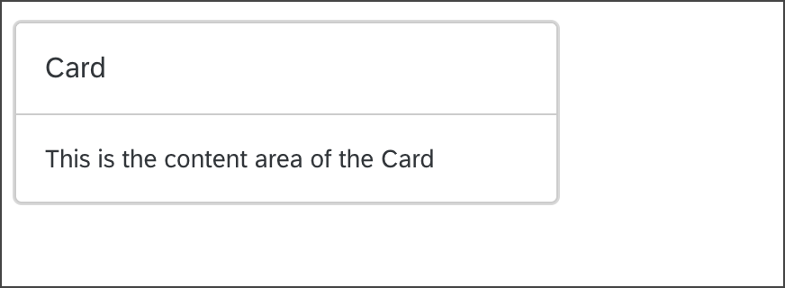

## Details
### You will learn
-  How to import components into your application
-  Learn about the usage of props
-  How to use event handling


Integrate the first component into your App. You can find **all** available components in the [Storybook](https://sap.github.io/ui5-webcomponents-react/?path=/story/welcome-getting-started--page).
There you can try out the different components and also take a look at the coding and the available props.

---

[ACCORDION-BEGIN [Step : ](Add components to MyApp.jsx)]
First you need to import the components you want to use.

You can check out all available components in the [Storybook](https://sap.github.io/ui5-webcomponents-react/?path=/story/welcome-getting-started--page). Take your time to play around a little, change some `props` and take a look at the coding.

1. For the sake of keeping the coding as short as possible, this tutorial will only use direct imports. Start with importing a `Card` component into your `MyApp.jsx` file (right below the existing import statement).

    ```JavaScript / JSX
    import { Card } from "@ui5/webcomponents-react";
    ```

    > Direct import of components from `@ui5/webcomponents-react` have a **negative impact on your bundle size**. If you want to keep the bundle size small, import the components like this:

    >    `import { Card } from "@ui5/webcomponents-react/lib/Card";`

2. So, you imported the `Card` component. Now it's time to use it. Replace the content of your `<div>` with a `<Card>`.

    In the [Storybook](https://sap.github.io/ui5-webcomponents-react/?path=/story/ui5-web-components-card--default-story), you can see that Cards can receive different props. For now only add `heading='Card'`.

    ```JavaScript / JSX
    <div>
      <Card heading="Card"></Card>
    </div>
    ```

Your webpage should now look like this.


And the file like this:

```JavaScript / JSX
import { Card } from "@ui5/webcomponents-react";

export function MyApp() {
  return (
    <div>
      <Card heading="Card"></Card>
    </div>
  );
}
```


[DONE]
[ACCORDION-END]

[ACCORDION-BEGIN [Step : ](Add content to the Card component)]
The content area of the `Card` component is empty, this is because it didn't receive any children. Children of `Cards` should be `ReactNodes` or an array of `ReactNodes`.

1. Add the following lines to your Card component:

    ```JavaScript / JSX
    <Card heading="Card">
      <div>This is the content area of the Card</div>
    </Card>
    ```

2. Now the `Card` has a content area, but the `font-family` differs from the `Card` header. All UI5 Web Components for React components use the same styling, this includes `font-family`, `color`, etc.  

    Replace with import statement to add another component `Text` to your `MyApp.jsx` file.

    ```JavaScript / JSX
    import { Card, Text } from "@ui5/webcomponents-react";
    ```

    And replace the inner `div` with the `Text` component.

    ```JavaScript / JSX
    <Card heading="Card">
      <Text>This is the content area of the Card</Text>
    </Card>
    ```

The `font-family` of the content now corresponds to the `font-family` of the header.

[DONE]
[ACCORDION-END]


[ACCORDION-BEGIN [Step : ](Style your component)]
In this step, we will only apply [inline-styling](https://reactjs.org/docs/dom-elements.html#style). You can also style your component using [JSS](https://cssinjs.org/?v=v10.0.0), but this will be covered in [Tutorial 6](ui5-webcomponents-react-styling) of the tutorial series.

The Card now spreads across the whole screen, this behavior is intended so it takes up the whole space of its container.

1. To restrict the `width` of the `Card`, add the `style` prop.

    ```JavaScript / JSX
    <Card heading="Card" style={{ width: "300px" }}>
      <Text>This is the content area of the Card</Text>
    </Card>
    ```

    

2. The content of the card is way too close to the border of the `Card`, so a `padding` is needed. UI5 Web Components comes with a `Util` library, which includes `padding` sizes.

    Execute this in your terminal:

    ```ShellBar
    npm install @ui5/webcomponents-react-base --save
    ```

    Then import:

    ```JavaScript / JSX
    import { spacing } from "@ui5/webcomponents-react-base";
    ```

    And finally add this to your `Text` component:

    ```JavaScript / JSX
    <Text style={spacing.sapUiContentPadding}>
      This is the content area of the Card
    </Text>
    ```
    Hereby you get a standardized content-padding. `spacing` comes with many more properties, feel free to test them and see what they do.

After this step `MyApp.jsx` should look like this:
```JavaScript / JSX
import React from "react";
import { Card, Text } from "@ui5/webcomponents-react";
import { spacing } from "@ui5/webcomponents-react-base";

export function MyApp() {
  return (
    <div>
      <Card heading="Card" style={{ width: "300px" }}>
        <Text style={spacing.sapUiContentPadding}>
          This is the content area of the Card
        </Text>
      </Card>
    </div>
  );
}
```
And your application like this:



[DONE]
[ACCORDION-END]

[ACCORDION-BEGIN [Step ](Event handling)]

1. The Card header can also be clickable. For this you need to set the `headerInteractive` prop to true.

    ```JavaScript / JSX
    <Card heading="Card" style={{ width: "300px" }} headerInteractive>
    ```

    We didn't pass a value to `headerInteractive`, because it [defaults to true](https://reactjs.org/docs/jsx-in-depth.html#props-default-to-true) if the value is omitted.

2.  To make the header react to a click, add a function as value to the `onHeaderClick` prop.

    ```JavaScript / JSX
    <Card
      heading="Card"
      style={{ width: "300px" }}
      headerInteractive
      onHeaderClick={handleHeaderClick}
    >
    ```

3. Now, add the callback function right in the beginning of the component (definition function):
    ```JavaScript / JSX
    export function MyApp() {
      const handleHeaderClick = () => {
        alert("Header clicked");
    };
    ```

The file now looks like this:
```JavaScript / JSX
import React from "react";
import { Card, Text } from "@ui5/webcomponents-react";
import { spacing } from "@ui5/webcomponents-react-base";

export function MyApp() {
  const handleHeaderClick = () => {
    alert("Header clicked");
  };
  return (
    <div>
      <Card
        heading="Card"
        style={{ width: "300px" }}
        headerInteractive
        onHeaderClick={handleHeaderClick}
      >
        <Text style={spacing.sapUiContentPadding}>
          This is the content area of the Card
        </Text>
      </Card>
    </div>
  );
}
```
Now the header opens an alert box on click.

[VALIDATE_1]
[ACCORDION-END]

---
