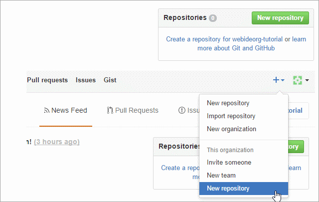
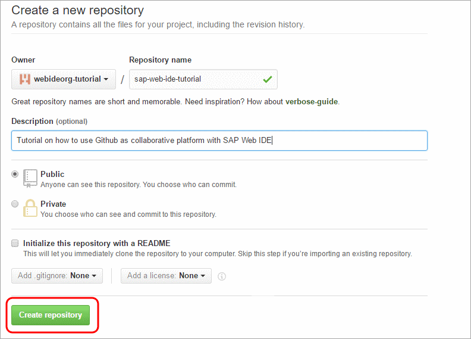
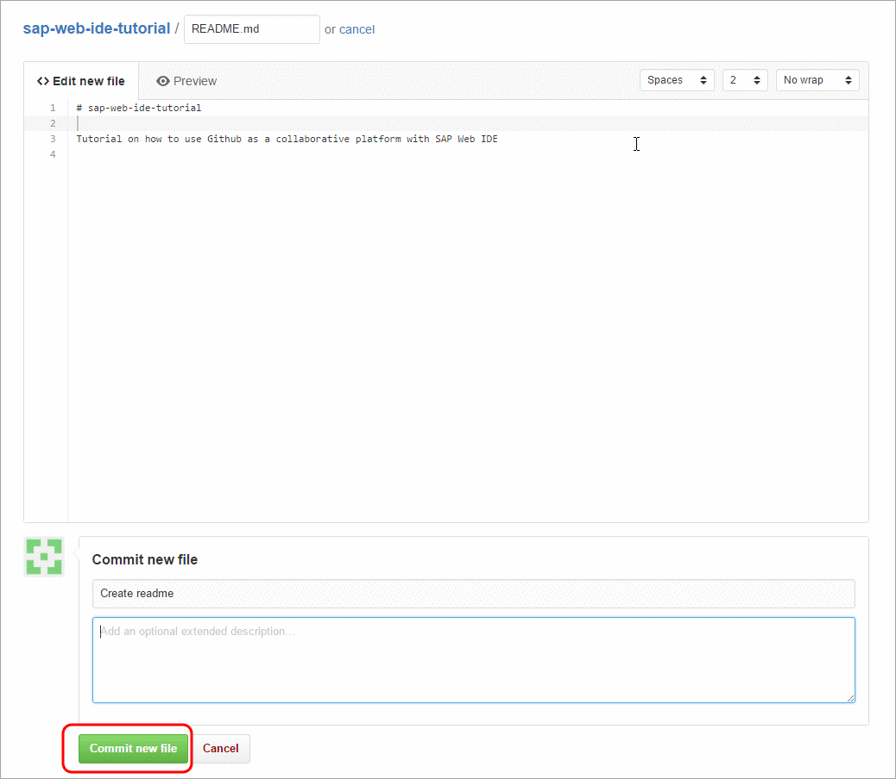

## Prerequisites  
- **Tutorials:** [Create a GitHub Organization and Add Collaborators](webide-github-creating-org)

## Details
### You will learn  
  - How to create a Git repository within a GitHub organization

---

[ACCORDION-BEGIN [Step 1: ](Log into GitHub)]

Go to [GitHub](https://github.com) and login with your account credentials.

[DONE]
[ACCORDION-END]

[ACCORDION-BEGIN [Step 2: ](Switch dashboard context)]

Switch to the organization context by clicking on the **Switch dashboard context** drop-down, and click the organization.

[DONE]
[ACCORDION-END]

[ACCORDION-BEGIN [Step 3: ](Create new repository)]

Click **New repository**.

>Alternatively, click the **+** icon on the top-right corner and click on **New Repository**.

[DONE]
[ACCORDION-END]

[ACCORDION-BEGIN [Step 4: ](Name the repository)]

Enter the repository name and description, and click **Initialize this repository with a README**. You can add a `.gitignore` and license later on.

[DONE]
[ACCORDION-END]

[ACCORDION-BEGIN [Step 5: ](Create a README file)]

If you did not select the option to **Initialize this repository with a README**, create an initial commit by adding a README file. You can keep this README file simple for now and add in details later.

[DONE]
[ACCORDION-END]

[ACCORDION-BEGIN [Step 6: ](Commit the file)]

At the commit screen, enter a commit message and click **Commit new file**.

Your Git repository is ready!

[DONE]
[ACCORDION-END]
