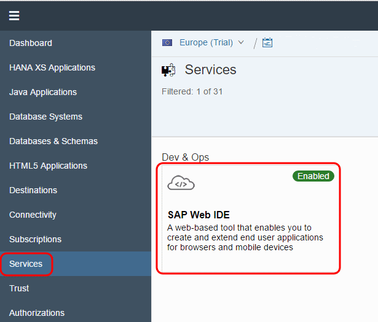
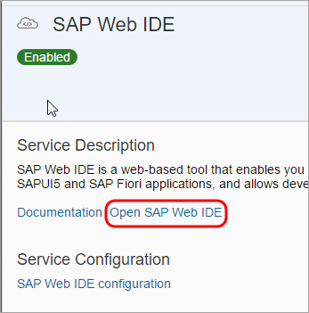
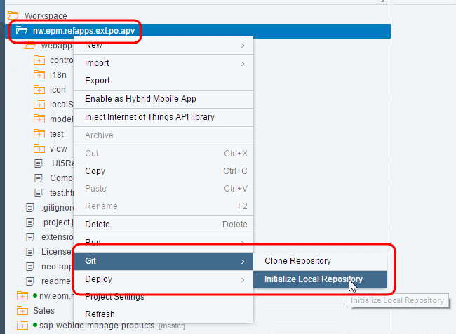
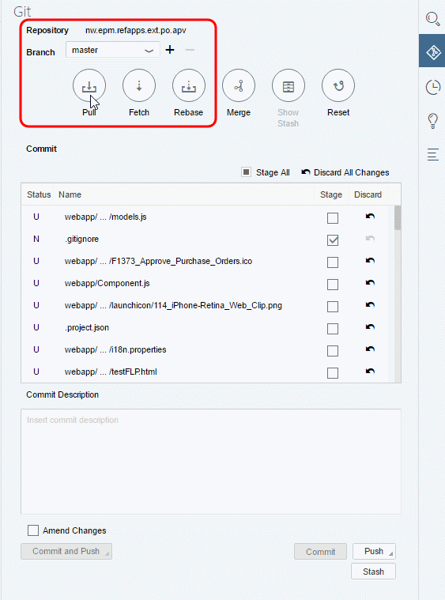
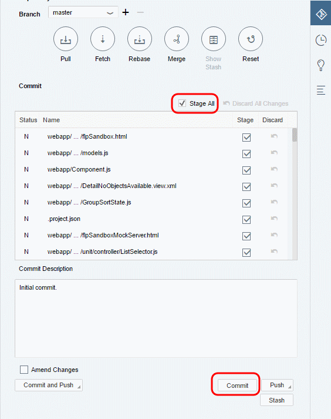
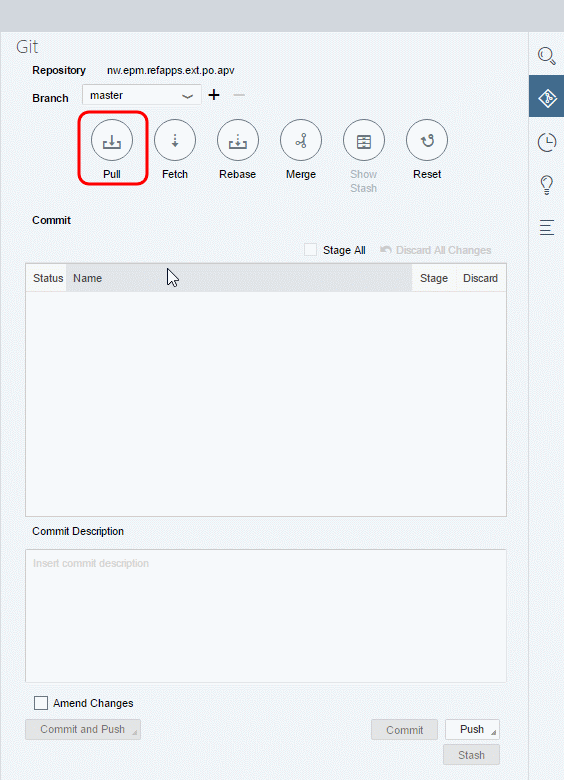
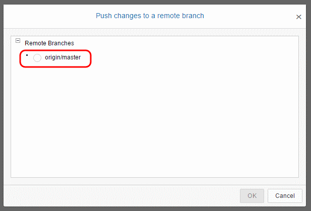
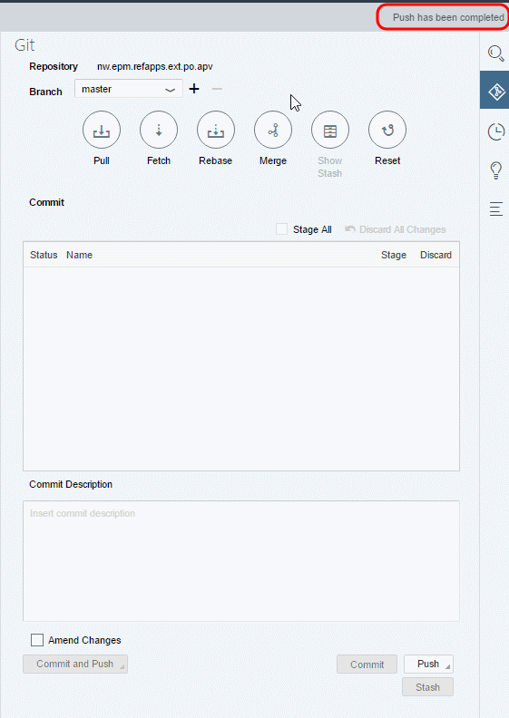

## Prerequisites  
- **Tutorials:** [Create a Git Repository in a GitHub Organization](webide-github-create-git-repo)

## Details
### You will learn  
  - How to import an existing SAP Web IDE project into your previously created GitHub repository

---

[ACCORDION-BEGIN [Step 1: ](Log into your SAP Cloud Platform cockpit)]

Go to [https://account.hanatrial.ondemand.com](https://account.hanatrial.ondemand.com) and log in to your SAP Cloud Platform cockpit.

[DONE]
[ACCORDION-END]

[ACCORDION-BEGIN [Step 2: ](Open the SAP Web IDE service page)]

Click the **Services** tab in the navigation bar, scroll down and click the **SAP Web IDE** tile to open the SAP Web IDE service page.

[DONE]
[ACCORDION-END]

[ACCORDION-BEGIN [Step 3: ](Launch SAP Web IDE)]

Click **Go to Service** to launch SAP Web IDE.

[DONE]
[ACCORDION-END]

[ACCORDION-BEGIN [Step 4: ](Open your project)]

Open an existing project in SAP Web IDE by clicking **File > Import**.

You could also create a new application by clicking **File > New > Project from Template**.

[DONE]
[ACCORDION-END]

[ACCORDION-BEGIN [Step 5: ](Initialize local repository)]

Once your project is open, right-click on your project folder and click **Git > Initialize Local Repository**.

[DONE]
[ACCORDION-END]

[ACCORDION-BEGIN [Step 6: ](Add Git repository URL to your project)]

In the **Configure Git Repository** dialog box, enter your GitHub organization repository's URL

Fetch the remote repository URL by heading over to the GitHub organization URL. Click the **Clone or Download** button and then select the icon to copy the URL to the clipboard.

Paste this URL into the remote repository textbox.

[DONE]
[ACCORDION-END]

[ACCORDION-BEGIN [Step 7: ](Verify Git repository)]

Your project is now initialized with a Git repository and linked to the GitHub platform. You can open the Git pane on the right sidebar to verify this.

[DONE]
[ACCORDION-END]

[ACCORDION-BEGIN [Step 8: ](Stage and commit files)]

Commit the project files to the local Git repository by clicking **Stage all**, enter a commit message, and click **Commit**.

[DONE]
[ACCORDION-END]

[ACCORDION-BEGIN [Step 9: ](Pull from GitHub)]

To synchronize the GitHub repository and local repository changes, click **Pull**. Enter your GitHub credentials.

[DONE]
[ACCORDION-END]

[ACCORDION-BEGIN [Step 10: ](View downloaded README)]

Once the pull is complete, you'll notice the `README.md` file that was created on GitHub is now available in the SAP Web IDE project workspace.

[DONE]
[ACCORDION-END]

[ACCORDION-BEGIN [Step 11: ](Push your local changes to GitHub)]

Click **Push** and select **Remote Branch**

Select **origin/master** as the remote branch and click **OK**.

Enter your GitHub credentials and click **OK**.

Once the push is complete, you will see a notification message on the top-right corner.

[DONE]
[ACCORDION-END]

[ACCORDION-BEGIN [Step 12: ](Check published changes)]

Go to the organization GitHub URL and you will notice that the changes are now published.

[DONE]
[ACCORDION-END]
