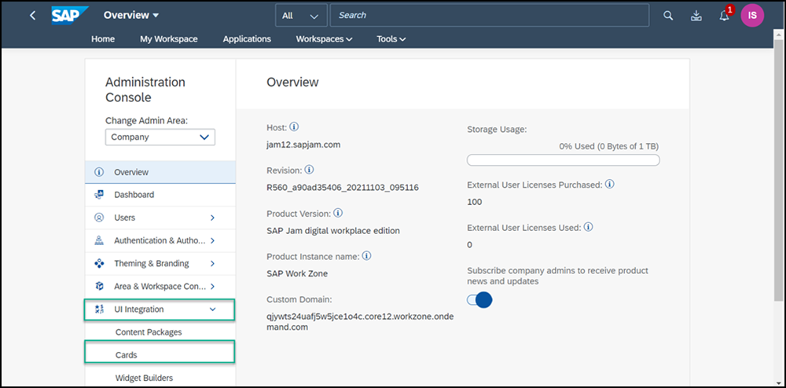
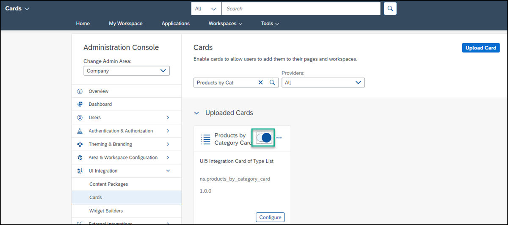
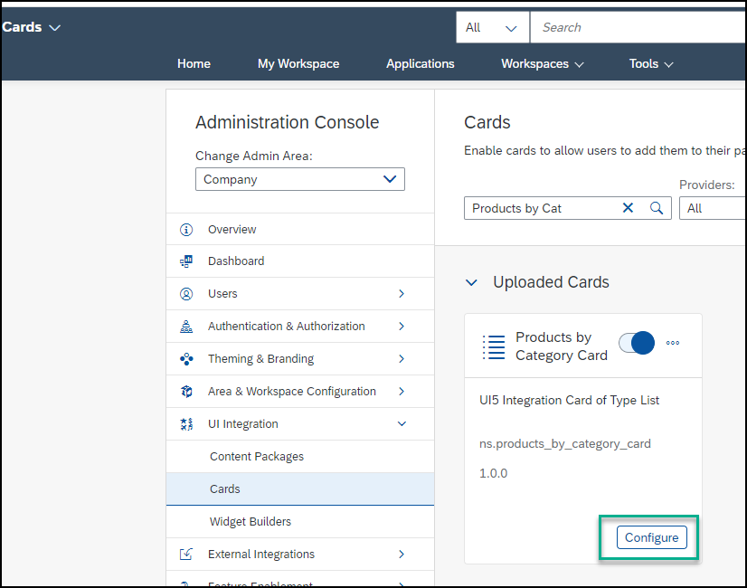
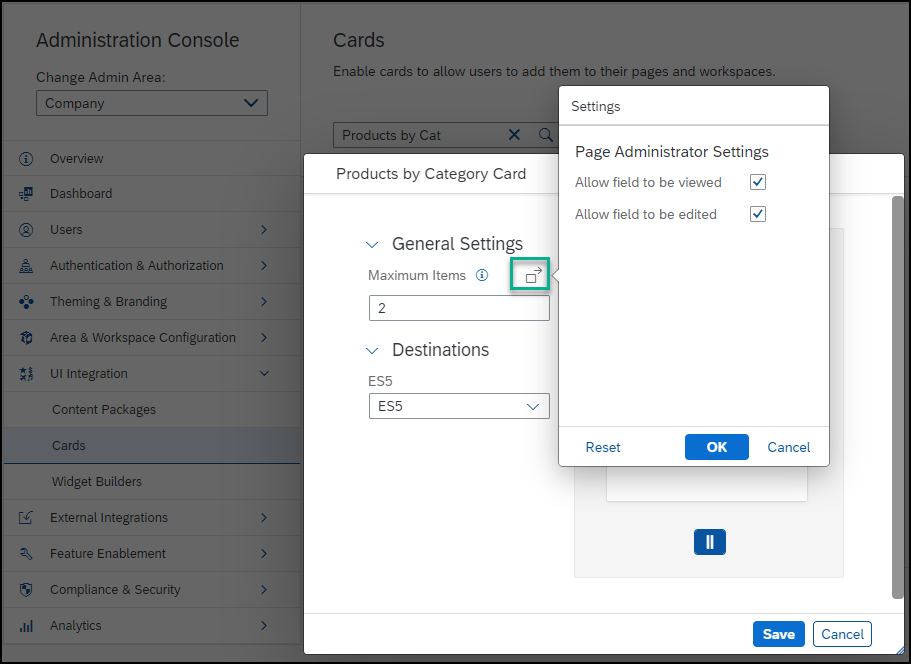
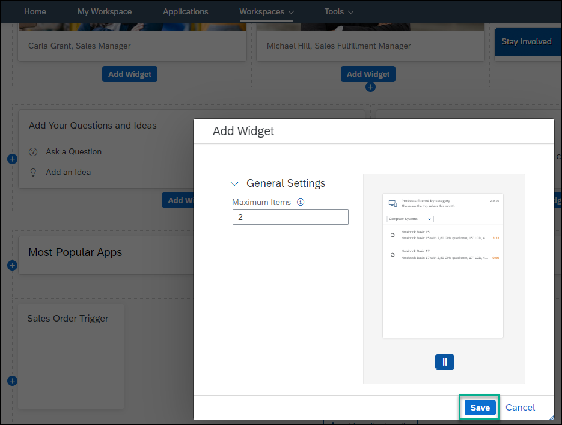
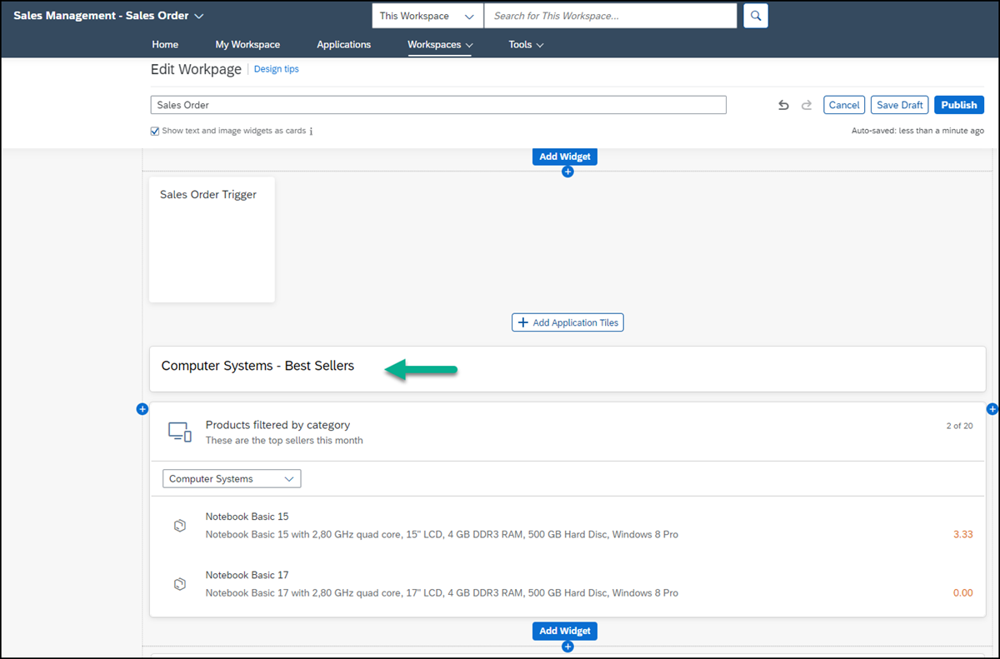
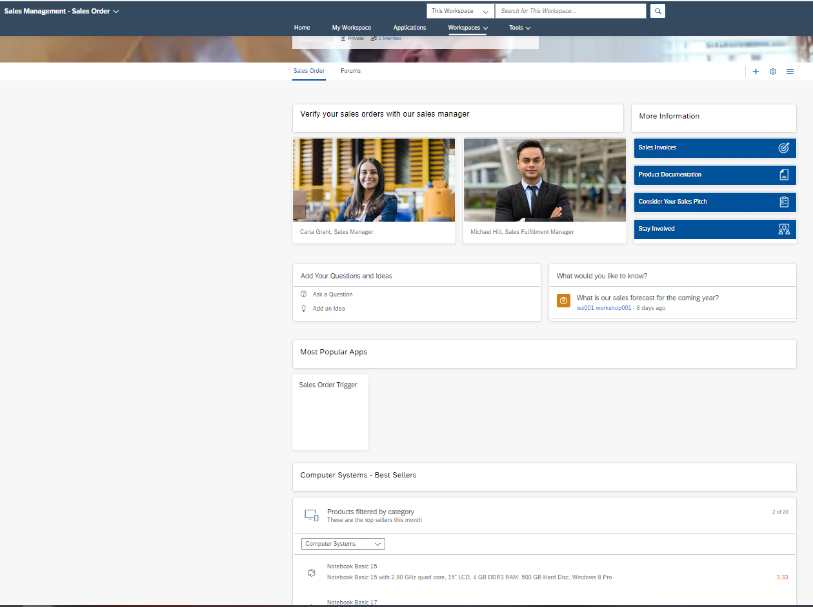

#  you 
<!-- description --> Add a custom UI5 integration card to your workpage in a workspace.

## Prerequisites
 - You have deployed a UI5 integration card.

## You will learn
  -  How to make a deployed UI5 integration card available in SAP Build Work Zone, advanced edition and add it to your workpage.

## Intro
You've already deployed a UI5 integration card. Now in this tutorial, you'll enable it to make it available in your site and later add it to your workpage in a workspace.

---

### Enable your deployed UI5 integration card

1. Access the **Administration Console** from the user actions dropdown menu under your avatar.

    <!-- border -->

2. Go to the **UI Integration** section, expand it, and click **Cards**.  

    <!-- border -->

3. Scroll down to view the **Uploaded Cards** section.

    >If you don't see your deployed card, you may need to refresh the browser.

4. Click the slider button to enable the card.

    <!-- border -->

The card is now enabled and can be added to the workpage in your workspace.

>In this step, for workshops, use your unique identifier `<your unique identifier>_Products by Vendor Card`.

>You can click on **Configure** to select a different destination for this UI5 integration card. As you used the same ES5 destination in this SAP BTP subaccount and also when you developed the card, this step is not required to complete this tutorial.

### Configure the card settings

Before you add the card to your workspace, let's configure one of the settings of the card.

1. On the `Products by Vendor Card`, click **Configure**.

    <!-- border -->

2. Under **General Settings**, change the **Maximum Items** to 2 and select the destination. If you're in a workshop, you can select the destination that you created:  `<your unique ID_ES5`>. Then click **Save changes**.

    <!-- border -->

    > On the **Configure** screen, when you click the **More settings** icon there are more settings that you can configure for the end user.
    <!-- border -->

In the next step you'll add the card to your workpage in your workspace.

### Add your UI5 integration card to your workpage in your workspace

1. Click the **Workspaces** menu and select `Employee Innovation Hackathon` to navigate to your workspace.

    <!-- border -->

2. Click the pencil icon on the right side of the screen to open the page designer.

    <!-- border -->

3. Click the **+** below the **Forum** widget and above the **Feed** widget to add a new section to your workspace.

    <!-- border -->

4. In the added section, click **Add Widget**.

    <!-- border -->

5. Click **Cards**.

    

6. Select the `Products by Vendor Card` widget that you previously created. In a workshop, use your unique identifier `<your unique identifier>_Products by Vendor Card`.

    <!-- border -->

7. In the **Add Widget** screen, click **Save**.

    <!-- border -->

The card you created was added to the workpage of your workspace.

Now let's add a title for the card.

### Finalize the design of your workspace

1. Click **Add Widget** below the card widget you just added.

    <!-- border -->

2. Select the **Text** widget.

3. Design the **Text** widget as follows:

    |  :------------- | :-------------
    | Text            | Type in the following: `Products of vendors sponsoring the hackathon, see what you can win!`.
    | Font            | Select the text and change to Arial 14pt.
    | Color           | With the text already selected, choose black from the chart.

4. Click outside of the widget section to see how your workpage looks so far.

5. Select the text widget you just added, and drag it above the card widget that you added before.

    <!-- border -->

6. Click **Publish** to publish your workpage.

    <!-- border -->

Your workspace should look like this - note that the card is only showing 2 out of 20 products because you configured it that way.

<!-- border -->
