## Details
### You will learn  

 - How to create a Calculation View using an `anonymization` node
 - Use `k-anonymity` to hide data that can identify individuals by comparing other identifying information. See the [SAP Help for more information](https://help.sap.com/viewer/e8e6c8142e60469bb401de5fdb6f7c00/2.0.03/en-US/205f52e73c4a422e91fb9a0fbd5f3ec6.html)
 - How to create a calculation view
 - Use artifacts to import data from text file


***GitHub repository available***
 
 This project can be cloned from this repository: [https://github.com/SAP/hana-xsa-calculation-view-anonymity](https://github.com/SAP/hana-xsa-calculation-view-anonymity)

---

[ACCORDION-BEGIN [Step 1: ](Check pre-requisites)]

### Map a space to your tenant
Make sure your project is using a space that is mapped to a tenant. Here is how to [create a new space,](https://sap.com/developer/tutorials/xsa-setup-new-space.html) only if you do not want to use the default development space and [how to map it to a tenant database](https://sap.com/developer/tutorials/xsa-tenant-db-space.html)

### Start the script server in your tenant database
If you have not already, log in to your System database as SYSTEM and execute the following statement. In HANA express, as `hxeadm`

```SQL
hdbsql -i 90 -d systemdb -u SYSTEM
alter database HXE  ADD 'scriptserver';
quit;
```

You can also do this from the Database Explorer tool, as user SYSTEM and logged into the `SYSTEMDB` database:


> Note: This example assumes the tenant database is the default first tenant created in SAP HANA, express edition. Replace `HXE` with eh name of your tenant. You can query available tenants from table `M_DATABASES`

### Deploy your database module in the space mapped to the tenant
If you created the database module before mapping the space to the tenant, you will see the HDI container in the space but it will still be connected to the system database. The system database is meant for administration purposes and does not have the necessary engines to execute advanced analytics such as `anonymization`.

Use command `xs ds` to delete the HDI container and deploy it again once the space has been mapped to the tenant database.

> Note: An indication of using the system database after completing the SQL statement in the previous prerequisite is an error stating `column store error search table error No ScriptServer available` or similar.

[DONE]

[ACCORDION-END]

[ACCORDION-BEGIN [Step 2: ](Log in to SAP Web IDE for SAP HANA and create a project)]

Right-click **Workspace** and choose **New > Project from template**.

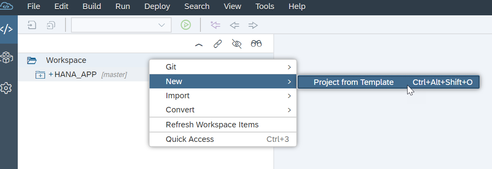

Click **Next**.

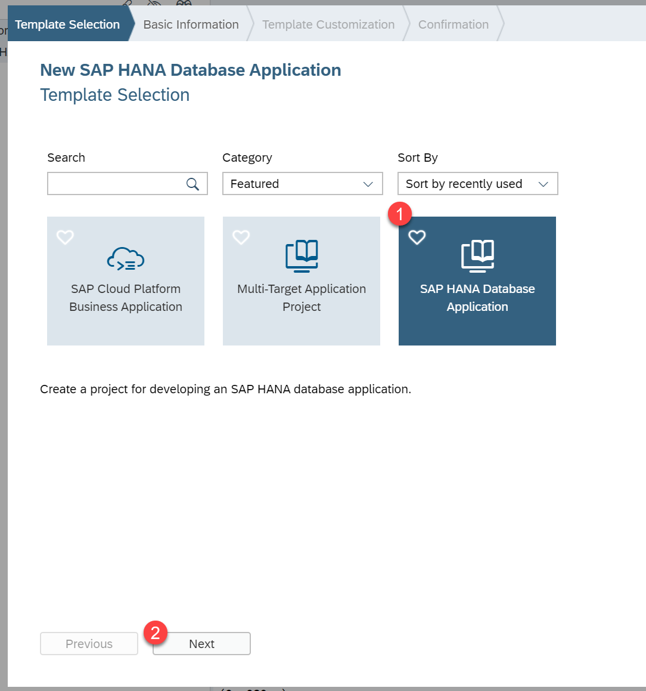

Call your project `ANALYTICS` and click **Next**.

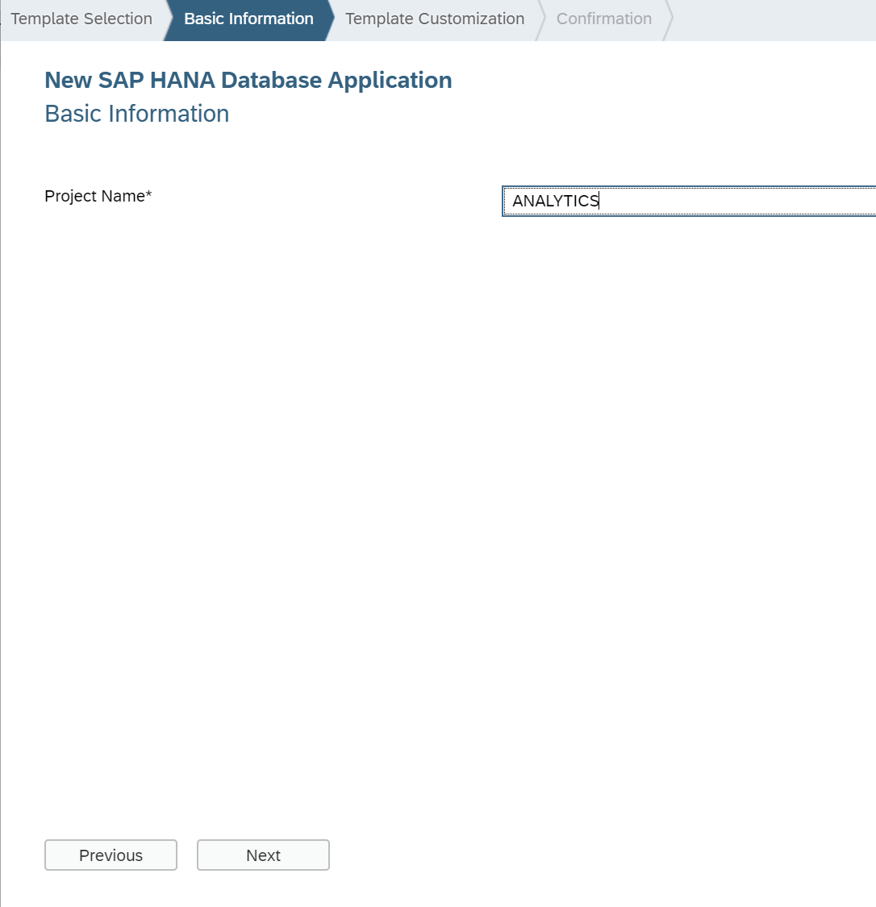

Make sure you are using the space that is mapped to the tenant database:

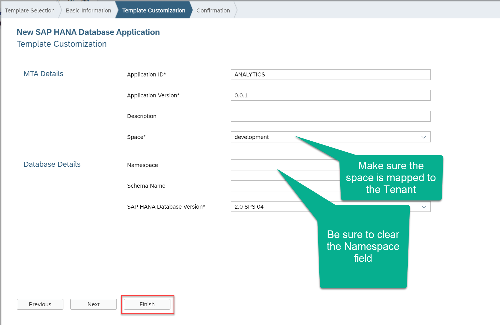

Click **Finish** to create your project.

[DONE]

[ACCORDION-END]

[ACCORDION-BEGIN [Step 3: ](Create a database module)]

**Right-click** on the project and select **New > SAP HANA Database Module**.

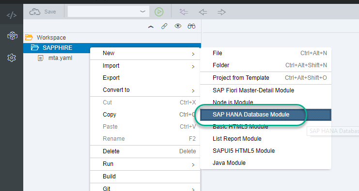

Call the module `db` and click **Next**.


Flag **Build module after creation** and click **Finish**.

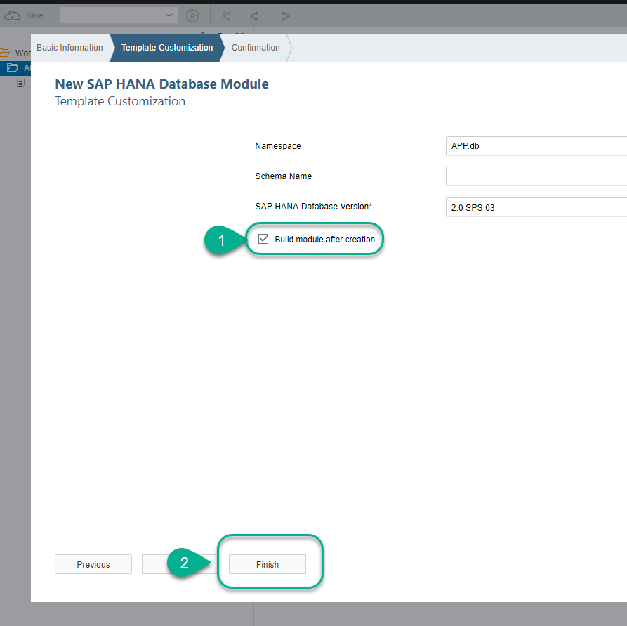

[DONE]

[ACCORDION-END]

[ACCORDION-BEGIN [Step 4: ](Create a table)]

In the `src` folder, create a folder called `data` and a file called `jobs.hdbtable`. Use the following code for the table:

```text
COLUMN TABLE JOBS (
	ID INTEGER CS_INT GENERATED BY DEFAULT AS IDENTITY (NO CYCLE NO CACHE NO MINVALUE START WITH 300001000 INCREMENT BY 1 MAXVALUE 399999999) NOT NULL COMMENT 'Opinion ID',
	ORIGIN_COUNTRY NVARCHAR(100),
	CURRENT_ROLE NVARCHAR(100),
	JOB_LIKES NVARCHAR(100),
	AGE INTEGER,
	CURRENT_TENURE INTEGER,
	primary key (ID)
)

```

[DONE]
[ACCORDION-END]

[ACCORDION-BEGIN [Step 5: ](Insert data into your tables)]

In the data folder, create a file called `data.csv` with the following content:

```text
ORIGIN_COUNTRY	CURRENT_ROLE	JOB_LIKES	AGE	CURRENT_TENURE
United States	Sr Architect	Designing systems with SAP HANA	37	12
United States	Development Lead	Creating solutions for my customers	45	3
United States	Development Lead	Providing customers with HANA models	45	3
Australia	Architect	Helping internal customers with their HANA implementations	37	9
Australia	Development Lead	Helping co-workers advance their careers		2
United States	Technical manager	Creating new solutions for customers	32	12
United States	Sr Architect	Learning new technologies in Big Data	37	4
Mexico	CIO	Helping my company achieve strategic goals	46	14
United States	Manager	Creating solutions on time and on budget	46	9
United States	Development manager	Innovating with SAP HANA	32	13
Canada	Developer Evangelist	Creating fun tutorials	28	7
Costa Rica	CFO	Generating value for shareholders	43	4
United States	Architect	The people I work with	65	17
Poland	Developer Evangelist	Turning ideas into technical solutions	28	9
Poland	BW/HANA Consultant	Creating complex IT solutions	58	17
United States	Marketing	Implementing fun developer programs	24	4
United States	CDO	Turning data into business value	54	3
United Kingdom	Solution Advisor	Helping my customers gain value from their data	34	18
United States	Intern	Learning new technologies in Big Data	21	2
```

Create another file called `load.hdbtabledata` and add the following contents into it

```text
{
"format_version": 1,
"imports": [{
  "target_table": "JOBS",
  "source_data": {
    "data_type": "CSV",
    "file_name": "data.csv",
    "has_header": true,
    "dialect": "HANA",
    "type_config": {
      "delimiter": "\t"
    }
  },
  "import_settings": {
    "import_columns": ["ORIGIN_COUNTRY", "CURRENT_ROLE", "JOB_LIKES", "AGE", "CURRENT_TENURE"]
  },
  "column_mappings": {
    "ORIGIN_COUNTRY": 1, "CURRENT_ROLE" : 2, "JOB_LIKES" : 3, "AGE" : 4, "CURRENT_TENURE" : 5
  }
}]
}

```

**Save** all of the files and **Build** the `db` module.


[DONE]
[ACCORDION-END]

[ACCORDION-BEGIN [Step 6: ](Create a Calculation View)]

Create folder called `models` under `src` and a calculation view of type cube called `K_ANONYMITY`

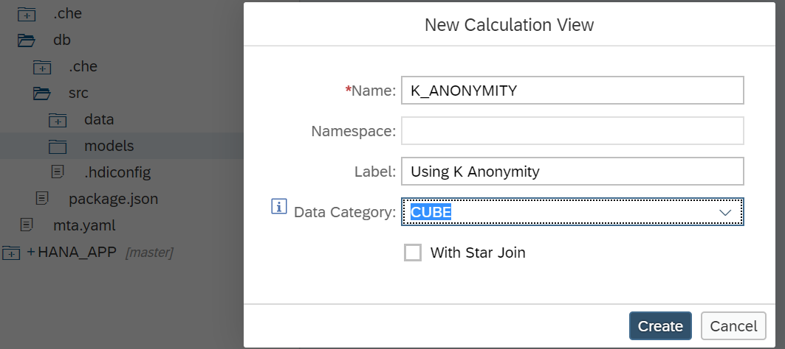

Drag and drop an `anonymization` node.

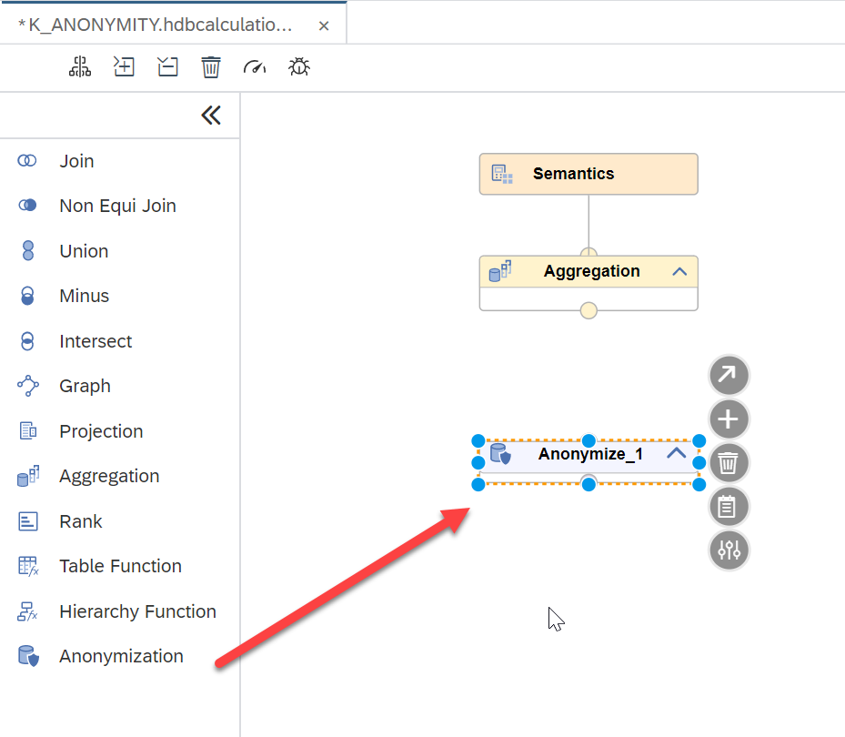

Click on the **+** sign to add a data source

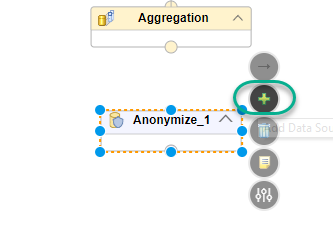

Search for the `jobs` table and add it to the node.

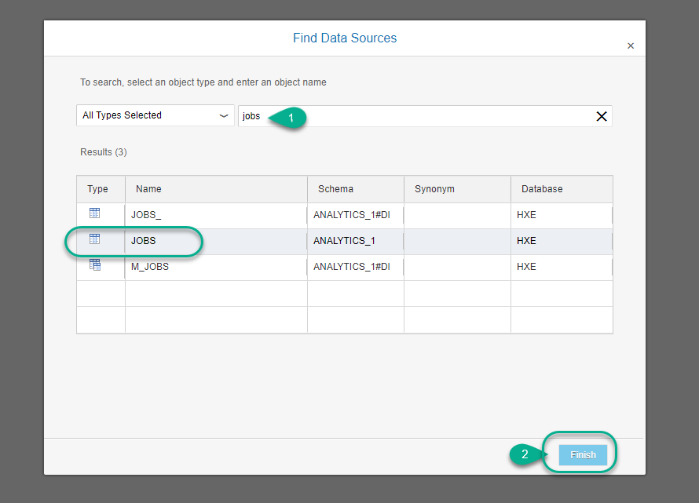

Double-click on the node and add all of the fields to the output. Then click on **Details** to configure the anonymity.

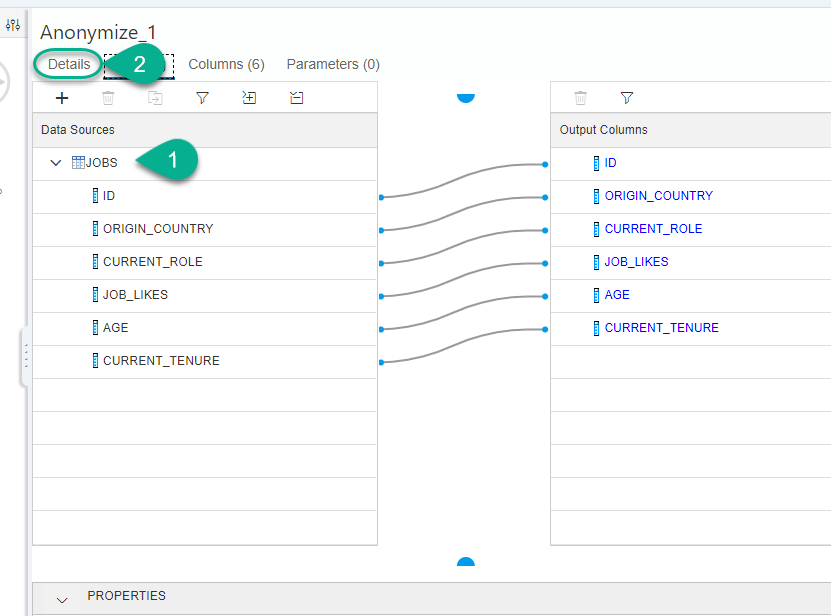

Set `ID` as the sequence column, `2` as the value for `k` and click on `+` to add quasi columns:

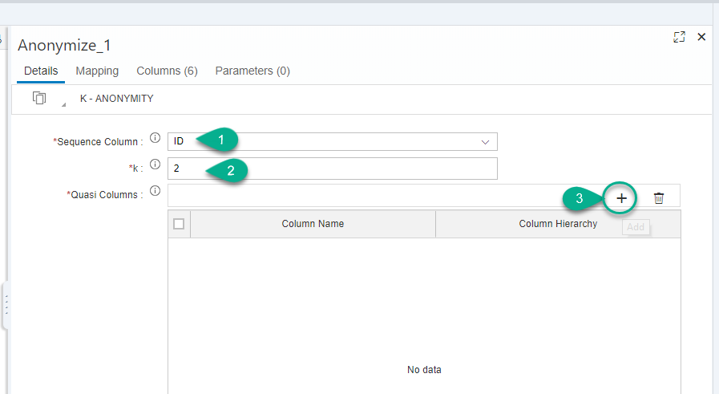

Choose the Country

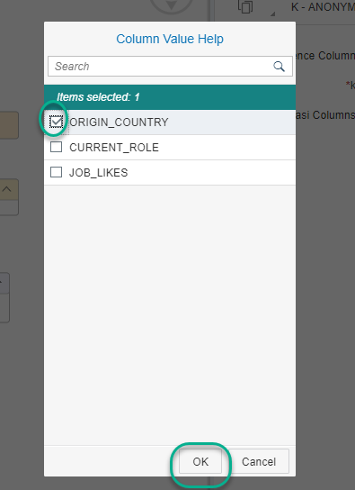

Click on the arrow to configure the values for the anonymity


Import the values and replace the values for the first level. **Save**,

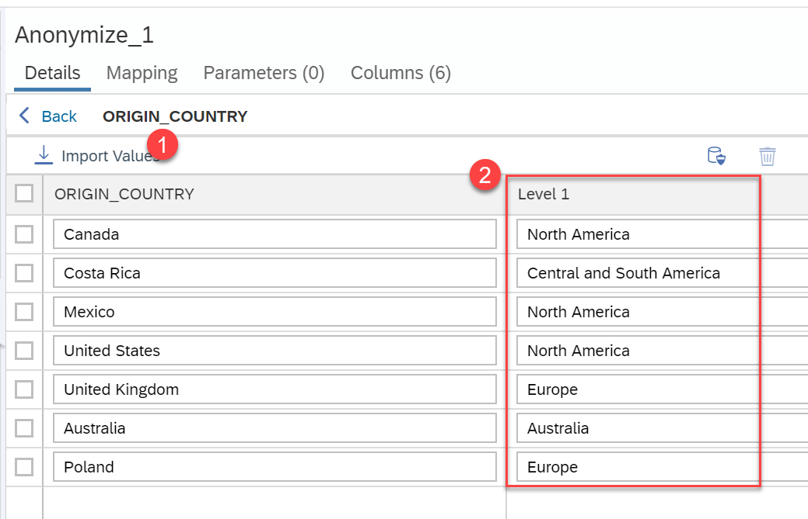

Click **Back**. Connect the `JOBS` node to the aggregation node.

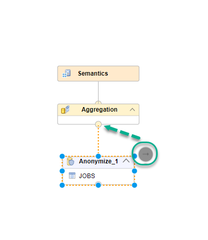

> ### Why is this useful?
> `Anonymization` of data helps companies protect privacy and comply with data protection regulations, such as GDPR, together with many other measures to mask data that could potentially identify an individual.
>&nbsp;
> In this example, there are single combinations of job roles in specific countries. In other words, if the other fields were sensitive information such as the salary and somebody knew who filled in the spreadsheet, they could deduce an individual's salary because of the unique combination of job role and country.

[DONE]
[ACCORDION-END]


[ACCORDION-BEGIN [Step 7: ](Configure semantics and test)]

Click on the aggregation node and add all of the columns to the output.

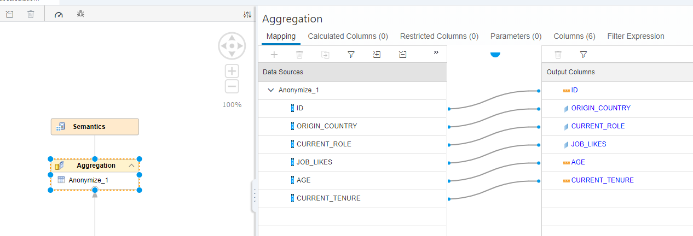

Save and build the view.

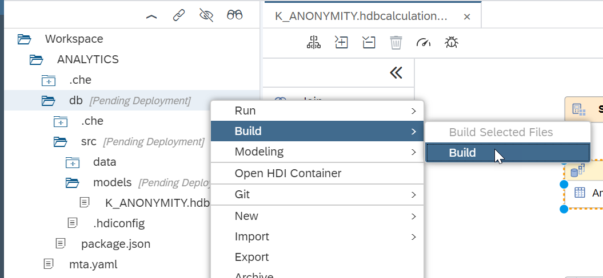

Once finished, right-click and choose the data preview. Choose `Raw Data` to complete the validation below.

Sort the column `CURRENT TENURE` descending. What is the value of the first Origin Country?

[VALIDATE_1]

[ACCORDION-END]

---
