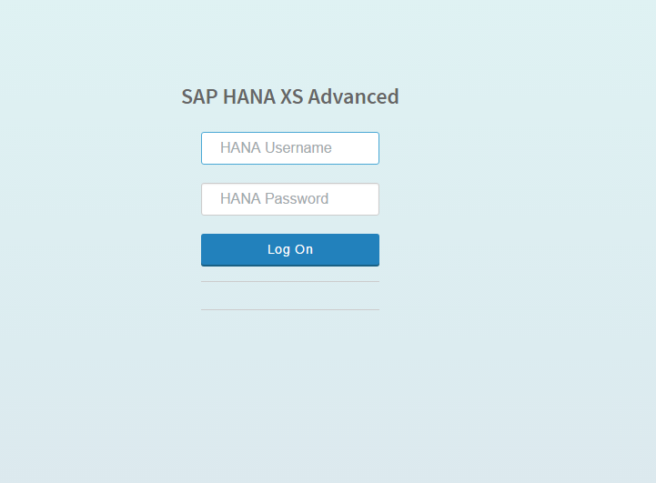
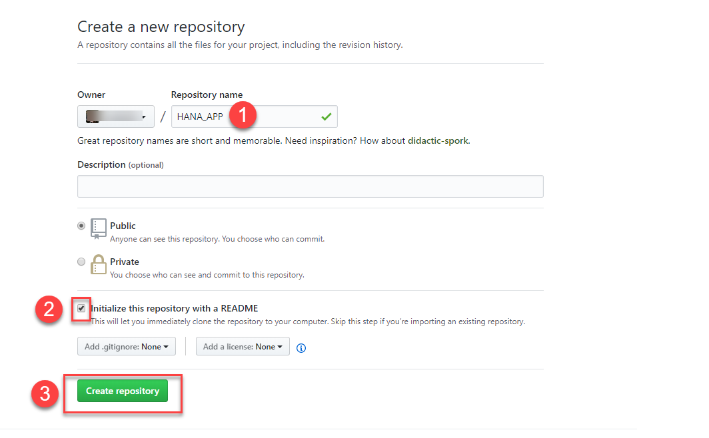
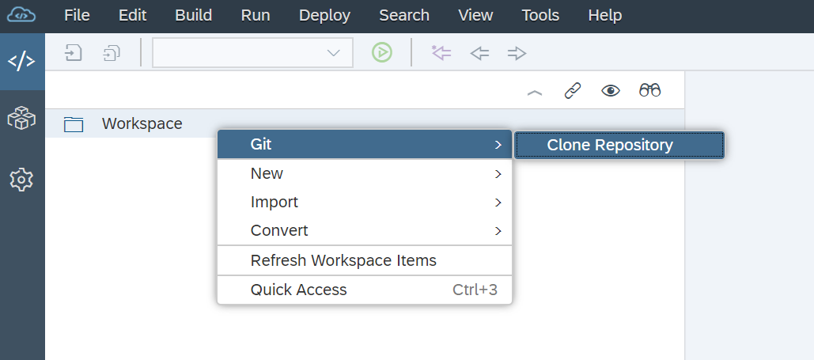
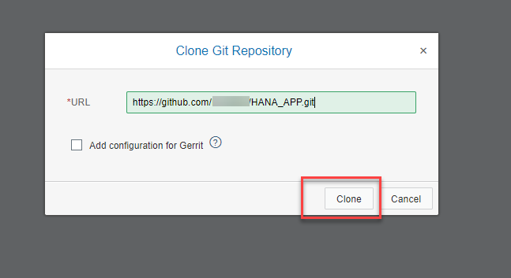
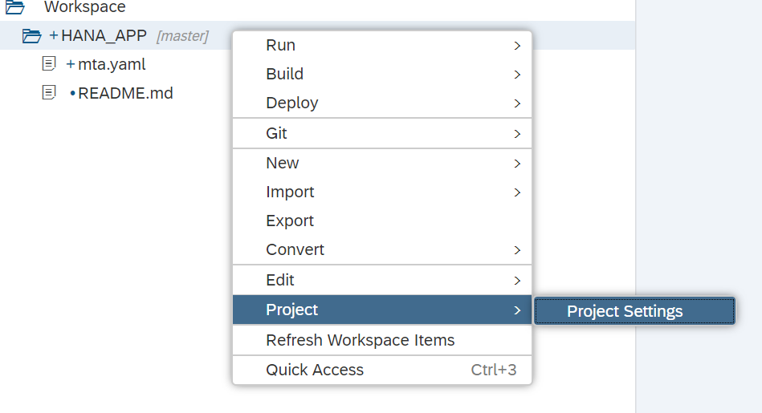
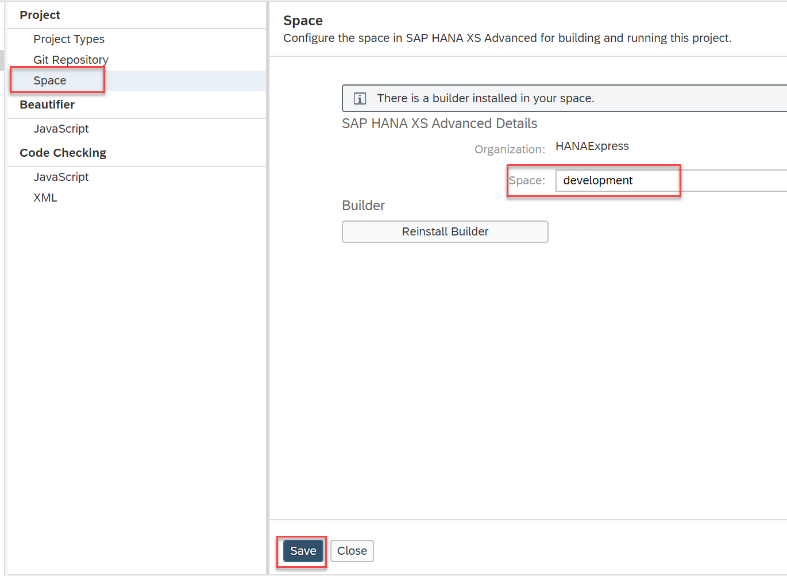
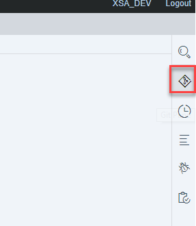

## Prerequisites  
  - If you do not have a HANA System with XS Advanced, [get your own instance of SAP HANA, express edition with XS Advanced](https://developers.sap.com/topics/sap-hana-express.html#details)
  - **Recommended**: It is recommended to map the development space to a tenant database. Follow [these instructions](https://developers.sap.com/tutorials/xsa-tenant-db-space.html) before creating your first database module.

## Details
SAP HANA Extended Application Services, advanced model is the new development paradigm from SAP based around the Cloud Foundry concepts and architectures.
To begin with you will need see how to connect to the SAP Web IDE for SAP HANA and clone a Git Repository.

As of SPS12, all design-time artifacts are stored in Git instead of the HANA database. We need to setup the repository so development can be collaborative.

Check [this series of blogs posts](https://blogs.sap.com/2017/09/04/xs-advanced-for-not-so-dummies/) to get introduced to the basic concepts in XS Advanced development, such as Multi-target Applications and micro-services.

### Time to Complete
**20 Min**

---

[ACCORDION-BEGIN [Step 1: ](Launch SAP Web IDE for SAP HANA)]

> It is **recommended** that you map the development space to the default tenant in SAP HANA, express edition. Follow [these instructions](https://developers.sap.com/tutorials/xsa-tenant-db-space.html) before getting started..

By default, in SAP HANA, express edition, SAP Web IDE for SAP HANA can be accessed using `https://hxehost:53075/`. If you are using a different system, you can check the URL using command `xs apps | grep webide` in the [XS Command Line Interface](https://help.sap.com/viewer/4505d0bdaf4948449b7f7379d24d0f0d/2.0.03/en-US/addd59069e6f444ca6ccc064d131feec.html).

User: `XSA_DEV`
Password: The password provided when you set up HANA Express

[DONE]

[ACCORDION-END]

[ACCORDION-BEGIN [Step 2: ](Sign in to your Git account)]

From a separate tab in the web browser, log into [GitHub](https://GitHub.com). If you do not have an account, proceed to create one by following the instructions to create and activate your account in the **sign up** button.

> If you are setting up the repository for use beyond this tutorial, you may want to create an organization and invite other users to join your repository. Further information can be found [on GitHub](https://help.github.com/articles/creating-a-new-repository/)

Alternatively, if you do not wish to create an account on GitHub, you can create a project by right-clicking on your workspace and following the wizard for Multi-Target Applications in `New->Project from Template`

[DONE]

[ACCORDION-END]

[ACCORDION-BEGIN [Step 3: ](Create a GitHub repository)]

Whether you have just activated a newly-created account or have been using GitHub disconnected from a HANA workspace, you may wish to create a new repository for this tutorial. If you already have a  GitHub repository you would like to use, continue to Step 3.

Follow the instructions in the **New Repository** option from the **+** menu in the upper right corner on `GitHub.com`

Complete the form adding a name and description, make sure to tick **Initialize this repository with a README** and click on **Create Repository**.

[DONE]

[ACCORDION-END]

[ACCORDION-BEGIN [Step 4: ](Clone the Repository into the Workspace)]

Form the GitHub page, copy the URL of the repository from the **Clone or Download** menu

Return to the SAP Web IDE for SAP HANA. Right click on the Workspace and choose **Clone Repository** from the Git menu.

SAP Web IDE for SAP HANA will request the Git URL to access the repository, which you have copied from GitHub:

Enter authentication details:
- User:  `<Your GitHub User ID>`
- Password:  `<You've guessed: Your GitHub password!>`

Tick the **Remember me** box so it will not ask again for the remainder of the session.

If successful, you will see the repository folder in your workspace, which is now connected to the git repository.

[DONE]
[ACCORDION-END]

[ACCORDION-BEGIN [Step 5: ](Configure the Space for the repository)]

Last, you need to configure the space for the repository you have just linked.

>Introduced in SPS12, spaces enable applications to access shared resources that can be used to develop, deploy, and maintain applications.

Right-click on the folder for the repository and select **Project Settings**

Select the proper space (for HANA express, `development`) from the list of available spaces, or use the space setup by the System Administrator:

> If you cannot find an appropriate space, you may either lack the `SpaceDeveloper` role to one or may need to [create one](xsa-setup-new-space). By default, SAP HANA, express edition brings a development space that is implicitly mapped to the system database. If you are planning on using any of the advanced analytics features (such as Machine Learning), you need to [map the space to a tenant database](xsa-tenant-db-space), such as the default one, HXE.

Click **Save**.

Open the GitHub pane using the menu bar on the right to complete the validation for this tutorial

[VALIDATE_7]

[ACCORDION-END]
