## Prerequisites
 - You have [created a trial account in SAP Cloud Platform](hcp-create-trial-account)
 - You have [enabled SAP Web IDE Full stack](webide-multi-cloud)
 - You have configured and [installed a builder](https://developers.sap.com/tutorials/webide-customize.html#da2f1d94-18a2-44df-ae0d-9ee14f752ca2) in your space
 - You have enabled the extensions for SAP HANA, Business Applications Development tools and SAP HANA under `Preferences -> Extensions`

## Details
### You will learn
  - How to create a simple application based on the SAP Cloud Platform Business Application wizard
  - You will be introduced to basics on cloud-native development and multi-target applications

---

[ACCORDION-BEGIN [Step 1: ](Create a Project)]

Right-click on workspace and choose `Project from Template`


Make sure `Cloud Foundry` is the selected environment. Select **SAP Cloud Platform Business Application** and click **Next**


Call the project `APP` and click **Next**

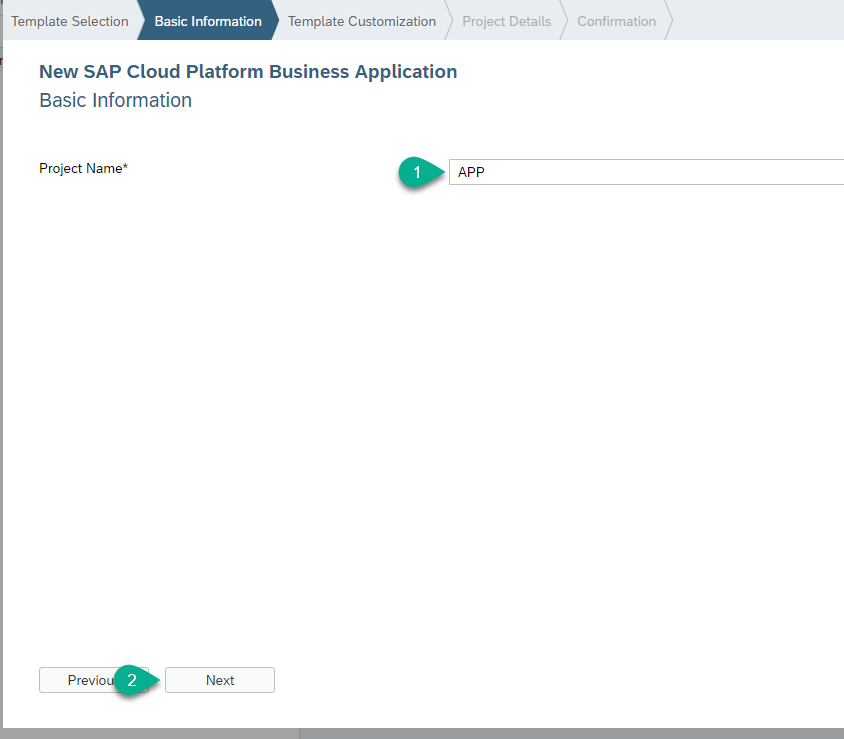

Mark **Use HTML5 application repository** and click **Next**

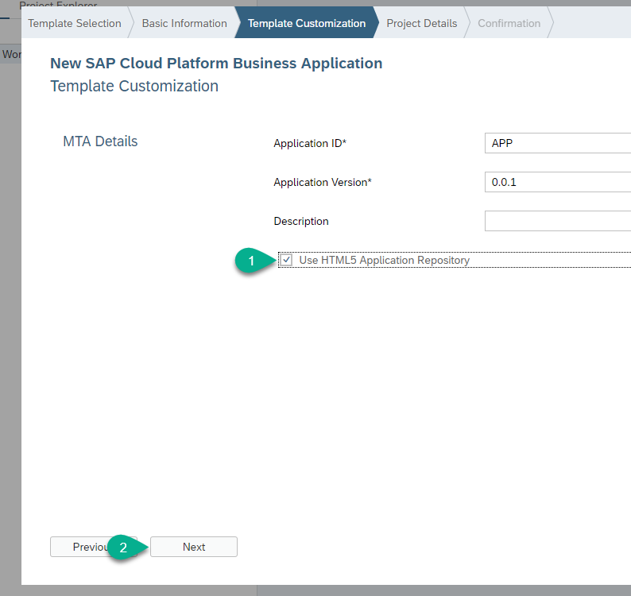

Change the database version to **2.0 SPS02**

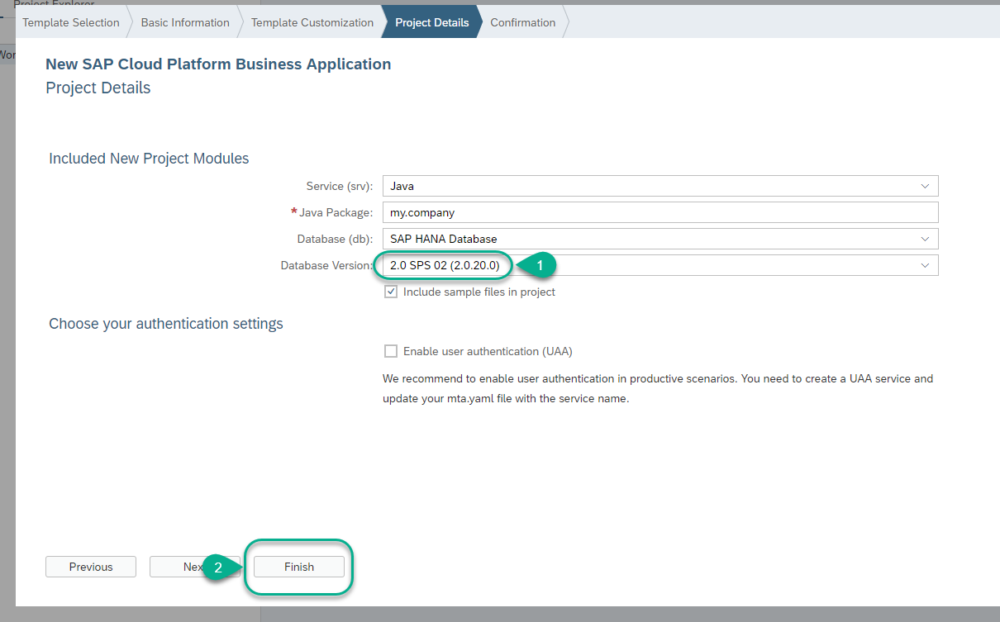

[DONE]
[ACCORDION-END]

[ACCORDION-BEGIN [Step 2: ](Create database artifacts)]

Expand the `db` folder and double-click on **`data-model.cds`** to expand it

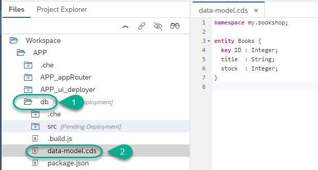

Replace the content in `data-model.cds` with the following:

```text

namespace my.app;

entity Recipes{
	key ID : Integer;
	instructions : String;
	dish : String;
	time : Integer;
	unit : String;
	ingredients : association to many Ingredients on ingredients.recipe = $self;
};


entity Ingredients{
	key ID : Integer;
	recipe : association to Recipes;
	quantity : Double;
	unit : String;
	ingredient : String;
};

```
For example:

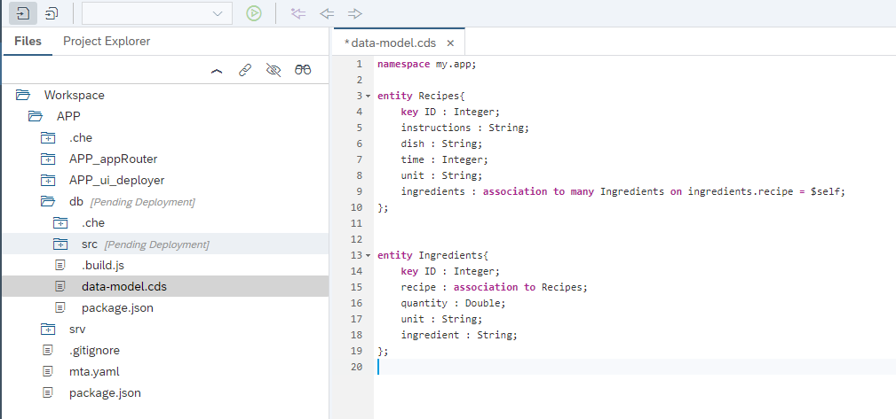

[DONE]
[ACCORDION-END]


[ACCORDION-BEGIN [Step 3: ](Create services to expose data)]

Navigate into the `srv` folder. Double-click on **`cat-service.cds`**.

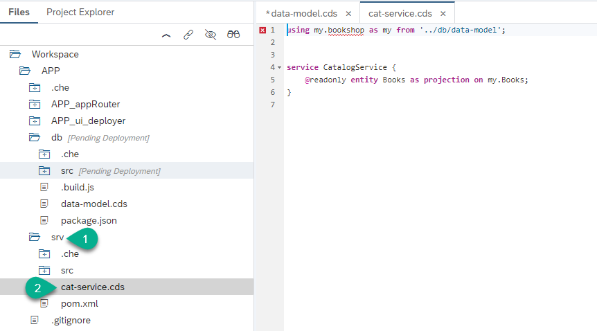

Replace the existing content in `cat-service.cds` with the following

```text
using my.app from '../db/data-model';
service CatalogService {

 entity Recipes
	@readonly
	as projection on app.Recipes;

 entity Ingredients
	@readonly
	as projection on app.Ingredients;

}

```

**Save all files**


> ## What is going on?
>
> You can see Core Data and Services generating design time artifacts based on SAP HANA (`.hdbcds`) under a new folder called `db\src\gen`. You can also follow progress by opening the console.
>
>  


[DONE]
[ACCORDION-END]

[ACCORDION-BEGIN [Step 4: ](Build the database module)]

The `.cds` file in which you defined the entities for persistence was used to create files with extension `.hdbcds`. These files will be used by the deployment infrastructure to create physical objects, such as tables, in the database.

Right-click on the `db` folder and choose **Build**


You can follow progress in the Console:

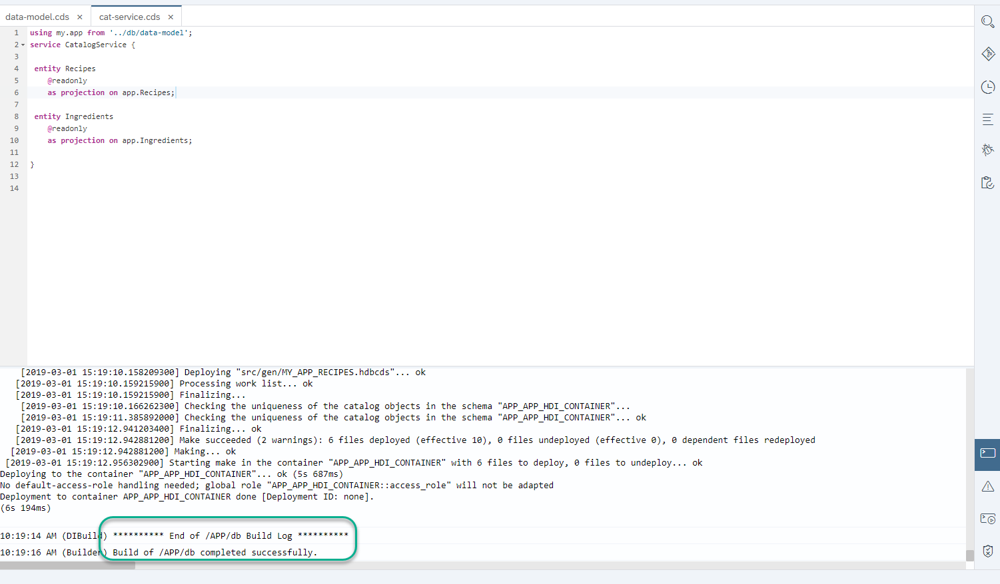


[DONE]
[ACCORDION-END]

[ACCORDION-BEGIN [Step 5: ](Insert data into the ingredients table)]

Now that the database module has been built, you can explore the HDI container and the physical tables.

Right-click on `db` and choose **Open HDI Container**.


Click on **Tables**. Right-click on `MY_APP_INGREDIENTS` and choose **Generate INSERT statement**.


**Make a note of the name of the schema and table, as you may need to adjust the code.**

Use the following code to insert values into the table:

```sql
INSERT INTO "APP_HDI_CONTAINER"."MY_APP_INGREDIENTS" VALUES(1,175,'G','Softened Butter',1);
INSERT INTO "APP_HDI_CONTAINER"."MY_APP_INGREDIENTS" VALUES(2,3,'UN','Egg',1);
INSERT INTO "APP_HDI_CONTAINER"."MY_APP_INGREDIENTS" VALUES(4,4,'TBSP','Nutella',1);
INSERT INTO "APP_HDI_CONTAINER"."MY_APP_INGREDIENTS" VALUES(5,250,'G','Nishiki Rice',2);
INSERT INTO "APP_HDI_CONTAINER"."MY_APP_INGREDIENTS" VALUES(6,750,'ML','Water',2);
INSERT INTO "APP_HDI_CONTAINER"."MY_APP_INGREDIENTS" VALUES(8,800,'G','Fresh salmon',2);
INSERT INTO "APP_HDI_CONTAINER"."MY_APP_INGREDIENTS" VALUES(9,50,'G','Macaroni',3);
INSERT INTO "APP_HDI_CONTAINER"."MY_APP_INGREDIENTS" VALUES(10,150,'ML','Water',3);
INSERT INTO "APP_HDI_CONTAINER"."MY_APP_INGREDIENTS" VALUES(11,50,'G','Cheddar cheese',3);

```

> Hint: `Ctrl+H` allows you to replace the schema in the code above if necessary.

Press `F8` or use the **Run** button to insert the records

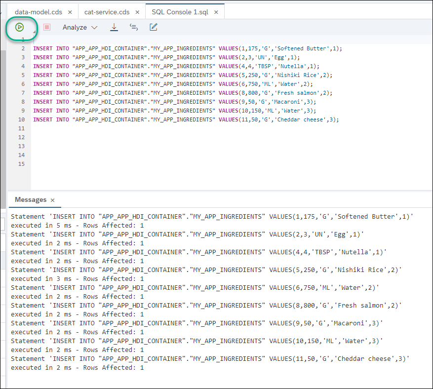


[DONE]
[ACCORDION-END]

[ACCORDION-BEGIN [Step 6: ](Insert data into the recipes table)]

Repeat the previous steps for the table `MY_APP_RECIPES` and use the following SQL statements to create data:

```sql
INSERT INTO "APP_APP_HDI_CONTAINER"."MY_APP_RECIPES" VALUES(1,'Mix the egg, butter and flour into a cup. Incorporate Nutella. Bake in microwave for 2 minutes','Nutella cupcake',15,'min');
INSERT INTO "APP_APP_HDI_CONTAINER"."MY_APP_RECIPES" VALUES(2,'Lay a piece of nori on sushi mat. Spread rice. Add salmon. Roll','Salmon roll',1,'h');
INSERT INTO "APP_APP_HDI_CONTAINER"."MY_APP_RECIPES" VALUES(3,'Mix the macaroni, water, and salt in a microwaveable mug. Microwave for 2-3 minutes','Mac and Cheese',7,'min');
```
Right-click on `MY_APP_RECIPES` and choose **Generate SELECT statement**.

Change the select clause to count the number of records to complete the validation below


[VALIDATE_1]
[ACCORDION-END]

[ACCORDION-BEGIN [Step 7: ](Build and run the OData services)]

Go back to the code editor.

Right-click on the `srv` folder and choose **Build**

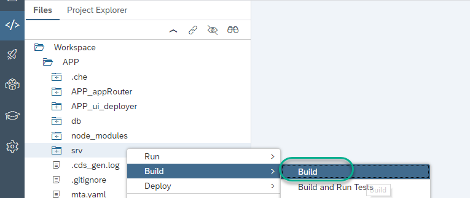

Wait until the process has finished and make sure the build has finished successfully in the console:

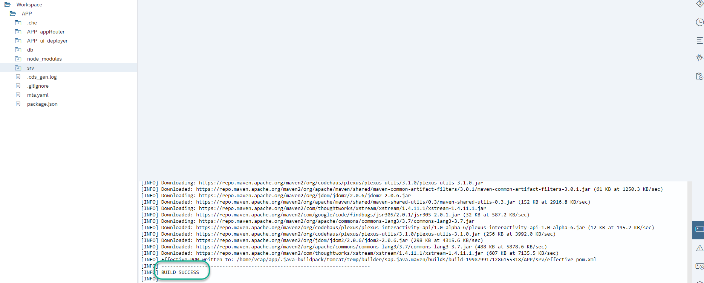

Right-click on the module and choose **Run as Java Application**


Once the application is running, click on the URL for the services.


[VALIDATE_2]
[ACCORDION-END]

[ACCORDION-BEGIN [Step 8: ](Add a Web module)]

Right-click on your app and choose **HTML5 module**

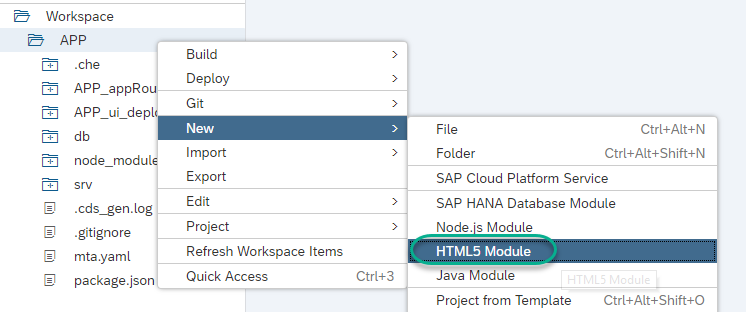

Choose **SAP Fiori `Worklist` Application**. Click **Next**

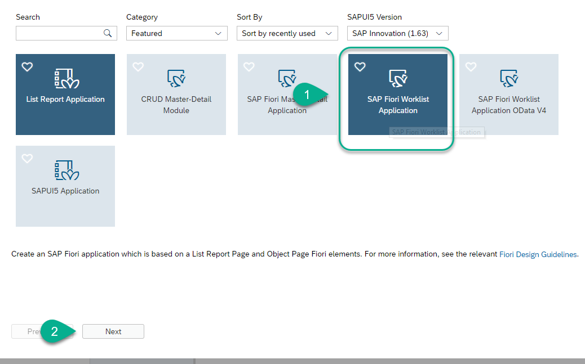

Call the module `web`. Fill in the **Title** and **Namespace** and click **Next**

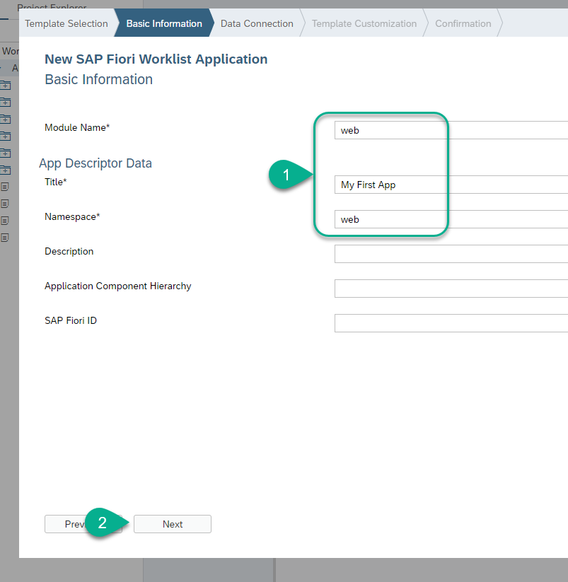

Choose `CatalogService` and click **Next**

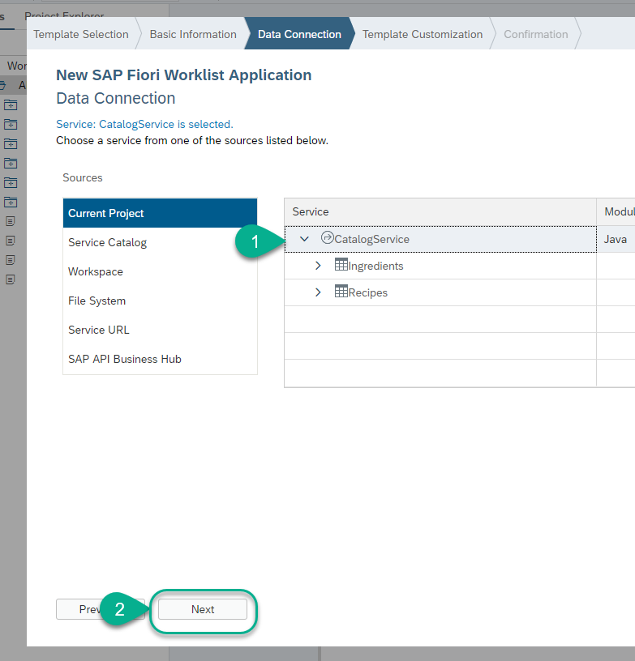

Complete the data binding as follows and click **Finish**

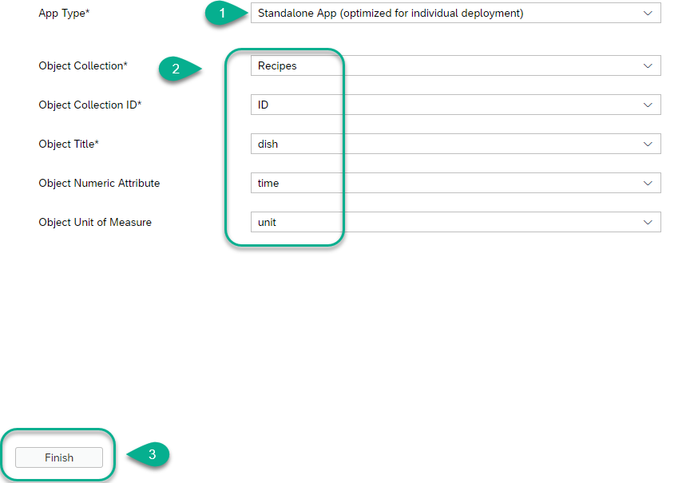

[DONE]
[ACCORDION-END]

[ACCORDION-BEGIN [Step 9: ](Run the application)]

Right-click on the web module and choose **Run as Web Application**


Choose `index.html`

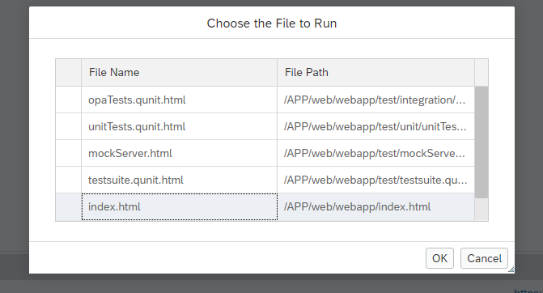

If prompted, enter your credentials:

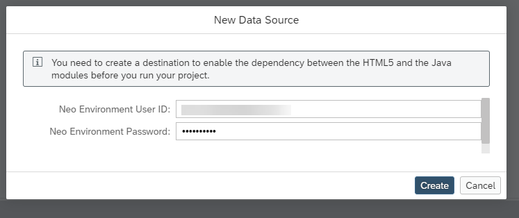

> Note: Your credentials are the same you used to log in to the SAP Cloud Platform trial account

**Congratulations!** You have created your first multi-target application using the Cloud Application Programming model. You can read more about Multi Target applications and SAP HANA [in this series of blogs posts](https://blogs.sap.com/2017/09/04/xs-advanced-for-not-so-dummies/) or about the Cloud Application Programming model [in the official SAP Documentation](https://help.sap.com/viewer/65de2977205c403bbc107264b8eccf4b/Cloud/en-US/00823f91779d4d42aa29a498e0535cdf.html)

> If you look into the SAP Cloud Platform Cockpit, you will see the Java micro-service running as an application:
>
> 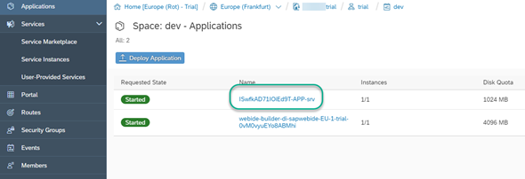
> And the HDI container, with the SAP HANA database artifacts, listed in the services:
>
> 


[VALIDATE_3]
[ACCORDION-END]


---
