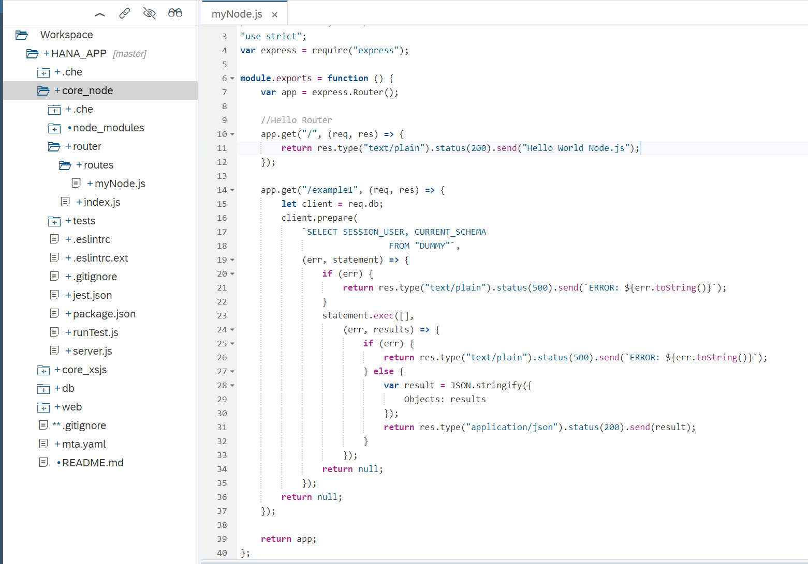
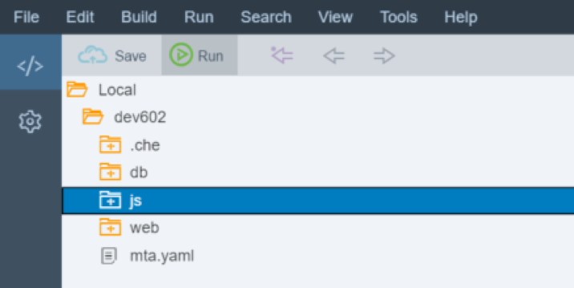
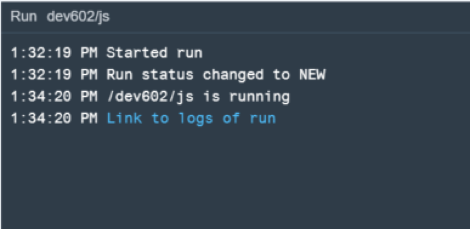
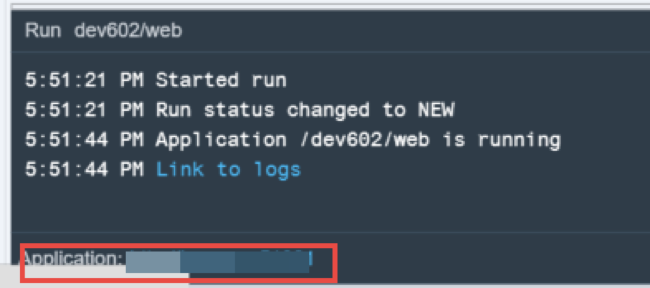
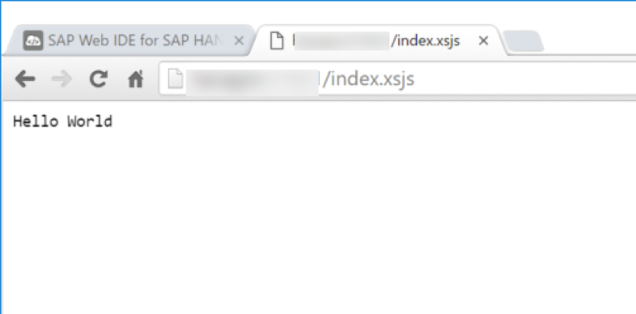

## Prerequisites  
- **Proficiency:** Intermediate
- **Tutorials:** [Modules and Express](https://developers.sap.com/tutorials/xsa-node-modules.html)

## Next Steps
- [Asynchronous Non-Blocking I/O](https://developers.sap.com/tutorials/xsa-node-async.html)

## Details
### You will learn  
Learn how to connect to the SAP HANA database using Node.js and the HANA database library, `hdb`.


### Time to Complete
**15 Min**.

---


[ACCORDION-BEGIN [Step 1: ](Add handler for new example request)]
In the [previous tutorial](https://developers.sap.com/tutorials/xsa-node-modules.html), you added a handler for a path called `/node` by modifying the files `myNode.js`.

Add a new route for `example1` to get the database `connection/client` from the express request object (`req.db`). Then create a prepared statement for the SELECT of `SESSION_USER` from dummy (dummy is the synonym created in the initial [HDI tutorial](https://developers.sap.com/tutorials/xsa-hdi-module.html)). Execute the statement and send the results as JSON in the response object.


```javascript

//Simple Database Select - In-line Callbacks
//Example1 handler
app.get("/example1", function(req, res) {
var client = req.db;
client.prepare(
	"select SESSION_USER from \"DUMMY\" ",
	function(err, statement) {
		if (err) {			
			res.type("text/plain").status(500).send("ERROR: " + err.toString());	return;	}
	statement.exec([],
		function(err, results) {
			if (err) {			
				res.type("text/plain").status(500).send("ERROR: " + err.toString());	return;						

		} else {							
			var result = JSON.stringify({ Objects: results});					
			res.type("application/json").status(200).send(result);
		}
		});
	});
});


```

As follows:




[ACCORDION-END]

[ACCORDION-BEGIN [Step 2: ](Run the node and web modules)]

Run the node and web modules. You should see that the build and deploy are successful. Call the **`example1`** script by changing the web tab


You can see the **`SESSION_USER`** returned by the SELECT statement.


[ACCORDION-END]

[ACCORDION-BEGIN [Step 3: ](Use the async module to access the database)]

The default programming approach in Node.js is using callbacks/event handlers. This is because even the different parts of a database request (connection, prepared statement, execution, etc) are all non-blocking operations.

>Hint: A callback is an asynchronous operation that gets executed after another one notifies completion.  

Add a second route handler, called `example2`, that uses the `async` module:

```javascript

var async = require("async");
	//Simple Database Select - Async Waterfall
	app.get("/example2", function(req, res) {
		var client = req.db;
		async.waterfall([

			function prepare(callback) {
				client.prepare("select SESSION_USER from \"DUMMY\" ",
					function(err, statement) {
						callback(null, err, statement);
					});
			},

			function execute(err, statement, callback) {
				statement.exec([], function(execErr, results) {
					callback(null, execErr, results);
				});
			},
			function response(err, results, callback) {
				if (err) {
					res.type("text/plain").status(500).send("ERROR: " + err.toString());
					return;
				} else {
					var result = JSON.stringify({
						Objects: results
					});
					res.type("application/json").status(200).send(result);
				}
				callback();
			}
		]);
	});

```  

Take a look at both newly-added examples. You can easily notice that the second one is easier to read, although the runtime does not change. You can check for more information on the `async` module  in the [`async` documentation](https://caolan.github.io/async/).


[ACCORDION-END]

[ACCORDION-BEGIN [Step 5: ](Add dependencies)]

Look at the `package.json` file in the editor. You will see the dependencies section which lists all required libraries and their versions. Add the new modules which we referenced in the `myNode.js` file for this exercise part.  

```text
  	"async": "latest"

```


[ACCORDION-END]

[ACCORDION-BEGIN [Step 6: ](Run the module)]

You can now run the `js` module



You should see that the build and deploy was successful.



However if you go to the tab where the service run was started, you will see an Unauthorized message just as we did in previous sections.  This is as intended.


[ACCORDION-END]

[ACCORDION-BEGIN [Step 7: ](Change paths)]

Click on the `web` folder and the run window should change to the details of the running HTML5 module.  Since its already running and we didn't make any changes to it, you can just click on the Application link in the bottom left corner of the window to reopen it in your web browser.



In the running tab, you should see the `index.html` from earlier. We can add the URL to our XSJS service `/index.xsjs` in the browser. This will test to make sure that our XSJS and XSODATA paths are still accessible even though we swapped out the root handler.  




[ACCORDION-END]

[ACCORDION-BEGIN [Step 8: ](View output)]

Now change the path in the browser to `/node/dummy`.  You should see the output of your successful SELECT statement.


You might have noticed that the default Node.js programming approach is to use callbacks/event handlers for each operation.  This is because even the different parts of a database request (connection, prepared statement, execution, etc) are all non-blocking operations.  While this provides considerable parallelization and performance opportunities; it can also make the code more difficult to read. As a bonus part of this exercise you can return to `myNode.js` and add a second route handler, `/dummy2` that performs the same select but uses the `async` module. This module doesn't really change the runtime aspects of the code, but organizes the callback functions in an easier to read array instead of in-lining them within each other.

```javascript
//Simple Database Select - Async Waterfall

app.route("/dummy2")
  .get(function(req, res){
  var client = req.db;
 async.waterfall([
 function prepare(callback){
    client.prepare("select SESSION_USER from \"dev602.data::DUMMY\" ",
  function(err,statement){callback(null, err, statement);});
  },

function execute(err, statement, callback){
   statement.exec([], function(execErr, results){callback(null,execErr,results);});
},
function response(err, results, callback){
 if(err){
 res.type("text/plain").status(500).send("ERROR: " + err);
}else{
 var result = JSON.stringify( { Objects: results });
 res.type("application/json").status(200).send(result);
}
callback();
} ]);
});
```


[ACCORDION-END]

