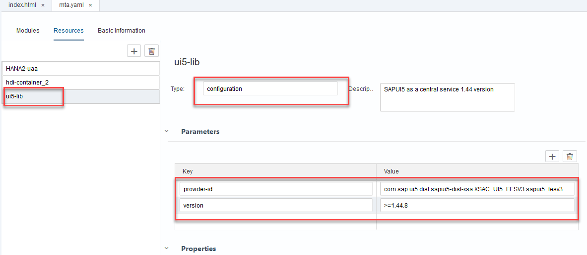
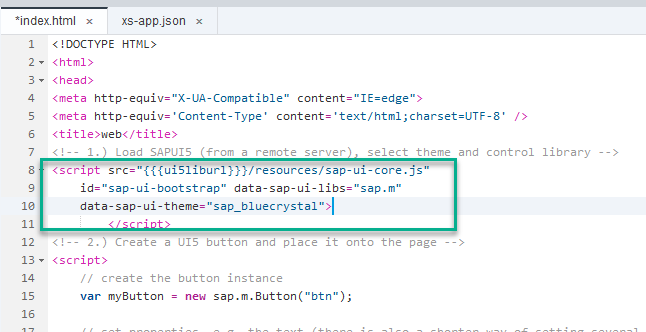
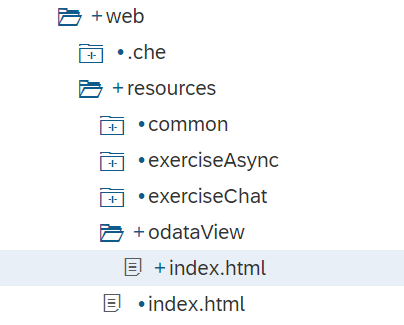
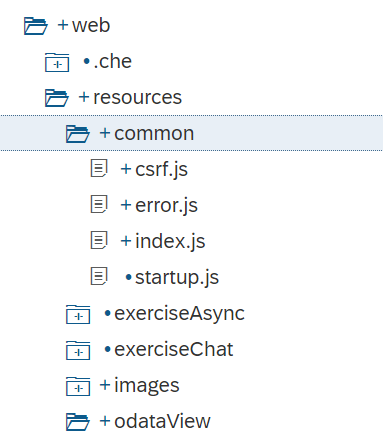
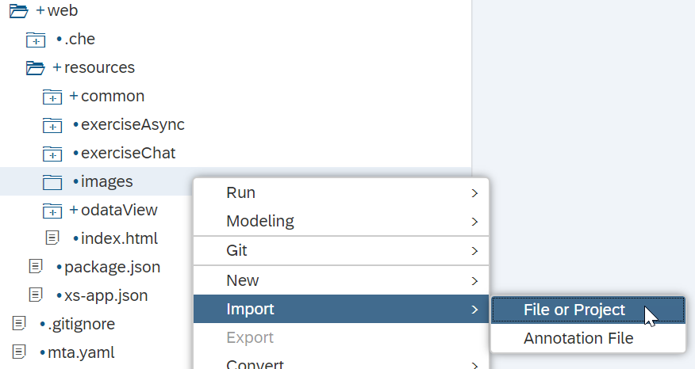
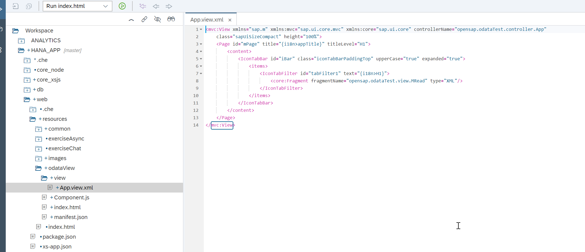
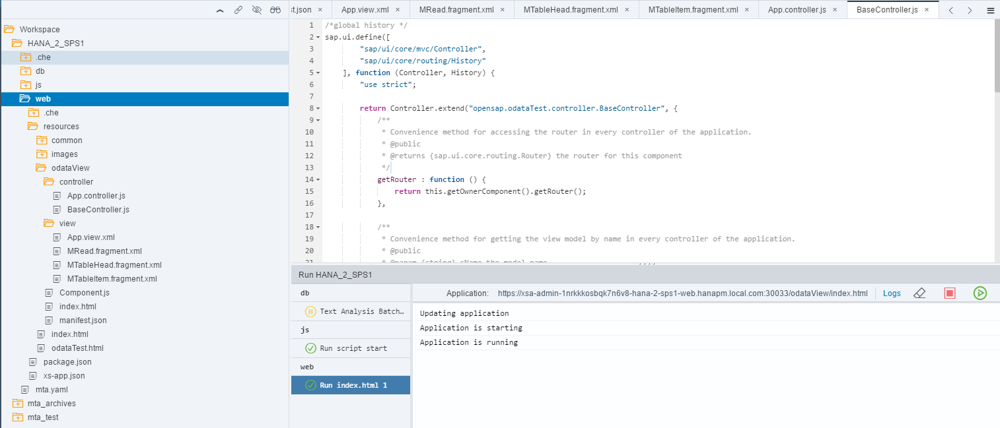
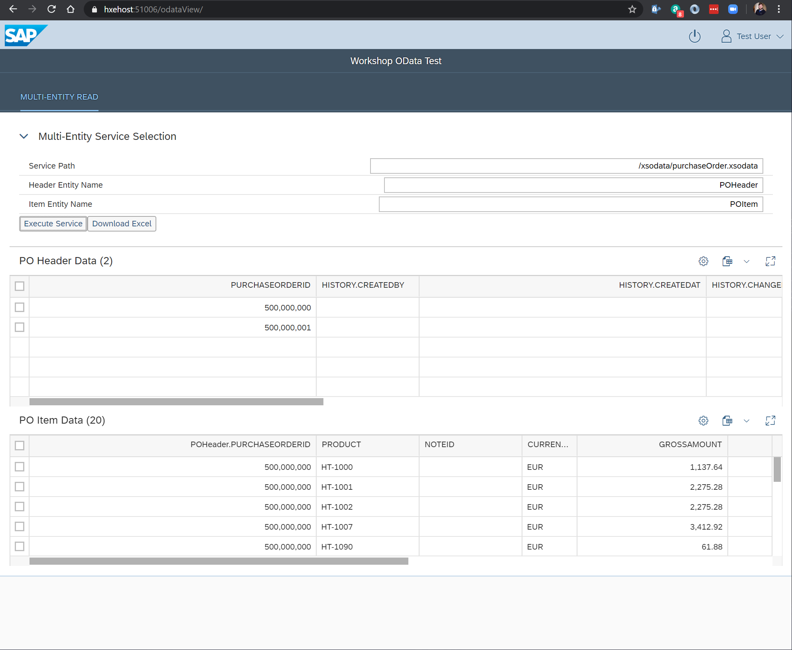

## Prerequisites  
- **Proficiency:** Intermediate
- **Tutorials:** [Creating an OData Service with Create Operation and XSJS Exit](https://developers.sap.com/tutorials/xsa-xsodata-create.html)

## Next Steps
- [Consume a Basic OData Service](https://developers.sap.com/tutorials/xsa-sapui5-odata.html)

## Details
### You will learn  
In this tutorial, you will create a SAPUI5 user interface, including the view and their controllers, to call `xsjs` and OData services.


### Time to Complete
**15 Min**.

---

[ACCORDION-BEGIN [Step 1: ](Use SAPUI5 micro-service)]

As of release of SAP HANA 2.0 SPS01, XSA delivers SAPUI5 as its own micro-service for local consumption. If you are using this or a later version, you need to adjust the reference to the publically hosted UI5 library to use the micro-service instead:


Go into your `mta.yaml` file and define a resource for the UI5 central service:
	- Create a resource called `ui5-lib`
	- Write  `configuration` in the **type** fields
	- Add the following key.value pairs: `provider-id` : `com.sap.ui5.dist.sapui5-dist-xsa.XSAC_UI5_FESV3:sapui5_fesv3` and `version` :  `>=1.44.8`



And add the `ui5-lib` resource as a dependency to the web module


[ACCORDION-END]

[ACCORDION-BEGIN [Step 2: ](Configure the App Router for the UI5 service in the bootstrap)]

Open your `xs-app.json` file in the web module add the following code:


```
 },{
 "source" : "/(.*)",
 "localDir" : "resources",
 "authenticationType" : "xsuaa",
 "replace" : {
   "pathSuffixes" : ["index.html", "odataTest.html"],
   "vars" : ["ui5liburl"]
 }
```

This keeps you from hard-coding the UI5 library in every html file in this project, and you can use the replace variable you have just defined instead by editing the `index.html` file:



So that your source for the UI5 library is called with

```
src="{{{ui5liburl}}}/resources/sap-ui-core.js"

```

**Run** the web module and press `F12` to see how the source has been dynamically updated


[ACCORDION-END]

[ACCORDION-BEGIN [Step 3: ](Create a new html file)]

Return to your `web` module and create a new folder named `resources/odataView` with an HTML file called `index.html`




Here is the complete coding for the new page.


```html
<!DOCTYPE html>
<html>
<head>
	<meta http-equiv="X-UA-Compatible" content="IE=edge" />
	<meta http-equiv="Content-Type" content="text/html;charset=UTF-8"/>
	<meta name="viewport" content="width=device-width, initial-scale=1.0" />
   	<link type="image/x-icon" href="/images/favicon.ico" rel="shortcut icon">
    <link type="image/x-icon" href="/images/favicon.ico" rel="icon">
	<!-- <script id="sap-ui-bootstrap" src="https://sapui5.hana.ondemand.com/resources/sap-ui-core.js" -->
	<script id="sap-ui-bootstrap" src="{{{ui5liburl}}}/resources/sap-ui-core.js"
		data-sap-ui-theme="sap_belize_plus"
		data-sap-ui-xx-bindingSyntax="complex"
		data-sap-ui-compatVersion="edge"
		data-sap-ui-preload="async"
		data-sap-ui-language="en"
		data-sap-ui-resourceroots='{
				"odataTest": "./" }'		
		data-sap-ui-libs="sap.m,sap.ui.comp,sap.ui.core,sap.ui.layout"
		data-sap-ui-frameOptions="trusted">
	</script>
	<script type="text/javascript" src="/common/error.js" ></script>  

	<script>
		sap.ui.getCore().attachInit(function () {
				var ComponentContainer = new sap.ui.core.ComponentContainer({
            		height : "100%"
            	});

            	new sap.m.Shell({
            		app: ComponentContainer,
            		showLogout: true
            	}).placeAt("content");

            	var oComponent = sap.ui.component({
            		id: "comp",
            		name: "odataTest",
            		manifestFirst: true,
            		async: true
            	}).then(function(oComponent){
            		ComponentContainer.setComponent(oComponent);
            	});
		});
	</script>
</head>

<!-- UI Content -->
<body class="sapUiBody" id="content">
</body>
</html>

```


[ACCORDION-END]

[ACCORDION-BEGIN [Step 4: ](Create `csrf.js` and `error.js` )]

There are two utility JavaScript libraries you reference in this HTML page:
- `common/csrf.js` for the handling of CSRF tokens
- `common/error.js` for producing error messages

Create a `common` folder in resources and add these two files.



Here is the coding of `csrf.js` :

```JavaScript
/*eslint no-console: 0, no-unused-vars: 0, no-use-before-define: 0, no-redeclare: 0*/
$.ajaxSetup({
	    beforeSend: function(xhr,settings) {
	      if (settings && settings.hasOwnProperty("type")
	          && settings.type !== "GET"){
	    	  var token = getCSRFToken();
	        xhr.setRequestHeader("X-CSRF-Token", token);
	      }
	    },
	    complete: function(xhr,textStatus) {
	        var loginPage = xhr.getResponseHeader("x-sap-login-page");
	        if (loginPage) {
	            location.href = loginPage + "?x-sap-origin-location=" + encodeURIComponent(window.location.pathname);
	        }
	    }
	});

	function getCSRFToken() {
	    var token = null;
	    $.ajax({
	        url: "/xsjs/csrf.xsjs",
	        type: "GET",
	        async: false,
	        beforeSend: function(xhr) {
	            xhr.setRequestHeader("X-CSRF-Token", "Fetch");
	        },
	        complete: function(xhr) {
	            token = xhr.getResponseHeader("X-CSRF-Token");
	        }
	    });
	    return token;
	}

```

And here is the code for `error.js`:

```JavaScript
/*eslint no-console: 0, no-unused-vars: 0, no-use-before-define: 0, no-redeclare: 0*/
function onErrorCall(jqXHR, textStatus, errorThrown) {
	var page = sap.ui.getCore().byId("pageID");
	page.setBusy(false);
	if (typeof jqXHR.status === "undefined") {
		var errorRes = JSON.parse(jqXHR.response.body);
		sap.m.MessageBox.show(
			errorRes.error.innererror.errordetail.DETAIL, {
				icon: sap.m.MessageBox.Icon.ERROR,
				title: "Service Call Error",
				actions: [sap.m.MessageBox.Action.OK],
				styleClass: "sapUiSizeCompact"
			});
	} else {
		if (jqXHR.status === 500 || jqXHR.status === 400) {
			sap.m.MessageBox.show(jqXHR.responseText, {
				icon: sap.m.MessageBox.Icon.ERROR,
				title: "Service Call Error",
				actions: [sap.m.MessageBox.Action.OK],
				styleClass: "sapUiSizeCompact"
			});
			return;
		} else {
			sap.m.MessageBox.show(jqXHR.statusText, {
				icon: sap.m.MessageBox.Icon.ERROR,
				title: "Service Call Error",
				actions: [sap.m.MessageBox.Action.OK],
				styleClass: "sapUiSizeCompact"
			});
			return;
		}
	}
}

function oDataFailed(oControlEvent) {
	sap.m.MessageBox.show("Bad Entity Definition", {
		icon: sap.m.MessageBox.Icon.ERROR,
		title: "OData Service Call Error",
		actions: [sap.m.MessageBox.Action.OK],
		styleClass: "sapUiSizeCompact"
	});
	return;
}

```


[ACCORDION-END]

[ACCORDION-BEGIN [Step 5: ](Create optional images folder)]

You also reference some images in this HTML page. They aren't critical, but if you want you can create an images folder inside resources and then upload these images from our GIT repository:
1. [SAP icon](https://github.com/SAP/com.sap.openSAP.hana5.templates/raw/hana2_sps01/ex4/favicon.ico)

2. [SAP logo](https://github.com/SAP/com.sap.openSAP.hana5.templates/raw/hana2_sps01/ex4/sap_18.png)




[ACCORDION-END]

[ACCORDION-BEGIN [Step 6: ](Create `Component.js`)]

Next you need to create your `Component.js` file in the folder `web/resources/odataView`. Here is the coding of this file:  

```javascript
/*eslint no-console: 0, no-unused-vars: 0, no-use-before-define: 0, no-redeclare: 0*/
sap.ui.define([
	"sap/ui/core/UIComponent",
	"sap/ui/Device"
//	"/odataTest/model/models"
], function(UIComponent, Device, models) {
	"use strict";

	return UIComponent.extend("odataTest.Component", {

		metadata: {
			manifest: "json"
		},

		init: function() {
			jQuery.sap.require("sap.m.MessageBox");
			jQuery.sap.require("sap.m.MessageToast");
		//	this.setModel(models.createDeviceModel(), "device");

			sap.ui.core.UIComponent.prototype.init.apply(
				this, arguments);
			this.getSessionInfo();
		},

		destroy: function() {
			// call the base component's destroy function
			UIComponent.prototype.destroy.apply(this, arguments);
		},

		getSessionInfo: function() {
			var aUrl = "/xsjs/exercisesMaster.xsjs?cmd=getSessionInfo";
			this.onLoadSession(
				JSON.parse(jQuery.ajax({
					url: aUrl,
					method: "GET",
					dataType: "json",
					async: false
				}).responseText));
		},

		onLoadSession: function(myJSON) {
			for (var i = 0; i < myJSON.session.length; i++) {
				var config = this.getModel("config");
				config.setProperty("/UserName", myJSON.session[i].UserName);
			}
		}
	});

});

```

Here you initialize the SAPUI5 component and in doing so you create an instance of the JSON configuration model. You also load your first view which you will create in the next step. Finally you see that you make a call to `xsjs/exercisesMaster.xsjs` to fill the page header with the current user id.


[ACCORDION-END]


[ACCORDION-BEGIN [Step 7: ](Create `manifest.json` file)]
This file works as an application descriptor. This file provides metadata about the application, such as libraries and other technical details. It also sets the initial view details as well as creates the JSON and OData models.

```
{
  "_version": "1.4.0",
  "start_url": "index.html",
  "sap.app": {
  	"_version": "1.4.0",
	"type": "application",
	"resources": "resources.json",
  	"id": "odataView",
  	"title": "oData test App",
  	"description": "My first UI5 App",
  	"applicationVersion": {
			"version": "${project.version}"
	}
  },
  "sap.fiori": {
	"_version": "2.0.0",
	"registrationIds": [],
	"archeType": "transactional"
  },
  "sap.ui": {
  	"_version": "1.40.0",
	"technology": "UI5",
  	"deviceTypes": {
		"desktop": true,
		"tablet": true,
		"phone": true
	},
	"supportedThemes": [
			"sap_hcb",
			"sap_bluecrystal",
			"sap_belize"
	]
  },
  "sap.ui5": {
    "config": {
      "sapFiori2Adaptation": true
    },
    "rootView": {
    	"viewName": "odataTest.view.App",
    	"type": "XML",
    	"id": "app"
    },
    "dependencies": {
			"minUI5Version": "1.40.0",
			"libs": {
				"sap.ui.core": {
					"minVersion": "1.40.0"
				},
				"sap.ui.comp": {
					"minVersion": "1.40.0"					
				},
				"sap.m": {
					"minVersion": "1.40.0"
				},
				"sap.ui.layout": {
					"minVersion": "1.40.0"
				}
			}
		},
	"contentDensities": {
		"compact": true,
		"cozy": true
	},
    "handleValidation": true,
    "models": {
    	"": {
    		"type": "sap.ui.model.json.JSONModel",
    		"settings": {
    			"defaultBindingMode": "TwoWay"
    		}
    	},
    	"config": {
    		"type": "sap.ui.model.json.JSONModel"
    	}
    }

  }
}
```

You can see the reference to this file in the `Component.js` file. This allows us to separate out a lot of the configuration of our application into a separate `manifest.json` file (as most modern Fiori based UI5 applications are designed).


[ACCORDION-END]


[ACCORDION-BEGIN [Step 7: ](Create `App.view.xml`)]

Create a folder called `view` inside `odataView`. This is where you will hold all of your views and controllers. Create the root view named `App.view.xml`.



Here is the complete coding of the `App.view.xml` file. It creates the shell control and the overall flow of your page, but then defers the design of the header and table areas to an XML fragment we will create next.

```xml
<core:View xmlns="sap.m" xmlns:u="sap.ui.unified"  xmlns:mvc="sap.ui.core.mvc"
	xmlns:core="sap.ui.core" controllerName="odataTest.controller.App" class="sapUiSizeCompact">
	<u:Shell id="myShell" icon="/images/sap_18.png">
		<u:user>
			<u:ShellHeadUserItem image="sap-icon://person-placeholder" username="{config>/UserName}"/>
		</u:user>
		<u:content>
			<IconTabBar class="iconTabBarPaddingTop" upperCase="true" expanded="true">
				<items>
					<IconTabFilter text="Multi-Entity Read">
						<core:Fragment fragmentName="odataTest.view.MRead" type="XML"/>
					</IconTabFilter>
				</items>
			</IconTabBar>
		</u:content>
	</u:Shell>
</core:View>
```


[ACCORDION-END]

[ACCORDION-BEGIN [Step 8: ](Create fragments)]

Create a file named `MRead.fragment.xml`. Here is the complete coding of this file.
Here you build a panel with your input fields. These fields will allow you to control settings for calling your XSODATA service. You will then have a table control for your purchase order header and another for your purchase order items.  The rendering of these two sections are further separated out into two JavaScript based fragments.

```xml
<core:FragmentDefinition xmlns:core="sap.ui.core" xmlns="sap.m">
	<Panel expandable="true" expanded="true" headerText="Multi-Entity Service Selection">
		<List width="100%">
			<InputListItem label="Service Path">
				<Input id="mPath" value="{/mPath}"/>
			</InputListItem>
			<InputListItem label="Header Entity Name">
				<Input id="mEntity1" value="{/mEntity1}"/>
			</InputListItem>
			<InputListItem label="Item Entity Name">
				<Input id="mEntity2" value="{/mEntity2}"/>
			</InputListItem>
		</List>
		<Button press="callMultiService" text="Execute Service"/>
		<Button press="callExcel" text="Download Excel"/>
	</Panel>
	<core:Fragment fragmentName="odataTest.view.MTableHead" type="XML"/>
	<core:Fragment fragmentName="odataTest.view.MTableItem" type="XML"/>
</core:FragmentDefinition>


```
Create another file called `MTableHead.fragment.xml`  with the following content:

```xml
<core:FragmentDefinition xmlns:core="sap.ui.core" xmlns="sap.m" xmlns:smartTable="sap.ui.comp.smarttable">
	<VBox fitContainer="true">
		<smartTable:SmartTable id="tblPOHeader" tableType="Table" header="POHeader" showRowCount="true" enableAutoBinding="true"
			showFullScreenButton="true"></smartTable:SmartTable>
	</VBox>
</core:FragmentDefinition>


```

And one last fragment called `MTableItem.fragment.xml` with the following content:

```xml
<core:FragmentDefinition xmlns:core="sap.ui.core" xmlns="sap.m" xmlns:smartTable="sap.ui.comp.smarttable">
	<smartTable:SmartTable id="tblPOItem" tableType="Table" header="POItem" showRowCount="true" enableAutoBinding="true"
		showFullScreenButton="true"/>
</core:FragmentDefinition>

```


[ACCORDION-END]

[ACCORDION-BEGIN [Step 9: ](Create a controller for the main view)]

Create a file named `App.controller.js` in a new folder called `controller`. This file contains all the event handlers for our application. The first event, called `onInit` is triggered automatically when the page starts up. Some of the initial values are set here.

Take a look at the comments inside the code to learn what each of the events does.

```JavaScript
/*eslint no-console: 0, no-unused-vars: 0, no-use-before-define: 0, no-redeclare: 0, no-undef: 0*/
//To use a javascript controller its name must end with .controller.js
sap.ui.define([
	"odataTest/controller/BaseController",
	"sap/ui/model/json/JSONModel"
], function(BaseController, JSONModel) {
	"use strict";

	return BaseController.extend("odataTest.controller.App", {

/*Triggered when the page first loads. Sets the config model and sets some more properties in the model*/
		onInit: function() {

			var oConfig = this.getOwnerComponent().getModel("config");
			var userName = oConfig.getProperty("/UserName");

			var urlMulti = "/xsodata/purchaseOrder.xsodata";
			this.getOwnerComponent().getModel().setProperty("/mPath", urlMulti);
			this.getOwnerComponent().getModel().setProperty("/mEntity1", "POHeader");
			this.getOwnerComponent().getModel().setProperty("/mEntity2", "POItem");

		},

/*handles the logic to call the oData service.  This will read the metadata from the oData service to dynamically create
the columns in the table controls*/		
		callMultiService: function() {
			var oTable = this.getView().byId("tblPOHeader");
			var oTableItem = this.getView().byId("tblPOItem");

			var mPath = this.getOwnerComponent().getModel().getProperty("/mPath");
			var mEntity1 = this.getOwnerComponent().getModel().getProperty("/mEntity1");
			var mEntity2 = this.getOwnerComponent().getModel().getProperty("/mEntity2");

			var oParams = {};
			oParams.json = true;
			oParams.useBatch = true;
			var oModel = new sap.ui.model.odata.v2.ODataModel(mPath, oParams);
			oModel.attachEvent("requestFailed", oDataFailed);

			function fnLoadMetadata() {
				oTable.setModel(oModel);
				oTable.setEntitySet(mEntity1);
				oTableItem.setModel(oModel);
				oTableItem.setEntitySet(mEntity2);				
				var oMeta = oModel.getServiceMetadata();
				var headerFields = "";
				var itemFields = "";
				for (var i = 0; i < oMeta.dataServices.schema[0].entityType[0].property.length; i++) {
					var property = oMeta.dataServices.schema[0].entityType[0].property[i];
					headerFields +=  property.name + ",";
				}

				for (var i = 0; i < oMeta.dataServices.schema[0].entityType[1].property.length; i++) {
						var property = oMeta.dataServices.schema[0].entityType[1].property[i];
						itemFields +=  property.name + ",";
				}
				oTable.setInitiallyVisibleFields(headerFields);
				oTableItem.setInitiallyVisibleFields(itemFields);
			}

			oModel.attachMetadataLoaded(oModel, function() {
				fnLoadMetadata();
			});

			oModel.attachMetadataFailed(oModel, function() {
				sap.m.MessageBox.show("Bad Service Definition", {
					icon: sap.m.MessageBox.Icon.ERROR,
					title: "Service Call Error",
					actions: [sap.m.MessageBox.Action.OK],
					styleClass: "sapUiSizeCompact"
				});
			});
		},
		callExcel: function(oEvent) {
			//Excel Download
			window.open("/xsjs/hdb.xsjs");
			return;
		}
	});
});

```


[ACCORDION-END]

[ACCORDION-BEGIN [Step 10: ](Create a reusable Controller)]

Create a reusable controller for further tutorials. Create a file called `BaseController.js` in the `controller` folder with the following code:

```JavaScript
/*global history */
sap.ui.define([
		"sap/ui/core/mvc/Controller",
		"sap/ui/core/routing/History"
	], function (Controller, History) {
		"use strict";

		return Controller.extend("opensap.odataTest.controller.BaseController", {
			/**
			 * Convenience method for accessing the router in every controller of the application.
			 * @public
			 * @returns {sap.ui.core.routing.Router} the router for this component
			 */
			getRouter : function () {
				return this.getOwnerComponent().getRouter();
			},

			/**
			 * Convenience method for getting the view model by name in every controller of the application.
			 * @public
			 * @param {string} sName the model name
			 * @returns {sap.ui.model.Model} the model instance
			 */
			getModel : function (sName) {
				return this.getView().getModel(sName);
			},

			/**
			 * Convenience method for setting the view model in every controller of the application.
			 * @public
			 * @param {sap.ui.model.Model} oModel the model instance
			 * @param {string} sName the model name
			 * @returns {sap.ui.mvc.View} the view instance
			 */
			setModel : function (oModel, sName) {
				return this.getView().setModel(oModel, sName);
			},

			/**
			 * Convenience method for getting the resource bundle.
			 * @public
			 * @returns {sap.ui.model.resource.ResourceModel} the resourceModel of the component

			getResourceBundle : function () {
				return this.getOwnerComponent().getModel("i18n").getResourceBundle();
			},
			*/
			/**
			 * Event handler for navigating back.
			 * It there is a history entry we go one step back in the browser history
			 * If not, it will replace the current entry of the browser history with the master route.
			 * @public
			 */
			onNavBack : function() {
				var sPreviousHash = History.getInstance().getPreviousHash();

					if (sPreviousHash !== undefined) {
					history.go(-1);
				} else {
					this.getRouter().navTo("master", {}, true);
				}
			}

		});

	}
);

```


[ACCORDION-END]


[ACCORDION-BEGIN [Step 12: ](Run and test the web module)]

So now run the `web` module. It will need to rebuild and redeploy all the newly added artifacts.



In the running tab, you should see the `index.html` from earlier. Adjust the URL and add `odataView`

Test both the Execute Service and Download Excel buttons




[ACCORDION-END]

